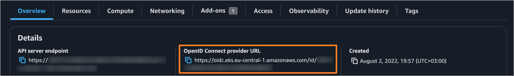

# IAM Roles for Kaniko Service Accounts

:::note
  The information below is relevant in case ECR is used as Docker container registry.
  Make sure that IRSA is enabled and [amazon-eks-pod-identity-webhook](https://github.com/aws/amazon-eks-pod-identity-webhook/tree/master) is deployed according to the [Associate IAM Roles With Service Accounts](enable-irsa.md) documentation.
:::

:::note
Alternatively, the Kaniko IAM Role can also be created automatically during the cluster installation process.
For more details, refer to the [Deploy AWS EKS Cluster](../../deploy-aws-eks.md) page.
:::

The `build-image-kaniko` stage, used in Tekton build pipelines, manages [ECR](https://aws.amazon.com/ecr/) through IRSA that should be available on the cluster. Follow the steps below to create a required role:

1. Create AWS IAM Policy `AWSIRSA_<CLUSTER_NAME>_Kaniko_policy`:

    ```json
    {
      "Version": "2012-10-17",
      "Statement": [
        {
            "Effect": "Allow",
            "Action": [
                "ecr:*",
                "cloudtrail:LookupEvents"
            ],
            "Resource": "arn:aws:ecr:<AWS_REGION>:<AWS_ACCOUNT_ID>:repository/*"
        },
        {
            "Effect": "Allow",
            "Action": "ecr:GetAuthorizationToken",
            "Resource": "*"
        },
        {
            "Effect": "Allow",
            "Action": [
                "ecr:DescribeRepositories",
                "ecr:CreateRepository"
            ],
            "Resource": "arn:aws:ecr:<AWS_REGION>:<AWS_ACCOUNT_ID>:repository/*"
        }
      ]
    }
    ```

2. Create AWS IAM Role `AWSIRSA_<CLUSTER_NAME>_Kaniko` with trust relationships:

    :::note
    `OIDC_PROVIDER` value can be found in the AWS Management Console under the Elastic Kubernetes Service (EKS) service. Select the appropriate cluster and navigate to the **Overview** tab to find the `OpenID Connect provider URL` value.
    
    :::

    ```json
    {
      "Version": "2012-10-17",
      "Statement": [
        {
          "Effect": "Allow",
          "Principal": {
            "Federated": "arn:aws:iam::<AWS_ACCOUNT_ID>:oidc-provider/<OIDC_PROVIDER>"
          },
          "Action": "sts:AssumeRoleWithWebIdentity",
          "Condition": {
            "StringEquals": {
              "<OIDC_PROVIDER>:sub": "system:serviceaccount:*"
            }
          }
        }
      ]
    }
    ```

3. Attach the `AWSIRSA_<CLUSTER_NAME>_Kaniko_policy` policy to the `AWSIRSA_<CLUSTER_NAME>_Kaniko` role.

4. Set the resulting Amazon Resource Name (ARN) of the role in the `edp-tekton.kaniko.roleArn` field within the `values.yaml` file during the [KubeRocketCI installation](../../install-kuberocketci.md).

## Related Articles

* [Associate IAM Roles With Service Accounts](enable-irsa.md)
