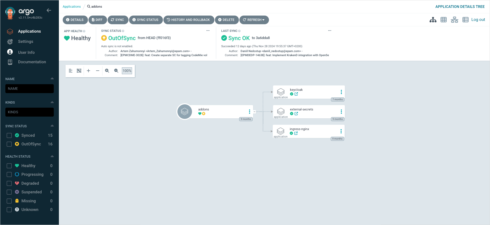

---

title: "Install Argo CD"
description: "Comprehensive guide on enabling Argo CD within KubeRocketCI, including prerequisites, installation steps using Helm, and integration with add-ons for enhanced platform functionality."
sidebar_label: "Install Argo CD"

---
<!-- markdownlint-disable MD025 -->

# Install Argo CD

<head>
  <link rel="canonical" href="https://docs.kuberocketci.io/docs/operator-guide/install-argocd" />
</head>

Review the necessary prerequisites and follow the steps to enable Argo CD within KubeRocketCI.

## Prerequisites

The following tools must be installed:

* [KubeRocketCI](./install-kuberocketci.md)
* [Kubectl version 1.24+](https://kubernetes.io/docs/tasks/tools/)
* [Helm version 3.10+](https://github.com/helm/helm/releases)
* [Keycloak](./auth/keycloak.md) (optional)

## Installation

Enabling Argo CD on the platform involves two main steps:

* Argo CD installation
* Argo CD integration with Add-Ons

Argo CD can be installed in several ways, please follow the [official documentation](https://argo-cd.readthedocs.io/en/stable/operator-manual/installation/) for more details. It is also possible to install Argo CD using the [edp-cluster-add-ons](https://github.com/epam/edp-cluster-add-ons/tree/main/argo-cd).

### Install With Helm

Follow the steps below to install Argo CD using Helm:

:::warning "For the OpenShift users"
  When using the OpenShift platform, apply the `SecurityContextConstraints` resource. Change the namespace in the `users` section if required.

  <details>
  <summary><b>View: SecurityContextConstraints</b></summary>

    ```yaml
    allowHostDirVolumePlugin: false
    allowHostIPC: false
    allowHostNetwork: false
    allowHostPID: false
    allowHostPorts: false
    allowPrivilegeEscalation: true
    allowPrivilegedContainer: false
    allowedCapabilities: null
    apiVersion: security.openshift.io/v1
    allowedFlexVolumes: []
    defaultAddCapabilities: []
    fsGroup:
      type: MustRunAs
      ranges:
        - min: 99
          max: 65543
    groups: []
    kind: SecurityContextConstraints
    metadata:
      annotations:
          "helm.sh/hook": "pre-install"
      name: argo-redis-ha
    priority: 1
    readOnlyRootFilesystem: false
    requiredDropCapabilities:
    - KILL
    - MKNOD
    - SETUID
    - SETGID
    runAsUser:
      type: MustRunAsRange
      uidRangeMin: 1
      uidRangeMax: 65543
    seLinuxContext:
      type: MustRunAs
    supplementalGroups:
      type: RunAsAny
    seccompProfiles:
      - '*'
    users:
    - system:serviceaccount:argocd:argo-redis-ha
    - system:serviceaccount:argocd:argo-redis-ha-haproxy
    - system:serviceaccount:argocd:argocd-notifications-controller
    - system:serviceaccount:argocd:argo-argocd-repo-server
    - system:serviceaccount:argocd:argocd-server
    volumes:
    - configMap
    - downwardAPI
    - emptyDir
    - persistentVolumeClaim
    - projected
    - secret
    ```
  </details>
:::

1. Fork the [Add-Ons](https://github.com/epam/edp-cluster-add-ons/tree/main/argo-cd) repository to personal account.

2. Run the installation:

    ```bash
    helm dependency update argo-cd
    helm install argocd argo-cd -n argocd --create-namespace
    ```

3. Port-forward Argo CD service using kubectl:

    ```bash
    kubectl port-forward svc/argo-argocd-server 8080:80 -n argocd
    ```

4. Login to the Argo CD server in browser using login and password:

    :::info
      By default, to access the console with administrative privileges, use the following credentials:
      - URL: localhost:8080
      -	Login: admin
    :::

    ```bash title="password"
    kubectl get secret -n argocd argocd-initial-admin-secret --template={{.data.password}} | base64 -d
    ```
5. Integrate Argo CD with [Add-Ons](add-ons-overview.md) and Install Core Add-Ons

    To ensure the environment functions correctly, it is necessary to install the following core components:

      - **Nginx Ingress Controller**: Provides external endpoint management through ingress resources.
      - **External Secrets Operator (ESO)**: Manages secure provisioning and access to secrets.
      - **Keycloak (KK)**: Enables Single Sign-On (SSO) for authentication.
      - **Keycloak Operator**: Simplifies the configuration and management of Keycloak instances.

    These components can be installed using the prepared [add-ons repository](https://github.com/epam/edp-cluster-add-ons). Detailed installation instructions are available in the [add-ons installation guide](add-ons-overview.md).

    To configure these components, refer to the relevant sections in `values.yaml`, which include the required parameters for enabling and customizing the add-ons.

    

    After completing the installation of these components, proceed with the configuration of Argo CD.

6. Update Argo CD helm chart:

    :::note
    After installing the necessary add-ons, such as the External Secrets Operator, it is recommended to add ESO components for all secrets that were manually created during the integration of [add-ons with Argo CD](add-ons-overview.md). An example can be found [here](https://github.com/epam/edp-cluster-add-ons/blob/main/argo-cd/templates/external-secrets/externalsecret-argocd-github.yaml).

        :::info
        Make sure Kubernetes resources have the required labels for Argo CD to manage them.
          ```yaml
          metadata:
            label:
              app.kubernetes.io/part-of: argocd
          ```
    :::

    To enable features such as ingress, login via oidc provider, provisioning secret using ESO need to update Argo CD with [values](https://github.com/epam/edp-cluster-add-ons/blob/main/argo-cd/values.yaml) below:

    ```yaml title=" kubernetes values.yaml"
    argo-cd:
      global:
        # -- Default domain used by all components
        ## Used for ingresses, certificates, SSO, notifications, etc.
        domain: argocd.example.com
      configs:
        cm:
          # required when SSO is enabled
          url: "https://argocd.example.com"
        oidc.config: |
          issuer: https://keycloak.example/auth/realms/shared
      server:
        ingress:
          enabled: true
          hosts:
            - "argocd.example.com"
    oidc:
      enabled: true
    eso:
      enabled: true
    ```

    <details>
    <summary><b>View: openshift values.yaml</b></summary>

      ```yaml
    argo-cd:
      global:
        # -- Default domain used by all components
        ## Used for ingresses, certificates, SSO, notifications, etc.
        domain: argocd.example.com
      configs:
        cm:
          # required when SSO is enabled
          url: "https://argocd.example.com"
        oidc.config: |
          issuer: https://keycloak.example/auth/realms/shared
      server:
        route:
          enabled: true
          hostname: "argocd.example.com"
          termination_type: edge
          termination_policy: Redirect
    oidc:
      enabled: true
    eso:
      enabled: true
      ```

    </details>

## Next Step

  - Install third-party tools via [Add-Ons](add-ons-overview.md)
  - Install [KubeRocketCI](install-kuberocketci.md)

After completing the steps outlined in this documentation, the following results should be achieved:

1. **Centralized Argo CD Instance**:
   - A fully deployed and operational Argo CD instance installed using Helm.

2. **Add-Ons Repository Configured**:
   - Add-ons repository integrated and configured with Argo CD for managing additional components.

3. **Core Components Deployed**:
   - Essential infrastructure components, such as:
     - **External Secrets Operator (ESO)** for secure secret management.
     - **Keycloak** and **Keycloak Operator** for Single Sign-On (SSO).
     - **Nginx Ingress Controller** for external endpoint management.
## Related Articles

* [Argo CD Integration](cd/argocd-integration.md)
* [Install via Add-Ons](add-ons-overview.md)
