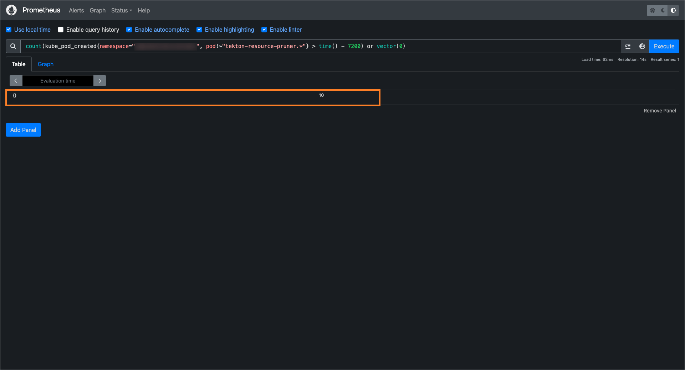
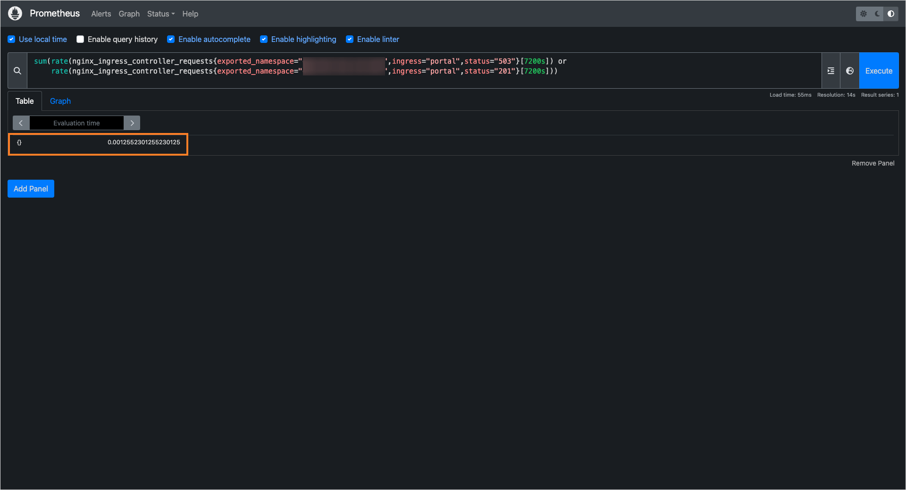

---

title: "Efficient Kubernetes Autoscaling With Karpenter and KEDA: A Comprehensive Guide"
description: "Step-by-step guide on configuring pod and cluster autoscaling in Kubernetes with Karpenter and KEDA for cost-effective, scalable, and efficient infrastructure."
sidebar_label: "Scaling With Karpenter and KEDA"

---
<!-- markdownlint-disable MD025 -->

# Efficient Kubernetes Autoscaling With Karpenter and KEDA: A Comprehensive Guide

<head>
  <link rel="canonical" href="https://docs.kuberocketci.io/docs/operator-guide/kubernetes-cluster-scaling/namespace-and-cluster-autoscaling" />
</head>

In modern cloud environments, efficient resource management is essential to maintain performance while minimizing costs. This documentation provides a step-by-step guide to configuring pods and cluster autoscaling in a Kubernetes environment using Karpenter and KEDA.

Karpenter dynamically provisions and removes nodes based on real-time demand, ensuring that the cluster has just the right amount of capacity. KEDA, on the other hand, scales workloads by adjusting pod replicas based on key metrics, such as pipeline activity and user requests.

By implementing this approach, the cluster remains responsive to workload fluctuations, preventing over-provisioning and reducing unnecessary resource usage. This results in a cost-effective, scalable, and efficient infrastructure that adapts to real-time demands without manual intervention.

## Prerequisites

Before setting up AutoScaling, ensure the following requirements are met:

- [**Prometheus is installed**](https://github.com/epam/edp-cluster-add-ons/tree/main/clusters/core/addons/prometheus-operator) and exporting cluster metrics.
- [**Nginx Ingress is installed**](https://github.com/epam/edp-cluster-add-ons/tree/main/clusters/core/addons/ingress-nginx) and configured to export its [metrics](https://github.com/epam/edp-cluster-add-ons/blob/main/clusters/core/addons/ingress-nginx/values.yaml#L38) to Prometheus.

## Karpenter

Configuring and installing Karpenter involves several key steps:

- **Setting up AWS resources** – configuring IAM roles, permissions, and networking.
- **Installing Karpenter** – deploying Karpenter controller in the Kubernetes cluster.
- **Configuring essential components** – setting up `Node Pools` and `Node Classes` to enable automatic node provisioning.

### AWS Configuration

To enable Karpenter to manage node provisioning effectively, it is essential to properly configure the necessary AWS resources. These steps include:

- **Creating IAM roles and policies** – Karpenter requires specific permissions to provision and manage EC2 instances.
- **Tagging VPC Subnets and Security Groups** – Karpenter uses these tags to determine which network subnets and security groups should be applied when provisioning new nodes.

:::info
Karpenter does not use Auto Scaling Groups (ASG) for node creation. Instead, it provisions EC2 instances directly and registers them with the Kubernetes cluster.
:::

#### IAM Role and Policies

Karpenter needs specific IAM permissions to manage EC2 instances, including the ability to create and terminate EC2 instances in your AWS account. It also requires permissions to register and manage nodes in the Kubernetes cluster.

To simplify the setup, we recommend using the [terraform-aws-karpenter](https://registry.terraform.io/modules/terraform-aws-modules/eks/aws/latest/submodules/karpenter) module. This module automates the creation of the necessary IAM roles and policies for Karpenter.

This setup assumes your cluster uses on-demand instances with 24/7 availability. If your cluster configuration differs, adjust the settings to match your needs. You can find Karpenter configuration parameters in the [terraform-aws-platform](https://github.com/KubeRocketCI/terraform-aws-platform/blob/master/eks/main.tf#L277) repository.

With this configuration, the following IAM roles will be created:

- **KarpenterController**: This role also includes `system:nodes` access to the Kubernetes cluster and will be used by the [Karpenter controller](https://github.com/epam/edp-cluster-add-ons/blob/main/clusters/core/addons/karpenter/values.yaml#L33) deployed within the cluster. This role contains the `KarpenterController` custom policy.

- **Karpenter-\<CLUSTER_NAME\>**: This role will be used by Karpenter to manage EC2 instances. We will configure this role later in the Karpenter [Node Class setup](https://github.com/epam/edp-cluster-add-ons/blob/main/clusters/core/addons/karpenter-np/templates/node-class.yaml#L8). This role contains the following policies:

  - `AmazonEC2ContainerRegistryReadOnly`
  - `AmazonEKS_CNI_Policy`
  - `AmazonEKSWorkerNodePolicy`
  - `AmazonSSMManagedInstanceCore`

#### Configure Network and Security Groups

Karpenter needs to know which subnets and security groups to use when provisioning new nodes. This is done by tagging your VPC subnets and security groups. Verify the tags in your required subnets and security groups. If necessary, modify your [terraform configuration](https://github.com/KubeRocketCI/terraform-aws-platform/blob/master/vpc/main.tf#L37) to add new, unique tags. These tags will be used in the Karpenter [Node Class configuration](https://github.com/epam/edp-cluster-add-ons/blob/main/clusters/core/addons/karpenter-np/templates/node-class.yaml).

### Install Karpenter

To deploy Karpenter in your Kubernetes cluster, we recommend using the [add-ons approach](https://github.com/epam/edp-cluster-add-ons/tree/main/clusters/core/addons/karpenter).
For best practices, Karpenter should be deployed on nodes that are not managed by Karpenter itself. This ensures that Karpenter can manage the cluster independently of its own scaling actions. To achieve this, you should use the affinity configuration in the values.yaml file.

Additionally, Karpenter requires the `KarpenterController` IAM role to manage the cluster's nodes. This role must be specified in the Service Account configuration. The clusterName should also be set in the settings section. Here's an example of how to configure values.yaml before installation:

```yaml title="values.yaml"
karpenter:
  affinity:
    nodeAffinity:
      requiredDuringSchedulingIgnoredDuringExecution:
        nodeSelectorTerms:
          - matchExpressions:
              - key: karpenter.sh/nodepool
                operator: DoesNotExist
  # -- Karpenter IAM role to manage cluster nodes
  serviceAccount:
    annotations:
      eks.amazonaws.com/role-arn: arn:aws:iam::0123456789:role/KarpenterController
  # -- EKS cluster name
  settings:
    clusterName: <CLUSTER_NAME>
```

### Deploy Karpenter Resources

Once Karpenter is installed, you need to create a Node Class and Node Pool. The Node Class defines the configuration for nodes that Karpenter will provision, while the Node Pool specifies the criteria for selecting which nodes to use. We recommend using the [add-ons approach](https://github.com/epam/edp-cluster-add-ons/blob/main/clusters/core/addons/karpenter-np/values.yaml) to deploy Karpenter resources. First, adjust the values.yaml file according to your specific requirements:


```yaml title="values.yaml"
karpenter:
# -- AMI used by nodes in the EKS cluster
amiID: ami-XXXXXXXXXXXXXXXXX
# -- EKS cluster name (must match the Karpenter configuration)
clusterName: "<CLUSTER_NAME>"
# Instance type settings
instanceType:
  category: ["m"]
  family: ["m7i"]
  size: ["xlarge"]
  type: ["on-demand"]
```

You can adjust the Node Pools and Node Class configuration based on your workload requirements. For instance, you can specify different instance types, categories, and families. More detailed information on configuring Node Pools and Node Classes can be found in the [Karpenter documentation](https://karpenter.sh/docs/).

### Verify Karpenter Functionality

To verify the functionality of Karpenter, you can create a pod and adjust the number of replicas in its configuration.

1. Create a deployment with the zero replicas:

    ```bash
    cat <<EOF | kubectl apply -f -
    apiVersion: apps/v1
    kind: Deployment
    metadata:
      name: inflate
    spec:
      replicas: 0
      selector:
        matchLabels:
          app: inflate
      template:
        metadata:
          labels:
            app: inflate
        spec:
          terminationGracePeriodSeconds: 0
          securityContext:
            runAsUser: 1000
            runAsGroup: 3000
            fsGroup: 2000
          containers:
          - name: inflate
            image: public.ecr.aws/eks-distro/kubernetes/pause:3.7
            resources:
              requests:
                cpu: 1
            securityContext:
              allowPrivilegeEscalation: false
    EOF
    ```

2. Scale the deployment to 5 replicas to see how Karpenter responds:

    ```bash
    kubectl scale deployment inflate --replicas 5
    ```

3. Check Karpenter logs to confirm it is provisioning nodes:

    ```bash
    kubectl logs -f -n karpenter -l app.kubernetes.io/name=karpenter -c controller
    ```

4. Clean up resources after testing:

    ```bash
    kubectl delete deployment inflate
    ```

## KEDA

The configuration and installation of KEDA involves several steps, including:

- **Installing the KEDA Helm chart** – deploying KEDA controller in the Kubernetes cluster.
- **Configuring essential components** – setting up `Scaled Object`, and integrating with cluster resources.

### Install KEDA

Install and configure KEDA using the [add-ons approach](https://github.com/epam/edp-cluster-add-ons/tree/main/clusters/core/addons/keda) or manually. Specify **tolerations** and **nodeSelector** if necessary:

```yaml title="values.yaml"
keda:
  # tolerations:
  # - key: "type"
  #   operator: "Equal"
  #   value: "system"
  #   effect: "NoSchedule"
  # nodeSelector:
  #   type: system
```

### Install KEDA Resources

KEDA operates based on configurations stored in its Custom Resources. It supports multiple data sources to determine the appropriate number of replicas for a deployment. In this setup, the scaling decisions are based on **Prometheus metrics**, which have been selected based on the behavior of the KRCI platform.

Below are the key metrics used for scaling analysis:

- **Number of created pods in the last N minutes** (excluding cron jobs for old pipeline cleanup). This metric ensures the platform remains active if users are continuously running pipelines.
- **Number of HTTP requests to the KRCI portal in the last N minutes**, indicating user activity on the platform.

These metrics help maintain an optimal balance between performance and resource efficiency.

You can install and configure KEDA-tenant either using the [add-ons approach](https://github.com/epam/edp-cluster-add-ons/tree/main/clusters/core/addons/keda-tenants) or manually.

  Before installing, ensure that you have set the correct values in the **KEDA Tenants** configuration. The following parameters should be customized according to your setup:

  - **`namespaces`** – List of namespaces where the KRCI platform is installed.
  - **`timeInterval`** – Idle time after which the platform will automatically scale down to **0 replicas**.
  - **`gitProviders`** – List of Git providers configured to work with the platform (this list must match the configuration set during the installation of the [`edp-install`](https://github.com/epam/edp-install/blob/release/3.11/deploy-templates/values.yaml#L32) Helm chart).

  Below are the key parameters for configuring the KEDA Tenants Helm chart:

  ```yaml title="values.yaml"
  kedaTenants:
    # -- This value specifies the namespaces where KubeRocketCI deployed.
    namespaces:
    - krci
  # -- Interval in seconds to scale resources.
  timeInterval: '7200'

  # -- This parameter specifies which Git servers are installed in KubeRocketCI.
  # -- https://github.com/epam/edp-install/blob/master/deploy-templates/values.yaml#L2
  gitProviders:
    - github
    # - gitlab
    # - bitbucket
    # - gerrit
  ```

### Verify KEDA Functionality

To verify that KEDA is operating correctly, follow the steps below:

1. Access Prometheus. Use **Ingress** or **port-forwarding** to access the Prometheus UI.

2. Verify the expected results:

    - If the metric values are **greater than 0**, KEDA will keep the deployments running.
    - If the metric values drop **below 0**, KEDA will scale the deployments down to **0 replicas**.

    Use the query below to get the number of new nodes:

    

    Use the query below to get the number of new requests:

    

By following the steps in this documentation, we have set up a flexible cluster configuration that dynamically adjusts computing resources based on the current workload.

With **Karpenter**, the cluster automatically scales nodes when additional capacity is needed and removes unused ones when the load decreases.
With **KEDA**, workloads scale up or down based on real-time metrics, ensuring efficient resource utilization.

This approach helps maintain **high performance**, **cost efficiency**, and **automatic resource management** without manual intervention.

## Related Articles

- [Kubernetes Cluster Scaling](./overview.md)
- [AWS Infrastructure Cost Estimation](../../developer-guide/aws-infrastructure-cost-estimation.md)
