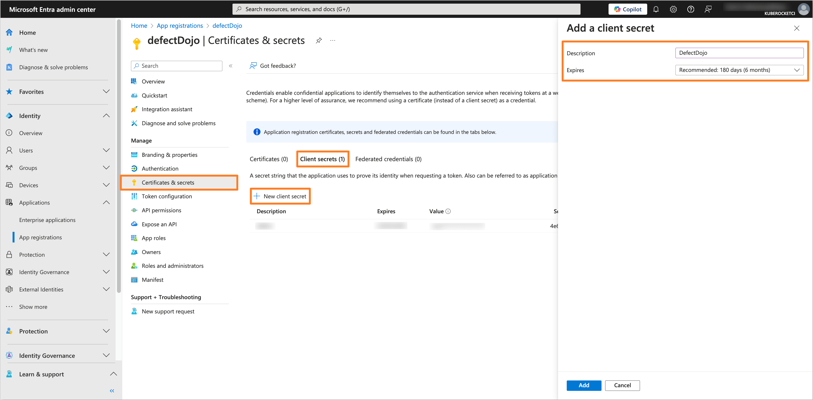
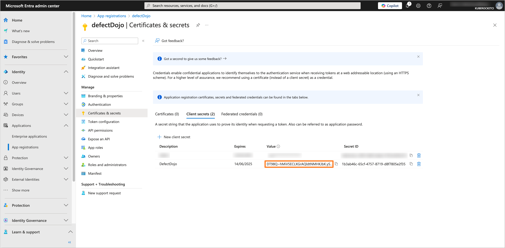
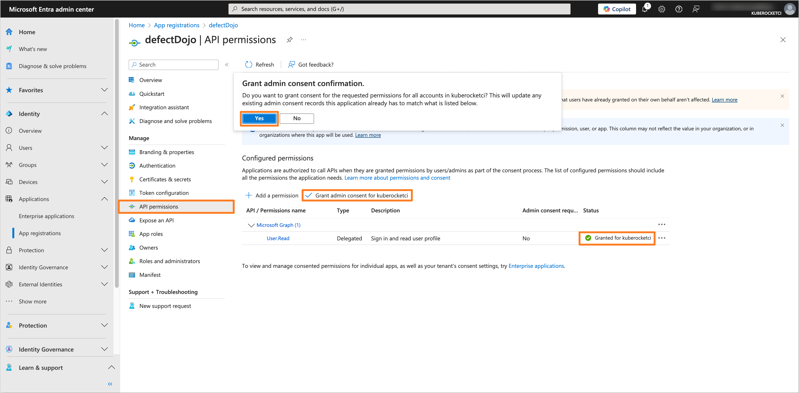
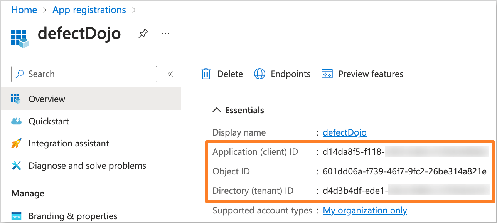
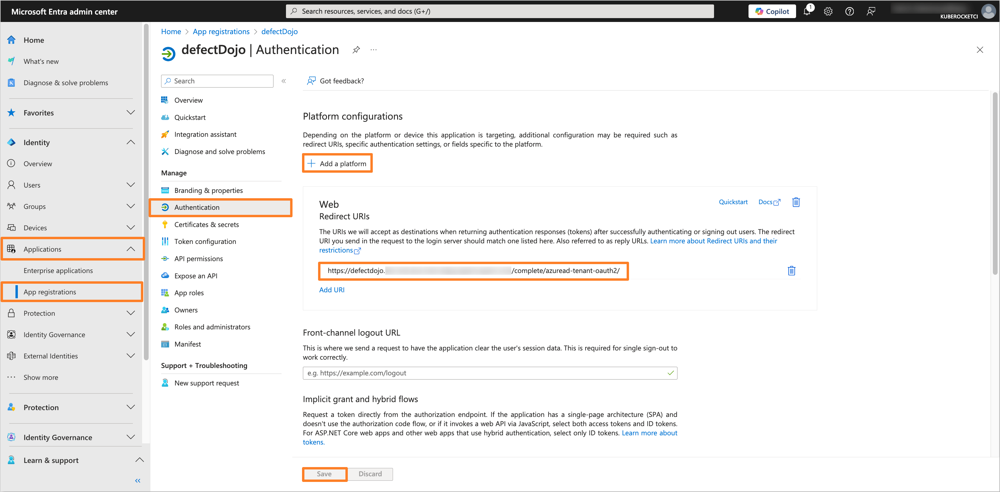
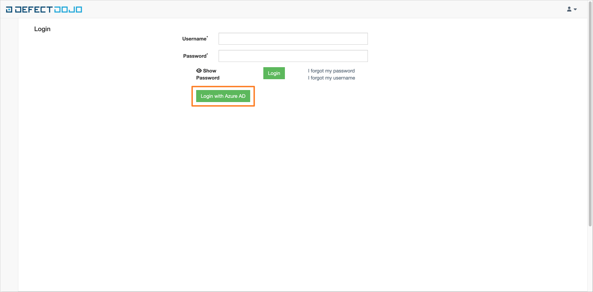

# Guide: Microsoft Entra SSO integration with DefectDojo

<head>
  <link rel="canonical" href="https://docs.kuberocketci.io/docs/operator-guide/microsoft-entra/defectdojo-oidc-authentication/" />
</head>

This guide provides instructions on how to configure DefectDojo with OpenID Connect (OIDC) authentication using Microsoft Entra as the Identity Provider (IdP).

## Prerequisites

- Access to the [Microsoft Entra Admin Center](https://entra.microsoft.com/) with administrative privileges.
- Created Microsoft Entra Tenant.
- Installed DefectDojo (can be installed during **Configuring Helm chart** step).
- Fork copy of the [edp-cluster-add-ons](https://github.com/epam/edp-cluster-add-ons) repository.
- (Optional) Installed External Secrets Operator.

## Configuring Microsoft Entra Application

To configure Microsoft Entra as the Identity Provider for DefectDojo, it is necessary to create and configure an Application in the Microsoft Entra Admin Center.

1. Log in to the [Microsoft Entra Admin Center](https://entra.microsoft.com/?feature.msaljs=true#home).

    

2. In the left sidebar menu, select **Applications** and click **App registrations**.

    

3. Click on the **New registration** button.

    

4. Fill in the required fields, such as **Name**, **Supported account types** and **Redirect URI** (You can skip setting the **Redirect URI** if you don't deploy DefectDojo yet). Click **Register** to create the application.

    :::note
    The **Redirect URI** should be in the format `https://<DefectDojo URL>/complete/azuread-tenant-oauth2/`.
    :::

    

5. In the created application, navigate to the **Certificates & secrets** section from the left sidebar menu. In the **Client secrets** tab, click on the **New client secret** button to create a new secret. Fill in the required fields and click **Add**.

    

6. Copy the generated Client secret value and store it securely. You will need this value to configure the DefectDojo Helm chart.

    

7. Navigate to the **API permissions** section. Ensure that the **User.Read** permission is added under the **Microsoft Graph** API. If not, click on the **Add a permission** button, select **Microsoft Graph**, and add the **User.Read** permission. After adding the permission, click on the **Grant admin consent for 'Tenant name'** button to grant the required permissions.

    

## Configuring DefectDojo Helm chart

To integrate DefectDojo with configured Microsoft Entra Application, it is necessary to configure the DefectDojo Helm chart.
In this example, we will use the [edp-cluster-add-ons](https://github.com/epam/edp-cluster-add-ons) repository to deploy DefectDojo to the Kubernetes (e.g. AWS EKS) cluster.

:::note
The Application data, such as **Application (client) ID** and **Directory (tenant) ID**, can be found in the **Overview** section of the Application in the Microsoft Entra Admin Center.

:::

1. Navigate to the forked [Cluster Add-Ons repository](https://github.com/epam/edp-cluster-add-ons) and locate the `values.yaml` file in the `clusters/core/addons/defectdojo` directory.

    Update the `values.yaml` file with the following values:

    ```yaml title="clusters/core/addons/defectdojo/values.yaml"
    defectdojo:
      extraConfigs:
        DD_SOCIAL_AUTH_AZUREAD_TENANT_OAUTH2_KEY: '<Application (client) ID>'
        DD_SOCIAL_AUTH_AZUREAD_TENANT_OAUTH2_SECRET: "defectdojo-extrasecrets"
        DD_SOCIAL_AUTH_AZUREAD_TENANT_OAUTH2_TENANT_ID: '<Directory (tenant) ID>'
        DD_SOCIAL_AUTH_AZUREAD_TENANT_OAUTH2_ENABLED: 'True'
        DD_SESSION_COOKIE_SECURE: 'True'
        DD_CSRF_COOKIE_SECURE: 'True'
        DD_SECURE_SSL_REDIRECT: 'False'
    ```

    Replace the `<Application (client) ID>` and `<Directory (tenant) ID>` placeholders with the appropriate values from the Microsoft Entra Application created in the previous step.

2. Update or create the `defectdojo-extrasecrets` secret with the Application Client Secret value.

    - Using External Secrets Operator

      Navigate to the `clusters/core/addons/defectdojo/templates/external-secrets/externalsecret-defectdojo-extrasecrets.yaml` file and set the `.spec.data.secretKey` field to the `DD_SOCIAL_AUTH_AZUREAD_TENANT_OAUTH2_SECRET` value.

      ```yaml title="clusters/core/addons/defectdojo/templates/external-secrets/externalsecret-defectdojo-extrasecrets.yaml"
      apiVersion: external-secrets.io/v1beta1
      kind: ExternalSecret
      metadata:
        name: defectdojo-extrasecrets
      spec:
        refreshInterval: 1h
        secretStoreRef:
          kind: SecretStore
          name: {{ .Values.eso.secretStoreName }}
        data:
          - secretKey: DD_SOCIAL_AUTH_AZUREAD_TENANT_OAUTH2_SECRET
            remoteRef:
              key: {{ $secretName }}
              property: defectdojo.oidcClientSecret
      ```

      Be sure to update the AWS Parameter Store object path specified in the `clusters/core/addons/defectdojo/values.yaml` file in the `eso.secretName` field with the Application Client Secret value.

      ```json title="AWS Parameter Store object"
      {
        "defectdojo.oidcClientSecret": "<Application Client Secret>"
      }
      ```

    - Manual approach

      Create the `defectdojo-extrasecrets` secret manually using the following template:

      ```yaml title="defectdojo-extrasecrets.yaml"
      apiVersion: v1
      kind: Secret
      metadata:
        name: defectdojo-extrasecrets
        namespace: <namespace>
      type: Opaque
      data:
        DD_SOCIAL_AUTH_AZUREAD_TENANT_OAUTH2_SECRET: <Application Client Secret>
      ```

      Replace `<Application Client Secret>` with the generated Client secret value from the Microsoft Entra Application.

3. After updating the `values.yaml` file and creating the `defectdojo-extrasecrets` secret, commit the changes to the repository and apply the changes with Helm or Argo CD.

4. Navigate to the Microsoft Entra Application and add the **Redirect URI** in the **Authentication** section if you haven't done it before.

    :::note
    The **Redirect URI** should be in the format `https://<DefectDojo URL>/complete/azuread-tenant-oauth2/`.
    :::

    

5. Verify that the OIDC authentication is configured correctly by logging in to DefectDojo using the **Log in with Azure AD** option.

    

6. After successfully verifying the login, you can proceed with configuring specific permissions for each logged-in user directly within the DefectDojo application.

## Related articles

- [OpenID Connect Authentication Overview](./oidc-authentication-overview.md)
