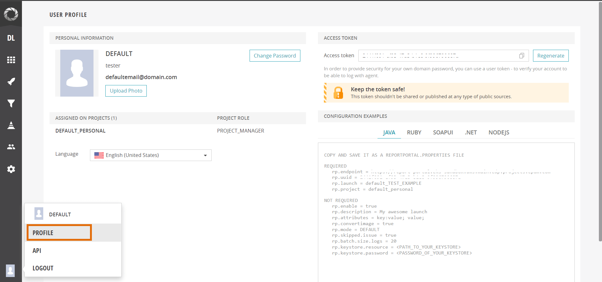
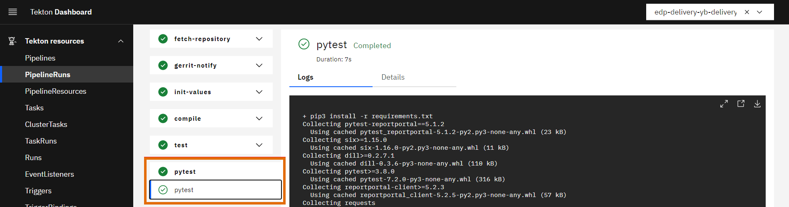
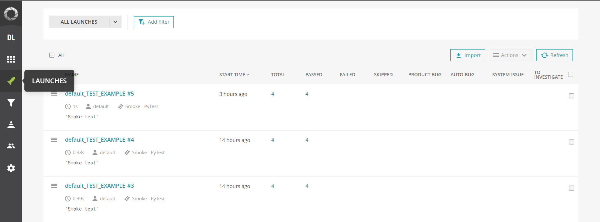

# Tekton Integration

Integrating ReportPortal with Tekton centralizes the management of all automation outcomes and reports, enabling the visualization of metrics and analytics. This integration facilitates team collaboration by associating statistical results, enhancing the overall efficiency and insight into the automation processes.

For integration, take the following steps:

1. Log in to the ReportPortal console and navigate to the **User Profile** menu:

    

2. Copy the **Access token** and use it as a value while creating a kubernetes secret for the ReportPortal credentials:

    ```yaml
    apiVersion: v1
    kind: Secret
    type: Opaque
    metadata:
      name: rp-credentials
      namespace: edp
    stringData:
      rp_uuid: <access-token>
    ```

3. In the **Configuration examples** section of the ReportPortal **User Profile** menu, copy the following `REQUIRED` fields: `rp.endpoint`, `rp.launch` and `rp.project`. Insert these fields to the `pytest.ini` file in root directory of your project:

    ```bash
    [pytest]
    addopts = -rsxX -l --tb=short --junitxml test-report.xml
    rp_endpoint = <endpoint>
    rp_launch = <launch>
    rp_project = <project>
    ```

4. In root directory of the project create/update **requirements.txt** file and fill with following. It's mandatory to install report-portal python library (version may vary):

    ```bash
    pytest-reportportal == 5.1.2
    ```

5. Create a custom Tekton task:

    <details>
    <summary><b>View: Custom Tekton task</b></summary>

    ```yaml
    apiVersion: tekton.dev/v1beta1
    kind: Task
    metadata:
      labels:
        app.kubernetes.io/version: '0.1'
      name: pytest-reportportal
      namespace: edp
    spec:
      description: |-
        This task can be used to run pytest integrated with report portal.
      params:
        - default: .
          description: The path where package.json of the project is defined.
          name: PATH_CONTEXT
          type: string
        - name: EXTRA_COMMANDS
          type: string
        - default: python:3.8-alpine3.16
          description: The python image you want to use.
          name: BASE_IMAGE
          type: string
        - default: rp-credentials
          description: name of the secret holding the rp token
          name: rp-secret
          type: string
      steps:
        - env:
            - name: HOME
              value: $(workspaces.source.path)
            - name: RP_UUID
              valueFrom:
                secretKeyRef:
                  key: rp_uuid
                  name: $(params.rp-secret)
          image: $(params.BASE_IMAGE)
          name: pytest
          resources: {}
          script: >
            #!/usr/bin/env sh
            set -e
            export PATH=$PATH:$HOME/.local/bin
            $(params.EXTRA_COMMANDS)
            # tests are being run from ./test directory in the project
            pytest ./tests --reportportal
          workingDir: $(workspaces.source.path)/$(params.PATH_CONTEXT)
      workspaces:
        - name: source
    ```

    </details>

6. Add this task ref to your Tekton pipeline after *tasks*:

    <details>
    <summary><b>View: Tekton pipeline</b></summary>

    ```yaml
    - name: pytest
      params:
        - name: BASE_IMAGE
          value: $(params.image)
        - name: EXTRA_COMMANDS
          value: |
            set -ex
            pip3 install -r requirements.txt
            [ -f run_service.py ] && python run_service.py &
      runAfter:
        - compile
      taskRef:
        kind: Task
        name: pytest-reportportal
      workspaces:
        - name: source
          workspace: shared-workspace
    ```

    </details>

7. Launch your Tekton pipeline and check that the custom task has been successfully executed:

    

8. Test reports will be displayed in the **Launches** section of the ReportPortal:

    

## Related Articles

* [Install ReportPortal](../project-management-and-reporting/install-reportportal.md)
* [Keycloak Integration](reportportal-keycloak.md)
* [Pytest Integration With ReportPortal](https://github.com/reportportal/agent-python-pytest)
