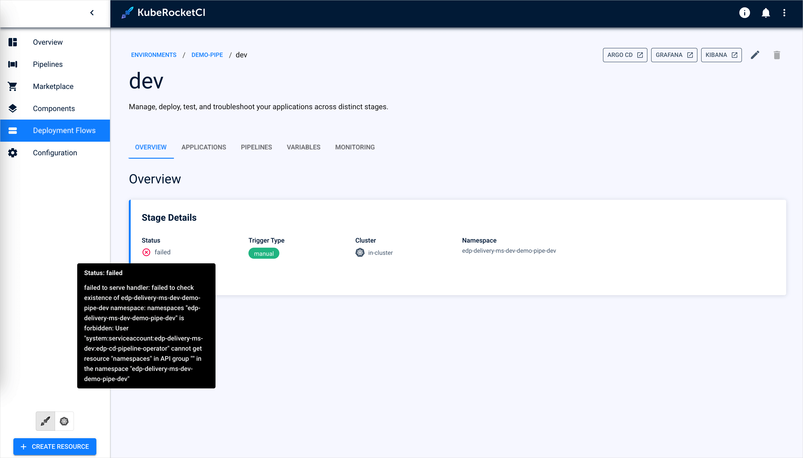

---

title: "Environment Creation Issues"
description: "Troubleshooting steps for resolving environment creation failures in KubeRocketCI due to namespace permission issues, including manual namespace creation and Helm chart configuration adjustments."
sidebar_label: "Environment Creation Issues"

---
<!-- markdownlint-disable MD025 -->

# Environment Creation Issues

<head>
  <link rel="canonical" href="https://docs.kuberocketci.io/docs/operator-guide/troubleshooting/environment-creation" />
</head>

## Problem

Failed to create an environment due to the following error:



## Cause

The [cd-pipeline-operator](https://github.com/epam/edp-cd-pipeline-operator), one of the components of KubeRocketCI, should have the proper permissions to automatically create namespaces. This permission is managed by the `manageNamespace` parameter of the [values.yaml](https://github.com/epam/edp-install/blob/v3.10.5/deploy-templates/values.yaml#L245) file.

If the `manage-namespace` parameter is set to false, it means the KubeRocketCI does not have permission to create namespaces and the procedure of creating namespaces in your project is delegated to a concrete person.

## Solution

Make sure the `manageNamespace` parameter is intentionally set to `false`. If not, define proper flow for namespace management. Read the [Namespace Management](../auth/namespace-management.md) page for more details.

If the parameter was intentionally set to `false`, the solution would be to clarify with your management who is allowed to manage namespaces in your project and request a namespace creation:

If you are allowed to create namespaces, create it manually:

1. Open the terminal. Ensure you have access to the cluster from your kubeconfig.

2. Create a namespace using the `kubectl create namespace` command:

```bash
kubectl create namespace <ns>
```

Usually, the required namespace is shown on the Overview tab of the Environment:


## Related Articles

* [Namespace Management](../auth/namespace-management.md)
