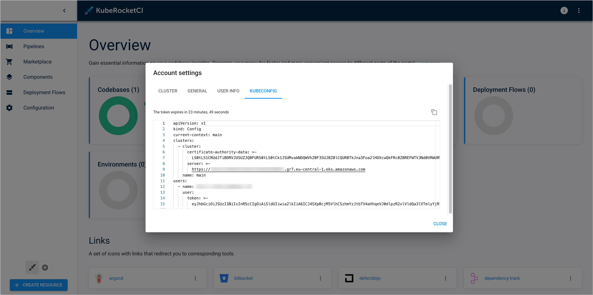
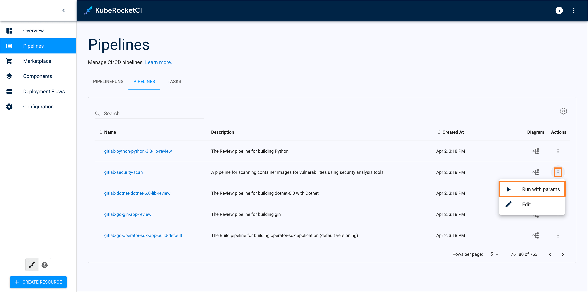
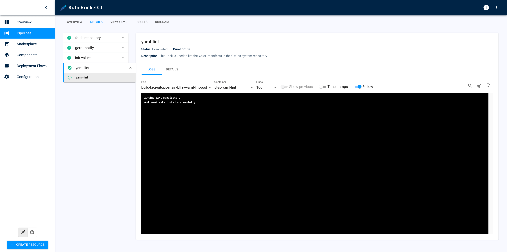
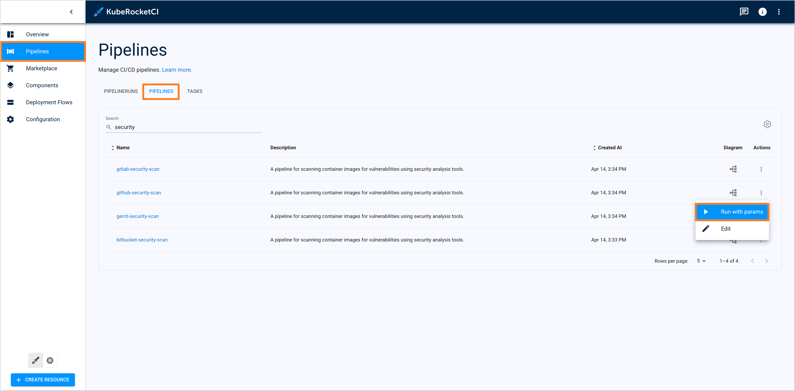
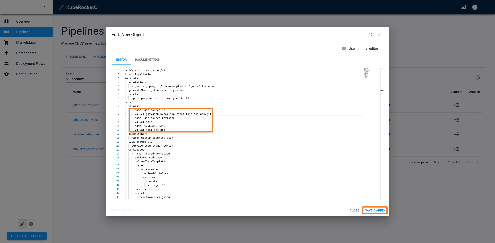
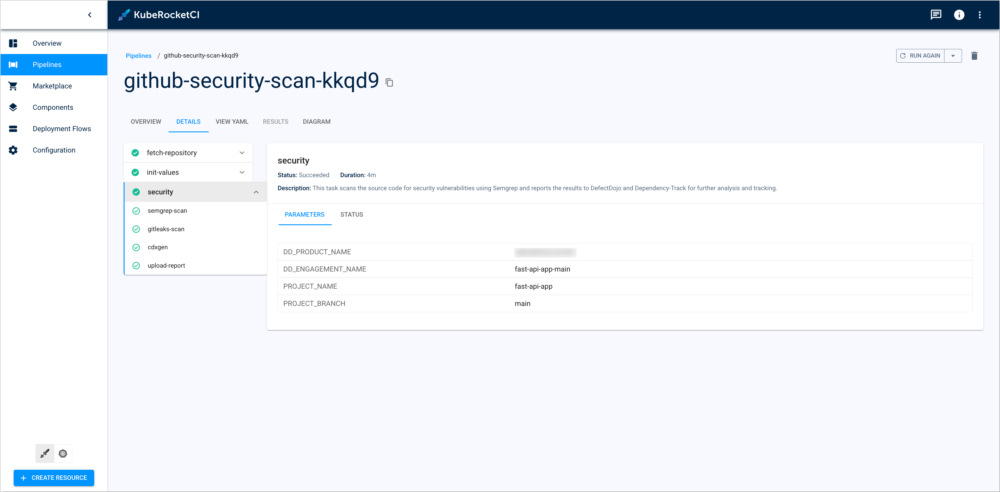

<!-- markdownlint-disable MD025 -->

import Tabs from '@theme/Tabs';
import TabItem from '@theme/TabItem';

# Upgrade KubeRocketCI v3.10 to 3.11

<head>
  <link rel="canonical" href="https://docs.kuberocketci.io/docs/operator-guide/upgrade/upgrade-edp-3.11" />
</head>

This section provides detailed instructions for upgrading KubeRocketCI to version 3.11. Follow the steps and requirements outlined below:

:::important
We suggest backing up the KubeRocketCI environment before starting the upgrade procedure.
:::

1. Configure API Cluster Endpoint:

    Starting from version 3.11, the KubeRocketCI portal UI supports generating a kubeconfig file that can be used to access the cluster and manage Kubernetes resources. To enable this feature, it is necessary to set the `apiClusterEndpoint` field in the `values.yaml` file. This field should contain the API endpoint of the cluster where KubeRocketCI is installed. For example:

    ```yaml title="values.yaml"
    global:
      apiClusterEndpoint: "https:///EXAMPLED539D4633E53DE1B71EXAMPLE.gr7.eu-central-1.eks.amazonaws.com"
    ```

    After upgrading to version 3.11, kubeconfig file generation will be available in the KubeRocketCI portal UI under the **Account Settings** section.

    

2. Add Trigger Template Label to Tekton Custom Pipelines:

    :::note
    Pipelines without the `app.edp.epam.com/triggertemplate` label will not be available for manual triggering in the KubeRocketCI portal UI.
    :::

    Starting from version 3.11, the KubeRocketCI portal supports manually triggering pipelines. To enable this feature for existing custom Tekton pipelines, it is necessary to specify the label `app.edp.epam.com/triggertemplate` with the name of the Tekton trigger template that will be used to trigger the pipeline. For example:

    ```yaml title="custom-pipeline.yaml"
    apiVersion: tekton.dev/v1
    kind: Pipeline
    metadata:
      name: custom-pipeline
      labels:
        app.edp.epam.com/triggertemplate: github-build-template
    ```

    After upgrading to version 3.11, the custom pipeline can be triggered manually with provided parameters from the **Pipelines** section in the KubeRocketCI portal UI.

    

3. Update Codebase Custom Resources:

    :::note
    It is highly recommended to update the Codebase resources manually to avoid unexpected behavior when using a bash script.
    :::

    In version 3.11, the `edp` versioning type was renamed to `semver`. Due to this change, it is necessary to update the existing Codebase resources with the new versioning type name. For example:

    <Tabs
      defaultValue="3.11"
      values={[
        {label: '3.10', value: '3.10'},
        {label: '3.11', value: '3.11'}
      ]}>

      <TabItem value="3.10">
      ```yaml title="CodebaseBranch"
      apiVersion: v2.edp.epam.com/v1
      kind: Codebase
      metadata:
        name: java-app
        namespace: krci
      spec:
        ...
        versioning:
          startFrom: 0.1.0-SNAPSHOT
          type: edp
      ```
      </TabItem>

      <TabItem value="3.11">
      ```yaml title="CodebaseBranch"
      apiVersion: v2.edp.epam.com/v1
      kind: Codebase
      metadata:
        name: java-app
        namespace: krci
      spec:
        ...
        versioning:
          startFrom: 0.1.0-SNAPSHOT
          type: semver
      ```
      </TabItem>
    </Tabs>

    To automate the update of the Codebase resources, it is possible to use the following bash script:

    ```bash title="patch-codebase.sh"
    #!/bin/bash

    codebases=$(kubectl get codebase -n krci -o jsonpath='{.items[*].metadata.name}')

    for codebase in $codebases; do

      versioning_type=$(kubectl get codebase $codebase -n krci -o jsonpath='{.spec.versioning.type}')

      if [[ $versioning_type == "edp" ]]; then

        kubectl patch codebase $codebase -n krci --type=json -p="[{\"op\": \"replace\", \"path\": \"/spec/versioning/type\", \"value\": \"semver\"}]"

        echo "Updated $codebase: $versioning_type -> semver"
      fi
    done
    ```

4. Update CodebaseBranch Custom Resources:

    :::note
    It is highly recommended to update the CodebaseBranch resources manually to avoid unexpected behavior when using a bash script.
    :::

    In version 3.11, Tekton build pipelines were renamed to align with the `semver` versioning type (previously `edp`). Due to this change, it is necessary to update the existing CodebaseBranch resources with the new Tekton build pipelines names. For example:

    <Tabs
      defaultValue="3.11"
      values={[
        {label: '3.10', value: '3.10'},
        {label: '3.11', value: '3.11'}
      ]}>

      <TabItem value="3.10">
      ```yaml title="CodebaseBranch"
      apiVersion: v2.edp.epam.com/v1
      kind: CodebaseBranch
      metadata:
        name: java-app-main
        namespace: krci
      spec:
        branchName: main
        codebaseName: java-app
        pipelines:
          build: gerrit-maven-java21-app-build-edp
          review: gerrit-maven-java21-app-review
        release: false
        version: 0.1.0-SNAPSHOT
      ```
      </TabItem>

      <TabItem value="3.11">
      ```yaml title="CodebaseBranch"
      apiVersion: v2.edp.epam.com/v1
      kind: CodebaseBranch
      metadata:
        name: java-app-main
        namespace: krci
      spec:
        branchName: main
        codebaseName: java-app
        pipelines:
          build: gerrit-maven-java21-app-build-semver
          review: gerrit-maven-java21-app-review
        release: false
        version: 0.1.0-SNAPSHOT
      ```
      </TabItem>
    </Tabs>

    To automate the update of the CodebaseBranch resources, it is possible to use the following bash script:

    ```bash title="patch-codebasebranch.sh"
    #!/bin/bash

    codebasebranches=$(kubectl get codebasebranch -n krci -o jsonpath='{.items[*].metadata.name}')

    for branch in $codebasebranches; do

      build_pipeline=$(kubectl get codebasebranch $branch -n krci -o jsonpath='{.spec.pipelines.build}')

      if [[ $build_pipeline == *-edp ]]; then

        new_build_pipeline="${build_pipeline%-edp}-semver"

        kubectl patch codebasebranch $branch -n krci --type=json -p="[{\"op\": \"replace\", \"path\": \"/spec/pipelines/build\", \"value\": \"$new_build_pipeline\"}]"

        echo "Updated $branch: $build_pipeline -> $new_build_pipeline"
      fi
    done
    ```

5. Replace `edp-config` ConfigMap for Tekton Custom Tasks:

    Starting from version 3.11, the `edp-config` ConfigMap was renamed to `krci-config`. For Tekton custom tasks, that are using the `edp-config` ConfigMap, it is necessary to replace it with the `krci-config` in the task resource. For example:

    <Tabs
      defaultValue="3.11"
      values={[
        {label: '3.10', value: '3.10'},
        {label: '3.11', value: '3.11'}
      ]}>

      <TabItem value="3.10">
      ```yaml title="custom-task.yaml"
      apiVersion: tekton.dev/v1
      kind: Task
      metadata:
        name: custom-task
      spec:
        steps:
          - name: custom-step
            env:
              - name: PLATFORM
                valueFrom:
                  configMapKeyRef:
                    name: edp-config
                    key: platform
      ```
      </TabItem>

      <TabItem value="3.11">
      ```yaml title="custom-task.yaml"
      apiVersion: tekton.dev/v1
      kind: Task
      metadata:
        name: custom-task
      spec:
        steps:
          - name: custom-step
            env:
              - name: PLATFORM
                valueFrom:
                  configMapKeyRef:
                    name: krci-config
                    key: platform
      ```
      </TabItem>
    </Tabs>

6. Update `pipelineUrl` parameter for Tekton Custom Pipelines:

    :::note
    The `pipelineUrl` parameter is used to update the Pull Request status with the corresponding pipeline URL, which is generated when the review or build pipeline is triggered automatically.
    :::

    In version 3.11, KubeRocketCI portal has changed the URL format for Tekton pipelines. Due to this change, it is necessary to update the `pipelineUrl` parameter for the existing custom Tekton pipelines. For example:

    <Tabs
      defaultValue="3.11"
      values={[
        {label: '3.10', value: '3.10'},
        {label: '3.11', value: '3.11'}
      ]}>

      <TabItem value="3.10">
      ```yaml title="custom-pipeline.yaml"
      apiVersion: tekton.dev/v1
      kind: Pipeline
      metadata:
        name: custom-pipeline
      spec:
        params:
          - default: https://portal-{{ $.Release.Namespace }}.{{ $.Values.dnsWildCard }}/c/main/pipelines/$(context.pipelineRun.namespace)/$(context.pipelineRun.name)
            name: pipelineUrl
            type: string
      ```
      </TabItem>

      <TabItem value="3.11">
      ```yaml title="custom-pipeline.yaml"
      apiVersion: tekton.dev/v1
      kind: Pipeline
      metadata:
        name: custom-pipeline
      spec:
        params:
          - default: https://portal-{{ $.Release.Namespace }}.{{ $.Values.dnsWildCard }}/c/main/pipelines/pipelineruns/$(context.pipelineRun.namespace)/$(context.pipelineRun.name)
            name: pipelineUrl
            type: string
      ```
      </TabItem>
    </Tabs>

7. (Optional) Add yamllint config to the GitOps repository:

    :::note
    By default, yamllint uses the default configuration to lint YAML files in the GitOps repository. For more details on available yamllint rules, refer to the yamllint [documentation](https://yamllint.readthedocs.io/en/stable/rules.html).
    :::

    In version 3.11, yamllint task, used in the GitOps review and build pipelines, supports custom configuration which can be added to the GitOps repository. To configure yamllint custom rules, it is necessary to create a `.yamllint` config file in the root directory of the GitOps repository. For example:

    ```yaml title=".yamllint"
    # yamllint configuration file
    # Extends the default configuration:
    # https://yamllint.readthedocs.io/en/stable/configuration.html#default-configuration

    extends: default

    ignore:
      - '.yamllint'

    rules:
      line-length: disable     # Disable line-length rule
      document-start: disable  # Disable rule for requiring '---' at the document start
    ```

    After upgrading to version 3.11, the custom yamllint configuration will be used in the GitOps review and build pipelines.

    

8. Security Tekton Task migration:

    Starting from version 3.11, the `security` Tekton task, previously used in build pipelines, has been migrated to a separate `security-scan` pipeline. After the upgrade process, a new `security-scan` pipeline will be created for each available Git server.

    To trigger the `security-scan` pipeline for the appropriate component, follow the steps below:

    1. Open the KubeRocketCI portal and navigate to the **Pipelines** section.

    2. In the **Pipelines** tab, select the appropriate `security-scan` pipeline depending on the Git server where the component is hosted. Click the three dots icon in the **Actions** column and select the **Run with params** option.

        

    3. In the **Editor** tab, specify the following parameters and click **Save & Apply** button to trigger the pipeline:

        - `git-source-url` - URL of the Git repository where the component is hosted.
        - `git-source-revision` - Git revision (branch) to be scanned.
        - `CODEBASE_NAME` - Name of the component to be scanned.

        

    4. After the pipeline is triggered, navigate to the **Pipelines** section and locate the `security-scan` pipeline run. The pipeline will contain a single main task named `security`, which will perform the security scan for the specified component.

        

9. To upgrade KubeRocketCI to the v3.11, run the following command:

    :::note
    To verify the installation, it is possible to test the deployment before applying it to the cluster with the `--dry-run` key:
    `helm upgrade krci epamedp/edp-install -n krci --values values.yaml --version=3.11.2 --dry-run`
    :::

    ```bash
    helm upgrade krci epamedp/edp-install -n krci --values values.yaml --version=3.11.2
    ```
