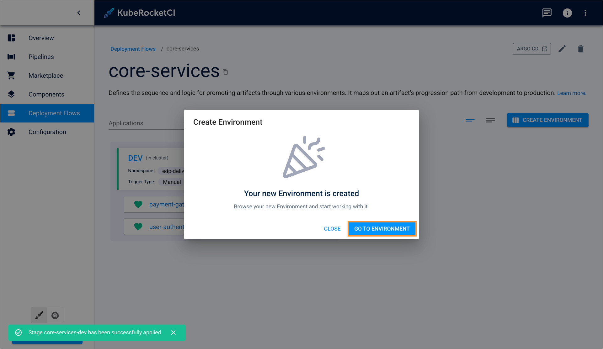

# Add Deployment Flow

<head>
  <link rel="canonical" href="https://docs.kuberocketci.io/docs/user-guide/add-cd-pipeline/" />
</head>

In KubeRocketCI, deployments are managed through Deployment Flows, a versatile mechanism that enables GitOps, automated deploy, promotion within pipelines, and multi-environment support.

Navigate to the **Deployment flows** section on the navigation bar and click **+ Create deployment flow**. Once clicked, the **Create deployment flow** dialog will appear.

The creation of the Deployment Flow becomes available as soon as an application is created including its provisioning
in a branch and the necessary entities for the Deployment FLow. You can create a Deployment FLow [in YAML](#create-deployment-flow-in-yaml) or [via the two-steps menu](#create-deployment-flow) in the dialog.

## Create Deployment Flow

The **Create Deployment Flow** dialog contains the two steps:

* The **Enter name** step
* The **Add applications** step

### The Deployment Flow Menu

Before proceeding, ensure to familiarize yourself with the [Manage GitOps](gitops.md) page as it is required to add a GitOps repository first before creating an environment:

  

To create a deployment flow, follow the steps below:

1. Navigate to the **Deployment Flows** tab and click the **+ Create Deployment Flow** button:

    

2. The **Enter name** tab of the **Create Deployment Flow** window is presented below:

    

    1. Enter the deployment flow name that will be displayed in the Deployment Flows list. Enter at least two characters, use the lower-case letters, numbers, and dashes.

    2. Click the **Next** button to move onto the **Add applications** tab.

    :::note
      The namespace created by the environment has the following pattern combination: **[KubeRocketCI namespace]-[environment name]-[stage name]**.
      Please be aware that the namespace length should not exceed 63 symbols.
    :::

3. The **Component** tab of the **Environments** menu is presented below:

    

    1. Select the necessary application from the **Mapping field name** drop-down menu and click by it name.

    2. Specify the application parameters:

        * **Branch** - Select the application branch from the drop-down menu.

        * **Promote in pipeline** - Select the this check box in order to transfer the application from one to another stage
        by the specified codebase branch. If the **Promote in pipeline** check box is not selected,
        the same codebase stream will be deployed regardless of the stage, i.e. the codebase stream input,
        which was selected for the pipeline, will always be used.

        :::note
          If there is another deployed environment stage with the respective codebase stream (equal image stream as an OpenShift term), the pattern combination will be as follows: `[pipeline name]-[stage name]-[application name]-[verified]`.
        :::

4. Click the **Create** button to finish deployment flow configuration and proceed with configuring environment.

    

### The Environments Menu

Stages are created the following way:

1. On the **Environments** menu, click the **Create Environment** button and fill in the necessary fields in the corresponding window:

    

2. The **Configure Stage** tab of the **Create Stage** menu is presented below:

    

    Set the proper cluster options:

      * **Cluster** - Choose the cluster to deploy the stage in;
      * **Stage name** - Enter the stage name;
      * **Namespace** - Specify the Kubernetes namespace where the resources will be deployed in. By default, this field is pre-populated automatically but keep in mind that the namespace name must be no longer than 63 symbols;
      * **Description** - Enter the description for this stage;
      * **Trigger type** - Select the trigger type. The key benefit of the automatic deploy feature is to keep environments up-to-date. The available trigger types are _Manual_ and _Auto_. When the _Auto_ trigger type is chosen, the environment will initiate automatically once the image is built. _Manual_ implies that user has to perform deploy manually by clicking the **Deploy** button in the environment menu. Please refer to the [Architecture Scheme of CD Pipeline Operator](https://github.com/epam/edp-cd-pipeline-operator/blob/master/docs/arch.md) page for additional details.
      * **Pipeline template** - Choose a predefined blueprint outlining the deployment process for your application. While you have the option to incorporate custom deployment templates by generating a resource of the PipelineTemplate category, you can also opt for one of the preexisting options: with autotests or without.
      * **Clean Pipeline template** - Choose one of the pre-defined pipelines offered by KubeRocketCI to define the cleanup logic. In case if you have specific requirements to the environment cleanup procedure, you can make up your own cleanup pipeline to use, which will be added to the **Clean Pipeline template** drop-down list.

3. Click the **Next** button to move onto the **Add quality gates** tab:

    

    Select the quality gate options:
      * **Quality gate type** - Select the quality gate type:
        * Manual - means that the promoting process should be confirmed in Tekton manually;
        * Autotests - means that the promoting process should be confirmed by the successful passing of the autotests.;
      * **Step name** - Type the step name, which will be displayed in Tekton, for every quality gate;
      * **Autotest** - Select the previously created [autotest](add-autotest.md) name;
      * **Autotest branch** - Specify a branch for the autotest.

        :::info Execution sequence
          The image promotion and execution of the pipelines depend on the sequence in which the environments are added.
        :::

4. Click the **Create** button to start the provisioning of the pipeline:

    

As a result, a new environment will be created in the environments list.

## Create Deployment Flow in YAML

Click **Edit YAML** in the upper-right corner of the **Create CD Pipeline** dialog to open the YAML editor and create a deployment flow:

  

Type you pipeline configuration in the YAML format:

  

To edit YAML in the minimal editor, turn on the **Use minimal editor** toggle in the upper-right corner of the **Create CD Pipeline** dialog.

To save the changes, select the **Save & Apply** button.

## Related Articles

* [Manage Deployment Flows](../user-guide/manage-environments.md)
* [Add Quality Gate](../user-guide/add-quality-gate.md)
