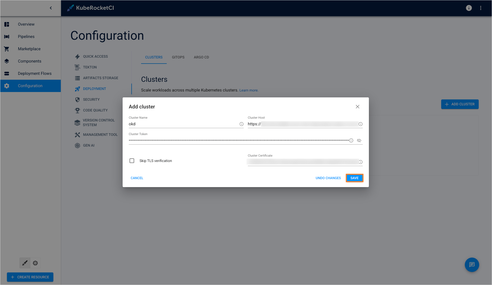
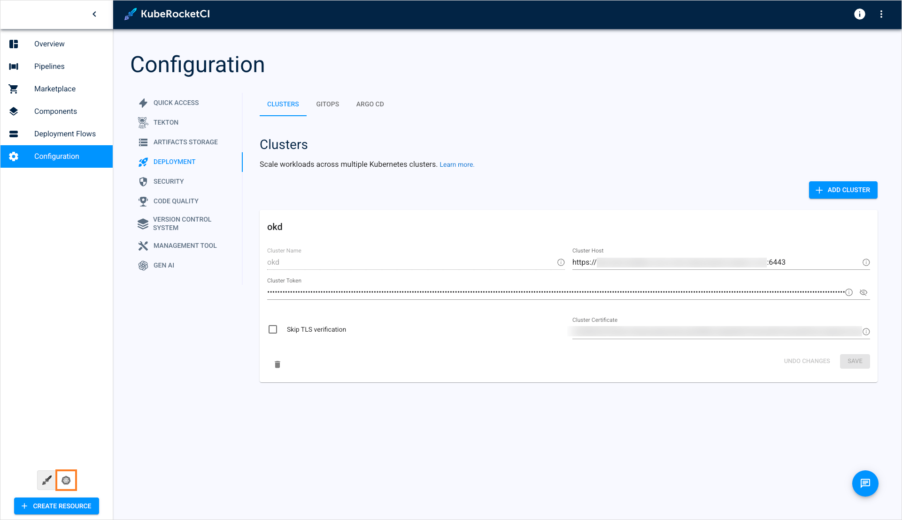
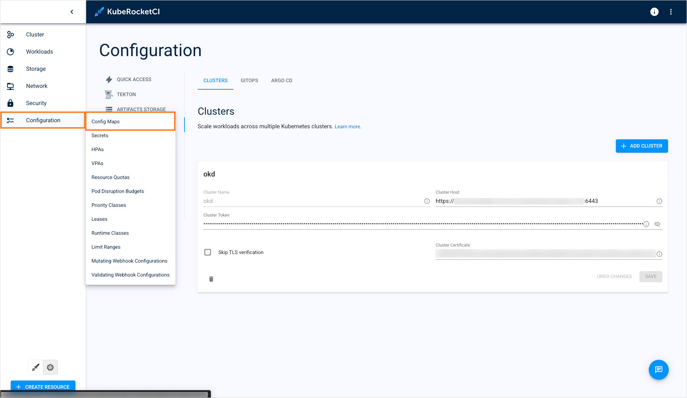
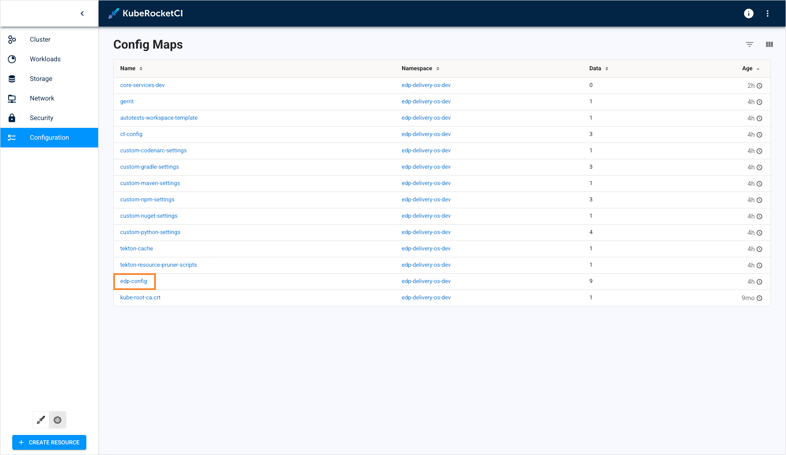
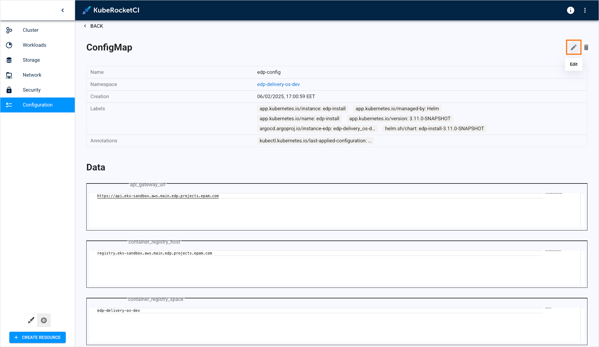
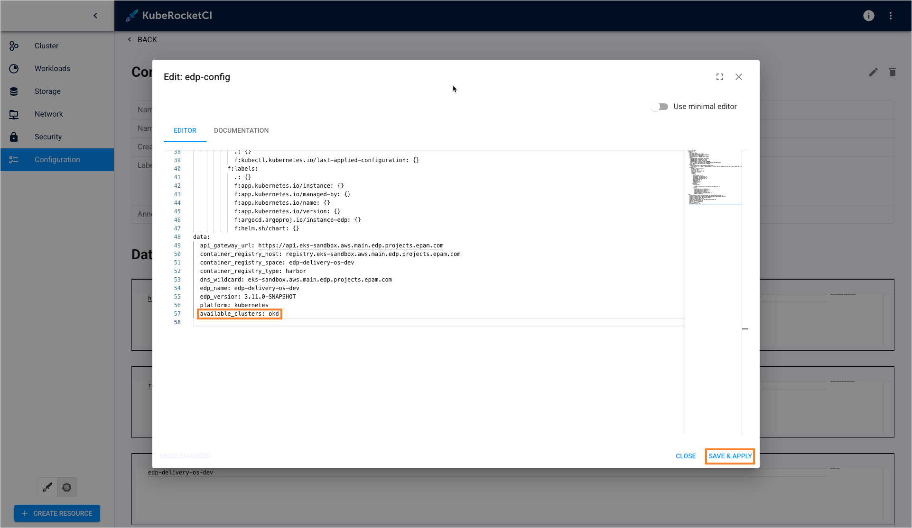
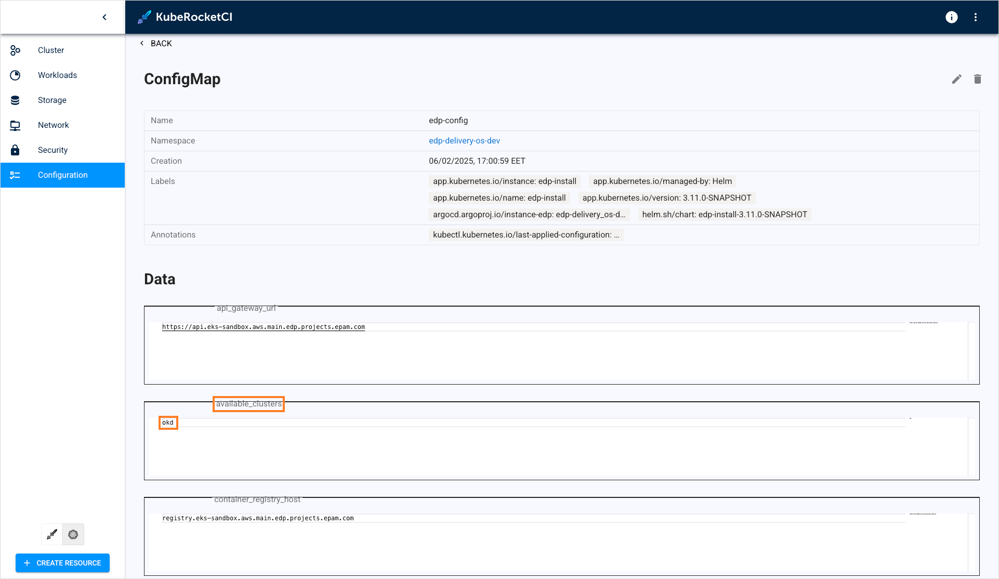
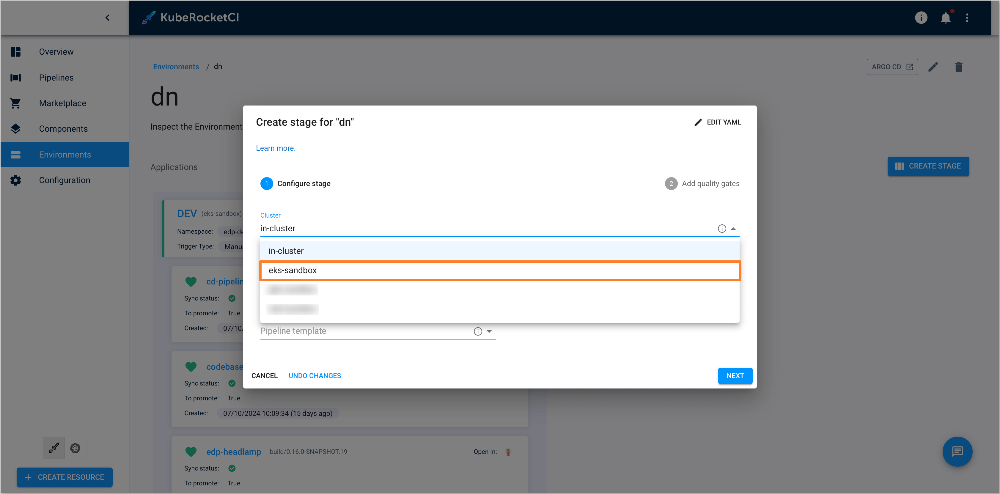

---

title: "Add Cluster"
sidebar_label: "Add Cluster"
description: "Step-by-step guide on integrating new clusters into KubeRocketCI for multi-cluster deployment, enhancing environment segregation and management."

---
<!-- markdownlint-disable MD025 -->

# Add Cluster

<head>
  <link rel="canonical" href="https://docs.kuberocketci.io/docs/user-guide/add-cluster/" />
</head>

This page provides comprehensive instructions on how to integrate a new cluster into the KubeRocketCI workloads. By doing so, it creates an opportunity for users to employ multi-cluster deployment, thereby facilitating the segregation of different environments across various clusters.

## Prerequisites

Before moving ahead, ensure you have already performed the guidelines outlined in the [Argo CD Integration](../operator-guide/cd/argocd-integration.md#deploy-argo-cd-application-to-remote-cluster-optional) page. Besides, user needs to have a cluster admin role to add clusters.

## Deploy to Remote Cluster

To deploy an application to a remote cluster, follow the steps below:

1. Navigate to **Configuration** -> **Deployment** -> **Clusters** and click the **+ Add cluster** button:

    

2. In the drop-down window, specify the required fields. Click the **Save** button to add the cluster:

    * **Cluster Name** - a unique and descriptive name for the new cluster;
    * **Cluster Host** - the cluster’s endpoint URL (e.g., example-cluster-domain.com);
    * **Cluster Token** - a Kubernetes token with permissions to access the cluster. This token is required for proper authorization;
    * **Skip TLS verification** - allows connect to cluster without cluster certificate verification;
    * **Cluster Certificate** - a Kubernetes certificate essential for authentication. Obtain this certificate from the configuration file of the user account you intend to use for accessing the cluster.

    :::note
      The `Cluster Certificate` field is hidden if the `skip TLS verification` option is enabled.
    :::

    

3. As soon as the cluster is added, switch the KubeRocketCI portal to the Kubernetes mode:

    

4. In the **Configuration** section, select **Config maps**:

    

5. In the Config maps list, enter the **edp-config** config map:

    

6. In the **edp-config** config map, click the pencil icon in the top right corner of the screen:

    

7. In the YAML file, add the `available_clusters` parameter, insert the cluster name, and click **Save & apply**:

    

8. Ensure the `available_clusters` parameter is added into the config map:

    

9. When adding a new environment, select the remote cluster in the **Cluster** field:

    

## Related Articles

* [Argo CD Integration](../operator-guide/cd/argocd-integration.md)
* [Add Application](add-application.md)
* [Add Library](add-library.md)
* [Add Autotest](add-autotest.md)
* [Add CD Pipeline](add-cd-pipeline.md)
