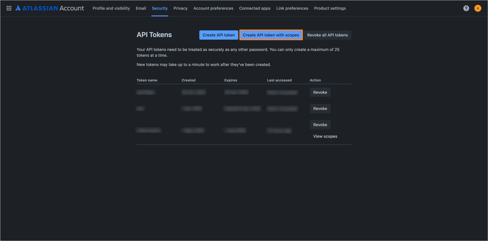
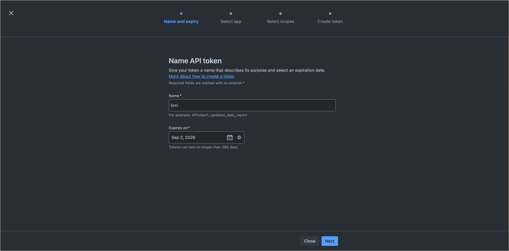
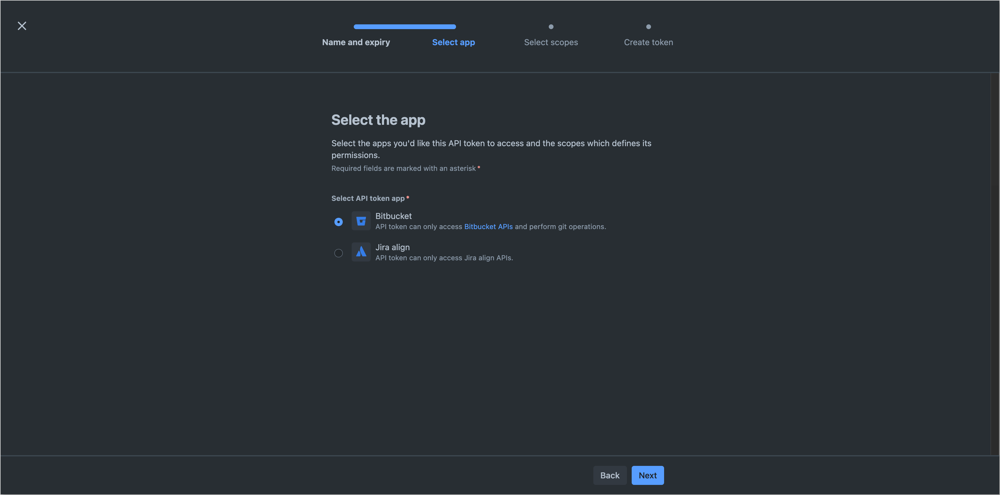
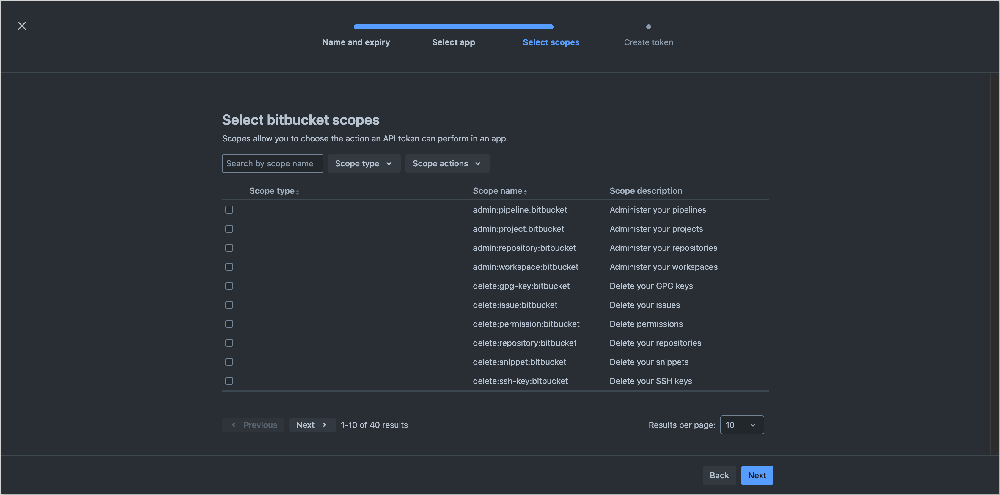
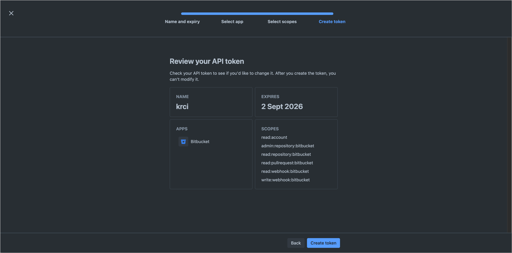
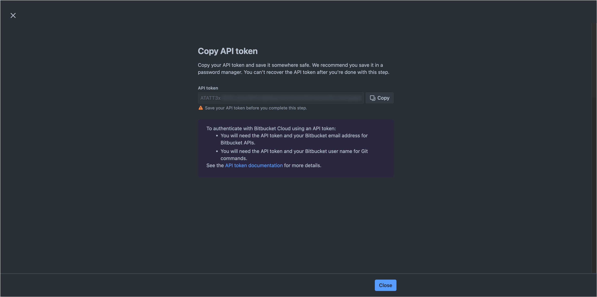

<!-- markdownlint-disable MD025 -->

import Tabs from '@theme/Tabs';
import TabItem from '@theme/TabItem';

# Add Git Server

<head>
  <link rel="canonical" href="https://docs.kuberocketci.io/docs/user-guide/add-git-server" />
</head>

This guide provides a step-by-step procedure for integrating KubeRocketCI with Version Control Systems (VCS) such as GitHub, GitLab, or Bitbucket. This is the mandatory step to enable KubeRocketCI to interact with code repositories, allowing users to automate workflows, manage components, and streamline the CI/CD process.

<div style={{ display: 'flex', justifyContent: 'center' }}>
<iframe width="560" height="315" src="https://www.youtube-nocookie.com/embed/pzheGwBLZvU" title="Install KubeRocketCI via Civo" frameborder="0" allow="accelerometer; autoplay; clipboard-write; encrypted-media; gyroscope; picture-in-picture" allowfullscreen="allowfullscreen"></iframe>
</div>

## Integration Procedure

To integrate KubeRocketCI with appropriate VCS, follow the steps below:

1. Generate an SSH key pair and add a public key to your [GitHub](https://docs.github.com/en/authentication/connecting-to-github-with-ssh/generating-a-new-ssh-key-and-adding-it-to-the-ssh-agent), [GitLab](https://docs.gitlab.com/ee/user/ssh.html), or [Bitbucket](https://support.atlassian.com/bitbucket-cloud/docs/configure-ssh-and-two-step-verification) account.

    ```bash
    ssh-keygen -t ed25519 -C "email@example.com"
    ```

2. Generate access token for [GitLab](https://docs.gitlab.com/ee/user/profile/personal_access_tokens.html) or [GitHub](https://docs.github.com/en/authentication/keeping-your-account-and-data-secure/creating-a-personal-access-token) account with read/write access to the API. Both personal and project access tokens are applicable.
For [Bitbucket](https://support.atlassian.com/bitbucket-cloud/docs/create-an-api-token/), generate an API token with the required permissions.

    <Tabs
      defaultValue="github"
      values={[
        {label: 'GitHub', value: 'github'},
        {label: 'GitLab', value: 'gitlab'},
        {label: 'Bitbucket', value: 'bitbucket'}
      ]}>

      <TabItem value="github">
      To create access token in GitHub, follow the steps below:

      * Log in to GitHub.
      * Click the profile account and navigate to **Settings** -> **Developer Settings**.
      * Select *Personal access tokens (classic)* and generate a new token with the following parameters:

        

      :::note
        The access below is required for the codebase operator to setup hooks.
      :::

      
      
      

      :::warning
        Make sure to save a new personal access token because it won't be displayed later.
      :::
      </TabItem>

      <TabItem value="gitlab">
      To create access token in GitLab, follow the steps below:

      * Log in to GitLab.
      * In the top-right corner, click the avatar and select **Settings**.
      * On the **User Settings** menu, select **Access Tokens**.
      * Choose a name and an optional expiry date for the token.
      * In the **Scopes** block, select the **api** scope for the token.

        

      * Click the **Create personal access token** button.

      :::note
        Make sure to save the access token as there will not be any ability to access it once again.
      :::

      In case you want to create a project access token instead of a personal one, take the following steps:

      * Log in to GitLab and navigate to the project.
      * On the **User Settings** menu, select *Access Tokens*.
      * Choose a name and an optional expiry date for the token.
      * Choose a role: *Owner* or *Maintainer*.
      * In the **Scopes** block, select the *api* scope for the token.

        

      * Click the **Create project access token** button.
      </TabItem>

      <TabItem value="bitbucket">
      To create an API token in Bitbucket, follow the steps below:

      * Log in to Bitbucket.
      * In the top navigation bar, click the **Settings** icon located in the upper-right corner.
      * Navigate to **Personal settings** and select **Atlassian account settings**.
      * Select the **Security** tab on the top navigation bar.
      * In the **API tokens** section, click the **Create and manage API tokens** button.
      * In the opened **API tokens** page, click the **Create API token with scopes** button.

        

      * In the **Name and expiry** section, provide a name for the token and set the desired expiration period.

        

      * In the **Select app** section, choose the "Bitbucket" option as API token app.

        

      * In the **Select scopes** section, select the required scopes for the token. The following scopes are required for KubeRocketCI integration:

        - `read:account` - to read user account information.
        - `admin:repository:bitbucket` - to manage repositories.
        - `read:repository:bitbucket` - to read repository data.
        - `read:pullrequest:bitbucket` - to read pull request information.
        - `read:webhook:bitbucket` - to read webhook configurations.
        - `write:webhook:bitbucket` - to create and manage webhooks.

        

      * In the **Create token** section, verify the provided information and click the **Create token** button.

        

      * Copy the generated token and store it securely, as it will not be displayed again.

        

      </TabItem>
    </Tabs>

3. Enable integration in KubeRocketCI:

    :::warning
    For integration with **Bitbucket**, the **token** field should be in the format `username:APItoken` and must be base64 encoded. To encode the token, use the following command:

    ```bash
    echo -n "username:APItoken" | base64
    ```
    :::

    To enable integration with the selected VCS, it is necessary to add a new Git Server in KubeRocketCI portal.

    Navigate to the **Configuration** section and select the **Version Control System** tab in the left sidebar. Click the **Add Git Server** button and fill in the following fields in the opened dialog:

    

As a result, you will be able to create codebases using an integrated Version Control System.

## Bitbucket Default Branch Management

When onboarding components via KubeRocketCI with Bitbucket as the Git Server, Bitbucket automatically creates a `master` branch as the default, regardless of the branch specified during component creation (e.g., `main`). This may result in inconsistencies with the expected default branch.

To change the default branch from `master` to desired branch in Bitbucket, follow these steps:

* Log in to Bitbucket.
* Navigate to the repository where the default branch needs to be changed.
* In the left sidebar menu, select **Repository Settings**.

  

* Proceed to the **Advanced** section. Locate the **Main branch** field and select your desired branch to set it as the default.

  

* Click **Save changes** to apply your modifications.

## Advanced Configuration: Using a Custom Webhook URL

Custom Webhook URL configuration is effectively utilized in Kubernetes clusters facing specific restrictions on traffic routing or requiring customized webhook event handling. Beyond the conventional Ingress, alternative traffic routing solutions such as Service Mesh (e.g., Istio), NodePort services, or external Load Balancers can be employed to manage traffic into the cluster, offering flexibility in addressing diverse networking policies and security requirements.

User is responsible for the following action:

* **Ingress Traffic Routing:** The configuration and management of Ingress for custom webhook URL. This entails ensuring that the custom URL is configured to accept incoming traffic and webhook events from your VCS (e.g., GitHub, GitLab). It's essential that your networking setup, including firewalls and DNS, allows your git hosting service to reach the specified URL endpoint.

* **Tekton EventListener Setup:** The creation and configuration of the Tekton EventListener, which processes webhook events directed to the custom URL. This setup involves defining the EventListener to capture and handle events from your VCS, triggering the necessary CI/CD pipelines within KubeRocketCI based on these events.

For more information on setting up a Ingress and Tekton EventListener for custom webhook URL, refer to the [Helm Chart](https://github.com/epam/edp-tekton/tree/release/0.12/charts/pipelines-library/templates/resources/gitservers).

## Related Articles

* [Add Application](add-application.md)
* [Manage Git Servers](git-server-overview.md)
