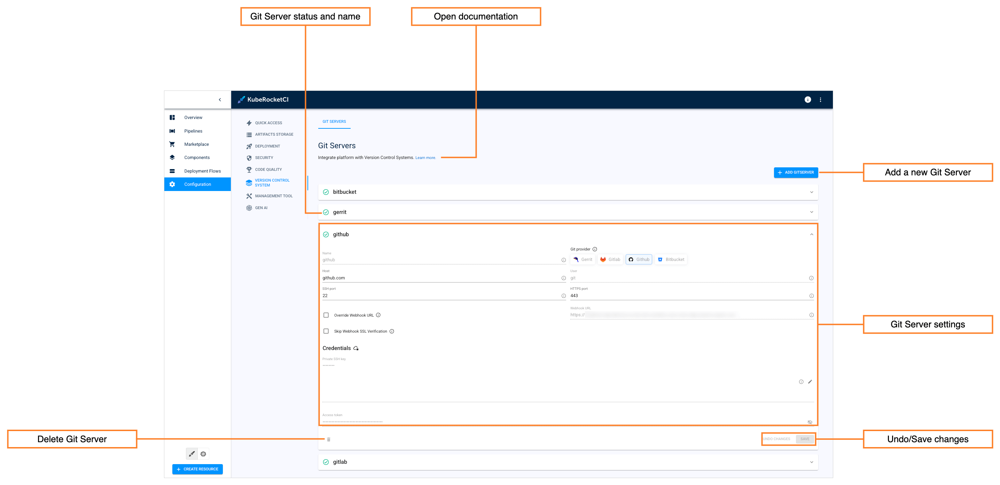

---

title: "Manage Git Servers"
sidebar_label: "Manage Git Servers"
description: "Discover how to manage Git Server integrations in KubeRocketCI for seamless Version Control System connectivity, ensuring streamlined workflows."

---
<!-- markdownlint-disable MD025 -->

# Manage Git Servers

<head>
  <link rel="canonical" href="https://docs.kuberocketci.io/docs/user-guide/git-server-overview" />
</head>

Git Server is responsible for integration with Version Control System, whether it is GitHub, GitLab, Bitbucket, or Gerrit.

<div style={{ display: 'flex', justifyContent: 'center' }}>
<iframe width="560" height="315" src="https://www.youtube-nocookie.com/embed/pzheGwBLZvU" title="YouTube video player" frameborder="0" allow="accelerometer; autoplay; clipboard-write; encrypted-media; gyroscope; picture-in-picture" allowfullscreen="allowfullscreen"></iframe>
</div><br />

The Git Server is set via the **global.gitProviders** parameter of the [values.yaml](https://github.com/epam/edp-install/blob/release/3.9/deploy-templates/values.yaml#L12) file.

To view the current Git Server, you can open Portal **Configuration** -> **Version control system** and inspect the following properties:



* **Git Server status and name** - displays the Git Server status, which depends on the Git Server integration status (Success/Failed).
* **Git Server properties** - displays the Git Server type, its host address, username, SSH/HTTPS port, public and private SSH keys.
* **Open documentation** - opens the "Manage Git Servers" documentation page.
* **Undo/Save changes** - these buttons apply or revert changes made to the Git Server.
* **Add a new Git Server** - add a new blank to specify the new Git Server's parameters.

## View Authentication Data

To view authentication data that is used to connect to the Git server, use `kubectl describe` command as follows:

  ```bash
  kubectl describe GitServer git_server_name -n krci
  ```

## Delete Git Server

To remove a Git Server from the Git Servers list, utilize the `kubectl delete` command as follows:

  ```bash
  kubectl delete GitServer git_server_name -n krci
  ```

## Related Articles

* [Add Git Server](add-git-server.md)
* [Components Overview](./components.md)
