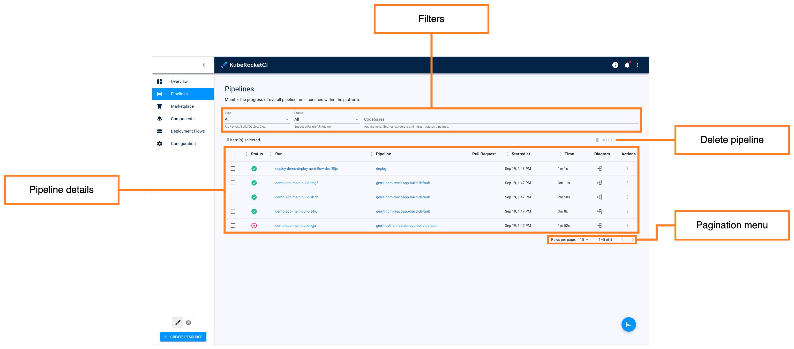
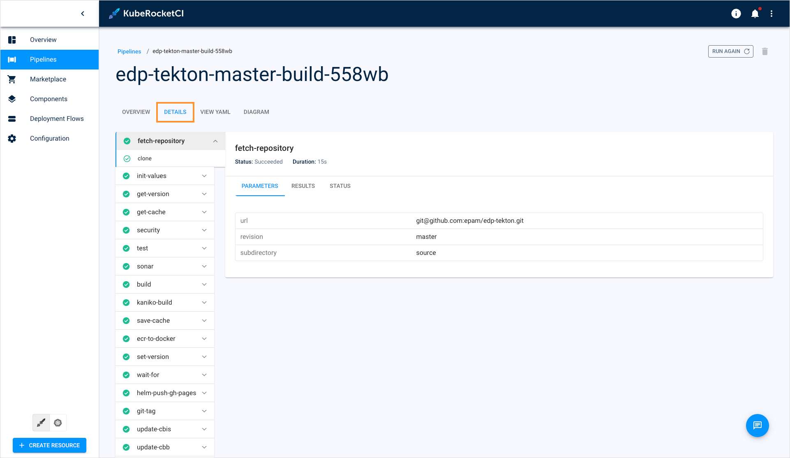
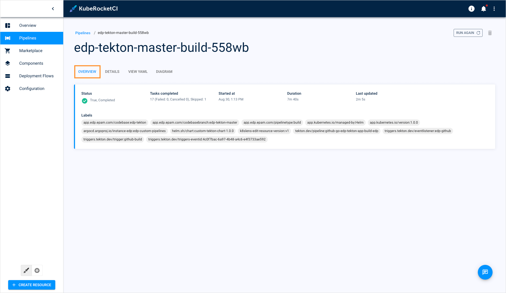
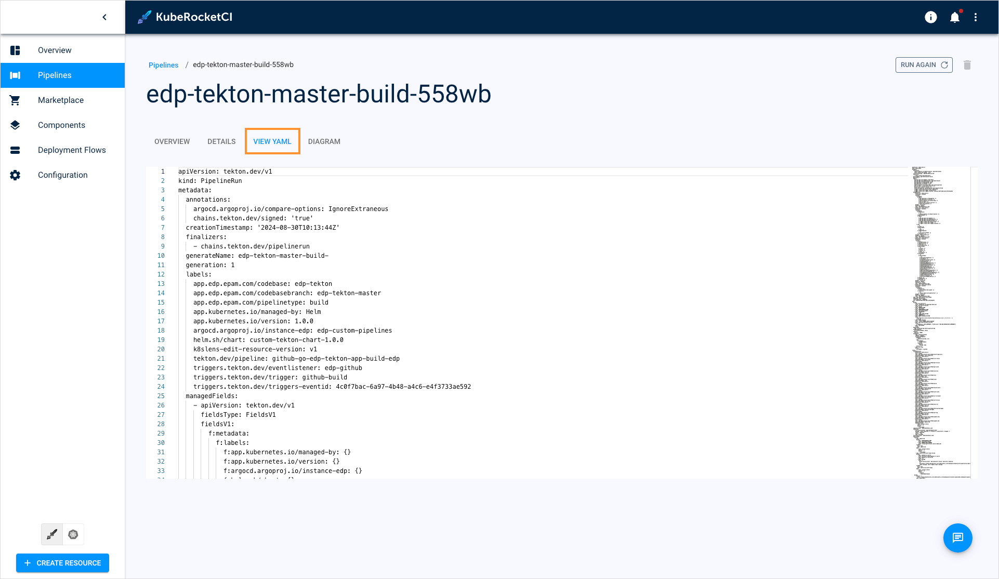
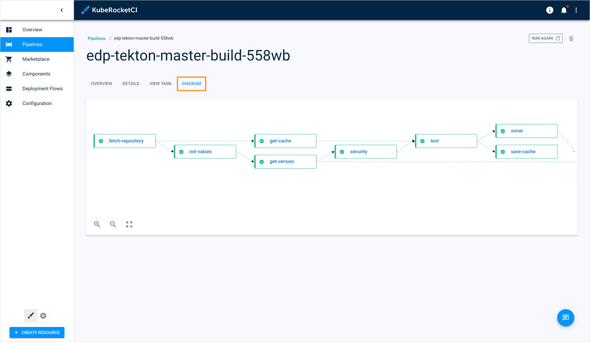
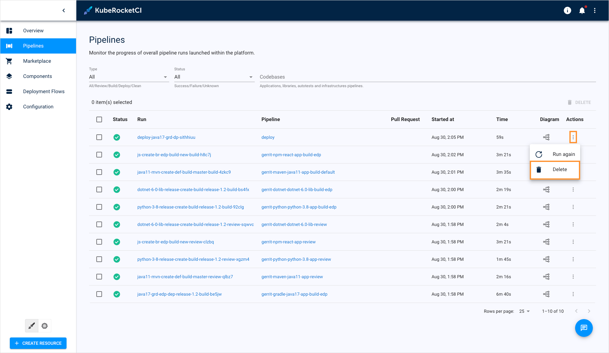
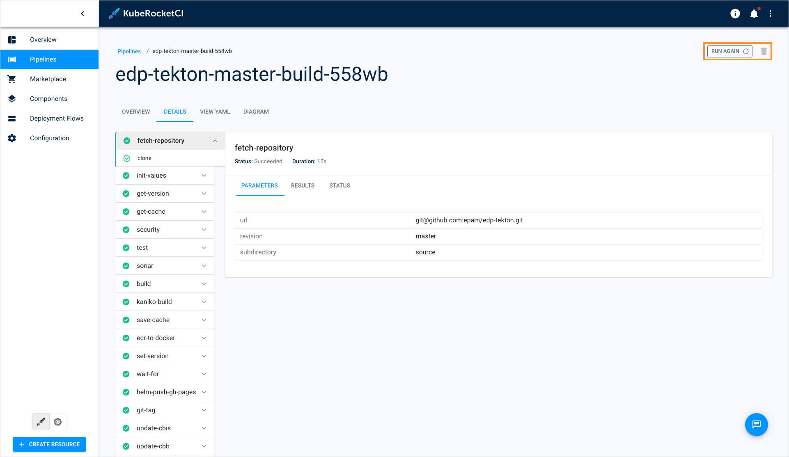

# Pipelines Overview

<head>
  <link rel="canonical" href="https://docs.kuberocketci.io/docs/user-guide/pipelines/" />
</head>

Pipelines are integral part of any CI/CD. They are involved in code code builds, reviews, and deployments. Such big variety of pipelines result in a demand of having a single place where the pipelines can be managed. For this purpose, the Pipelines section was added to the KubeRocketCI portal.

## Pipelines Page Overview

To see the Pipelines section, open the KubeRocketCI portal and select the **Pipelines** section:

  

* **Pipeline details** - Displays the following pages:

  * **Checkbox** - Click the check box to select the pipelines to delete.
  * **Status** - Displays pipeline run status. The status can be either successful (green) or failed (red). Hover over the status to view the description.
  * **Run** - Displays the pipeline run name. Click the name to view its details.
  * **Pipeline** - Indicates which pipeline this pipeline run belongs to. Click the pipeline name to view its details.
  * **Pull Request** - Click the icon to see which pull request started this pipeline run.
  * **Started at** - Displays the time the pipeline was started.
  * **Time** - Displays the total amount of time it took the pipeline to complete.
  * **Diagram** - Click the icon to see the real-time pipeline diagram.
  * **Actions** - This button allows for restarting and deleting pipeline runs.

* **Filters** - Filter pipeline runs by name, namespace, and pipeline they belong to.
* **Delete** - Allows to delete the selected pipeline runs.
* **Pagination menu** - Allows to navigate through the list of pipeline runs.
* **Chat assistant** - Allows to open the chat assistant menu.

## Pipeline Overview

1. Click the pipeline name to view their details:

  

  The first tab that you view once you click the pipeline run name is the **Details** tab.

2. Navigate to the **Overview** tab:

  

  In this tab, you can view the general information and resources that the pipeline is connected with.

3. Navigate to the **View** tab:

  

  This tab displays the YAML configuration of your pipeline.

4. Navigate to the **Diagram** tab:

  

  Diagram displays the pipeline's real-time status. You click the task name to navigate to the corresponding task in the **Details** tab.

## Operate With Pipelines

The Pipelines section allows you to track, restart, and delete pipelines.

To restart the pipeline run, click the actions button and select **Re-run**:

  

To delete the pipeline run, click the actions button and select **Delete**:

  

Alternatively, you can enter the pipeline run and delete/restart the pipeline using the corresponding buttons:

  

## Related Articles

* [Marketplace Overview](./marketplace.md)
* [Manage Deployment Flows](./manage-environments.md)
* [Manage Applications](./application.md)
