import Tabs from '@theme/Tabs';
import TabItem from '@theme/TabItem';

# Platform Cleanup Guide

<head>
  <link rel="canonical" href="https://docs.kuberocketci.io/docs/user-guide/platform-cleanup-guide/" />
</head>

Throughout your project's lifecycle, various resources are created within the KubeRocketCI platform. Over time, some of these resources may become deprecated. It is crucial to clean up any associated artifacts to ensure the platform functions correctly, especially if you intend to re-add a component with the same name.

This page provides comprehensive guidelines for completely deleting resources in KubeRocketCI, from applications to third-party resources.

## Prerequisites

To follow the guidelines below, ensure you have:

* Admin access to the KubeRocketCI portal
* Admin access to third-party tools (Nexus, SonarQube, container registry, Git, etc.)

## Platform Resource Cleanup

This section covers platform resource removal, such as components, deployment flows, and pipeline runs.

### Delete Deployment Flows

Platform cleanup starts with deleting [deployment flows](add-cd-pipeline.md), a core resource that allows the platform to build an automated workflow. Deleting a deployment flow will delete applications from its associated cluster.

We recommend cleaning environments before deleting deployment flows to ensure graceful resource deletion and avoid potential issues.

There are two strategies for cleaning environments:

* **Using the delete option**: This strategy involves using the **Delete** button to remove an environment. It’s suitable for environments that don’t rely on specific workload setups to deploy.
* **Using a clean pipeline**: This strategy involves creating a [clean pipeline](../operator-guide/cd/customize-environment-deletion.md) to handle the deletion of third-party dependencies, such as cloud resources and databases, that share the same lifecycle as your environment. We recommend this strategy for applications with complex third-party interactions.

To delete an environment using the **Delete** button, read the [Manage Environments](manage-environments.md#delete-environment) page.

:::note
  A deployment flow must include at least one environment.
:::

Once the environments are deleted, proceed with deleting a deployment flow. To delete a [deployment flow](./manage-environments.md), follow these steps:

1. Navigate to **KubeRocketCI portal** -> **Deployment flows**:

  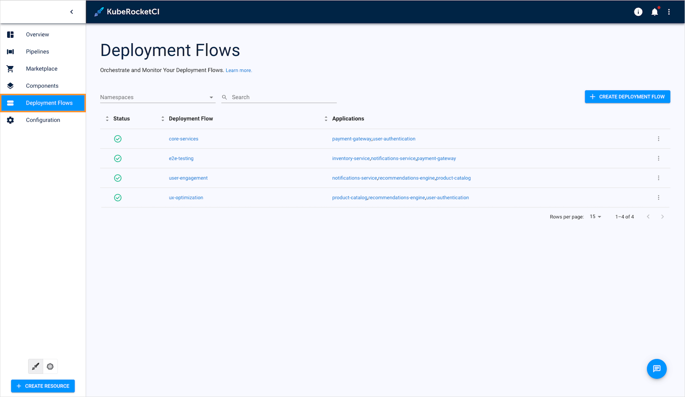

2. Choose a deployment flow to delete. Click the actions button and select **Delete**:

  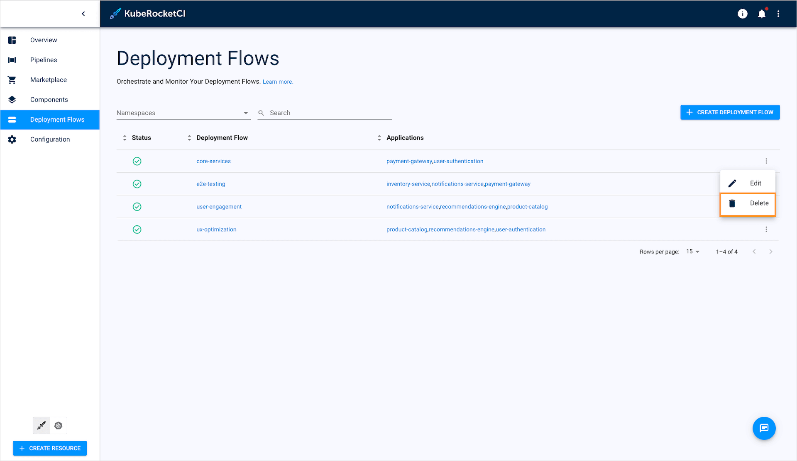

3. Enter the deployment flow name and click **Delete**:

  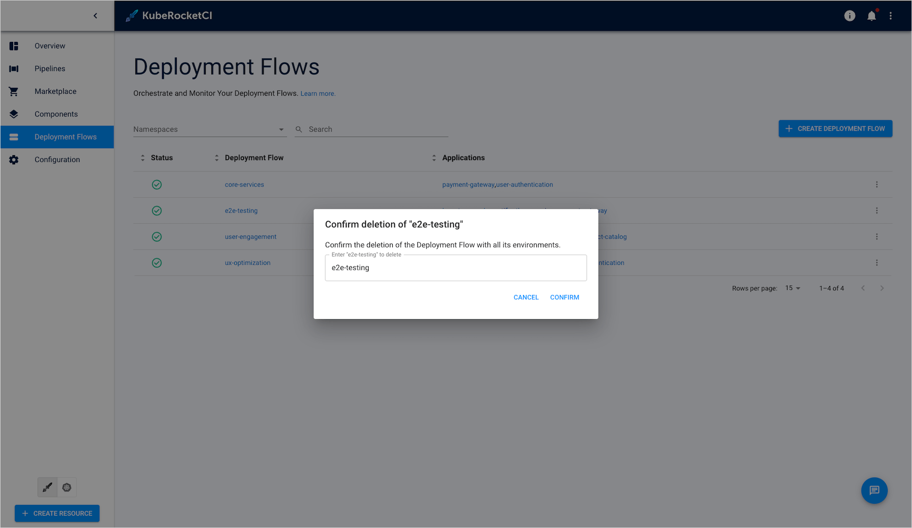

### Delete Codebases

After deleting deployment flows, you can delete the associated resources they operate with. These resources, collectively referred to as codebases, include [applications](application.md), [libraries](library.md), [autotests](autotest.md), and [infrastructures](infrastructure.md).

In this example, we will demonstrate how to delete an application. The same procedure applies to other types of codebases:

1. Navigate to **KubeRocketCI portal** -> **Components**:

  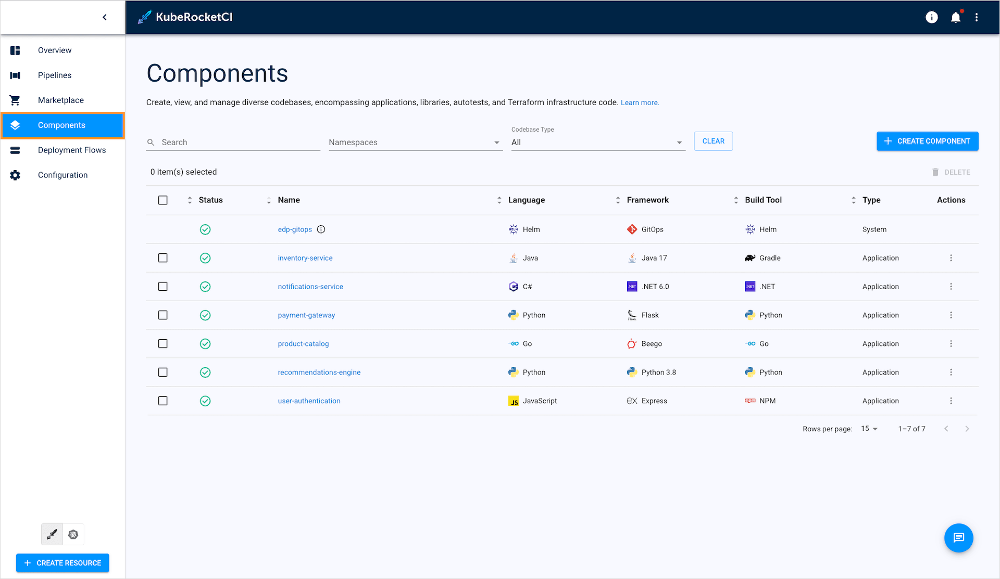

2. Choose an application to delete. Click the actions button and select **Delete**:

  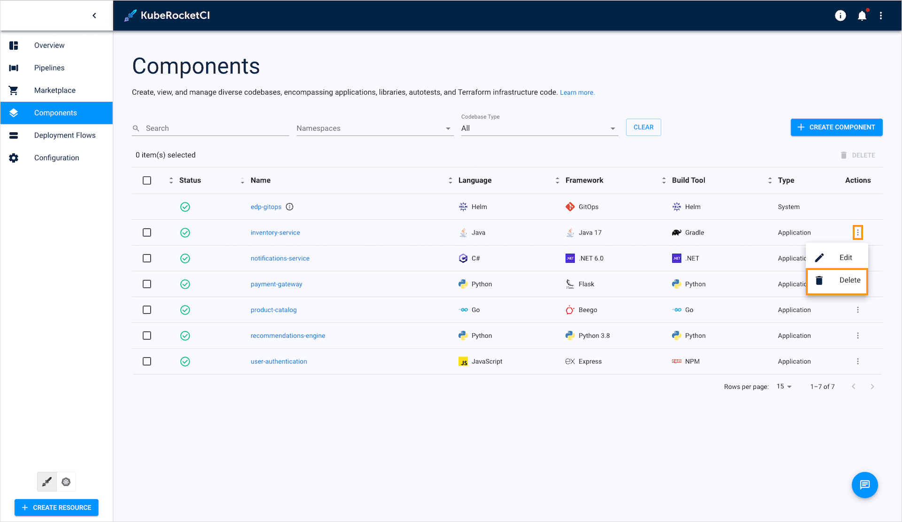

3. Enter the application name and click **Delete**:

  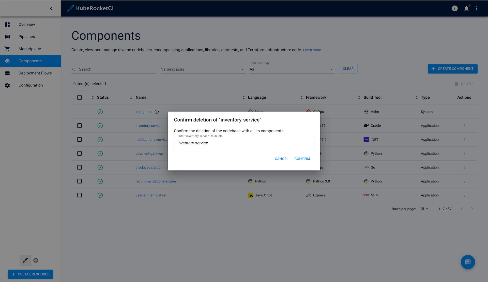

### Delete Pipeline Runs

The last platform resource remaining is [pipeline runs](./pipelines.md). A pipeline run refers to an execution instance of a pipeline. Each time you trigger a build, review, deploy, or clean pipeline, a new pipeline run emerges. To delete pipeline runs, follow these steps:

1. Navigate to **KubeRocketCI portal** -> **Pipelines**:

  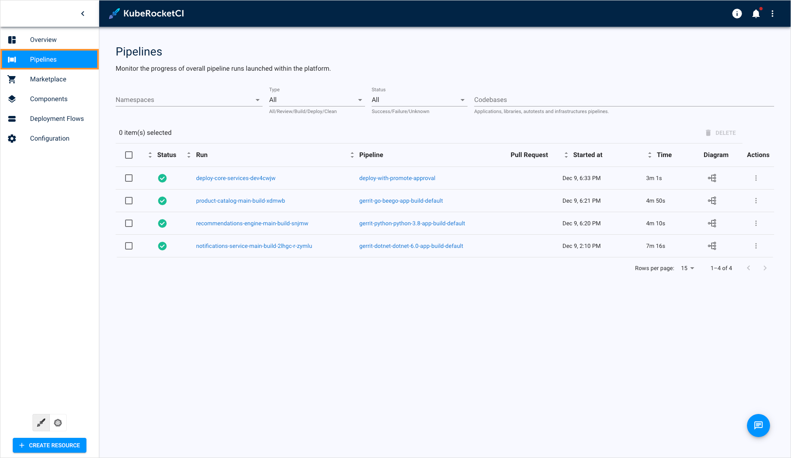

2. Choose pipeline runs and click **Delete**:

  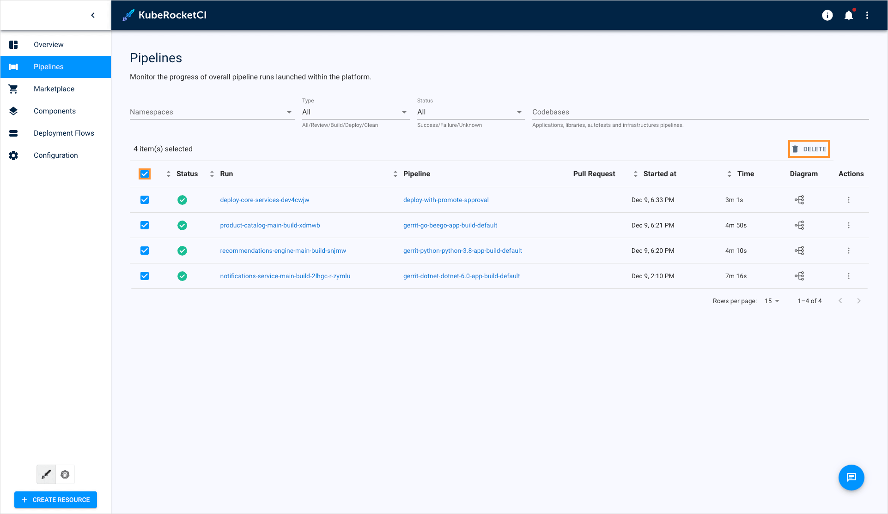

3. On the confirmation window, enter **confirm** and click **Delete**:

  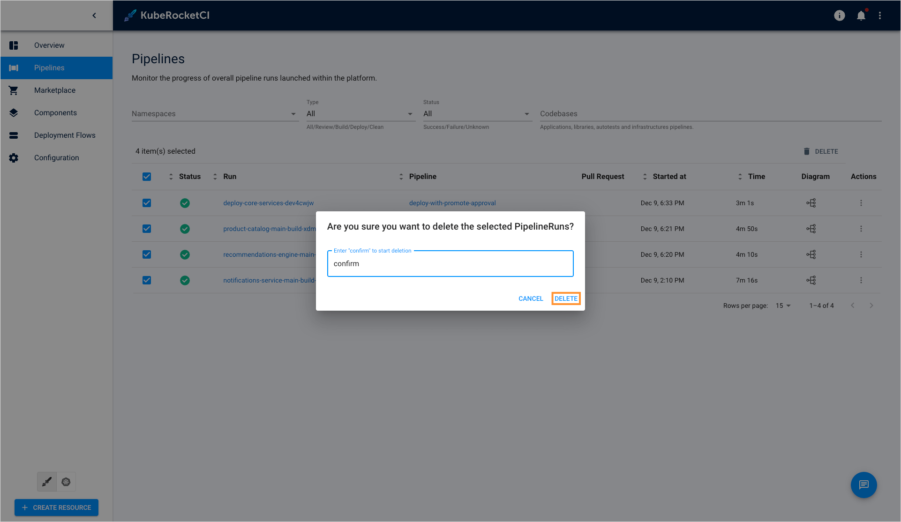

## Third-Party Resource Cleanup

KubeRocketCI supports integrations with a wide range of [third-party tools](../operator-guide/devsecops/overview.md#integrated-tools), many of which are involved in the codebase management process. Therefore, it is crucial to clean up resources associated with these integrations.

### Version Control Systems

If you want to re-add a component with the same name, cleaning up artifacts is mandatory for correct platform operation. When using a create or clone strategy, [codebase operator](https://github.com/epam/edp-codebase-operator) provisions a repository in the Version Control System (VCS) each time you create a new codebase.

:::note
  When re-adding a repository instead of deleting it, clear repository tags to prevent versioning conflicts. For re-adding a Helm chart, clean the **deploy-templates** folder.
:::

Below are links to the official documentation for deleting code repositories:

<Tabs
  defaultValue="github"
  values={[
    {label: 'GitHub', value: 'github'},
    {label: 'GitLab', value: 'gitlab'},
    {label: 'Bitbucket', value: 'bitbucket'},
    {label: 'Gerrit', value: 'gerrit'}
  ]}>

    <TabItem value="github">
      To delete a GitHub repository, read the [Deleting a repository](https://docs.github.com/en/repositories/creating-and-managing-repositories/deleting-a-repository) page.
    </TabItem>

    <TabItem value="gitlab">
      To delete a GitLab repository, read the [Manage projects](https://docs.gitlab.com/ee/user/project/working_with_projects.html#delete-a-project) page.
    </TabItem>

    <TabItem value="bitbucket">
      To delete a Bitbucket repository, read the [Delete a repository](https://support.atlassian.com/bitbucket-cloud/docs/delete-a-repository/) page.
    </TabItem>

    <TabItem value="gerrit">
      To delete a Gerrit repository, refer to the [Project Deletion](https://gerrit-review.googlesource.com/Documentation/intro-project-owner.html#project-deletion) section.
    </TabItem>
</Tabs>

### Delete Nexus Artifacts

KubeRocketCI uses Nexus Repository Manager as an artifact registry for storing application binaries.

If the Nexus instance is installed using [add-ons](https://github.com/epam/edp-cluster-add-ons/tree/main), a predefined [cleanup policy](https://github.com/epam/edp-cluster-add-ons/blob/main/clusters/core/addons/nexus-operator/templates/scripts/create-tasks.yaml) is deployed along with it. This policy automatically deletes unused images after [30 days](https://github.com/epam/edp-cluster-add-ons/blob/main/clusters/core/addons/nexus-operator/templates/scripts/create-tasks.yaml#L132). Ensure that the policy is activated to enable successful automatic cleanup.

#### Repository Types in Nexus

A Nexus repository is a collection of components such as JAR files, Docker images, and other artifacts. KubeRocketCI uses the following repository types:

* **Container Repository**: Stores container images and Helm charts.
* **Maven Repository**: Handles Maven artifacts like JARs and POMs.
* **Dotnet Repository**: Manages NuGet packages.
* **NPM Repository**: Stores NPM packages.
* **Python Repository**: Hosts Pip packages.
* **Yum Repository**: Stores RPM packages.

#### Repository Structure

Repositories are categorized into the following types:

* **Hosted**: Stores locally uploaded artifacts (e.g., krci-npm-hosted).
* **Group**: Aggregates multiple repositories for unified access (e.g., krci-maven-group).
* **Proxy**: Mirrors artifacts from remote repositories (e.g., krci-maven-proxy).

#### Manual Deletion Procedure

To clean up unnecessary application binaries manually, follow these steps:

1. Navigate to Nexus main menu and select the **Browse** tab:

  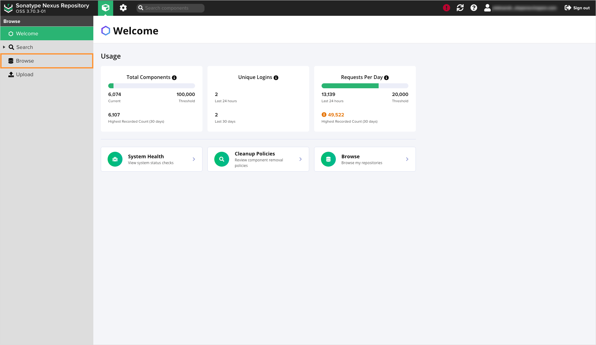

2. On the **Browse** tab, select the folder with the name that represents the application type:

  For example, to delete a .NET application, navigate to **krci-dotnet-releases** or **krci-dotnet-snapshots** folder. Understanding the difference between the release and snapshot folders is essential:

  * **Releases**: This repository type stores applications built in release branches. These applications are usually tagged as release candidates (RC).
  * **Snapshots**: This type of repository stores other applications and their versions, usually tagged as snapshots.

  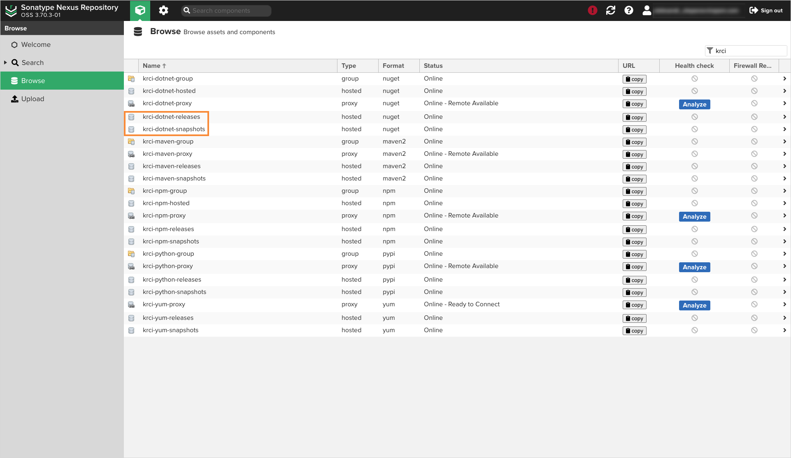

3. In the Nexus repository, select the package folder and click **Delete folder**:

  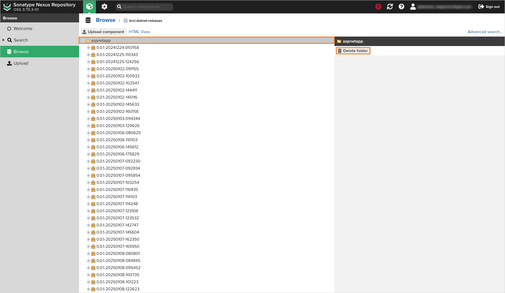

4. (Optional) Repeat steps 1-3 for all the packages that need to be cleaned up.

### Delete Container Images

KubeRocketCI uses container images to deploy the applications to [deployment flows](../user-guide/add-cd-pipeline.md). To clean up a container registry, follow the corresponding guidelines:

  <Tabs
    defaultValue="ecr"
    values={[
      {label: 'AWS ECR', value: 'ecr'},
      {label: 'DockerHub', value: 'docker'},
      {label: 'Harbor', value: 'harbor'},
      {label: 'Nexus', value: 'nexus'},
      {label: 'GitHub', value: 'github'}
    ]}>

      <TabItem value="ecr">
        To delete container images from the AWS Elastic Container Registry, read the [Deleting an image in Amazon ECR](https://docs.aws.amazon.com/AmazonECR/latest/userguide/delete_image.html#:~:text=To%20delete%20an%20image%20(AWS%20Management%20Console)&text=In%20the%20navigation%20pane%2C%20choose,to%20delete%20and%20choose%20Delete.) page.
      </TabItem>

      <TabItem value="docker">
        To delete container images from DockerHub, read the [Delete a repository](https://docs.docker.com/docker-hub/repos/delete/) page.
      </TabItem>

      <TabItem value="harbor">
        To delete container images from Harbor, read the [Deleting Artifacts](https://goharbor.io/docs/2.3.0/working-with-projects/working-with-images/deleting-artifact/) page.
      </TabItem>

      <TabItem value="nexus">
        1. Navigate to Nexus main menu and select the **Browse** tab:

          

        2. On the **Browse** tab, select the repository with the **krci-container-hosted** name:

          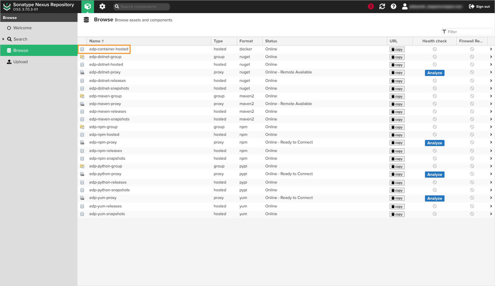

        3. On the repository details page, select the folder name and click **Delete folder**:

          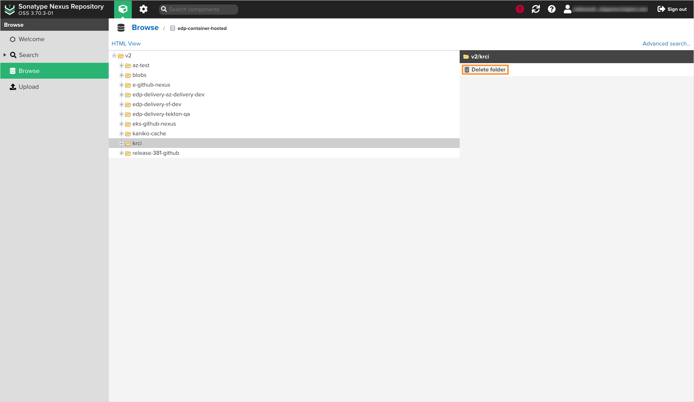
      </TabItem>

      <TabItem value="github">
        To delete container images from GitHub Container Registry, read the [Working with the Container registry](https://docs.github.com/en/packages/working-with-a-github-packages-registry/working-with-the-container-registry) page.
      </TabItem>
  </Tabs>

### Delete SonarQube Projects

KubeRocketCI generates a SonarQube project for every new codebase. To clean up application projects, follow the guidelines described in the [official documentation](https://docs.sonarsource.com/sonarqube-server/8.9/project-administration/project-settings/#deleting-a-project). Deleting a codebase without removing the corresponding SonarQube project may lead to issues in review pipelines.

### Observability Tools

KubeRocketCI supports various observability tools, including DefectDojo, Dependency-Track, Datadog, and more. While these tools don't directly impact the platform's core functionality, they can generate significant data during operation.

Some tools, such as Dependency-Track and SonarQube, offer deep integration with KubeRocketCI through dedicated widgets. These widgets allow users to view code quality metrics and dependency scan results directly in the codebase details menu:

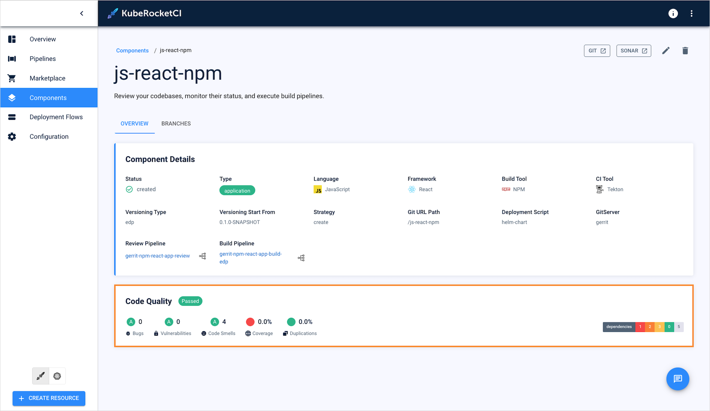

#### DefectDojo

There are two methods to delete observability data from DefectDojo:

* **By deleting a product**: This method lets you delete observability data for the entire KubeRocketCI platform simultaneously.
* **By deleting engagements**: This method lets you selectively delete data for specific codebases.

Deleting a DefectDojo product is preferable if you no longer need your product's security scans. Typically, the product name matches the Kubernetes namespace. A product is deleted on the product's details page:

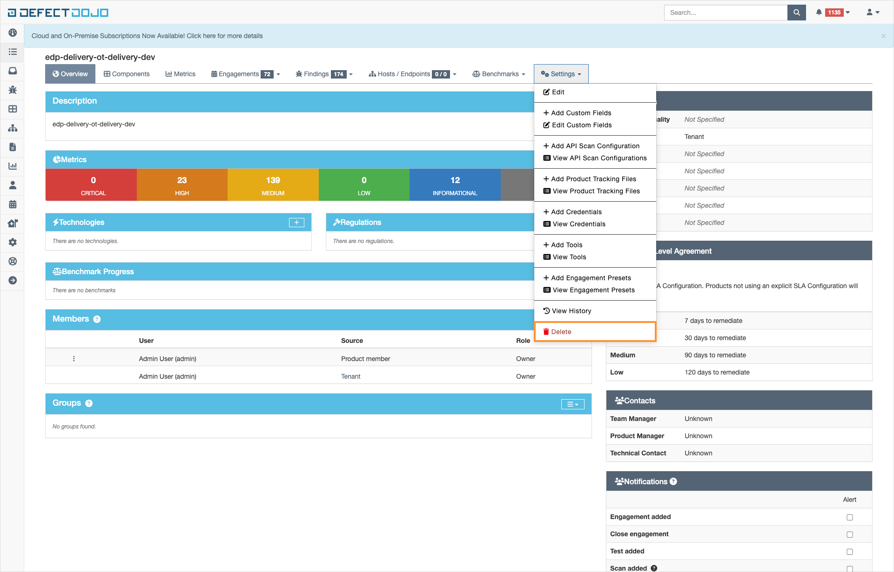

Deleting engagements will clean up security scan runs for specific codebases. This method is preferable when retaining certain parts of the product's data. To find the security scans for specific codebases, use search filters:

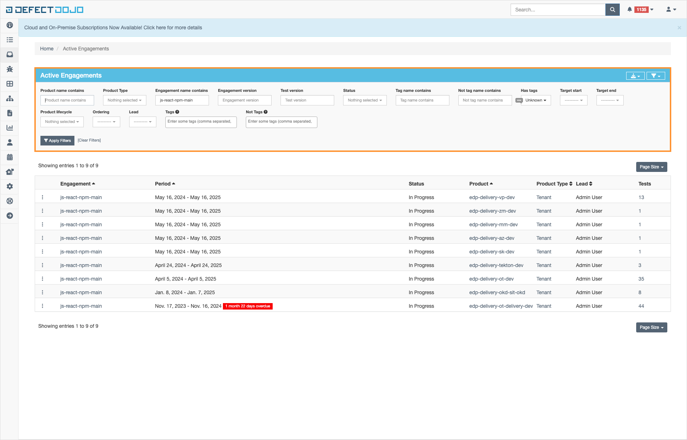

To delete an engagement, click the three dots icon and select **Delete**:

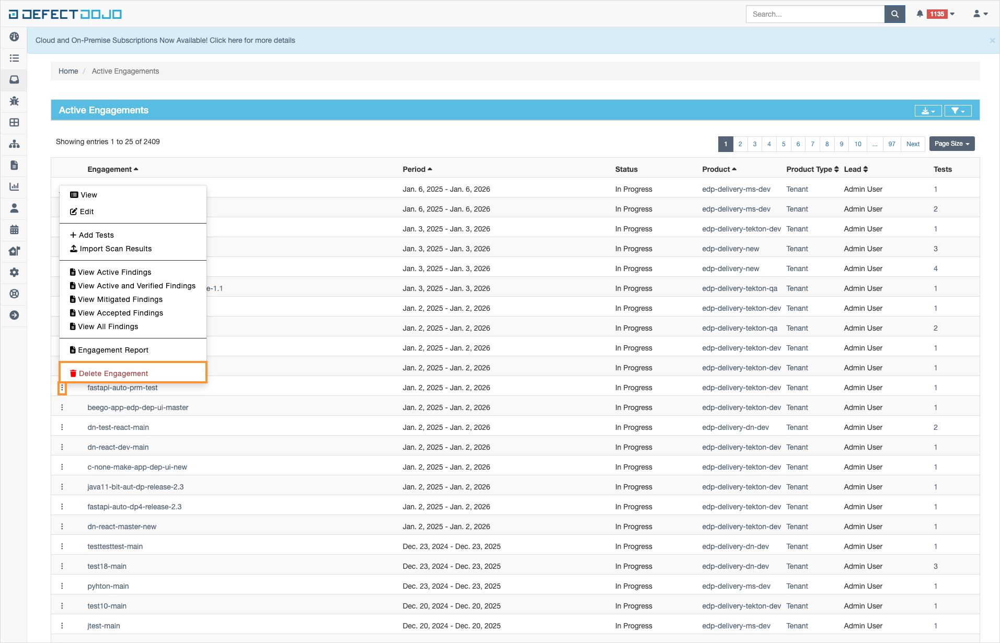

#### Dependency-Track

At the moment, Dependency-Track has fewer options for selectively deleting data. Therefore, it is often preferable to delete an entire Dependency-Track project.

To delete a Dependency-Track project, follow these steps:

1. Log into your Dependency-Track instance.
2. Open the Projects list and find the project you want to delete.
3. Enter the project details by clicking its name:

  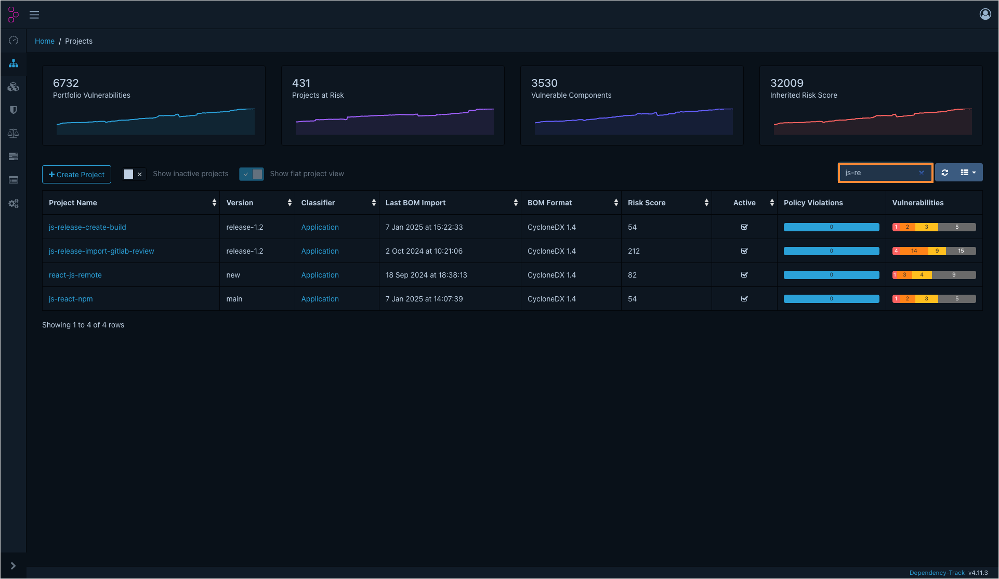

4. In the project's details page, click the **View Details** button:

  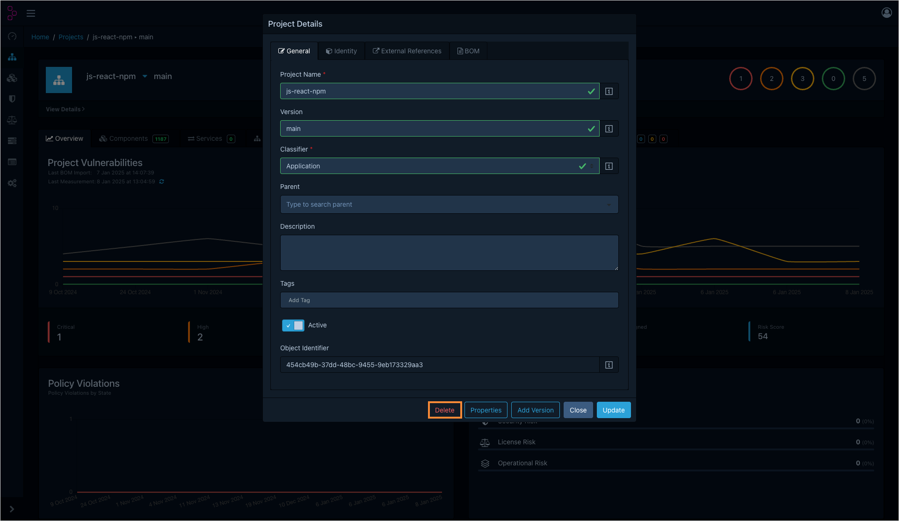

5. On the project details menu, click **Delete**:

  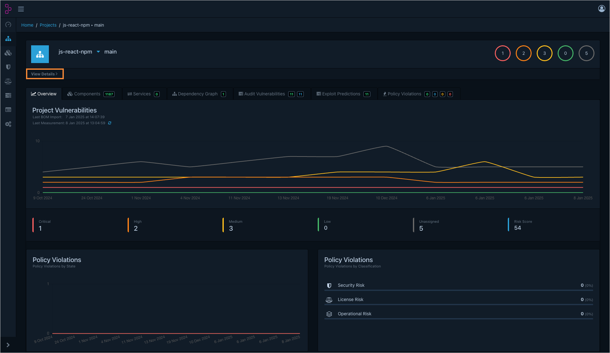

## Related Articles

* [Manage Applications](./application.md)
* [Add Application](./add-application.md)
* [Manage Deployment Flows](./manage-environments.md)
