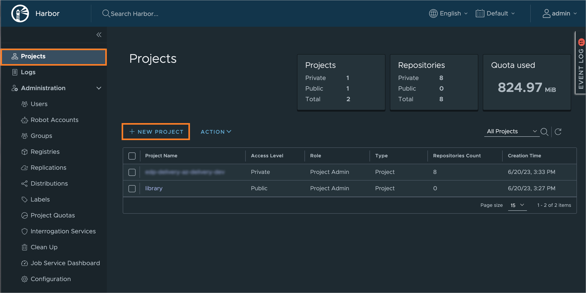
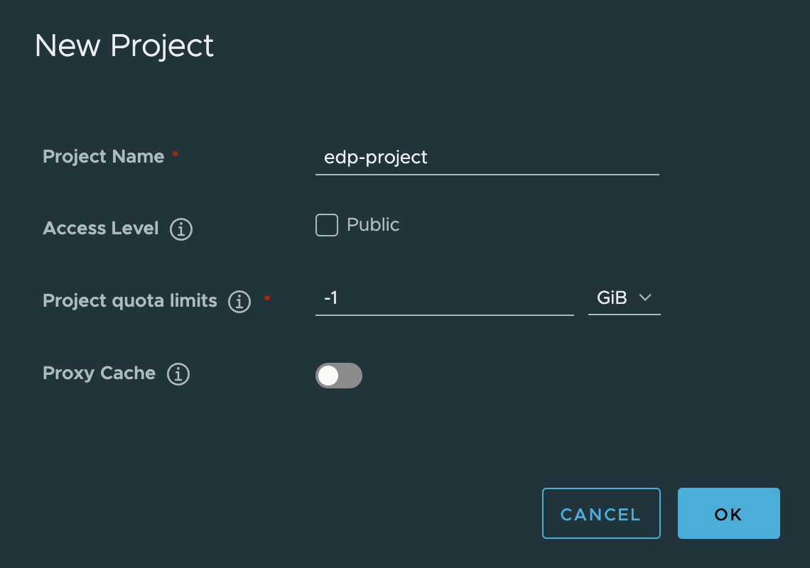
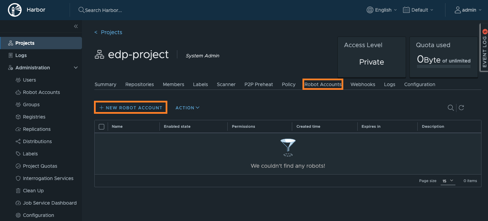
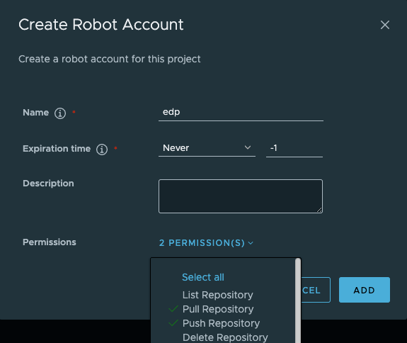
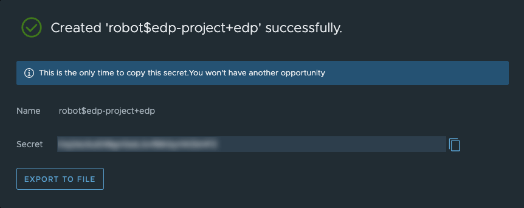
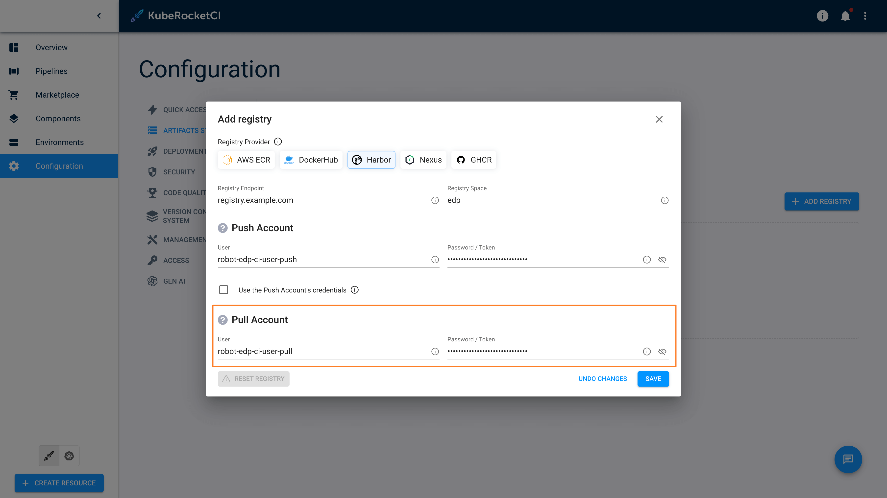
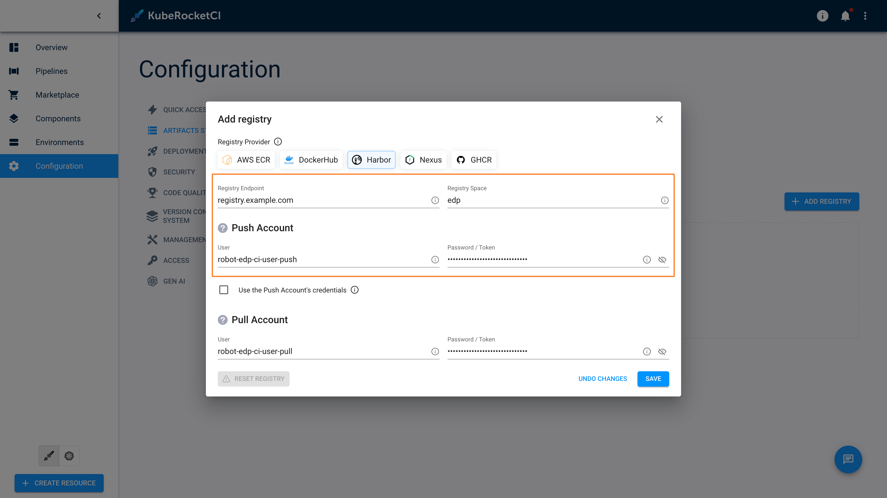
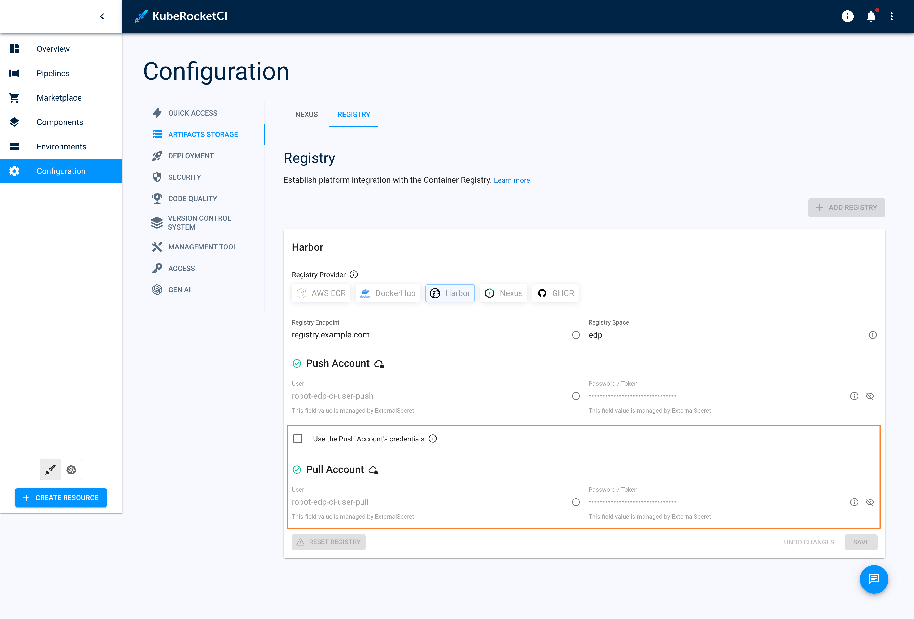
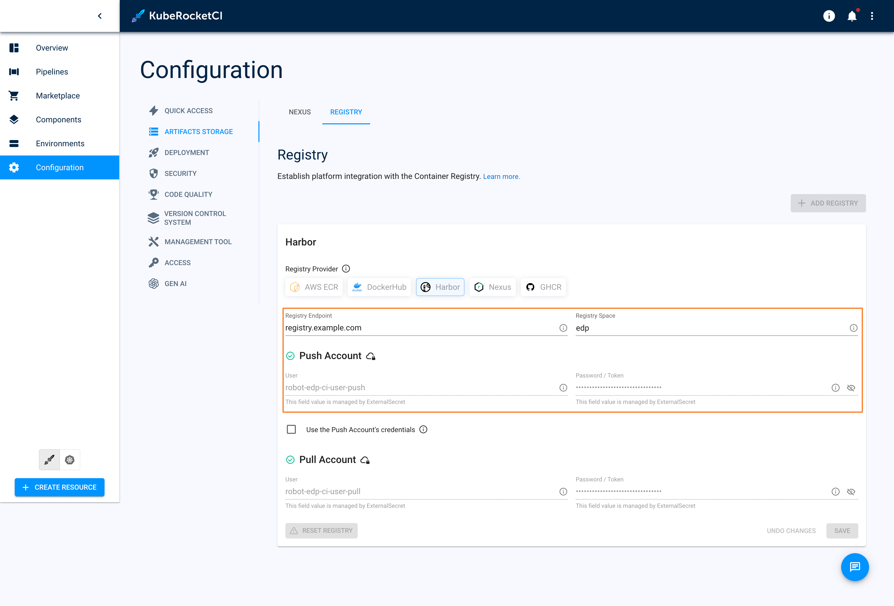

<!-- markdownlint-disable MD025 -->

import Tabs from '@theme/Tabs';
import TabItem from '@theme/TabItem';

# Integrate Harbor With Tekton Pipelines

<head>
  <link rel="canonical" href="https://docs.kuberocketci.io/docs/operator-guide/artifacts-management/harbor-integration" />
</head>

[Harbor](https://goharbor.io/) is an advanced, open-source cloud-native registry that securely manages container images and Helm charts, and also supports a wide range of OCI artifacts. It enforces policies and role-based access control, while ensuring all managed content, including container images and other artifacts, are scanned and certified free from vulnerabilities. For those looking to integrate Harbor into their workflow, the documentation provides comprehensive steps on [creating projects](https://goharbor.io/docs/2.0.0/working-with-projects/create-projects/) and establishing robot accounts. These accounts facilitate automated and secure interactions with the registry, crucial for CI pipelines and enhancing overall security and efficiency in artifact management.

## Overview

Harbor integration with Tekton enables the centralized storage of container images within the cluster,
eliminating the need for external services. By leveraging Harbor as the container registry, users can manage
and store their automation results and reports in one place.

## Integration Procedure

The integration process involves two steps:

1. Creating a project to store application images.

2. Creating two service accounts (robot account) with different permissions to push (read/write) and pull (read-only) project images.

### Create New Project

The process of creating new projects is the following:

1. Log in to the Harbor console using your credentials.
2. Navigate to the **Projects** menu, click the **New Project** button:

    

3. On the **New Project** menu, enter a project name that matches your platform namespace in the **Project Name** field. Keep other fields as default and click **OK** to continue:

    

### Set Up Robot Account

To facilitate seamless interaction between KubeRocketCI and a Harbor project, it is crucial to establish a robot account. This process involves:

1. Navigate to your newly created project, select **Robot Accounts** menu and choose **New Robot Account**:

    

2. In the pop-up window, fill in the fields as follows:

    * **Name** - `edp-push`;
    * **Expiration time** -  set the value which is aligned with your organization policy;
    * **Description** - `read/write permissions`;
    * **Permissions** - `Pull Repository` and `Push Repository`.

    To proceed, click the **ADD** button:

    

3. In the appeared window, copy the robot account credentials or click the **Export to file** button to save the secret and account name locally:

    

4. Provision the **kaniko-docker-config** secrets using kubectl, KubeRocketCI portal or with the externalSecrets operator:

    The `auth` string can be generated by this command:

    ```bash
    echo -n "robot\$edp-project+edp:secret" | base64
    ```

    <Tabs
      defaultValue="portal"
      values={[
        {label: 'UI Portal', value: 'portal'},
        {label: 'Manifests', value: 'manifests'},
        {label: 'External Secrets Operator', value: 'externalsecret'},
      ]}>

      <TabItem value="portal">
      Navigate to **Portal** -> **Configuration** -> **ARTIFACTS STORAGE** -> **Registry**. Update or click **+ ADD INTEGRATION** fill in the required fields and click `Save`.

      
      </TabItem>

      <TabItem value="manifests">
      ```yaml
        apiVersion: v1
        kind: Secret
        metadata:
          name: kaniko-docker-config
          namespace: krci
          labels:
            app.edp.epam.com/secret-type: registry
            app.edp.epam.com/integration-secret: "true"
        type: kubernetes.io/dockerconfigjson
        stringData:
          .dockerconfigjson: |
            {
              "auths" : {
                "harbor-registry.com":
                  {
                    "username":"registry-username",
                    "password":"registry-password",
                    "auth": "secret-string"
                  }
              }
            }
      ```
      </TabItem>

      <TabItem value="externalsecret">
      ```json
      "kaniko-docker-config":
        {"auths" : "harbor-registry.com":
          {
            "username":"registry-username",
            "password":"registry-password",
            "auth": "secret-string"
          }
        }
      ```

      Navigate to **Portal** -> **Configuration** -> **ARTIFACTS STORAGE** -> **Registry**. Here, you will observe the `Managed by ExternalSecret` message:

      

      :::note
        More details of External Secrets Operator Integration can be found in the [External Secrets Operator Integration](../secrets-management/external-secrets-operator-integration.md) page.
      :::
      </TabItem>

    </Tabs>

5. Repeat steps 2-3 with values below:

    * **Name** - `edp-pull`;
    * **Expiration time** -  set the value which is aligned with your organization policy;
    * **Description** - `read-only permissions`;
    * **Permissions** - `Pull Repository`.

6. Provision the **regcred** secrets using kubectl, KubeRocketCI portal or with the externalSecrets operator:

    The `auth` string can be generated by this command:<br />

    ```bash
    echo -n "robot\$edp-project+edp-push:secret" | base64
    ```

    <Tabs
      defaultValue="portal"
      values={[
        {label: 'UI Portal', value: 'portal'},
        {label: 'Manifests', value: 'manifests'},
        {label: 'External Secrets Operator', value: 'externalsecret'},
      ]}>

      <TabItem value="portal">
      Navigate to **Portal** -> **Configuration** -> **ARTIFACTS STORAGE** -> **Registry**. Update or click **+ ADD INTEGRATION** fill in the required fields and click `Save`.

      
      </TabItem>

      <TabItem value="manifests">
      ```yaml
      apiVersion: v1
      kind: Secret
      metadata:
        name: regcred
        namespace: krci
        labels:
          app.edp.epam.com/secret-type: registry
          app.edp.epam.com/integration-secret: "true"
      type: kubernetes.io/dockerconfigjson
      stringData:
        .dockerconfigjson: |
          {
            "auths" : {
              "harbor-registry.com":
                {
                  "username":"registry-username",
                  "password":"registry-password",
                  "auth": "secret-string"
                }
            }
          }
      ```
      </TabItem>

      <TabItem value="externalsecret">
      ```json
      "regcred":
        {"auths" : "harbor-registry.com":
          {
            "username":"registry-username",
            "password":"registry-password",
            "auth": "secret-string"
          }
        }
      ```

      Navigate to **Portal** -> **Configuration** -> **ARTIFACTS STORAGE** -> **Registry**. Here, you will observe the `Managed by ExternalSecret` message:

      

      :::note
        More details of External Secrets Operator Integration can be found in the [External Secrets Operator Integration](../secrets-management/external-secrets-operator-integration.md) page.
      :::
      </TabItem>
    </Tabs>

7. In the [values.yaml](https://github.com/epam/edp-install/blob/master/deploy-templates/values.yaml) file for the **edp-install** Helm chart, set the following values for the specified fields:

    <Tabs
      defaultValue="manifests"
      values={[
        {label: 'Manifests', value: 'manifests'},
        {label: 'External Secrets Operator', value: 'externalsecret'},
      ]}>

      <TabItem value="manifests">
      If the `kaniko-docker-config` secret has been created manually:

      ```yaml title="values.yaml"
      ...
      kaniko:
        existingDockerConfig: "kaniko-docker-config"
      global:
        dockerRegistry:
          url: harbor-registry.com
          type: "harbor"
      ...
      ```

      </TabItem>

      <TabItem value="externalsecret">
      If the `kaniko-docker-config` secret has been created via External Secrets Operator:

      ```yaml title="values.yaml"
      ...
      kaniko:
        existingDockerConfig: "kaniko-docker-config"
      externalSecrets:
        enabled: true
      global:
        dockerRegistry:
          url: harbor-registry.com
          type: "harbor"
      ...
      ```

      </TabItem>
    </Tabs>

8. (Optional) If you've already deployed the edp-install Helm chart, you can update it using the following command:

    ```bash
    helm update --install edp epamedp/edp-install \
    --values values.yaml \
    --namespace krci
    ```

As a result, application images built in UI Portal will be stored in Harbor project and will be deployed from the harbor registry.

Harbor projects can be added and retained with a retention policy generated through the script in [edp-cluster-add-ons](https://github.com/epam/edp-cluster-add-ons/tree/main/clusters/core/addons/harbor-ha/hack/harbor).

## Related Articles

* [Install KubeRocketCI](../install-kuberocketci.md)
* [Install Harbor](../artifacts-management/harbor-installation.md)
* [Adjust Jira Integration](../project-management-and-reporting/jira-integration.md)
* [Custom SonarQube Integration](../code-quality/sonarqube.md)
