<!-- markdownlint-disable MD025 -->

import Tabs from '@theme/Tabs';
import TabItem from '@theme/TabItem';

# Argo CD Integration

<head>
  <link rel="canonical" href="https://docs.kuberocketci.io/docs/operator-guide/cd/argocd-integration" />
</head>

KubeRocketCI uses Argo CD as a [part of the Continuous Delivery/Continuous Deployment](../../user-guide/cd-pipeline-details.md)
implementation. Argo CD follows the best GitOps practices, uses Kubernetes native approach for the Deployment Management, has rich UI and
required RBAC capabilities.

## Argo CD Deployment Approach in KubeRocketCI

Argo CD can be installed using [two different approaches](https://argo-cd.readthedocs.io/en/stable/operator-manual/installation):

* Cluster-wide scope with the cluster-admin access
* Namespaced scope with the single namespace access

Both approaches can be deployed with High Availability (HA) or Non High Availability (non HA) installation manifests.

KubeRocketCI uses the HA deployment with the cluster-admin permissions, to minimize cluster resources consumption by sharing
single Argo CD instance across multiple KubeRocketCI Tenants. Please follow [the installation instructions](../install-argocd.md) to deploy Argo CD.

## Integration

See a diagram below for the details:

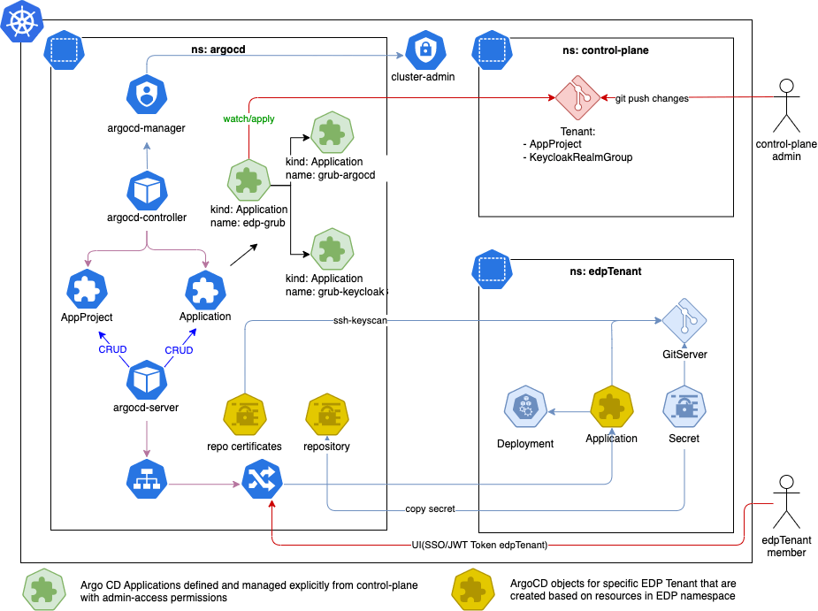

* Argo CD is deployed in a separate `argocd` namespace.
* Argo CD uses a `cluster-admin` role for managing cluster-scope resources.
* The `control-plane` application is created using the App of Apps approach, and its code is managed by the `control-plane` members.
* The `control-plane` is used to onboard new Argo CD Tenants (Argo CD Projects - AppProject).
* The `KubeRocketCI Tenant Member` manages `Argo CD Applications` using `kind: Application` in the `krciTenant` namespace.

The [App Of Apps approach](https://argo-cd.readthedocs.io/en/stable/operator-manual/cluster-bootstrapping/) is used to
manage the `KubeRocketCI Tenants`. Inspect the [edp-grub](https://github.com/SergK/edp-grub) repository structure that is used to
provide the KubeRocketCI Tenants for the Argo CD Projects:

```bash
edp-grub
├── LICENSE
├── README.md
├── apps                      ### All Argo CD Applications are stored here
│   ├── grub-argocd.yaml      # Application that provisions Argo CD Resources - Argo Projects (KubeRocketCI Tenants)
│   └── grub-keycloak.yaml    # Application that provisions Keycloak Resources - Argo CD Groups (KubeRocketCI Tenants)
├── apps-configs
│   └── grub
│       ├── argocd            ### Argo CD resources definition
│       │   └── edp.yaml
│       └── keycloak          ### Keycloak resources definition
│           └── edp.yaml
├── bootstrap
│   └── root.yaml             ### Root application in App of Apps, which provision Applications from /apps
└── examples                  ### Examples
    └── tenant
        └── edp-petclinic.yaml
```

The Root Application must be created under the `control-plane` scope.

## Argo CD Configuration

Now that Argo CD is integrated, it is time to configure it properly. To configure Argo CD for KubeRocketCI, follow the steps below:

1. Modify the `argocd-cmd-params-cm` ConfigMap in the `argocd` namespace and add the `application.namespaces` parameter to the `data` subsection:

    <Tabs
      defaultValue="kubectl"
      values={[
        {label: 'kubectl', value: 'kubectl'},
        {label: 'manifest', value: 'manifest'}
      ]}>

      <TabItem value="kubectl">
        ```bash
        kubectl patch configmap argocd-cmd-params-cm -n argocd --type merge -p '{"data":{"application.namespaces":"krci"}}'
        ```
      </TabItem>

      <TabItem value="manifest">
        ```yaml
        data:
          application.namespaces: krci
        ```
      </TabItem>
    </Tabs>

2. Add a [credential template](https://argo-cd.readthedocs.io/en/stable/user-guide/private-repositories/#private-repositories)
for GitHub, GitLab, Bitbucket, or Gerrit integrations. The credential template must be created for each Git Server.

    <Tabs
      defaultValue="github"
      values={[
        {label: 'GitHub/GitLab/Bitbucket', value: 'github'},
        {label: 'Gerrit', value: 'gerrit'}
      ]}>

      <TabItem value="github">

      Generate an SSH key pair and add a public key to GitLab, GitHub, or Bitbucket account.

      :::warning
        Use an additional GitHub/GitLab User to access a repository. For example:<br />
          - GitHub, add a User to a repository with a "Read" role.<br />
          - GitLab, add a User to a repository with a "Guest" role.
      :::

      ```bash
      ssh-keygen -t ed25519 -C "email@example.com" -f argocd
      ```

      Copy SSH private key to Argo CD namespace.

      ```bash
      KRCI_NAMESPACE="krci"
      VCS_HOST="<github.com_or_gitlab.com_or_bitbucket.org>"
      ACCOUNT_NAME="<ACCOUNT_NAME>"
      URL="ssh://git@${VCS_HOST}:22/${ACCOUNT_NAME}"

      kubectl create secret generic ${KRCI_NAMESPACE} -n argocd \
        --from-file=sshPrivateKey=argocd \
        --from-literal=url="${URL}"
      kubectl label --overwrite secret ${KRCI_NAMESPACE} -n argocd "argocd.argoproj.io/secret-type=repo-creds"
      ```

      </TabItem>

      <TabItem value="gerrit">
        Copy existing SSH private key for Gerrit to Argo CD namespace.

        ```bash
        KRCI_NAMESPACE="krci"
        GERRIT_PORT=$(kubectl get gerrit gerrit -n ${KRCI_NAMESPACE} -o jsonpath='{.spec.sshPort}')
        GERRIT_ARGOCD_SSH_KEY_NAME="gerrit-ciuser-sshkey"
        GERRIT_URL=$(echo "ssh://edp-ci@gerrit.${KRCI_NAMESPACE}:${GERRIT_PORT}" | base64)
        kubectl get secret ${GERRIT_ARGOCD_SSH_KEY_NAME} -n ${KRCI_NAMESPACE} -o json | jq 'del(.data.username,.metadata.annotations,.metadata.creationTimestamp,.metadata.labels,.metadata.resourceVersion,.metadata.uid,.metadata.ownerReferences)' | jq '.metadata.namespace = "argocd"' | jq --arg name "${KRCI_NAMESPACE}" '.metadata.name = $name' | jq --arg url "${GERRIT_URL}" '.data.url = $url' | jq '.data.sshPrivateKey = .data.id_rsa' | jq 'del(.data.id_rsa,.data."id_rsa.pub")' | kubectl apply -f -
        kubectl label --overwrite secret ${KRCI_NAMESPACE} -n argocd "argocd.argoproj.io/secret-type=repo-creds"
        ```
      </TabItem>
    </Tabs>

3. Add [SSH Known hosts](https://argo-cd.readthedocs.io/en/stable/user-guide/private-repositories/#unknown-ssh-hosts)
   for GitHub, GitLab, Bitbucket, or Gerrit integration.

    <Tabs
      defaultValue="github"
      values={[
        {label: 'GitHub/GitLab/Bitbucket', value: 'github'},
        {label: 'Gerrit', value: 'gerrit'}
      ]}>

      <TabItem value="github">
        Add GitHub, GitLab, or Bitbucket host to Argo CD config map with known hosts.

        ```bash
        KRCI_NAMESPACE="krci"
        VCS_HOST="<VCS_HOST>"
        KNOWN_HOSTS_FILE="/tmp/ssh_known_hosts"
        ARGOCD_KNOWN_HOSTS_NAME="argocd-ssh-known-hosts-cm"

        rm -f ${KNOWN_HOSTS_FILE}
        kubectl get cm ${ARGOCD_KNOWN_HOSTS_NAME} -n argocd -o jsonpath='{.data.ssh_known_hosts}' > ${KNOWN_HOSTS_FILE}
        ssh-keyscan ${VCS_HOST} >> ${KNOWN_HOSTS_FILE}
        kubectl create configmap ${ARGOCD_KNOWN_HOSTS_NAME} -n argocd --from-file ${KNOWN_HOSTS_FILE} -o yaml --dry-run=client | kubectl apply -f -
        ```
      </TabItem>

      <TabItem value="gerrit">
        Add Gerrit host to Argo CD config map with known hosts

        ```bash
        KRCI_NAMESPACE="krci"
        KNOWN_HOSTS_FILE="/tmp/ssh_known_hosts"
        ARGOCD_KNOWN_HOSTS_NAME="argocd-ssh-known-hosts-cm"
        GERRIT_PORT=$(kubectl get gerrit gerrit -n ${KRCI_NAMESPACE} -o jsonpath='{.spec.sshPort}')

        rm -f ${KNOWN_HOSTS_FILE}
        kubectl get cm ${ARGOCD_KNOWN_HOSTS_NAME} -n argocd -o jsonpath='{.data.ssh_known_hosts}' > ${KNOWN_HOSTS_FILE}
        kubectl exec -it deployment/gerrit -n ${KRCI_NAMESPACE} -- ssh-keyscan -p ${GERRIT_PORT} gerrit.${KRCI_NAMESPACE} >> ${KNOWN_HOSTS_FILE}
        kubectl create configmap ${ARGOCD_KNOWN_HOSTS_NAME} -n argocd --from-file ${KNOWN_HOSTS_FILE} -o yaml --dry-run=client | kubectl apply -f -
        ```
      </TabItem>
    </Tabs>

4. Create an Argo CD Project (Tenant), for example, with the `krci` name:

    ```yaml title="AppProject"
    apiVersion: argoproj.io/v1alpha1
    kind: AppProject
    metadata:
      name: krci
      namespace: argocd
      # Finalizer that ensures that project is not deleted until it is not referenced by any application
      finalizers:
        - resources-finalizer.argocd.argoproj.io
    spec:
      destinations:
        # by default krci work with 'krci-*' namespace
        - namespace: 'krci-*'
        # allow to deploy to specific server (local in our case)
          name: in-cluster
      # Deny all cluster-scoped resources from being created, except for Namespace
      clusterResourceWhitelist:
      - group: ''
        kind: Namespace
      # Allow all namespaced-scoped resources to be created, except for ResourceQuota, LimitRange, NetworkPolicy
      namespaceResourceBlacklist:
      - group: ''
        kind: ResourceQuota
      - group: ''
        kind: LimitRange
      - group: ''
        kind: NetworkPolicy
      # we are ok to create any resources inside namespace
      namespaceResourceWhitelist:
      - group: '*'
        kind: '*'
      # enable access only for specific git server. The example below 'krci' - it is namespace where KubeRocketCI deployed
      sourceRepos:
        - ssh://git@github.com/*
      # enable capability to deploy objects from namespaces
      sourceNamespaces:
        - krci
    ```

5. Check that your new **Repository**, **Known Hosts**, and **AppProject** are added to the Argo CD UI.

6. Generate Argo CD project token for deploy integration:

    <Tabs
      defaultValue="yaml"
      values={[
        {label: 'YAML', value: 'yaml'},
        {label: 'UI', value: 'ui'}
      ]}>

      <TabItem value="yaml">

        ```bash
        URL=<ARGO CD URL>
        TOKEN=$(argocd proj role create-token krci developer -i argocd-ci -t)


        cat <<EOF | kubectl apply -f -
        apiVersion: v1
        kind: Secret
        metadata:
          name: argocd-ci
          namespace: krci
          labels:
            app.edp.epam.com/integration-secret: "true"
            app.edp.epam.com/secret-type: "argocd"
        type: Opaque
        stringData:
          token: $TOKEN
          url: $URL
        EOF
        ```

      </TabItem>

      <TabItem value="ui">
        Generate Argo CD project token via UI, follow the steps below:

        1. Open your Argo CD endpoint.

        2. In the Argo CD main menu, select **Settings**:

          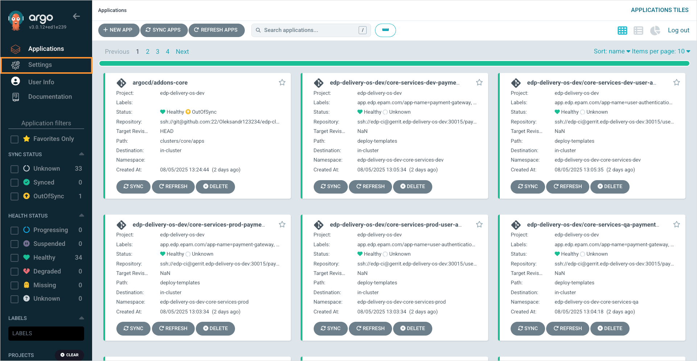

        3. On the **Settings** page, select **Projects**:

          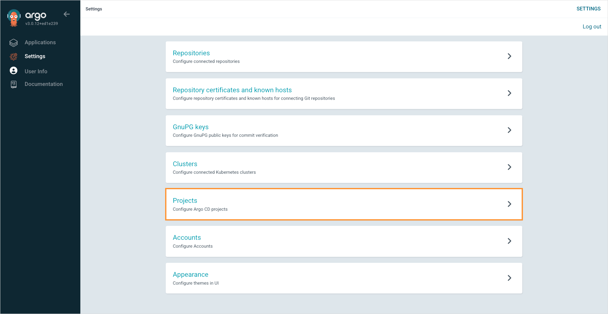

        4. On the **Projects** page, select the previously created Argo CD project:

          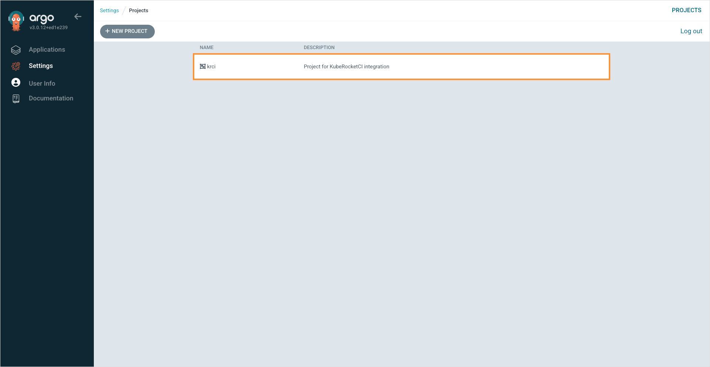

        5. On the project details page, select the **Roles** tab:

          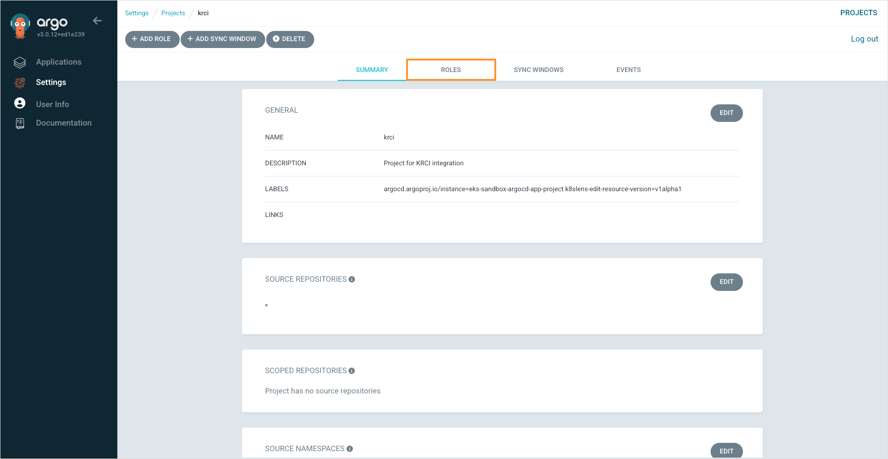

        6. On the **Roles** tab, select the **developer** role:

          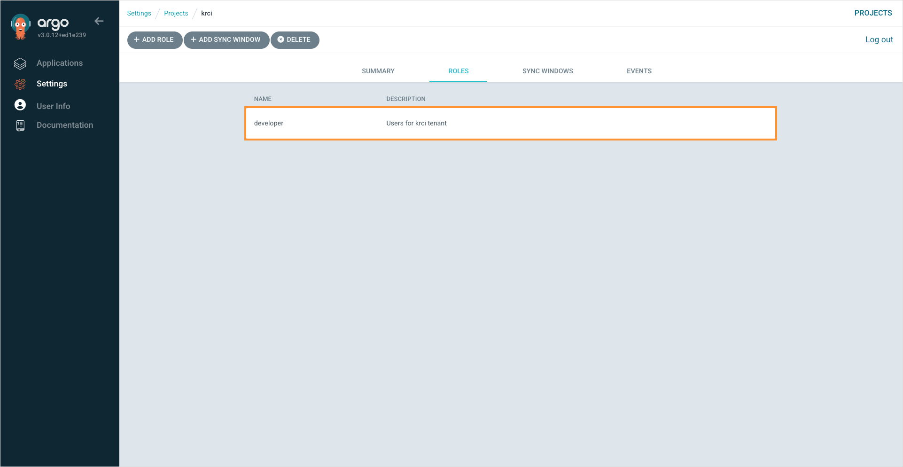

        7. On the appeared window, scroll down to the **JWT Tokens** section, specify the required fields and click **Create**:

          * **Token ID**: Token name.
          * **Expires in**: Defines the period for which the token is considered valid. Must be in the "[0-9]+[s,m,h,d]" format. For example, "12h", "7d".

          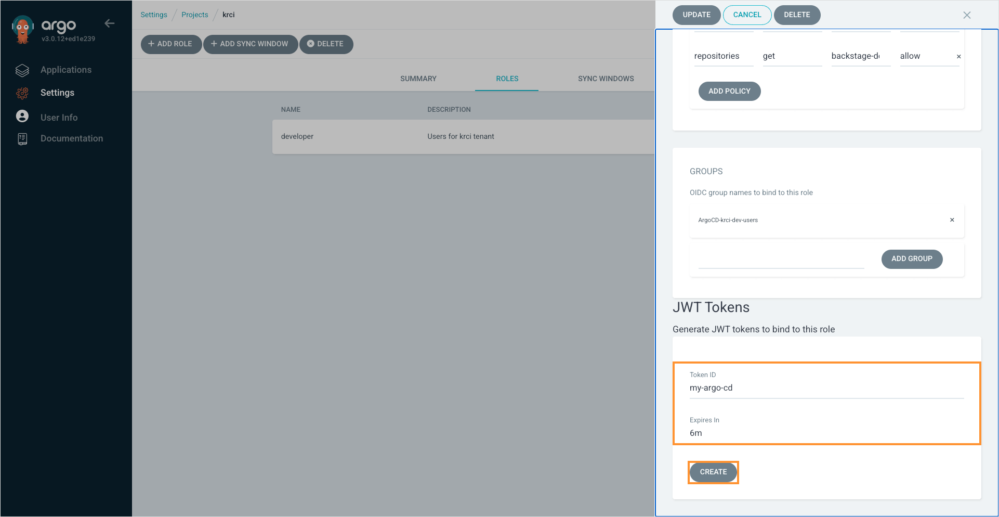

        8. Confirm the token creation:

          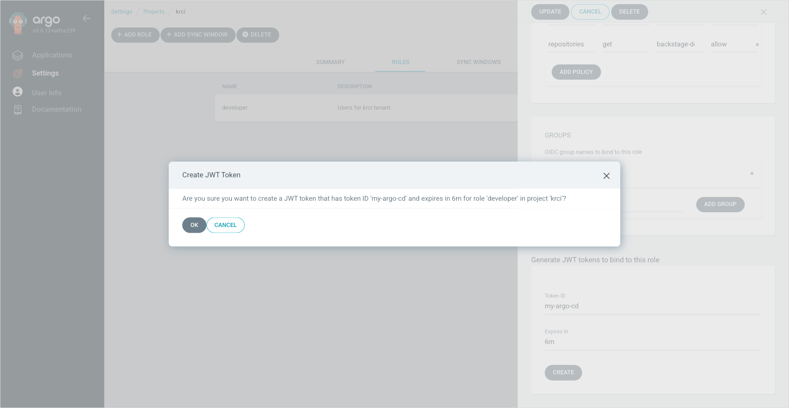

        9. Copy the data of the newly created token:

          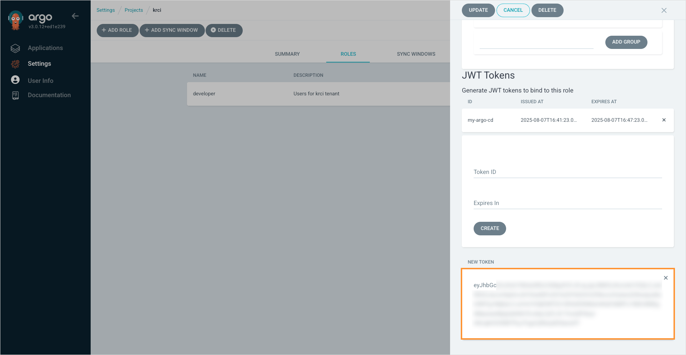

        10. Navigate to **KubeRocketCI portal** -> **Configuration** -> **Deployment** -> **Argo CD** and click **+ Add integration**:

          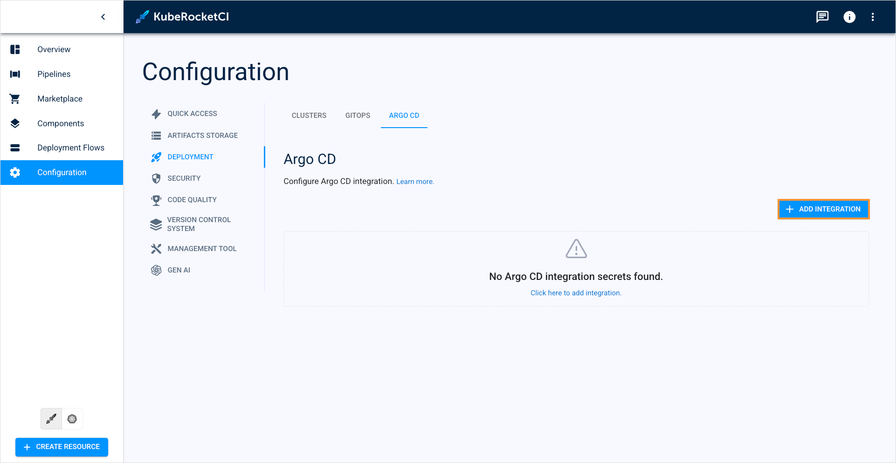

        11. In the integration window, specify the required fields and click **Save**:

          * **Quick Link URL**: Enter the URL of your Argo CD instance (e.g., https://argocd.example.com). A quick link will be added to the Overview section for quick access to Argo CD from the KubeRocketCI portal.
          * **URL**:  Enter the URL of your Argo CD instance (e.g., https://argocd.example.com).
          * **Token**: Paste the JWT token data copied earlier.

          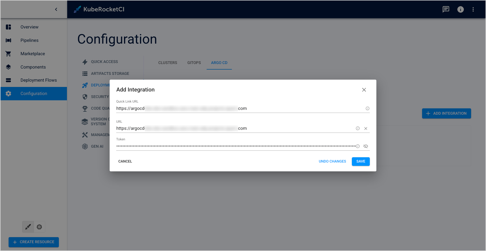

        12. Verify that the integration status is green:

          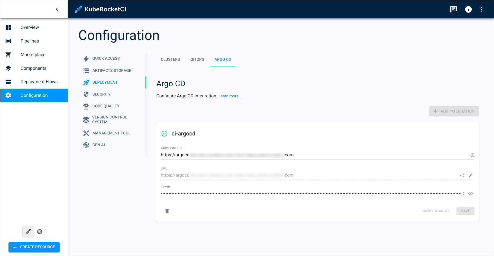

      </TabItem>
    </Tabs>

Once Argo CD is successfully integrated, KubeRocketCI user can utilize Argo CD to deploy [CD pipelines](../../user-guide/add-cd-pipeline.md).

## Check Argo CD Integration (Optional)

This section provides the information on how to test the integration with Argo CD and is not mandatory to be followed.

1. Add an Argo CD application:

    <details>
      <summary><b>View: argocd-values.yaml</b></summary>

        ```yaml
        apiVersion: argoproj.io/v1alpha1
        kind: Application
        metadata:
          name: demo
        spec:
          project: krci
          destination:
            namespace: krci-demo
            server: https://kubernetes.default.svc
          source:
            helm:
              parameters:
                - name: image.tag
                  value: master-0.1.0-1
                - name: image.repository
                  value: image-repo
            path: deploy-templates
            # github/gitlab example ssh://git@github.com/<github_account_name>/<repository_name>.git
            # gerrit example ssh://<gerrit_user>@gerrit.krci:30007/<repository_name>.git
            repoURL: ssh://git@github.com/krci/demo.git
            targetRevision: master
          syncPolicy:
            syncOptions:
              - CreateNamespace=true
            automated:
              selfHeal: true
              prune: true
        ```

    </details>

2. Check that your new Application is added to the Argo CD UI under the `krci` Project scope.

## Deploy Argo CD Application to Remote Cluster (Optional)

KubeRocketCI also supports deploying Argo CD applications to a remote cluster. To deploy applications to remote clusters, follow the steps below:

1. Create `ServiceAccount` `ClusterRoleBinding` and `Secret` for that `ServiceAccount`.

2. Receive the bearer token:

    ```bash
    BEAR_TOKEN=$(kubectl get secret <serviceaccount-secret-name> -o jsonpath='{.data.token}' | base64 --decode)
    ```

3. Create ArgoCD secret for remote cluster:

    ```yaml title="manifest"
    apiVersion: v1
    kind: Secret
    metadata:
      name: krci-remote-cluster
      namespace: argocd
    data:
      # Remote cluster config
      config: {"bearerToken":"<BEAR_TOKEN>","tlsClientConfig":{"insecure":false,"caData":"<certificate-authority-data>"}}
      # Remote cluster name
      name: "krci-remote-cluster"
      # Cluster endpoint URL
      server: "https://xxxxxxxxxxxxxxxxxxxx.sk1.eu-central-1.eks.amazonaws.com"
    type: stringData
    ```

4. Update an Argo CD Project (KubeRocketCI Tenant), with the `krci` name:

    ```yaml title="AppProject"
    apiVersion: argoproj.io/v1alpha1
    kind: AppProject
    metadata:
      name: krci
    spec:
      destinations:
          # Add block that allow deploy in remote cluster
          # by default, krci works with 'krci-*' namespaces
        - namespace: 'krci-*'
          # allow to deploy to specific server (remote in our case)
          name: krci-remote-cluster
    ```

5. Add a remote cluster in the KubeRocketCI portal. Please refer to the [Add Cluster](../../user-guide/add-cluster.md) page for details.

## Keycloak Integration (Optional)

:::note
  To proceed with the steps below, you need the [edp-keycloak-operator](https://github.com/epam/edp-keycloak-operator) to be deployed.
:::

To provide Argo CD with the Keycloak SSO authorization mechanism, follow the guidelines below:

1. Create secret `keycloak-client-argocd-secret`.

    ```bash
    kubectl create secret generic keycloak-client-argocd-secret \
    --from-literal=clientSecret=$(openssl rand -base64 32) \
    --namespace=argocd
    ```

2. Update the `argocd-cm` ConfigMap:

    <Tabs
      defaultValue="kubectl"
      values={[
        {label: 'kubectl', value: 'kubectl'},
        {label: 'manifest', value: 'manifest'}
      ]}>

      <TabItem value="kubectl">
        ```bash
        kubectl patch configmap argocd-cm -n argocd --patch "$(cat <<EOF
        data:
          oidc.config: |
            name: Keycloak
            issuer: https://<keycloakEndpoint>/auth/realms/edp
            clientID: argocd-tenant
            clientSecret: $keycloak-client-argocd-secret:clientSecret
            requestedScopes:
              - openid
              - profile
              - email
              - groups
        EOF
        )"
        ```
      </TabItem>

      <TabItem value="manifest">

        ```yaml
        data:
          oidc.config:
            url: "https://argocd.<.Values.global.dnsWildCard>"
            application.instanceLabelKey: argocd.argoproj.io/instance-edp
            oidc.config: |
              name: Keycloak
              issuer: https://<.Values.global.keycloakEndpoint>/auth/realms/edp
              clientID: argocd-tenant
              clientSecret: $keycloak-client-argocd-secret:clientSecret
              requestedScopes:
                - openid
                - profile
                - email
                - groups
        ```

      </TabItem>
    </Tabs>

3. Create a Keycloak Group:

    ```yaml
    apiVersion: v1.edp.epam.com/v1
    kind: KeycloakRealmGroup
    metadata:
      name: argocd-krci-users
    spec:
      name: ArgoCD-krci-users
      realm: main
    ```

4. Create a Keycloak Client:

    ```yaml
    apiVersion: v1.edp.epam.com/v1
    kind: KeycloakClient
    metadata:
      name: argocd
      namespace: argocd
    spec:
      advancedProtocolMappers: true
      attributes:
        post.logout.redirect.uris: +
      clientId: argocd-tenant
      defaultClientScopes:
        - groups
      realmRef:
        kind: ClusterKeycloakRealm
        name: main
      secret: keycloak-client-argocd-secret
      webUrl: "https://argocd.<.Values.global.dnsWildCard>"
    ```

5. In Keycloak, add users to the `ArgoCD-krci-users` Keycloak Group.

6. Update spec in project:

    ```yaml title="AppProject"
    spec:
      description: CD pipelines for krci
      roles:
        - name: developer
          description: Users for krci tenant
          policies:
            - p, proj:krci:developer, applications, create, krci/*, allow
            - p, proj:krci:developer, applications, delete, krci/*, allow
            - p, proj:krci:developer, applications, get, krci/*, allow
            - p, proj:krci:developer, applications, override, krci/*, allow
            - p, proj:krci:developer, applications, sync, krci/*, allow
            - p, proj:krci:developer, applications, update, krci/*, allow
            - p, proj:krci:developer, repositories, create, krci/*, allow
            - p, proj:krci:developer, repositories, delete, krci/*, allow
            - p, proj:krci:developer, repositories, update, krci/*, allow
            - p, proj:krci:developer, repositories, get, krci/*, allow
          groups:
            # Keycloak Group name
            - ArgoCD-krci-users
    ```

7. Then restart the deployment:

    ```bash
    kubectl -n argocd rollout restart deployment argo-argocd-server
    ```

## Related Articles

* [Install Argo CD](../install-argocd.md)
