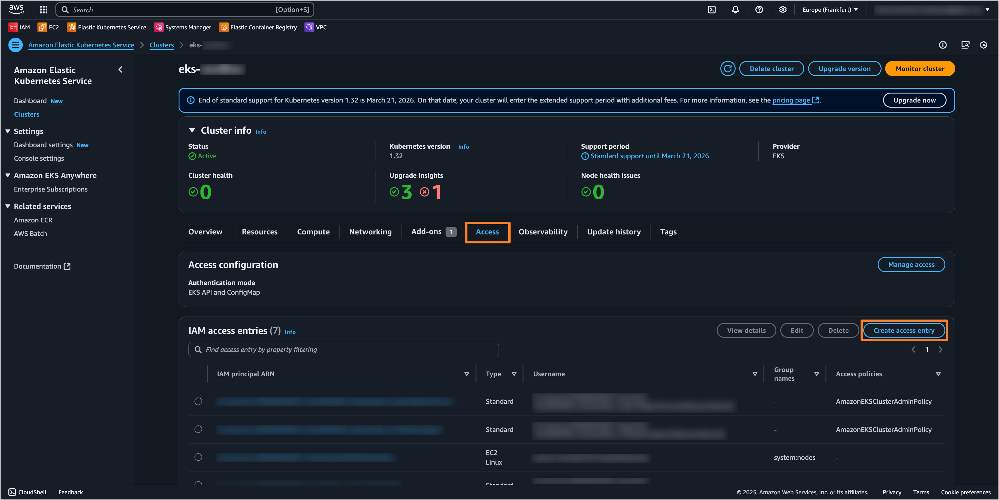
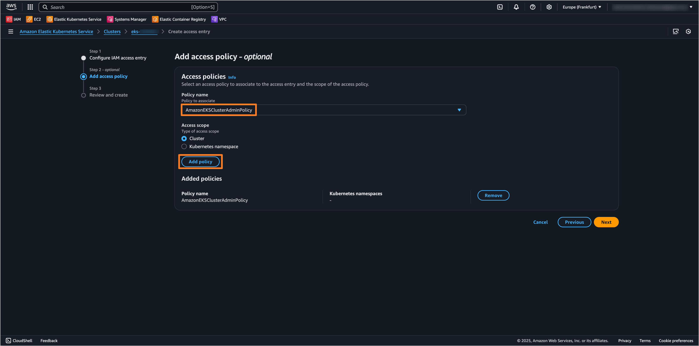
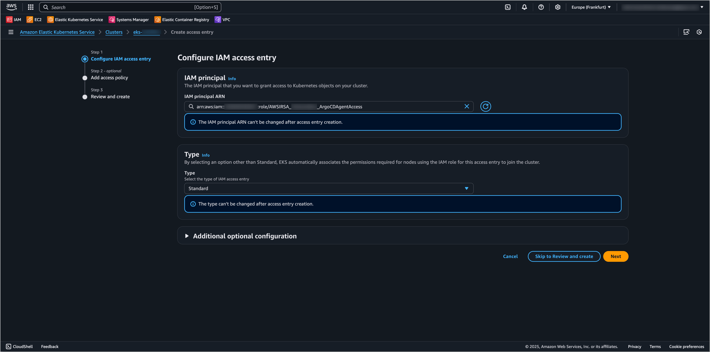

---

title: "Deploy Application In Remote Cluster via IRSA"
sidebar_label: "Deploy Application In Remote Cluster via IRSA"
description: "Learn how to securely deploy applications across AWS accounts using IRSA (IAM Roles for Service Accounts) in KubeRocketCI. Step-by-step guide for EKS cross-account access configuration."

---
<!-- markdownlint-disable MD025 -->

import Tabs from '@theme/Tabs';
import TabItem from '@theme/TabItem';

# Deploy Application In Remote Cluster via IRSA

<head>
  <link rel="canonical" href="https://docs.kuberocketci.io/docs/operator-guide/cd/deploy-application-in-remote-cluster-via-irsa" />
</head>

KubeRocketCI enables secure deployment of applications to remote AWS EKS clusters using IAM Roles for Service Accounts (IRSA). This guide explains how to configure cross-account access between Kubernetes clusters, allowing applications to be deployed from one AWS account to another without storing long-term credentials. IRSA provides temporary, scoped credentials by allowing Kubernetes service accounts to assume specific IAM roles with precisely defined permissions, enhancing both security and operational efficiency when working with multi-account AWS environments.

<div style={{ display: 'flex', justifyContent: 'center' }}>
<iframe width="560" height="315" src="https://www.youtube.com/embed/3Gm8YLj-0x4" title="Deploying Applications to Remote Kubernetes Clusters with KubeRocketCI and Argo CD" frameborder="0" allow="accelerometer; autoplay; clipboard-write; encrypted-media; gyroscope; picture-in-picture" allowfullscreen="allowfullscreen"></iframe>
</div>

## Prerequisites

Before implementing IRSA for cross-account deployments, the following requirements must be met:

- Configured two [AWS accounts](https://docs.aws.amazon.com/accounts/latest/reference/getting-started.html): Account A (where KubeRocketCI is deployed) and Account B (the target account for application deployment);
- Administrative access to both AWS accounts;
- Running [EKS cluster](https://docs.aws.amazon.com/eks/latest/userguide/create-cluster.html) in Account A with configured [OIDC Identity Provider](../auth/configure-keycloak-oidc-eks.md) authentication;
- Running [EKS cluster](https://docs.aws.amazon.com/eks/latest/userguide/create-cluster.html) in Account B as the target cluster for application deployment;
- Installed and configured [Argo CD](../install-argocd.md).

## Architecture and Working Principles

KubeRocketCI uses IRSA to establish secure connections between AWS accounts without storing long-term credentials. The architecture follows these key principles:

1. **Service Account Federation** - Kubernetes service accounts in Account A are federated with AWS IAM through OIDC
2. **Role Chaining** - IAM roles in Account A assume corresponding roles in Account B
3. **Temporary Credentials** - All access is provided through short-lived, automatically rotated tokens

The cross-account deployment process involves two main components:

**CD Pipeline Operator Flow:**
- The [cd-pipeline-operator](https://github.com/epam/edp-cd-pipeline-operator) in Account A uses a service account linked to the `AWSIRSA_{cluster_name}_CDPipelineOperator` IAM role
- When new environments or clusters are configured in KubeRocketCI, the `AWSIRSA_{cluster_name}_CDPipelineOperator` role in Account A assumes the `AWSIRSA_{cluster_name}_CDPipelineAgent` role in Account B
- The agent role creates the necessary Kubernetes resources (namespaces, service accounts, secrets) in the target cluster

**Argo CD Flow:**
- Argo CD controllers in Account A use service accounts linked to the `AWSIRSA_{cluster_name}_ArgoCDMaster` IAM role
- During deployment, this role assumes the `AWSIRSA_{cluster_name}_ArgoCDAgentAccess` role in Account B
- The agent role accesses the target EKS cluster to deploy and manage applications

The diagram below illustrates the IRSA access model for cross-account deployments:

    ```mermaid
    flowchart TD
      subgraph subGraph0["AWS Account A"]
        SA["cd-pipeline-operator"]
        ROLE_A["IAM Role <br> CDPipelineOperator"]
      end
      subgraph subGraph1["AWS Account B"]
        ROLE_B["IAM Role <br> CDPipelineAgent"]
        RESOURCES["Kubernetes resources"]
      end
      subgraph subGraph2["CD Pipeline Operator Flow"]
        subGraph0
        subGraph1
      end
      subgraph subGraph3["AWS Account A"]
        ARGOCD["Argo CD Controllers"]
        ROLE_MASTER["IAM Role <br> ArgoCDMaster"]
      end
      subgraph subGraph4["AWS Account B"]
        ROLE_AGENT["IAM Role <br> ArgoCDAgentAccess"]
        APP_RESOURCES["Applications & Resources"]
      end
      subgraph subGraph5["Argo CD Flow"]
        subGraph3
        subGraph4
      end
      SA -- IRSA --> ROLE_A
      ROLE_A -- AssumeRole --> ROLE_B
      ROLE_B -- Create/Configure --> RESOURCES
      ARGOCD -- IRSA --> ROLE_MASTER
      ROLE_MASTER -- AssumeRole --> ROLE_AGENT
      ROLE_AGENT -- Deploy/Manage --> APP_RESOURCES
    ```

## Create IAM Roles

To enable cross-account deployments using IRSA, it is necessary to create specific IAM roles in both AWS accounts.

There are two approaches to create the required IAM roles:

- **Using the AWS Management Console**: This approach is based on creating roles through the AWS web-based interface.
- **Using Terraform & AWS Management Console**: This hybrid approach is based on using the [terraform-aws-platform](https://github.com/KubeRocketCI/terraform-aws-platform) repository to create the required IAM roles in Account A, while using the AWS Management Console to create the roles in Account B.

### Using AWS Management Console

To create the required IAM roles in Account A using the AWS Management Console, follow the steps below:

1. Log in to the AWS Management Console for Account A.
2. Navigate to the **IAM** service and select **Roles**.
3. Create the `AWSIRSA_{cluster_name}_CDPipelineOperator` IAM role with the following settings:

    <details>
      <summary><b>Trust Policy</b></summary>

    ```json
    {
        "Version": "2012-10-17",
        "Statement": [
            {
                "Sid": "",
                "Effect": "Allow",
                "Principal": {
                    "Federated": "arn:aws:iam::<AWS_ACCOUNT_A_ID>:oidc-provider/oidc.eks.<AWS_REGION>.amazonaws.com/id/<OIDC_ID>"
                },
                "Action": "sts:AssumeRoleWithWebIdentity",
                "Condition": {
                    "StringEquals": {
                        "oidc.eks.<AWS_REGION>.amazonaws.com/id/<OIDC_ID>:sub": [
                            "system:serviceaccount:krci:edp-cd-pipeline-operator"
                        ],
                        "oidc.eks.<AWS_REGION>.amazonaws.com/id/<OIDC_ID>:aud": "sts.amazonaws.com"
                    }
                }
            }
        ]
    }
    ```

    </details>

    <details>
      <summary><b>Permissions Policy</b></summary>

    ```json
    {
        "Version": "2012-10-17",
        "Statement": [
            {
                "Action": "sts:AssumeRole",
                "Effect": "Allow",
                "Resource": "arn:aws:iam::<AWS_ACCOUNT_B_ID>:role/AWSIRSA_{cluster_name}_CDPipelineAgent"
            }
        ]
    }
    ```

    </details>

4. Create the `AWSIRSA_{cluster_name}_ArgoCDMaster` IAM role with the following settings:

    <details>
      <summary><b>Trust Policy</b></summary>

    ```json
    {
        "Version": "2012-10-17",
        "Statement": [
            {
                "Sid": "",
                "Effect": "Allow",
                "Principal": {
                    "Federated": "arn:aws:iam::<AWS_ACCOUNT_A_ID>:oidc-provider/oidc.eks.<AWS_REGION>.amazonaws.com/id/<OIDC_ID>"
                },
                "Action": "sts:AssumeRoleWithWebIdentity",
                "Condition": {
                    "StringLike": {
                        "oidc.eks.<AWS_REGION>.amazonaws.com/id/<OIDC_ID>:sub": [
                            "system:serviceaccount:argocd:argocd-application-controller",
                            "system:serviceaccount:argocd:argocd-applicationset-controller",
                            "system:serviceaccount:argocd:argocd-server"
                        ],
                        "oidc.eks.<AWS_REGION>.amazonaws.com/id/<OIDC_ID>:aud": "sts.amazonaws.com"
                    }
                }
            }
        ]
    }
    ```

    </details>

    <details>
      <summary><b>Permissions Policy</b></summary>

    ```json
    {
        "Version": "2012-10-17",
        "Statement": [
            {
                "Action": "sts:AssumeRole",
                "Effect": "Allow",
                "Resource": [
                    "arn:aws:iam::<AWS_ACCOUNT_B_ID>:role/AWSIRSA_{cluster_name}_ArgoCDAgentAccess"
                ]
            }
        ]
    }
    ```

    </details>

To create the required IAM roles in Account B using the AWS Management Console, follow the steps below:

1. Log in to the AWS Management Console for Account B.
2. Navigate to the **IAM** service and select **Roles**.
3. Create the `AWSIRSA_{cluster_name}_CDPipelineAgent` IAM role with the following settings:

    <details>
      <summary><b>Trust Policy</b></summary>

    ```json
    {
        "Version": "2012-10-17",
        "Statement": [
            {
                "Effect": "Allow",
                "Principal": {
                    "AWS": "arn:aws:iam::<AWS_ACCOUNT_A_ID>:role/AWSIRSA_{cluster_name}_CDPipelineOperator"
                },
                "Action": "sts:AssumeRole"
            }
        ]
    }
    ```

    </details>

4. Create the `AWSIRSA_{cluster_name}_ArgoCDAgentAccess` IAM role with the following settings:

    <details>
      <summary><b>Trust Policy</b></summary>

    ```json
    {
        "Version": "2012-10-17",
        "Statement": [
            {
                "Effect": "Allow",
                "Principal": {
                    "AWS": "arn:aws:iam::<AWS_ACCOUNT_A_ID>:role/AWSIRSA_{cluster_name}_ArgoCDMaster"
                },
                "Action": "sts:AssumeRole"
            }
        ]
    }
    ```

    </details>

### Using Terraform and AWS Management Console

In case of using the [terraform-aws-platform](https://github.com/KubeRocketCI/terraform-aws-platform) repository for creating and managing AWS EKS clusters, the required IAM roles in Account A can be created using Terraform, while the roles in Account B can be created using the AWS Management Console.

To create the required IAM roles in Account A using Terraform, follow the steps below:

1. Clone the forked [terraform-aws-platform](https://github.com/KubeRocketCI/terraform-aws-platform) repository.
2. Navigate to the `eks` directory.
3. Update the `terraform.tfvars` configuration file by specifying the following variables:

    ```hcl title="terraform.tfvars"
    create_cd_pipeline_operator_irsa = true
    create_argocd_irsa               = true

    cd_pipeline_operator_agent_role_arn = "arn:aws:iam::<AWS_ACCOUNT_B_ID>:role/AWSIRSA_<ClusterName>_CDPipelineAgent"
    argocd_agent_role_arn               = "arn:aws:iam::<AWS_ACCOUNT_B_ID>:role/AWSIRSA_<ClusterName>_ArgoCDAgentAccess"
    ```

4. Run the following commands to create the IAM roles:

    :::note
    It is highly recommended to run the `terraform plan` command before applying the changes to check the resources that will be created or modified.
    :::

    ```bash
    terraform init
    terraform apply -var-file=./template.tfvars
    ```

To create the required IAM roles in Account B using the AWS Management Console, follow the steps below:

1. Log in to the AWS Management Console for Account B.
2. Navigate to the **IAM** service and select **Roles**.
3. Create the `AWSIRSA_{cluster_name}_CDPipelineAgent` IAM role with the following settings:

    <details>
      <summary><b>Trust Policy</b></summary>

    ```json
    {
        "Version": "2012-10-17",
        "Statement": [
            {
                "Effect": "Allow",
                "Principal": {
                    "AWS": "arn:aws:iam::<AWS_ACCOUNT_A_ID>:role/AWSIRSA_{cluster_name}_CDPipelineOperator"
                },
                "Action": "sts:AssumeRole"
            }
        ]
    }
    ```

    </details>

4. Create the `AWSIRSA_{cluster_name}_ArgoCDAgentAccess` IAM role with the following settings:

    <details>
      <summary><b>Trust Policy</b></summary>

    ```json
    {
        "Version": "2012-10-17",
        "Statement": [
            {
                "Effect": "Allow",
                "Principal": {
                    "AWS": "arn:aws:iam::<AWS_ACCOUNT_A_ID>:role/AWSIRSA_{cluster_name}_ArgoCDMaster"
                },
                "Action": "sts:AssumeRole"
            }
        ]
    }
    ```

    </details>

## Annotate Service Accounts

To enable the cross-account access for the cd-pipeline-operator and Argo CD, it is necessary to annotate the Kubernetes service accounts in the AWS Account A with the corresponding IAM role ARNs. This allows the service accounts to assume the roles and access resources in the target AWS Account B.

### CD Pipeline Operator Service Account

On the AWS Account A, where the KubeRocketCI is deployed, annotate the `edp-cd-pipeline-operator` service account with the `AWSIRSA_{cluster_name}_CDPipelineOperator` IAM role ARN.

There are several ways to annotate the service account:

    <Tabs
      defaultValue="values"
      values={[
        {label: 'Values.yaml', value: 'values'},
        {label: 'CLI', value: 'cli'},
        {label: 'Manifests', value: 'manifests'},
      ]}>

      <TabItem value="values">
        Update the `cd-pipeline-operator` configuration in [edp-install](https://github.com/epam/edp-install/blob/master/deploy-templates/values.yaml) repository to automatically add annotations to service account:

        ```yaml title="deploy-templates/values.yaml"
        cd-pipeline-operator:
          serviceAccount:
            annotations:
              eks.amazonaws.com/role-arn: "arn:aws:iam::<AWS_ACCOUNT_A_ID>:role/AWSIRSA_{cluster_name}_CDPipelineOperator"
        ```
      </TabItem>

      <TabItem value="cli">

      ```bash title="ServiceAccount: edp-cd-pipeline-operator"
      kubectl patch serviceaccount edp-cd-pipeline-operator -n krci \
        -p '{"metadata": {"annotations": {"eks.amazonaws.com/role-arn": "arn:aws:iam::<AWS_ACCOUNT_A_ID>:role/AWSIRSA_{cluster_name}_CDPipelineOperator"}}}'
      ```

      After applying annotations to service accounts, it is necessary to restart the corresponding deployments to ensure new pods are created with the updated IAM roles configuration. Use the following command:

      ```bash
      kubectl rollout restart deployment cd-pipeline-operator -n krci
      ```

      </TabItem>

      <TabItem value="manifests">

      ```yaml title="ServiceAccount: edp-cd-pipeline-operator"
      apiVersion: v1
      kind: ServiceAccount
      metadata:
        annotations:
          eks.amazonaws.com/role-arn: "arn:aws:iam::<AWS_ACCOUNT_A_ID>:role/AWSIRSA_{cluster_name}_CDPipelineOperator"
        name: edp-cd-pipeline-operator
        namespace: krci
      ```

      After applying annotations to service accounts, it is necessary to restart the corresponding deployments to ensure new pods are created with the updated IAM roles configuration. Use the following command:

      ```bash
      kubectl rollout restart deployment cd-pipeline-operator -n krci
      ```

      </TabItem>

    </Tabs>

### Argo CD Service Accounts

On the AWS Account A, where the Argo CD is deployed, annotate the `argocd-application-controller`, `argocd-applicationset-controller`, and `argocd-server` service accounts with the `AWSIRSA_{cluster_name}_ArgoCDMaster` IAM role ARN.

There are several ways to annotate the service accounts:

    <Tabs
      defaultValue="values"
      values={[
      {label: 'Values.yaml', value: 'values'},
      {label: 'CLI', value: 'cli'},
      {label: 'Manifests', value: 'manifests'},
      ]}>

      <TabItem value="values">
        Update the Argo CD configuration in [Add-Ons](https://github.com/epam/edp-cluster-add-ons/blob/main/clusters/core/addons/argo-cd/values.yaml) repository to automatically add annotations to service accounts:

        ```yaml title="clusters/core/addons/argo-cd/values.yaml"
        argo-cd:
          controller:
            serviceAccount:
              # -- Annotations applied to created service account
              annotations:
                eks.amazonaws.com/role-arn: "arn:aws:iam::<AWS_ACCOUNT_A_ID>:role/AWSIRSA_{cluster_name}_ArgoCDMaster"

          server:
            serviceAccount:
              # -- Annotations applied to created service account
              annotations:
                eks.amazonaws.com/role-arn: "arn:aws:iam::<AWS_ACCOUNT_A_ID>:role/AWSIRSA_{cluster_name}_ArgoCDMaster"

          applicationSet:
            serviceAccount:
              # -- Annotations applied to created service account
              annotations:
                eks.amazonaws.com/role-arn: "arn:aws:iam::<AWS_ACCOUNT_A_ID>:role/AWSIRSA_{cluster_name}_ArgoCDMaster"
        ```
      </TabItem>

      <TabItem value="cli">

      ```bash title="ServiceAccount: argocd-application-controller"
      kubectl patch serviceaccount argocd-application-controller -n argocd \
        -p '{"metadata": {"annotations": {"eks.amazonaws.com/role-arn": "arn:aws:iam::<AWS_ACCOUNT_A_ID>:role/AWSIRSA_{cluster_name}_ArgoCDMaster"}}}'
      ```

      ```bash title="ServiceAccount: argocd-applicationset-controller"
      kubectl patch serviceaccount argocd-applicationset-controller -n argocd \
        -p '{"metadata": {"annotations": {"eks.amazonaws.com/role-arn": "arn:aws:iam::<AWS_ACCOUNT_A_ID>:role/AWSIRSA_{cluster_name}_ArgoCDMaster"}}}'
      ```

      ```bash title="ServiceAccount: argocd-server"
      kubectl patch serviceaccount argocd-server -n argocd \
        -p '{"metadata": {"annotations": {"eks.amazonaws.com/role-arn": "arn:aws:iam::<AWS_ACCOUNT_A_ID>:role/AWSIRSA_{cluster_name}_ArgoCDMaster"}}}'
      ```

      After applying annotations to service accounts, it is necessary to restart the corresponding workloads to ensure new pods are created with the updated IAM roles configuration. To do this, use the following commands:

      ```bash
      kubectl delete pod -l app.kubernetes.io/name=argocd-application-controller -n argocd

      kubectl delete pod -l app.kubernetes.io/name=argocd-applicationset-controller -n argocd

      kubectl delete pod -l app.kubernetes.io/name=argocd-server -n argocd
      ```

      </TabItem>

      <TabItem value="manifests">

      ```yaml title="ServiceAccount: argocd service accounts"
      apiVersion: v1
      kind: ServiceAccount
      metadata:
        annotations:
          eks.amazonaws.com/role-arn: "arn:aws:iam::<AWS_ACCOUNT_A_ID>:role/AWSIRSA_{cluster_name}_ArgoCDMaster"
        name: argocd-application-controller
        namespace: argocd
      ---
      apiVersion: v1
      kind: ServiceAccount
      metadata:
        annotations:
          eks.amazonaws.com/role-arn: "arn:aws:iam::<AWS_ACCOUNT_A_ID>:role/AWSIRSA_{cluster_name}_ArgoCDMaster"
        name: argocd-applicationset-controller
        namespace: argocd
      ---
      apiVersion: v1
      kind: ServiceAccount
      metadata:
        annotations:
          eks.amazonaws.com/role-arn: "arn:aws:iam::<AWS_ACCOUNT_A_ID>:role/AWSIRSA_{cluster_name}_ArgoCDMaster"
        name: argocd-server
        namespace: argocd
      ```

      After applying annotations to service accounts, it is necessary to restart the corresponding workloads to ensure new pods are created with the updated IAM roles configuration. To do this, use the following commands:

      ```bash
      kubectl delete pod -l app.kubernetes.io/name=argocd-application-controller -n argocd

      kubectl delete pod -l app.kubernetes.io/name=argocd-applicationset-controller -n argocd

      kubectl delete pod -l app.kubernetes.io/name=argocd-server -n argocd
      ```

      </TabItem>

    </Tabs>

## Update Argo CD AppProject

:::note
API server endpoint can be found in the EKS cluster details in the AWS Management Console.
:::

To allow Argo CD to deploy applications in the target cluster in Account B, it is necessary to update the **AppProject** configuration to include the target cluster as a destination.

```yaml
apiVersion: argoproj.io/v1alpha1
kind: AppProject
metadata:
  name: krci
  namespace: argocd
spec:
  destinations:
    - namespace: krci-*
      server: https://<OIDC_ID>.gr7.<AWS_REGION_ACCOUNT_B>.eks.amazonaws.com
```

## Configure IAM Roles Access to EKS Cluster

To allow the IAM roles created in Account B to access the EKS cluster, it is necessary to configure the access permissions for the roles in the cluster. This can be done by creating the [Access Entry](https://docs.aws.amazon.com/eks/latest/userguide/eks-access-entries.html) objects for the `AWSIRSA_{cluster_name}_CDPipelineAgent` and `AWSIRSA_{cluster_name}_ArgoCDAgentAccess` IAM roles.

To configure the access permissions for the IAM roles for the EKS cluster in Account B, follow the steps below:

### CD Pipeline Operator Access Entry

To create the Access Entry for the `AWSIRSA_{cluster_name}_CDPipelineAgent` IAM role, follow the steps below:

1. Log in to the AWS Management Console for Account B.
2. Navigate to the **EKS** service and select the target cluster.
3. In the **Access** tab, click on **Create access entry**.

    

4. On the **Configure IAM access entry** page, specify the following settings:

    - **IAM principal ARN**: `arn:aws:iam::<AWS_ACCOUNT_B_ID>:role/AWSIRSA_{cluster_name}_CDPipelineAgent`
    - **Type**: `Standard`
    - **Kubernetes groups**: `cd-pipeline-operator` (required if Capsule Tenant is used)

    

    Click **Next** to proceed.

5. On the **Add access policy** page, select the **AmazonEKSClusterAdminPolicy** policy and click **Add policy** button.

    :::note
    If Capsule Tenant is used, it is not necessary to add the `AmazonEKSClusterAdminPolicy` policy, as the access will be managed by Capsule.
    :::

    

    Click **Next** to proceed.

6. On the **Review and create** page, review the settings and click **Create access entry** to create the Access Entry.

### Argo CD Access Entry

To create the Access Entry for the `AWSIRSA_{cluster_name}_ArgoCDAgentAccess` IAM role, follow the steps below:

1. Log in to the AWS Management Console for Account B.
2. Navigate to the **EKS** service and select the target cluster.
3. In the **Access** tab, click on **Create access entry**.

    

4. On the **Configure IAM access entry** page, specify the following settings:

    - **IAM principal ARN**: `arn:aws:iam::<AWS_ACCOUNT_B_ID>:role/AWSIRSA_{cluster_name}_ArgoCDAgentAccess`
    - **Type**: `Standard`

    

    Click **Next** to proceed.

5. On the **Add access policy** page, select the **AmazonEKSClusterAdminPolicy** policy and click **Add policy** button.

    

    Click **Next** to proceed.

6. On the **Review and create** page, review the settings and click **Create access entry** to create the Access Entry.

## Configure Capsule Tenant (Optional)

If [Capsule](https://projectcapsule.dev/) is used for multi-tenancy in the EKS cluster in Account B, it is necessary to configure the Capsule Tenant for the `cd-pipeline-operator` group. This allows the `AWSIRSA_{cluster_name}_ArgoCDAgentAccess` IAM role to have the necessary permissions to manage resources within the Capsule Tenant.

To configure the Capsule Tenant for the `cd-pipeline-operator` group, align the following Capsule resources in the EKS cluster in Account B:

    <details>
      <summary><b>Capsule Configuration</b></summary>

    ```yaml
    apiVersion: capsule.clastix.io/v1beta2
    kind: CapsuleConfiguration
    metadata:
      name: default
    spec:
      userGroups:
        - capsule.clastix.io
        - cd-pipeline-operator
    ```

    </details>

    <details>
      <summary><b>Capsule Tenant</b></summary>

    ```yaml
    apiVersion: capsule.clastix.io/v1beta2
    kind: Tenant
    metadata:
      name: krci
    spec:
      owners:
        - clusterRoles:
            - admin
            - capsule-namespace-deleter
          kind: Group
          name: cd-pipeline-operator
    ```

    </details>

## Next Steps

After completing the IRSA configuration on both AWS accounts, it is possible to deploy applications to the remote EKS cluster in Account B using KubeRocketCI. To proceed with the adding the remote cluster and deploying applications, refer to the [Add Cluster](../../user-guide/add-cluster.md) guide.

## Related Articles

* [Argo CD Integration](argocd-integration.md)
* [Add Cluster](../../user-guide/add-cluster.md)
* [Add Application](../../user-guide/add-application.md)
* [Add CD Pipeline](../../user-guide/add-cd-pipeline.md)
