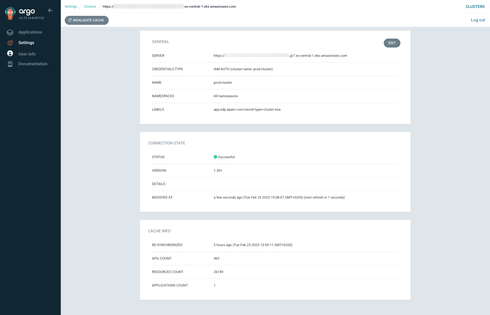
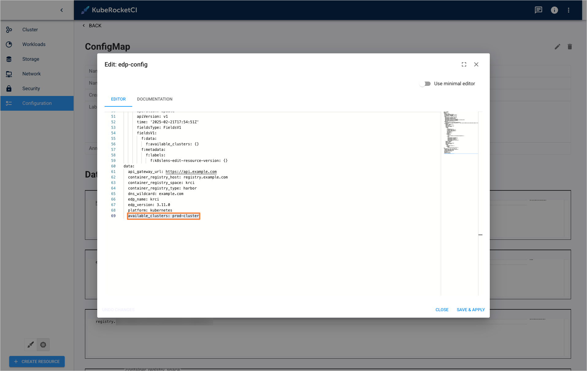
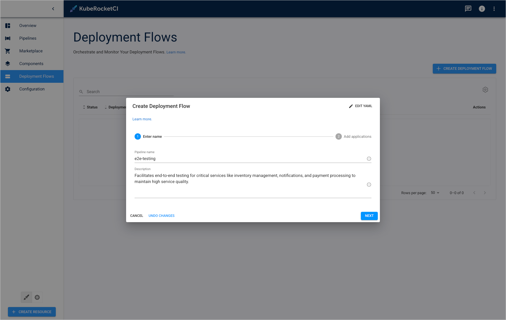
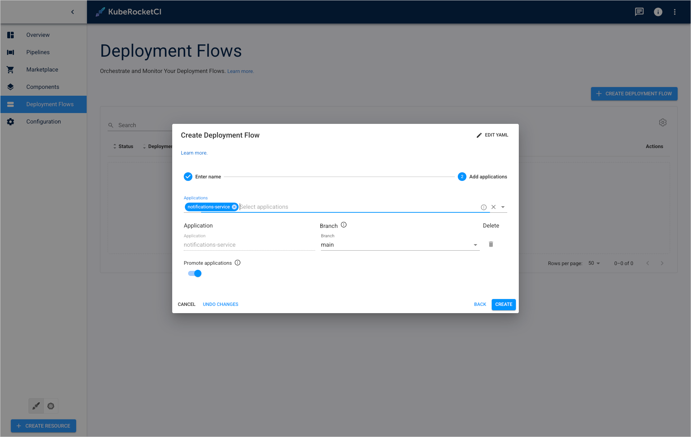
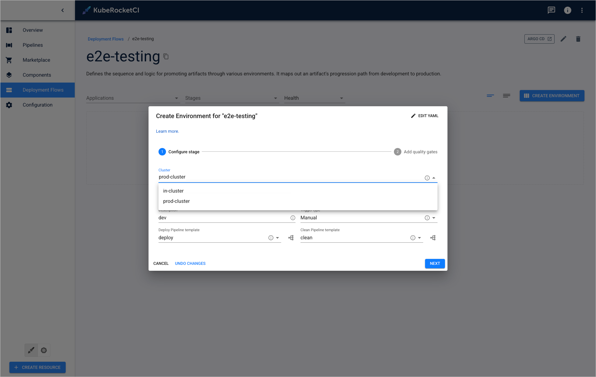
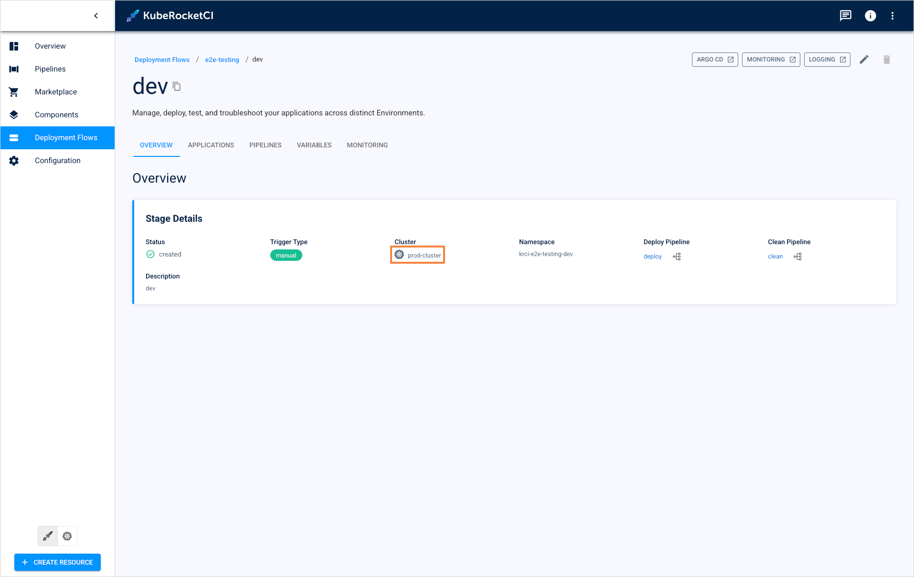
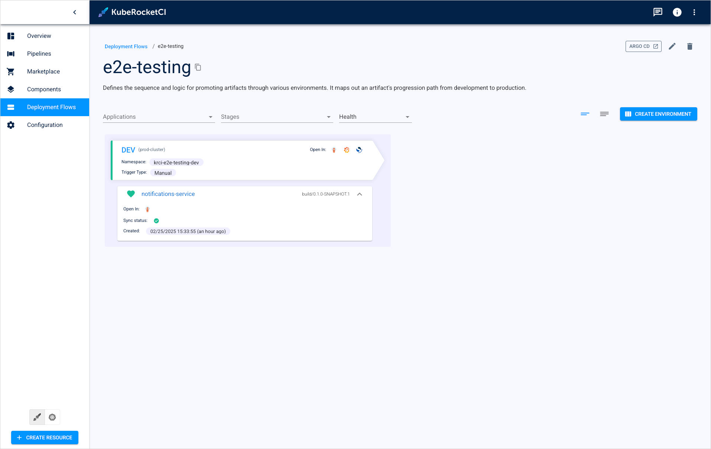
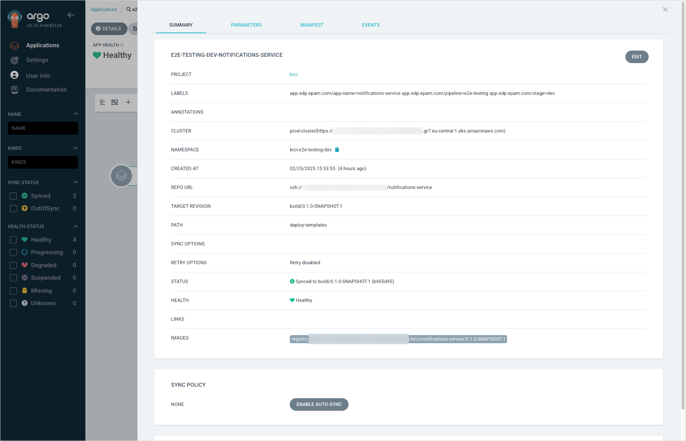

---

title: "Deploy Application In Remote Cluster via IRSA"
sidebar_label: "Deploy Application In Remote Cluster via IRSA"
description: "Learn how to securely deploy applications across AWS accounts using IRSA (IAM Roles for Service Accounts) in KubeRocketCI. Step-by-step guide for EKS cross-account access configuration."

---
<!-- markdownlint-disable MD025 -->

import Tabs from '@theme/Tabs';
import TabItem from '@theme/TabItem';

# Deploy Application In Remote Cluster via IRSA

<head>
  <link rel="canonical" href="https://docs.kuberocketci.io/docs/operator-guide/cd/deploy-application-in-remote-cluster-via-irsa" />
</head>

KubeRocketCI provides the capability to deploy applications securely using IAM Roles for Service Accounts (IRSA) in AWS EKS.
This integration enables Kubernetes pods to assume IAM roles for secure and temporary access to AWS resources, eliminating the need for long-lived credentials. While the deployment process is streamlined for most users, the platform also supports advanced configurations for custom permissions and role management, ensuring flexibility for more complex scenarios.

## Prerequisites

To start using this approach, you need to have OIDC (OpenID Connect) already configured for your EKS cluster. This setup allows Kubernetes service accounts to securely assume IAM roles. For your convenience, please follow our documentation [EKS OIDC With Keycloak](../auth/configure-keycloak-oidc-eks.md). This setup seamlessly integrates OIDC with minimal effort.

## Roles

Cross-account interaction is performed through IRSA with a two-tiered IAM role setup:

- In AWS Account A, the EKS cluster runs a kuberocketci cd-pipeline-operator with service account.
- This service account obtains temporary credentials through IRSA, which are associated with the `AWSIRSA_\{cluster_name\}_CDPipelineOperator` role.
- `AWSIRSA_\{cluster_name\}_CDPipelineOperator` can then assume the `AWSIRSA_\{cluster_name\}_CDPipelineAgent` role in AWS Account B.
- `AWSIRSA_\{cluster_name\}_CDPipelineAgent` configures the environment (Stage) by creating namespaces, generating service accounts, copying secrets, and preparing for deployment.

### Required IAM Roles and Polices for KRCI

Below is a Trust Policy for the initial IRSA role that the service account assumes:

<details>
<summary><b>View: AWSIRSA_\{cluster_name\}_CDPipelineOperator (AWS Account A)</b></summary>
```json
{
    "Version": "2012-10-17",
    "Statement": [
        {
            "Effect": "Allow",
            "Principal": {
                "Federated": "arn:aws:iam::<AWS_ACCOUNT_A_ID>:oidc-provider/oidc.eks.<AWS_REGION>.amazonaws.com/id/EXAMPLED539D4633E53DE1B71EXAMPLE"
            },
            "Action": "sts:AssumeRoleWithWebIdentity",
            "Condition": {
                "StringEquals": {
                    "oidc.eks.<AWS_REGION>.amazonaws.com/id/EXAMPLED539D4633E53DE1B71EXAMPLE:sub": [
                        "system:serviceaccount:krci:edp-cd-pipeline-operator"
                    ]
                }
            }
        },
        {
            "Effect": "Allow",
            "Principal": {
                "AWS": "arn:aws:iam::<AWS_ACCOUNT_A_ID>:AWSIRSA_{cluster_name}_CDPipelineOperator"
            },
            "Action": "sts:AssumeRole",
            "Condition": {}
        }
    ]
}
```
</details>

Below is a Policy that allows assuming roles in Account B:

<details>
<summary><b>View: AWSIRSA_\{cluster_name\}_CDPipelineAssume (AWS Account A)</b></summary>
```json
{
  "Version": "2012-10-17",
  "Statement": [
    {
      "Effect": "Allow",
      "Action": "sts:AssumeRole",
      "Resource": "arn:aws:iam::<AWS_ACCOUNT_B_ID>:role/AWSIRSA_{cluster_name}_CDPipelineAgent"
    }
  ]
}
```
</details>

Below is a Trust Policy that allows to control access to Account B resources:

<details>
<summary><b>View: AWSIRSA_\{cluster_name\}_CDPipelineAgent (AWS Account B)</b></summary>
```json
{
  "Version": "2012-10-17",
  "Statement": [
    {
      "Effect": "Allow",
      "Principal": {
        "AWS": "arn:aws:iam::<AWS_ACCOUNT_A_ID>:role/AWSIRSA_{cluster_name}_CDPipelineOperator"
      },
      "Action": "sts:AssumeRole"
    },
    {
      "Effect": "Allow",
      "Principal": {
        "Federated": "arn:aws:iam::<AWS_ACCOUNT_B_ID>:oidc-provider/oidc.eks.<AWS_REGION>.amazonaws.com/id/EXAMPLED539D4633E53DE1B71EXAMPLE"
      },
      "Action": "sts:AssumeRoleWithWebIdentity",
      "Condition": {
        "StringLike": {
          "oidc.eks.<AWS_REGION>.amazonaws.com/id/EXAMPLED539D4633E53DE1B71EXAMPLE:sub": "system:serviceaccount:*"
        }
      }
    }
  ]
}
```
</details>

Below is a Policy that defines permissions for deployments:

<details>
<summary><b>View: AWSIRSA_\{cluster_name\}_CDPipelineClusterAccess (AWS Account B)</b></summary>
```json
{
  "Version": "2012-10-17",
  "Statement": [
    {
      "Effect": "Allow",
      "Action": [
        "eks:DescribeCluster",
        "eks:ListClusters",
        "eks:AccessKubernetesApi"
      ],
      "Resource": "arn:aws:eks:<AWS_REGION>:<AWS_ACCOUNT_B_ID>:cluster/<cluster-name>"
    }
  ]
}
```
</details>

### Required IAM Roles and Policies for Argo CD Cross-Account Deployment

This section outlines the necessary IAM roles and policies required for Argo CD to manage Kubernetes clusters across AWS accounts securely. The setup follows AWS best practices by using IAM Roles for Service Accounts (IRSA) and cross-account access to limit privileges effectively.

This IAM role is used by Argo CD to authenticate via OIDC and assume required permissions:

  

<details>
<summary><b>View: AWSIRSA_\{cluster_name\}_ArgoCDMaster (AWS Account A)</b></summary>

```json
{
    "Version": "2012-10-17",
    "Statement": [
        {
            "Effect": "Allow",
            "Principal": {
                "AWS": "arn:aws:iam::<AWS_ACCOUNT_A_ID>:role/AWSIRSA_{cluster_name}_ArgoCDMaster"
            },
            "Action": "sts:AssumeRole"
        },
        {
            "Effect": "Allow",
            "Principal": {
                "Federated": "arn:aws:iam::<AWS_ACCOUNT_B_ID>:oidc-provider/oidc.eks.<AWS_REGION>.amazonaws.com/id/EXAMPLED539D4633E53DE1B71EXAMPLE"
            },
            "Action": "sts:AssumeRoleWithWebIdentity",
            "Condition": {
                "StringLike": {
                    "oidc.eks.<AWS_REGION>.amazonaws.com/id/EXAMPLED539D4633E53DE1B71EXAMPLE:sub": "system:serviceaccount:*"
                },
                "StringEquals": {
                    "oidc.eks.<AWS_REGION>.amazonaws.com/id/EXAMPLED539D4633E53DE1B71EXAMPLE:aud": "sts.amazonaws.com"
                }
            }
        }
    ]
}
```
</details>

This Policy allows Argo CD in Account A to describe and access the EKS cluster in Account B:

<details>
<summary><b>View: AWSIRSA_\{cluster_name\}_ArgoCDMasterClusterAccess (AWS Account A)</b></summary>
```json
{
    "Version": "2012-10-17",
    "Statement": [
        {
            "Effect": "Allow",
            "Action": [
                "eks:DescribeCluster",
                "eks:ListClusters",
                "eks:AccessKubernetesApi"
            ],
            "Resource": "arn:aws:eks:<AWS_REGION>:<AWS_ACCOUNT_B_ID>:cluster/<cluster-name>"
        }
    ]
}
```
</details>

This Role allows Argo CD service accounts to assume permissions necessary for managing deployments in Account B:

<details>
<summary><b>View: AWSIRSA_\{cluster_name\}_ArgoCDAgentAccess (AWS Account B)</b></summary>
```json
{
  "Version": "2012-10-17",
  "Statement": [
    {
      "Effect": "Allow",
      "Principal": {
        "Federated": "arn:aws:iam::<AWS_ACCOUNT_A_ID>:oidc-provider/oidc.eks.<AWS_REGION>.amazonaws.com/id/EXAMPLED539D4633E53DE1B71EXAMPLE"
      },
      "Action": "sts:AssumeRoleWithWebIdentity",
      "Condition": {
        "StringEquals": {
          "oidc.eks.<AWS_REGION>.amazonaws.com/id/EXAMPLED539D4633E53DE1B71EXAMPLE:sub": [
            "system:serviceaccount:argocd:argocd-application-controller",
            "system:serviceaccount:argocd:argocd-applicationset-controller",
            "system:serviceaccount:argocd:argocd-server"
          ],
          "oidc.eks.<AWS_REGION>.amazonaws.com/id/EXAMPLED539D4633E53DE1B71EXAMPLE:aud": "sts.amazonaws.com"
        }
      }
    }
  ]
}
```
</details>

This role enables Argo CD to assume the necessary permissions within the EKS cluster in Account B:

<details>
<summary><b>View: AWSIRSA_\{cluster_name\}_ArgoCDAssume (AWS Account B)</b></summary>
```json
{
    "Version": "2012-10-17",
    "Statement": [
        {
            "Effect": "Allow",
            "Action": "sts:AssumeRole",
            "Resource": "arn:aws:iam::<AWS_ACCOUNT_B_ID>:role/AWSIRSA_{cluster_name}_ArgoCDAgentAccess"
        }
    ]
}
```
</details>

## Add Annotations to Service Accounts (Account A)

The next step is to add proper annotations to service accounts to grant permissions defined in the Roles.

### CD-Pipeline-Operator Service Account (Account A)

Add annotations to the Service Account of cd-pipeline-operator:

<Tabs
  defaultValue="patch"
  values={[
    {label: 'patch', value: 'patch'},
    {label: 'Manifests', value: 'manifests'},
  ]}>

  <TabItem value="patch">

  ```bash title="ServiceAccount: edp-cd-pipeline-operator"
  kubectl patch serviceaccount edp-cd-pipeline-operator -n krci \
    -p '{"metadata": {"annotations": {"eks.amazonaws.com/role-arn": "arn:aws:iam::<AWS_ACCOUNT_A_ID>:role/AWSIRSA_{cluster_name}_CDPipelineOperator"}}}'
  ```

  </TabItem>

  <TabItem value="manifests">

  ```yaml title="ServiceAccount: edp-cd-pipeline-operator"
  apiVersion: v1
  kind: ServiceAccount
  metadata:
    annotations:
      eks.amazonaws.com/role-arn: "arn:aws:iam::<AWS_ACCOUNT_A_ID>:role/AWSIRSA_{cluster_name}_CDPipelineOperator"
    name: edp-cd-pipeline-operator
    namespace: krci
  ```

  </TabItem>

</Tabs>

After applying annotations to service accounts, it is necessary to restart the corresponding deployments to ensure new pods are created with the updated IAM roles configuration. Use the following command:

```bash
kubectl rollout restart deployment cd-pipeline-operator -n krci
```

### Annotate Service Accounts in Kubernetes (Account A)

Annotate the service accounts in the account where Argo CD is located with the corresponding role ARN:

<Tabs
  defaultValue="patch"
  values={[
  {label: 'patch', value: 'patch'},
  {label: 'Manifests', value: 'manifests'},
  ]}>

  <TabItem value="patch">

  ```bash title="ServiceAccount: argocd-application-controller"

  kubectl patch serviceaccount argocd-application-controller -n argocd \
    -p '{"metadata": {"annotations": {"eks.amazonaws.com/role-arn": "arn:aws:iam::<AWS_ACCOUNT_A_ID>:role/AWSIRSA_{cluster_name}_ArgoCDMaster"}}}'
  ```
  ```bash title="ServiceAccount: argocd-applicationset-controller"

  kubectl patch serviceaccount argocd-applicationset-controller -n argocd \
    -p '{"metadata": {"annotations": {"eks.amazonaws.com/role-arn": "arn:aws:iam::<AWS_ACCOUNT_A_ID>:role/AWSIRSA_{cluster_name}_ArgoCDMaster"}}}'
  ```
  ```bash title="ServiceAccount: argocd-server"

  kubectl patch serviceaccount argocd-server -n argocd \
    -p '{"metadata": {"annotations": {"eks.amazonaws.com/role-arn": "arn:aws:iam::<AWS_ACCOUNT_A_ID>:role/AWSIRSA_{cluster_name}_ArgoCDMaster"}}}'
  ```
  </TabItem>

  <TabItem value="manifests">

  ```yaml title="ServiceAccount: argocd service accounts"
  apiVersion: v1
  kind: ServiceAccount
  metadata:
    annotations:
      eks.amazonaws.com/role-arn: "arn:aws:iam::<AWS_ACCOUNT_A_ID>:role/AWSIRSA_{cluster_name}_ArgoCDMaster"
    name: argocd-application-controller
    namespace: argocd
  ---
  apiVersion: v1
  kind: ServiceAccount
  metadata:
    annotations:
      eks.amazonaws.com/role-arn: "arn:aws:iam::<AWS_ACCOUNT_A_ID>:role/AWSIRSA_{cluster_name}_ArgoCDMaster"
    name: argocd-applicationset-controller
    namespace: argocd
  ---
  apiVersion: v1
  kind: ServiceAccount
  metadata:
    annotations:
      eks.amazonaws.com/role-arn: "arn:aws:iam::<AWS_ACCOUNT_A_ID>:role/AWSIRSA_{cluster_name}_ArgoCDMaster"
    name: argocd-server
    namespace: argocd
  ```
  </TabItem>

</Tabs>

After applying annotations to service accounts, it is necessary to restart the corresponding workloads to ensure new pods are created with the updated IAM roles configuration. To do this, use the following commands:

```bash
kubectl delete pod -l app.kubernetes.io/name=argocd-application-controller -n argocd

kubectl delete pod -l app.kubernetes.io/name=argocd-applicationset-controller -n argocd

kubectl delete pod -l app.kubernetes.io/name=argocd-server -n argocd
```

## Define Argo CD Project for Remote Clusters (Account A)

Update the Argo CD project to add a new destination for the remote cluster:

```yaml
apiVersion: argoproj.io/v1alpha1
kind: AppProject
metadata:
  name: krci
  namespace: argocd
spec:
  destinations:
    - namespace: krci-*
      server: https://EXAMPLED539D4633E53DE1B71EXAMPLE.gr7.<AWS_REGION>.eks.amazonaws.com
```

## Update aws_auth ConfigMap in Target Cluster (Account B)

Update the **aws_auth** ConfigMap in Target Cluster to access and operate in that Target Cluster:

<details>
<summary><b>View: aws-auth-configmap.yaml</b></summary>
```yaml
apiVersion: v1
kind: ConfigMap
metadata:
  name: aws-auth
  namespace: kube-system
data:
  mapRoles: |
    - groups:
      - "cd-pipeline-operator"
      rolearn: "arn:aws:iam::<AWS_ACCOUNT_A_ID>:role/AWSIRSA_{cluster_name}_CDPipelineOperator"
      username: "eksadminrole"
    - groups:
      - "system:masters"
      rolearn: "arn:aws:iam::<AWS_ACCOUNT_A_ID>:role/AWSIRSA_{cluster_name}_ArgoCDMaster"
      username: "arn:aws:iam::<AWS_ACCOUNT_A_ID>:role/AWSIRSA_{cluster_name}_ArgoCDMaster"
```
</details>

## Create ClusterRole and ClusterRoleBinding (Account B)

Associate the IAM Role with the **cd-pipeline-operator** group:

<Tabs
  defaultValue="kubectl"
  values={[
  {label: 'kubectl', value: 'kubectl'},
  {label: 'Manifests', value: 'manifests'},
  ]}>

  <TabItem value="kubectl">

  ```bash title="ServiceAccount: argocd-application-controller"
  kubectl create clusterrole cd-pipeline-rolebinding-access \
    --verb=get,list,create,delete \
    --resource=rolebindings.rbac.authorization.k8s.io \
    --verb=create,get,list \
    --resource=secrets

  kubectl create clusterrolebinding cd-pipeline-operator-rolebinding-access \
    --clusterrole=cd-pipeline-rolebinding-access \
    --group=cd-pipeline-operator
  ```
  </TabItem>

  <TabItem value="manifests">

  ```yaml title="cd-pipeline-rolebinding-access.yaml"
  apiVersion: rbac.authorization.k8s.io/v1
  kind: ClusterRole
  metadata:
    name: cd-pipeline-rolebinding-access
  rules:
    - verbs:
        - get
        - list
        - create
        - delete
      apiGroups:
        - rbac.authorization.k8s.io
      resources:
        - rolebindings
    - verbs:
        - create
        - get
        - list
      apiGroups:
        - ''
      resources:
        - secrets
  ```

  ```yaml title="cd-pipeline-operator-rolebinding-access.yaml"
  apiVersion: rbac.authorization.k8s.io/v1
  kind: ClusterRoleBinding
  metadata:
    name: cd-pipeline-operator-rolebinding-access
  subjects:
    - kind: Group
      apiGroup: rbac.authorization.k8s.io
      name: cd-pipeline-operator
  roleRef:
    apiGroup: rbac.authorization.k8s.io
    kind: ClusterRole
    name: cd-pipeline-rolebinding-access
  ```
  </TabItem>

</Tabs>


## Clusters Secret Configuration

The following step is to configure secrets.

### KuberocketCI IRSA Cluster Connection Secret Configuration

This configuration enables secure cluster connection using IAM Roles for Service Accounts (IRSA) in AWS. You can set it up using one of the following methods:

<Tabs
  defaultValue="kuberocketci"
  values={[
    {label: 'KubeRocketCI portal', value: 'kuberocketci'},
    {label: 'Manifests', value: 'manifests'},
    {label: 'External Secrets Operator', value: 'externalsecret'},
  ]}>

  <TabItem value="kuberocketci">
  Navigate to **KuberocketCI portal** -> **Configuration** -> **DEPLOYMENT** -> **CLUSTERS** and click the **+ ADD CLUSTER** fill in the following fields and click **SAVE** button:

  * **Cluster name**: a unique and descriptive name for the new cluster (e.g., prod-cluster);
  * **Cluster Host**: the cluster’s endpoint URL (e.g., example-cluster-domain.com);
  * **Authority Data**: base64-encoded Kubernetes certificate essential for authentication. Obtain this certificate from the configuration file of the user account you intend to use for accessing the cluster;
  * **Role ARN**: an AWS Role for the remote cluster. E.g., arn:aws:iam::\<AWS_ACCOUNT_A_ID\>:role/AWSIRSA_\{cluster_name\}_CDPipelineOperator.

  
  </TabItem>

  <TabItem value="manifests">

  ```yaml
  apiVersion: v1
  kind: Secret
  metadata:
    name: <cluster-name>-cluster
    namespace: krci
    labels:
      app.edp.epam.com/cluster-type: irsa
      app.edp.epam.com/secret-type: cluster
      argocd.argoproj.io/secret-type: cluster
  data:
    config: >-
      {
        "server": "https://EXAMPLED539D4633E53DE1B71EXAMPLE.gr7.<AWS_REGION>.eks.amazonaws.com",
        "awsAuthConfig": {
          "clusterName": "<cluster-name>",
          "roleARN": "arn:aws:iam::<AWS_ACCOUNT_A_ID>:role/AWSIRSA_{cluster_name}_CDPipelineOperator"
        },
        "tlsClientConfig": {
          "insecure": false,
          "caData": "<Base64-encoded CA certificate of the target cluster>"
        }
      }
    name: "<cluster-name>"
    server: "https://EXAMPLED539D4633E53DE1B71EXAMPLE.gr7.<AWS_REGION>.eks.amazonaws.com"
  ```

  </TabItem>

  <TabItem value="externalsecret">

  ```json
  "<cluster-name>-cluster": {
    "config": {
      "server": "https://EXAMPLED539D4633E53DE1B71EXAMPLE.gr7.<AWS_REGION>.eks.amazonaws.com",
      "awsAuthConfig": {
        "clusterName": "<cluster-name>",
        "roleARN": "arn:aws:iam::<AWS_ACCOUNT_A_ID>:role/AWSIRSA_{cluster_name}_CDPipelineOperator"
      },
      "tlsClientConfig": {
        "insecure": false,
        "caData": "<Base64-encoded CA certificate of the target cluster>"
      }
    },
    "name": "<cluster-name>",
    "server": "https://EXAMPLED539D4633E53DE1B71EXAMPLE.gr7.<AWS_REGION>.eks.amazonaws.com"
  }
  ```

  </TabItem>
</Tabs>

### Argo CD IRSA Cluster Connection Secret Configuration

Create a Secret to integrate the remote cluster with Argo CD:

<Tabs
 defaultValue="manifests"
 values={[
 {label: 'Manifests', value: 'manifests'},
 {label: 'External Secrets Operator', value: 'externalsecret'},
 ]}>

  <TabItem value="manifests">

  ```yaml
  apiVersion: v1
  kind: Secret
  metadata:
    name: <cluster-name>-cluster
    namespace: argocd
    labels:
      argocd.argoproj.io/secret-type: cluster
  stringData:
    config: |
      {
        "awsAuthConfig": {
          "clusterName": "<cluster-name>",
          "roleARN": "arn:aws:iam::<AWS_ACCOUNT_A_ID>:role/AWSIRSA_{cluster_name}_ArgoCDMaster"
        },
        "tlsClientConfig": {
          "insecure": false,
          "caData": "<Base64-encoded CA certificate of the target cluster>"
        }
      }
    name: "<cluster-name>"
    server: "https://EXAMPLED539D4633E53DE1B71EXAMPLE.gr7.<AWS_REGION>.eks.amazonaws.com"
  ```
  </TabItem>

  <TabItem value="externalsecret">

  ```json
  "<cluster-name>-cluster": {
    "config": {
      "awsAuthConfig": {
        "clusterName": "<cluster-name>",
        "roleARN": "arn:aws:iam::<AWS_ACCOUNT_A_ID>:role/AWSIRSA_{cluster_name}_ArgoCDMaster"
      },
      "tlsClientConfig": {
        "insecure": false,
        "caData": "<Base64-encoded CA certificate of the target cluster>"
      }
    },
    "name": "<cluster-name>",
    "server": "https://EXAMPLED539D4633E53DE1B71EXAMPLE.gr7.<AWS_REGION>.eks.amazonaws.com"
  }
  ```
  </TabItem>
</Tabs>

After applying the configuration, you can verify the cluster connection `ArgoCD` -> `Settings` -> `Clusters` -> `<cluster-name>`:

  

## Update KuberocketCI ConfigMap To Add New Cluster

To add cluster to the KuberocketCI platform click on `kubernetes` icon -> `Configuration` -> `ConfigMap` -> `edp-config` and add parameter `available_clusters` in data with value `<cluster-name>` and click **Save & apply**:

  ```yaml title="edp-config.yaml"
  data:
    available_clusters: <cluster-name>
  ```

  

## Deploy Application on New Cluster

Now that the remote cluster is integrated, you can deploy applications in it.

### Create Deployment Flow

To create a deployment flow, follow the steps below:

1. Navigate to the **Deployment Flows** tab and click the **+ Create Deployment Flow** button.

2. The **Enter name** tab of the **Create Deployment Flow**:

  

3. Enter the deployment flow name that will be displayed in the Deployment Flows list. Enter at least two characters, use the lower-case letters, numbers, and dashes.

4. Click the **Next** button to move onto the **Add applications** tab.

  :::note
    The namespace created by the environment has the following pattern combination: **[KubeRocketCI namespace]-[environment name]-[stage name]**.
    Please be aware that the namespace length should not exceed 63 symbols.
  :::

5. The Component tab of the Environments menu is presented below:

  

6. Click the Create button to finish deployment flow configuration and proceed with configuring environment.

### Create IRSA Cluster Environment

1. On the Environments menu, click the **Create Environment** button.

2. The Configure Stage tab of the Create Stage menu is presented below:

  

Set the proper cluster options:

  * **Cluster** - Choose the `<cluster-name>` to deploy the stage in;
  * **Stage name** - Enter the stage name;
  * **Description** - Enter the description for this stage.

3. Click the **Next** button to move onto the **Add quality gates** tab. Define quality gates and click **Create**. Read the [Add Deployment Flow](../../user-guide/add-cd-pipeline.md) for more details.

4. Ensure the Environment uses the proper cluster:

  

5. Deploy application to verify the platform interacts with your cluster correctly. Read the [Manage Deployment Flows](../../user-guide/manage-environments.md#deploy-application) for more details.

### Deployment Application Summary

As soon as the application is deployed, verify that Environment has the green status:

  

In the Argo CD Application resource, you can also check the cluster your application is deployed in:

  

Now your platform can use your remote AWS EKS cluster as an additional workload for your Deployment Flows.

## Related Articles

* [Argo CD Integration](argocd-integration.md)
* [Add Cluster](../../user-guide/add-cluster.md)
* [Add Application](../../user-guide/add-application.md)
* [Add CD Pipeline](../../user-guide/add-cd-pipeline.md)
