<!-- markdownlint-disable MD025 -->

# Deploy RPM Packages

<head>
  <link rel="canonical" href="https://docs.kuberocketci.io/docs/operator-guide/cd/deploy-rpm" />
</head>

KubeRocketCI can use two types of deployment packages: Helm chart and RPM packages. While the Helm chart is the default deployment package in KubeRocketCI, using RPM packages is beneficial for specific Linux distributions, such as Oracle, Fedora, openSUSE, and others where these packages are supported and widespread. To learn more about RPM packages, refer to the official [documentation](https://docs.redhat.com/en/documentation/red_hat_enterprise_linux/7/html/rpm_packaging_guide/getting-started-with-rpm-packaging#introduction-to-rpm-packaging_getting-started-with-rpm-packaging).

In KubeRocketCI, RPM support allows to collect applications, store them as Nexus artifacts, and deploy them using the [Ansible](https://docs.ansible.com/ansible/latest/index.html) tool. KubeRocketCI is support two approach to work with RPM packages:

 * **Default approach**: This approach involves configuring deployments using a GitOps repository and Kubernetes secrets.
 * **AWX approach**: This approach involves deploying applications using the [AWX](https://ansible.readthedocs.io/projects/awx/en/latest/) tool.

### Features of Each Approach

#### Built-in Pipeline

- **Full GitOps Configuration**: All resources, including roles, inventories, hosts, tasks, and instance keys, are fully managed via GitOps.
- **Quick Start**: Enables a fast setup process without the need for third-party utilities.
- **Scalable**: Easily scales to accommodate an increasing number of tasks.
- **Customizable Task Execution**: Offers flexible configuration of task execution sequences.
- **No UI**: Operates entirely without a graphical user interface, relying on code-based configurations.

#### AWX Operator

- **User-Friendly Interface**: Features a convenient UI for managing configurations and tasks.
- **Partial Code-Based Configurations**: Retrieves some configurations (such as Ansible tasks) directly from the repository.
- **UI-Based Configuration**: All configurations are performed within the graphical user interface.

## Default Approach

The first method to delivery RPM packages is using KubeRocketCI RPM deploy pipeline.

### Integration Flow

Default approach involves the following steps:

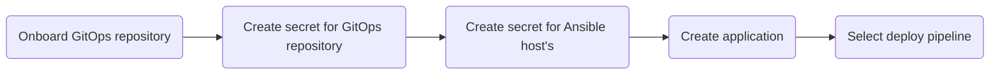

Here is a breakdown of the scheme above:

1. **Onboard GitOps repository**: GitOps repository is used to store pre-deploy information (such as dependencies) and Ansible configuration.
2. **Create secret for GitOps repository**: A secret providing access to the GitOps repository.
3. **Create secret for Ansible host's**: This is a secret used by Ansible to manage the instances where the application will be deployed.
4. **Create application**: [Add application](../../user-guide/add-application.md) to KubeRocketCI as an RPM package.
5. **Select deploy pipeline**: Choose a specific deploy pipeline when creating/editing an environment to deploy RPM packages.

By completing these steps, will be able to add, build, and deploy RPM applications.

To set up RPM integration, follow the steps below:

1. Open the KubeRocketCI portal. Navigate to **Configuration** -> **Deployment** -> **GitOps**:

  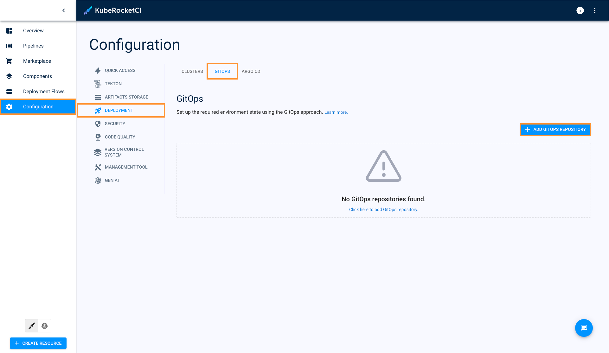

2. Specify the GitOps repository in the `username/repository_name` format:

  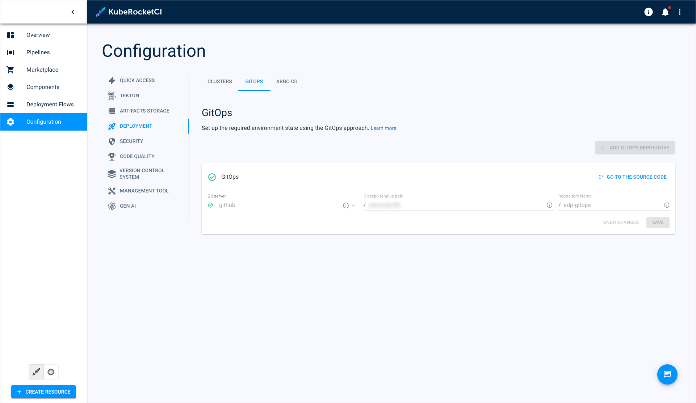

3. Create and apply the secret for the GitOps repository by running the command below. Specify SSH key path, Git account, and repository name:

```bash
kubectl apply -f - <<EOF
apiVersion: v1
kind: Secret
metadata:
  name: cd-ansible-gitops-key
  namespace: <krci>
data:
  id_rsa: $(cat /path/to/repo_id_rsa | base64 | tr -d '\n')
  url: $(echo -n "git@github.com:edp-robot/ansible-gitops.git" | base64 | tr -d '\n')
type: Opaque
EOF
```

4. Create and apply the secret for the hosts by running the command below. Don't forget to specify SSH key path:

```bash
kubectl apply -f - <<EOF
apiVersion: v1
kind: Secret
metadata:
  name: cd-ansible-ssh-key
  namespace: <krci>
data:
  id_rsa: $(cat /path/to/instance_id_rsa | base64 | tr -d '\n')
type: Opaque
EOF
```

5. When [creating codebases](../../user-guide/add-application.md), in the **Deployment option** field, select the **rpm-package** option:

  

6. When [creating](../../user-guide/manage-environments.md#add-a-new-environment) or [editing](../../user-guide/manage-environments.md#edit-environment) environments, in the **Deploy pipeline template** field, select **deploy-ansible**:

  :::note
    The **pre-deploy.yml** file will take affect only if the **Values override** option is enabled when deploying application.
  :::

  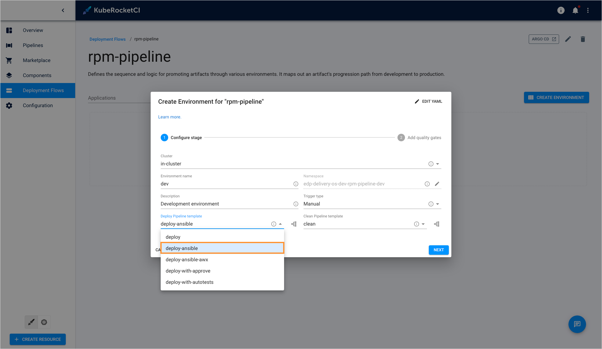

### GitOps Repository Structure

Below is a structure of a GitOps repository designed for deploying RPM packages:

    <details>
    <summary><b>View: repository structure</b></summary>
    ```bash
    nexus.repo
    inventory.ini
    pre-deploy.yml
    ├── web
    │   ├── dev
    │   │   ├── nano
    │   │   │   ├── 01_playbook.yml
    │   │   │   └── 02_playbook.yml
    │   │   └── atop
    │   │       ├── 01_playbook.yml
    │   │       └── 02_playbook.yml
    │   ├── qa
    │   │   ├── nano
    │   │   │   ├── 01_playbook.yml
    │   │   │   └── 02_playbook.yml
    │   │   └── atop
    │   │       ├── 01_playbook.yml
    │   │       └── 02_playbook.yml
    │   └── prod
    │       ├── nano
    │       │   ├── 01_playbook.yml
    │       │   └── 02_playbook.yml
    │       └── atop
    │           ├── 01_playbook.yml
    │           └── 02_playbook.yml
    └── db
        ├── dev
        │   ├── nano
        │   │   ├── 01_playbook.yml
        │   │   └── 02_playbook.yml
        │   └── atop
        │       ├── 01_playbook.yml
        │       ├── 02_playbook.yml
        │       └── 03_playbook.yml
        ├── qa
        │   ├── nano
        │   │   ├── 01_playbook.yml
        │   │   ├── 02_playbook.yml
        │   └── atop
        │       ├── 01_playbook.yml
        │       ├── 02_playbook.yml
        │       └── 03_playbook.yml
        └── prod
            ├── mysql
            │   ├── 01_playbook.yml
            │   └── 02_playbook.yml
            └── cc
                ├── 01_playbook.yml
                ├── 02_playbook.yml
                └── 03_playbook.yml
    ```
    </details>

The main configuration files description:

- **nexus.repo**: Contains the configuration for connecting to Nexus, to pull artifacts to the instance.
- **inventory.ini**: Contains groups with instances, user credentials, and additional settings for connecting to the instances.
- **pre-deploy.yml**: Contains general playbooks that contain a set of tasks that must be done before starting work, such as copying and connecting Nexus config, installing additional packages depending on the group.

The rest of the files are example of deployment configurations. The KubeRocketCI deploy pipeline uses naming pattern to comparisons deployment flows/environment with file structure in GitOps repository.

```bash
<deployment-flow-name>/<environment-name>/<package-name>/01_<file>.yml
```

For example, the **web/qa/nano/01_copy-file.yml** file related to:

  * Application: **nano**
  * Deployment Flow: **web**
  * Environment: **qa**

The file name must begin with its serial number (e.g., 01, 02, 03, ...), followed by an underscore.

## AWX Approach

The second approach to manage RPM packages is AWX-based. It features user interface and considered more simple.

### AWX Integration Flow

Default approach involves the following steps:

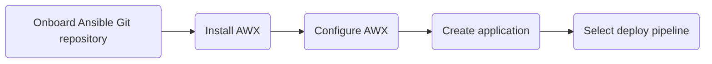

Here is a breakdown of the scheme above:

1. **Onboard Ansible Git repository**: Create an Ansible Git repository that contains playbooks that will be used in deploy pipelines.
2. **Install AWX**: Set Up AWX application. We recommend using [cluster add-ons](../add-ons-overview.md) to install it.
3. **Configure AWX**: Once AWX tool is installed, open its UI to create AWX Project, Inventory, Templates, etc.
4. **Create application**: [Add application](../../user-guide/add-application.md) to KubeRocketCI as an RPM package.
5. **Select deploy pipeline**: Choose a specific deploy pipeline when creating/editing an environment to deploy RPM packages.

### AWX Integration

AWX Integration implies creating a Git repository, installing AWX and configuring it via UI.

### AWX Integration Prerequisites

Ensure that External Secrets Operator is [installed](../secrets-management/install-external-secrets-operator.md) and [configured](../secrets-management/external-secrets-operator-integration.md) properly.

### AWX Integration Procedure

To set up RPM integration using AWX tool, follow the steps below. Completing these steps enables the addition, building, and deployment of RPM applications:

1. Onboard Ansible Git repository where will store Ansible configuration files. Below is a structure of an Ansible Git repository designed for deploying RPM packages:

    <details>
    <summary><b>View: repository structure</b></summary>
      ```bash
      package-install.yaml
        └── roles
            ├── pre-deploy
            │   ├── tasks
            │   │   └── role.yaml
            │   ├── files
            │   │   └── nexus.repo
            ├── package-install
            │   └── tasks
            │       └── role.yaml
            └── test-app-dev-web
                └── tasks
                    └── role.yaml
      ```
    </details>

    Here is a breakdown of the scheme above:

    * **package-install.yaml**: This is the main file that refers to playbooks located in the **roles** directory.
    * **roles**: This directory contains all the Ansible roles that will be executed in deploy pipeline.
    * **pre-deploy**: This is the first role the **package-install.yaml** file refers to. It connects to Nexus storage to interact with the application. Need to specify the required parameters in the **\<repo-name\>/roles/pre-deploy/files/nexus.repo** file.
    * **package-install**: This role contains the playbooks that install all the dependencies to AWS EC2 instances.
    * **test-app-dev-web**: This role contains the application playbooks, named according to the **\<codebase-name\>-\<deployment-flow-name\>-\<environment-name\>** convention. It will be executed only if the **Values override** parameter is set to **true** in the Deployment Flow during the component deployment process.

2. Install AWX via [cluster add-ons](https://github.com/epam/edp-cluster-add-ons):

    a. Create private repository based on the [cluster add-ons](https://github.com/epam/edp-cluster-add-ons) fork.

    b. In the AWX Operator **[values.yaml](https://github.com/epam/edp-cluster-add-ons/blob/main/clusters/core/addons/awx-operator/values.yaml)** file, specify hostname, secretName. OIDC mechanism is optional.

    c. In the Argo CD application **[values.yaml](https://github.com/epam/edp-cluster-add-ons/blob/main/clusters/core/apps/values.yaml)** file, enable the AWX operator:

    ```bash
    awx-operator:
      createNamespace: true
      enable: true
    ```

    d. Synchronize state in Argo CD. Refer to the [README.md](https://github.com/epam/edp-cluster-add-ons/blob/main/README.md) file for more details.

3. Configure AWX via UI:

    a. Once AWX operator is deployed, navigate to its UI using the hostname specified earlier:

      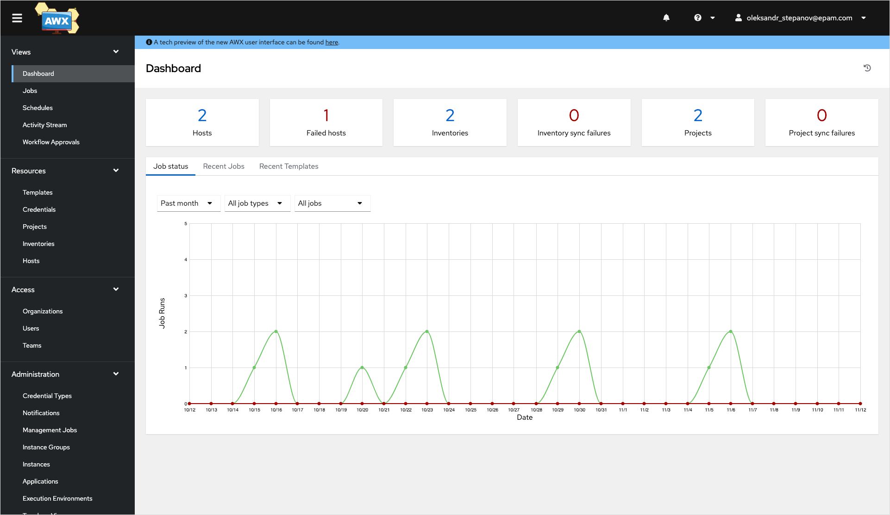

    b. (Optional) Configure OIDC. Navigate to **Settings** -> **Generic OIDC settings** and specify the required fields:

    * **OIDC Key**: Enter **awx**;
    * **OIDC Secret**: This is the client secret data;
    * **URL**: Specify the Keycloak realm URL.

      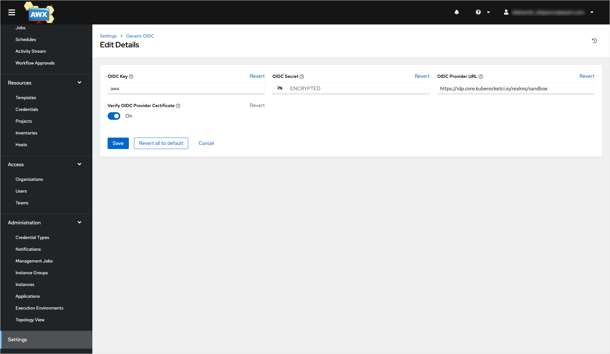

    c. Navigate to **Resources** -> **Credentials** and create two credentials:

      **For Git repository**: These credentials of the **Source Control** type must contain the SSH key with access to the Ansible Git repo:

      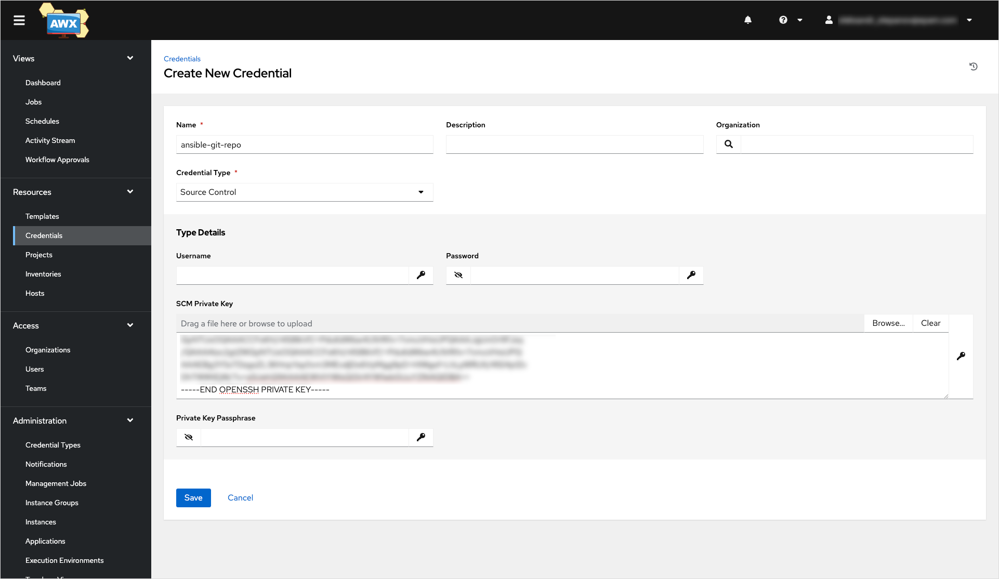

      **For AWS instances**: These credentials with access to the **Hosts** must contain the SSH key:

      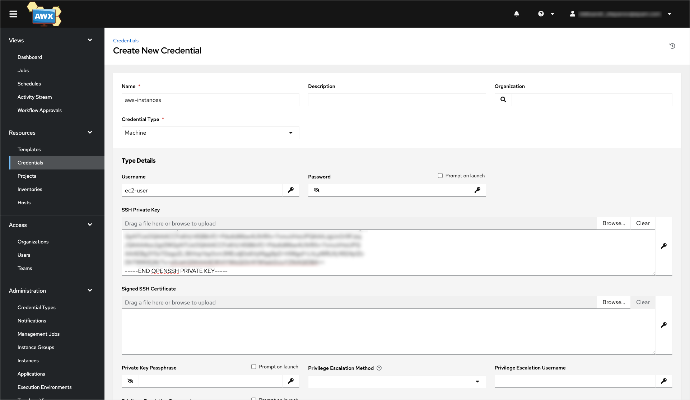

    d. Navigate to **Resources** -> **Project** and create a new project. The `Source Control URL` specifies the repository containing the [Ansible project](#awx-integration-flow).

      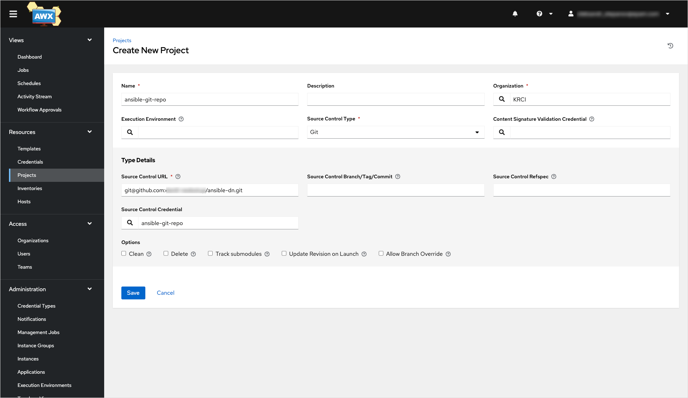

    e. Navigate to **Resources** -> **Inventories** and create an inventory using the **Add inventory** option:

      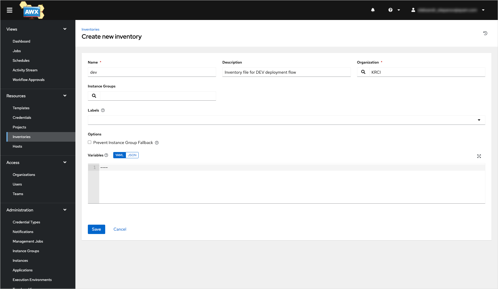

    f. Navigate to **Resources** -> **Hosts** and add hosts' IP addresses:

      

    g. Navigate to **Resources** -> **Templates**. Create job template called **package-install** as follows:

    :::note
      Don't forget to select the **Prompt on launch** checkbox for **inventory**, **limit**, and **variables** fields.
    :::

      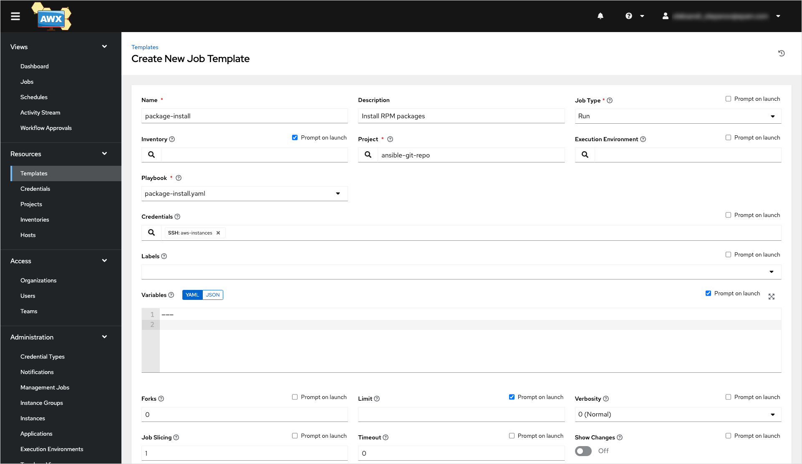

4. Create application with the **rpm-package** deployment option. Refer to the [Add Application](../../user-guide/add-application.md) page for more details:

  

5. When [creating environments](../../user-guide/manage-environments.md#add-a-new-environment), in the **Deploy pipeline template** field, select **deploy-ansible-awx**:

  

6. (Optional) When deploying application, enable the **Values override** option to apply configuration from the Ansible Git repository to be executed specifically for this component:

  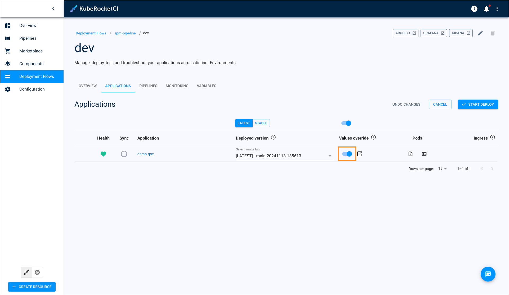

## Related Articles

* [Customize Deploy Pipeline](../../operator-guide/cd/customize-deploy-pipeline.md)
* [Add Deployment Flow](../../user-guide/add-cd-pipeline.md)
* [Manage Deployment Flows](../../user-guide/manage-environments.md)
* [Add Application](../../user-guide/add-application.md)
