---

title: "KrakenD Integration"
description: "Integrate KrakenD with KubeRocketCI for enhanced API management, including service discovery, caching, and security features like JWT authentication."
sidebar_label: "KrakenD"

---
<!-- markdownlint-disable MD025 -->

import Tabs from '@theme/Tabs';
import TabItem from '@theme/TabItem';

# KrakenD Integration

<head>
  <link rel="canonical" href="https://docs.kuberocketci.io/docs/operator-guide/extensions/krakend" />
</head>

This guide explains how to integrate KrakenD with KubeRocketCI. [KrakenD](https://www.krakend.io/docs/) is a fast, open-source API gateway that helps manage requests, protect sensitive data, and optimize routing. It offers options for service discovery, caching, authorization, and rate limiting, which can be customized for the platform.

KubeRocketCI uses KrakenD to connect with services like SonarQube, Dependency-Track, and OpenSearch. This integration allows the platform to fetch data from these services and show it in the KubeRocketCI portal, giving users a clear view of their projects and pipelines. For enhanced security, KrakenD uses JWT tokens from Identity Providers (such as Keycloak or Microsoft Entra ID) to authenticate and authorize requests.

## Prerequisites

To integrate KrakenD with KubeRocketCI, ensure the following prerequisites are met:

- An [Ingress Controller](https://github.com/epam/edp-cluster-add-ons/tree/main/clusters/core/addons/ingress-nginx) is installed and configured.
- A [Keycloak](../auth/keycloak.md) instance is installed and configured with the necessary settings from the [kuberocketci-rbac](https://github.com/epam/edp-cluster-add-ons/tree/main/clusters/core/addons/kuberocketci-rbac) repository.
- A [SonarQube](../code-quality/sonarqube.md) instance is installed and configured.
- A [Dependency-Track](../devsecops/dependency-track.md) instance is installed and configured.
- (Optional) An [OpenSearch](https://github.com/epam/edp-cluster-add-ons/tree/main/clusters/core/addons/opensearch) instance is installed and configured (required for the [Long-Term Storage](../ci/tekton-long-term-storage.md) feature).
- (Optional) The [External Secrets Operator](https://github.com/epam/edp-cluster-add-ons/tree/main/clusters/core/addons/external-secrets) is installed.

## Installation

There are two approaches to install KrakenD using [edp-cluster-add-ons](https://github.com/epam/edp-cluster-add-ons) repository:

### Approach 1: Deploy Using Argo CD

The first approach is to deploy KrakenD using Argo CD. Follow the steps below to install KrakenD using Argo CD:

1. Clone the forked [edp-cluster-add-ons](https://github.com/epam/edp-cluster-add-ons) repository.

2. Navigate to the `clusters/core/addons/krakend` directory and configure the `values.yaml` file with the necessary values for the KrakenD installation.

3. After configuring the KrakenD Helm chart values, navigate to the `clusters/core/apps` directory. In the `values.yaml` file, update the `krakend` section by specifying the `enable` field as `true` to enable Argo CD Application creation for the KrakenD:

    ```yaml
    krakend:
      enable: true
    ```

4. Commit and push the changes to the remote repository. After the changes are pushed, navigate to the Argo CD and sync the KrakenD application. Verify that the KrakenD is successfully deployed:

    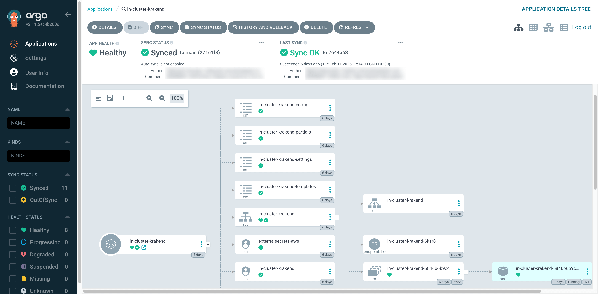

### Approach 2: Deploy Using Helm

The second approach is to deploy KrakenD using Helm. Follow the steps below to install KrakenD using Helm:

1. Clone the forked [edp-cluster-add-ons](https://github.com/epam/edp-cluster-add-ons) repository.

2. Navigate to the `clusters/core/addons/krakend` directory and configure the `values.yaml` file with the necessary values for the KrakenD installation.

3. After configuring the KrakenD Helm chart values, run the following command to deploy the KrakenD:

    ```bash
    helm upgrade --install krakend . -n krakend --create-namespace
    ```

4. Verify that the KrakenD is successfully deployed.

## Create Access Tokens

To integrate KrakenD with KubeRocketCI, it is necessary to create access tokens for the services that KrakenD will connect to. Follow the guides below to generate the necessary tokens for each service:

### SonarQube

To generate an access token for SonarQube, follow the steps below:

:::note
It is also possible to use the existing SonarQube user "view-user" to generate an access token. This user is created by default during the [sonar-operator](https://github.com/epam/edp-cluster-add-ons/blob/main/clusters/core/addons/sonar-operator/templates/sonar/user_view.yaml) installation process.
:::

1. Log in to SonarQube as an administrator:

    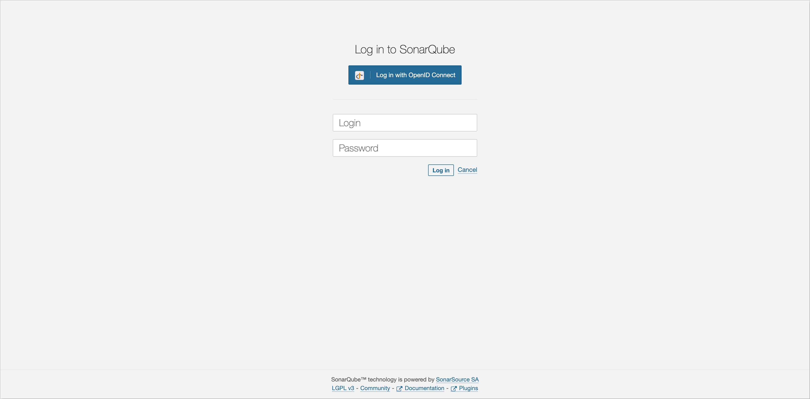

2. Navigate to the **Administration** tab and click **Security**. Select **Users** to navigate to the user management page:

    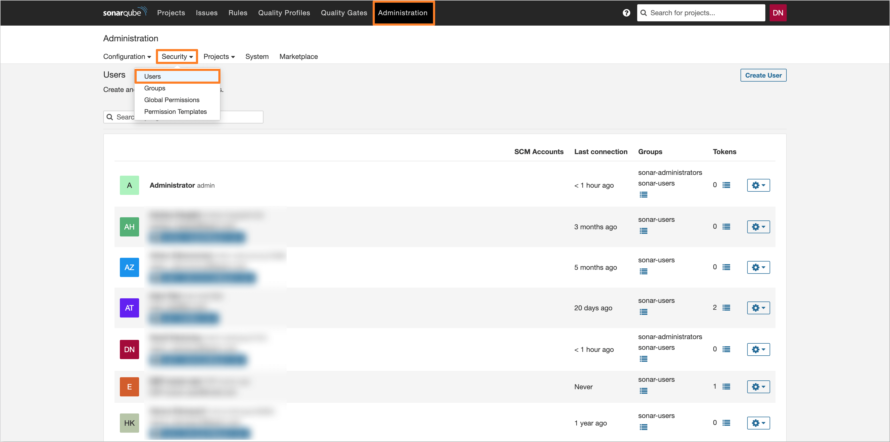

3. In the user management page, click the **Create User** button to create a new user:

    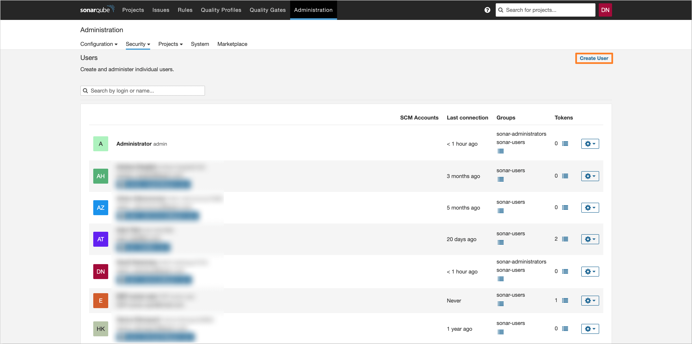

4. Fill in the user details and click the **Create** button to create the user:

    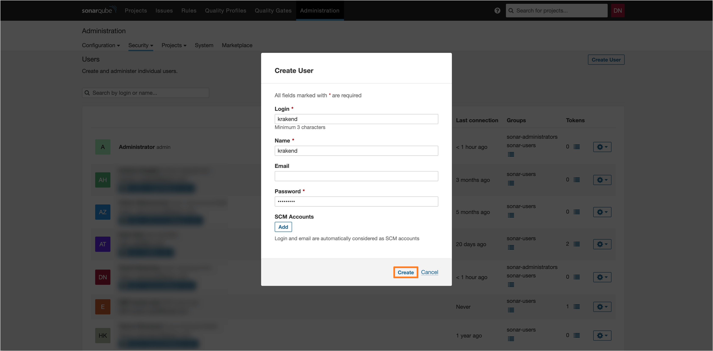

5. After creating, find the user in the list and click the **Update Groups** button. In the opened dialog, navigate to the **Unselected** tab and select the checkbox for the **view-group** group. Click the **Reload** button to apply the changes:

    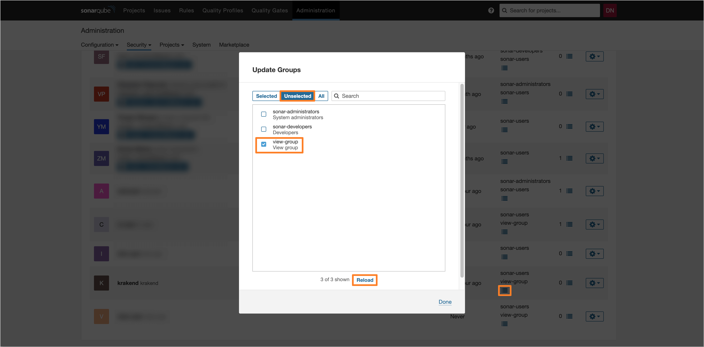

6. After updating the groups, click the **Update Tokens** button to generate a token for the user. Fill in the token name and click the **Generate** button to create the token. Copy the generated token for use in the KrakenD configuration:

    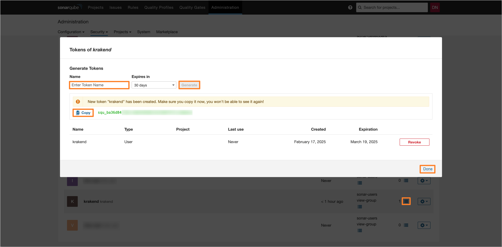

7. After generating the token, save it in a secure location for further use.

### Dependency-Track

To generate an access token for Dependency-Track, follow the steps below:

1. Log in to Dependency-Track as an administrator:

    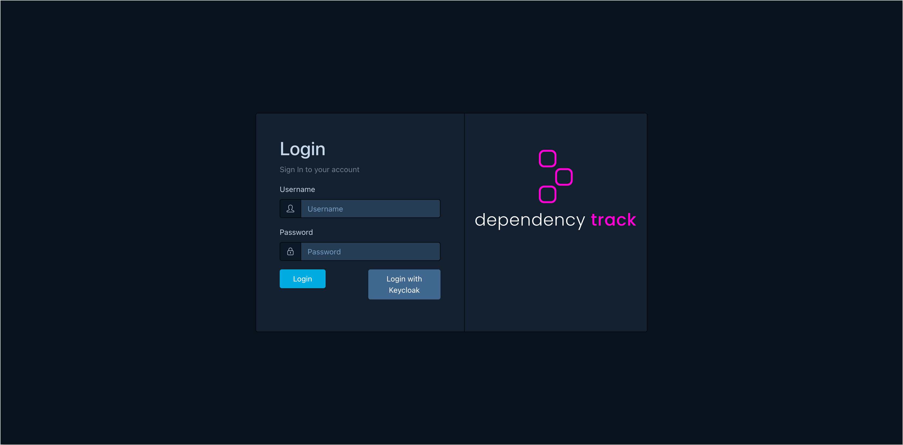

2. In the left sidebar menu, navigate to the **Administration** tab. Click **Access Management** and select **Teams**:

    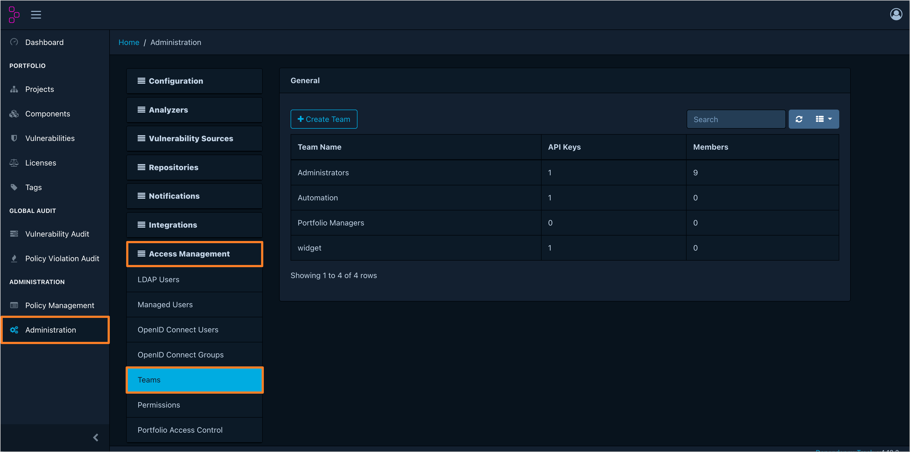

3. In the team list, click the **Create Team** button to create a new team. Fill in the team name and click the **Create** button to create the team:

    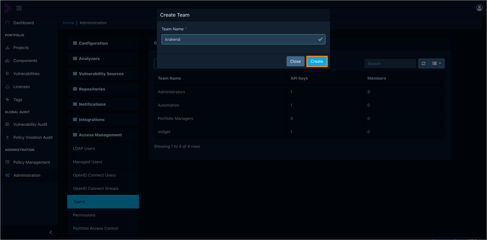

4. After creating the team, click the team name to navigate to the team details. In the **Permissions** section, add the **VIEW_PORTFOLIO** permission. In the **API Keys** section, generate a new API key. Copy the generated API key for use in the KrakenD configuration:

    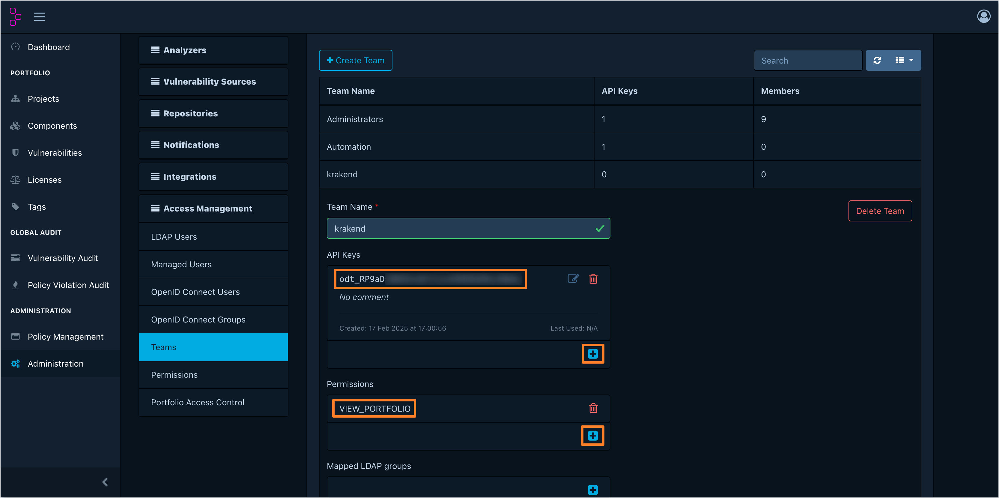

5. After generating the API key, save it in a secure location for further use.

### OpenSearch

In the case of OpenSearch, there is no need to generate an access token. Instead, the OpenSearch user credentials are used to authenticate requests. To create the user for KrakenD integration with OpenSearch, follow the steps below:

1. Log in to the OpenSearch instance as an administrator:

    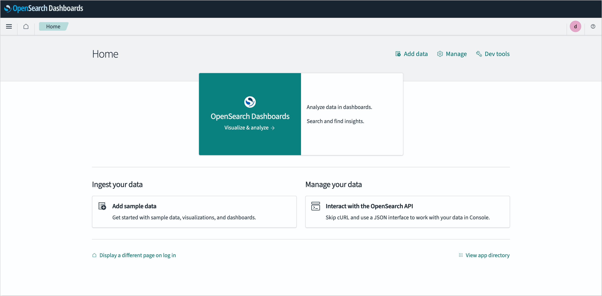

2. In the left sidebar menu, navigate to the **Management** tab and select the **Security** section:

    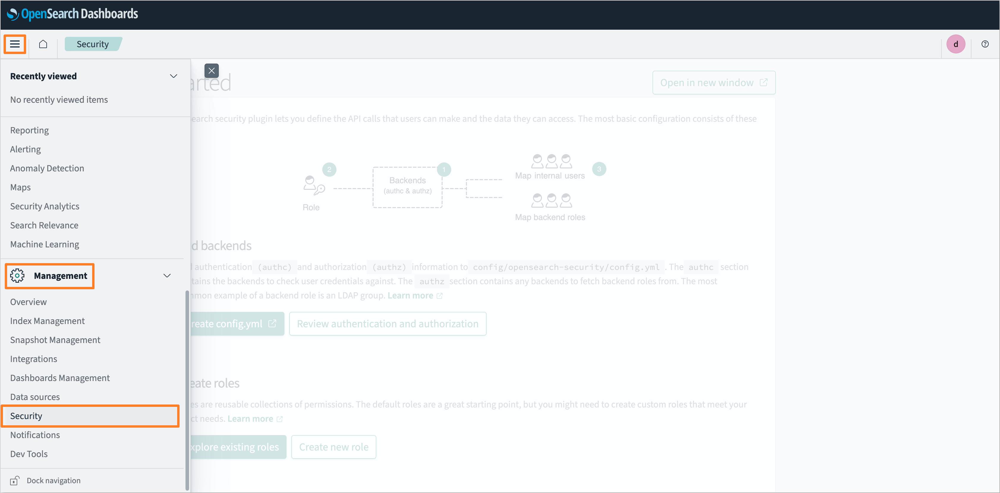

3. In the security settings, select the **Internal users** tab and click **Create internal user**:

    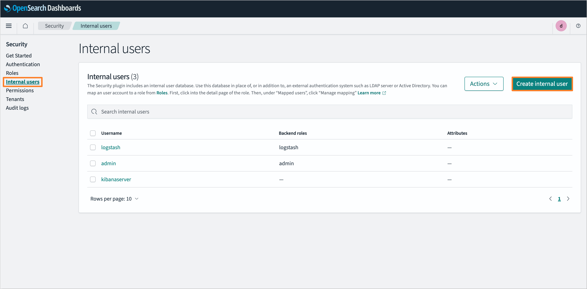

4. Fill in the username and password for the new user. In the **Backend roles** section, assign the **logstash** role. Click the **Create** button to create the user:

    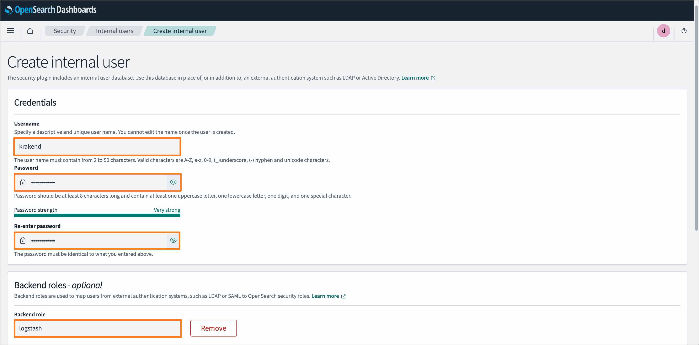

5. After creating the user, save the username and password in a secure location for further use.

## Configuration

:::note
It is highly recommended to use the [edp-cluster-add-ons](https://github.com/epam/edp-cluster-add-ons) repository to install and configure the necessary services for KrakenD integration.
For more details, refer to the [Installation via Add-Ons](../add-ons-overview.md) page.
:::

To configure KrakenD as the API gateway for KubeRocketCI, follow the steps below:

1. Define the KrakenD API gateway URL:

    It is necessary to define the KrakenD API gateway URL during platform installation or update process. In the [edp-install](https://github.com/epam/edp-install) repository, specify the `apiGatewayUrl` parameter in the `global` section of the `values.yaml` file:

    ```yaml
    global:
      apiGatewayUrl: "https://api.example.com"
    ```

    :::note
    This URL should point to the ingress URL of the KrakenD API Gateway. By default, this [value](https://github.com/epam/edp-install/blob/v3.11.0/deploy-templates/values.yaml#L16) is left empty, which means that the widgets are disabled by default.
    :::

2. Define the KrakenD secret:

    To allow KrakenD to connect to the services, it is necessary to create a secret with the required credentials and URLs. The secret should contain the following fields:

    * **SONARQUBE_URL**: The URL of the SonarQube instance. For example: `http://sonar.sonar:9000`

    * **SONARQUBE_TOKEN**: The access token, generated during the [SonarQube Access Token creation](#sonarqube) step. The token should be encoded in base64 format. To encode the token into Base64, execute the following command:

        :::warning
        It is necessary to add a colon `:` at the end of the token before encoding it.
        :::

        ```bash
        sonarqube_user_token="squ_19f5xxxxxxxxxxxxxxxxxxxxxxxxxxxxxxxx46b6"
        echo -n "${sonarqube_user_token}:" | base64
        ```

    * **DEPTRACK_URL**: The API Server URL of the Dependency-Track instance. For example: `http://dependency-track-api-server.dependency-track:8080`

    * **DEPTRACK_TOKEN**: The API key, generated during the [Dependency-Track Access Token creation](#dependency-track) step. Not required to encode in base64 format.

    * **OPENSEARCH_URL**: The URL of the OpenSearch instance. For example: `https://opensearch-cluster-master.logging:9200`

    * **OPENSEARCH_CREDS**: The user credentials, created during the [OpenSearch User creation](#opensearch) step. The credentials should be encoded in base64 format. To encode the credentials into Base64, execute the following command:

        ```bash
        echo -n "admin:MySecurePass123" | base64
        ```

    * **JWK_URL**: The URL of the Identity Provider (Keycloak or Microsoft Entra ID) to fetch the JSON Web Key (JWK) set.

        - For Keycloak, the URL should be in the following format: `https://keycloak.example.com/auth/realms/<realmName>/protocol/openid-connect/certs`.
        - For Microsoft Entra ID, the URL should be in the following format: `https://login.microsoftonline.com/common/discovery/v2.0/keys`.

    The secret can be specified in the following ways:

    - Using YAML manifest:

        ```yaml
        apiVersion: v1
        kind: Secret
        metadata:
          name: krakend
          namespace: krakend
        type: Opaque
        stringData:
          SONARQUBE_URL: http://sonar.sonar:9000
          SONARQUBE_TOKEN: <sonarqube-token>
          DEPTRACK_URL: http://dependency-track-api-server.dependency-track:8080
          DEPTRACK_TOKEN: <dependency-track-token>
          OPENSEARCH_URL: https://opensearch-cluster-master.logging:9200
          OPENSEARCH_CREDS: <base64-encoded-credentials>
          JWK_URL: https://keycloak.example.com/auth/realms/<realmName>/protocol/openid-connect/certs
        ```

    - Using External Secrets Operator:

        To define the secret using the External Secrets Operator, it is necessary to create an AWS Parameter Store object with the required fields. The object should contain the following fields:

        ```json title="AWS Parameter Store Object"
        {
          "SONARQUBE_URL": "http://sonar.sonar:9000",
          "SONARQUBE_TOKEN": "<sonarqube-token>",
          "DEPTRACK_URL": "http://dependency-track-api-server.dependency-track:8080",
          "DEPTRACK_TOKEN": "<dependency-track-token>",
          "OPENSEARCH_URL": "https://opensearch-cluster-master.logging:9200",
          "OPENSEARCH_CREDS": "<base64-encoded-credentials>",
          "JWK_URL": "https://keycloak.example.com/auth/realms/<realmName>/protocol/openid-connect/certs"
        }
        ```

        Specify the External Secrets Operator configuration in `values.yaml` file of the [KrakenD](https://github.com/epam/edp-cluster-add-ons/blob/main/clusters/core/addons/krakend/values.yaml#L221) Helm chart:

        ```yaml title="values.yaml"
        eso:
          # -- Install components of the ESO.
          enabled: true
          # -- Defines provider type. One of `aws` or `generic`.
          type: "aws"
          # -- Defines Secret Store name.
          secretStoreName: "aws-parameterstore"
          # -- Value name in AWS ParameterStore, AWS SecretsManager or other Secret Store.
          secretName: "/infra/core/addons/krakend"
          # -- Role ARN for the ExternalSecretOperator to assume.
          roleArn: arn:aws:iam::012345678910:role/AWSIRSA_Shared_ExternalSecretOperatorAccess
        ```

        More details about External Secrets Operator integration can be found in the [External Secrets Operator](../secrets-management/install-external-secrets-operator.md) page.

## Related Articles

* [Install KubeRocketCI With Values File](../install-kuberocketci.md)
* [Install via Add-Ons](../add-ons-overview.md)
* [SonarQube Integration](../code-quality/sonarqube.md)
* [Integrate DependencyTrack](../devsecops/dependency-track.md)
* [Install Keycloak](../auth/keycloak.md)
* [Install NGINX Ingress Controller](../install-ingress-nginx.md)
