---

title: "Guide: Microsoft Entra SSO Integration With AWS EKS & KubeRocketCI Portal"
description: "Comprehensive instructions on configuring OIDC authentication for AWS EKS and KubeRocketCI Portal using Microsoft Entra, including default namespace and user picture configuration."
sidebar_label: "AWS EKS & KubeRocketCI Portal"

---
<!-- markdownlint-disable MD025 -->

# Guide: Microsoft Entra SSO Integration With AWS EKS & KubeRocketCI Portal

<head>
  <link rel="canonical" href="https://docs.kuberocketci.io/docs/operator-guide/microsoft-entra/aws-eks-portal-authentication" />
</head>

This guide provides instructions on how to configure OpenID Connect (OIDC) authentication for the AWS EKS cluster and the KubeRocketCI Portal using Microsoft Entra as the Identity Provider (IdP), as well as how to configure the default namespace and user picture in the KubeRocketCI Portal using Microsoft Entra extension attributes.

## Prerequisites

Before you begin, make sure the following prerequisites are met:

- Access to the [Microsoft Entra Admin Center](https://entra.microsoft.com/) with administrative privileges.
- A running [AWS EKS](https://docs.aws.amazon.com/eks/latest/userguide/create-cluster.html) cluster with the necessary permissions for access and management.
- The [kubelogin](https://github.com/int128/kubelogin) plugin installed for authenticating to the EKS cluster using OIDC.
- The [kubectl](https://kubernetes.io/docs/tasks/tools/#kubectl) CLI tool installed.
- The [aws cli](https://aws.amazon.com/cli/) tool installed.
- The [curl](https://curl.se/) tool installed.

## Integrate AWS EKS and KubeRocketCI Portal with Microsoft Entra

For a detailed step-by-step guide on integrating OIDC authentication for AWS EKS and the KubeRocketCI Portal with Microsoft Entra, please refer to the [Integrating OIDC Authentication With Microsoft Entra in AWS EKS](/blog/integrating-oidc-authentication-microsoft-entra-aws-eks) blog post.

The blog covers the process of creating a Microsoft Entra tenant, configuring an application, and managing users and groups. It also explains how to integrate the created application with the AWS EKS cluster and set up authentication for the KubeRocketCI Portal.

## Configure Default Namespace

After logging in to the KubeRocketCI Portal, it is necessary to manually configure the **Default namespace** and **Allowed Namespaces**. To automate this process, it is possible to use the Microsoft Entra extension attributes.

Follow the steps below to configure the default namespace extension attribute in Microsoft Entra and assign it to the user:

1. Log in to the [Microsoft Entra Admin Center](https://entra.microsoft.com/):

    

2. In the left sidebar menu, select **Applications** and navigate to the application created during the [OIDC integration process](/blog/integrating-oidc-authentication-microsoft-entra-aws-eks) with AWS EKS and the KubeRocketCI Portal (e.g., `eks`):

    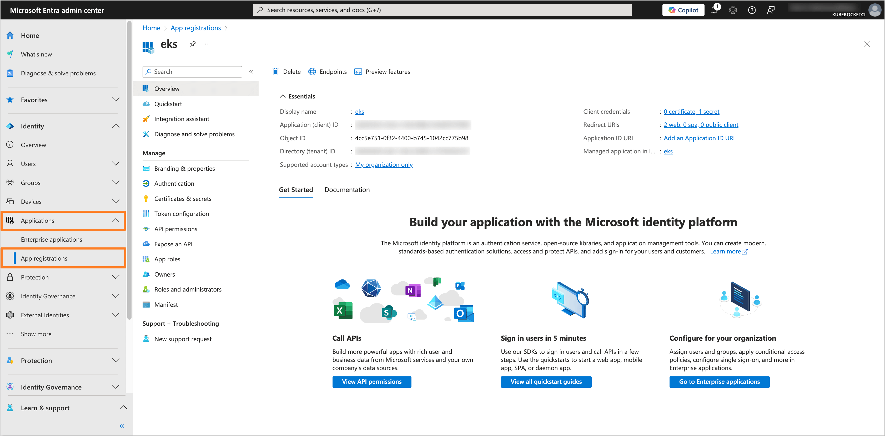

3. In the application tab, navigate to the **API permissions** section. Click on the **Add a permission** button. Select **Microsoft Graph** and then **Application permissions**. Add the following permissions:

    - **Application.ReadWrite.All**
    - **User.ReadWrite.All**

    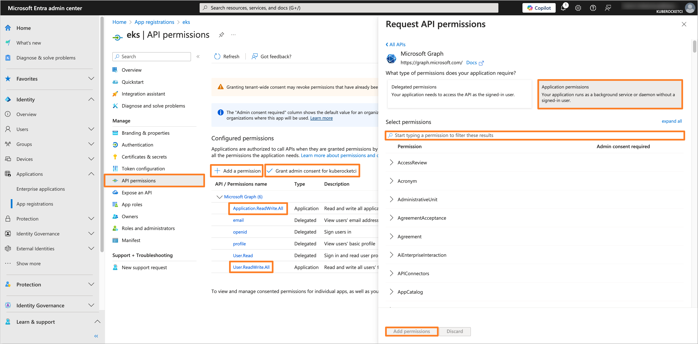

    After adding the permissions, click on the **Grant admin consent for 'Tenant name'** button to grant the required permissions.

4. Navigate to the local terminal and run the following command to get the access token:

    :::note
    The Application data, such as **Application (client) ID** and **Directory (tenant) ID**, can be found in the **Overview** section of the Application in the Microsoft Entra Admin Center.
    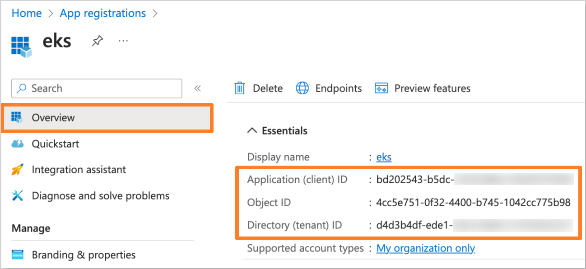
    :::

    :::note
    You can use the [jq](https://stedolan.github.io/jq/) tool to parse the JSON response. If you do not have it installed, you can drop the `| jq -r '.access_token'` part from the command.
    :::

    ```bash
    curl -X POST "https://login.microsoftonline.com/<tenant_id>/oauth2/v2.0/token" \
    -d "client_id=<application_client_id>" \
    -d "client_secret=<application_client_secret>" \
    -d "scope=https://graph.microsoft.com/.default" \
    -d "grant_type=client_credentials" | jq -r '.access_token'
    ```

    Replace `<tenant_id>`, `<application_client_id>`, and `<application_client_secret>` with the corresponding values from the Microsoft Entra application.

    Save the access token for further use.

5. Create the `default_namespace` extension attribute for the Microsoft Entra application by running the following command:

    :::note
    The Application parameter **Object ID** can be found in the **Overview** section of the Application in the Microsoft Entra Admin Center.
    
    :::

    ```bash
    curl -X POST "https://graph.microsoft.com/v1.0/applications/<application_object_id>/extensionProperties" \
    -H "Authorization: Bearer <access_token>" \
    -H "Content-Type: application/json" \
    -d '{
      "name": "default_namespace",
      "dataType": "String",
      "targetObjects": ["User"]
    }'
    ```

    Replace `<application_object_id>` with the Object ID of the Microsoft Entra application and `<access_token>` with the saved access token.

6. Assign the `default_namespace` extension attribute to the user who needs to have the default namespace configured by running the following command:

    :::note
    The user **Object ID** parameter can be found in the **Overview** section of the user in the Microsoft Entra Admin Center.
    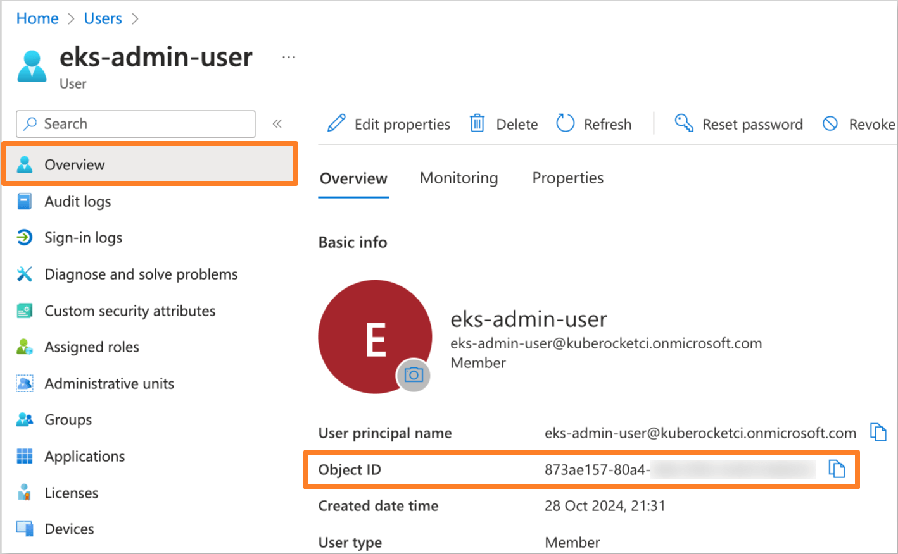
    :::

    ```bash
    curl -X PATCH "https://graph.microsoft.com/v1.0/users/<user_object_id>" \
    -H "Authorization: Bearer <access_token>" \
    -H "Content-Type: application/json" \
    -d '{
      "extension_<application_client_id>_default_namespace": "<default_namespace>"
    }'
    ```

    Replace `<user_object_id>`, `<application_client_id>`, `<access_token>`, and `<default_namespace>` with the user Object ID, application Client ID, saved access token, and the name of the desired default namespace, respectively.

7. Navigate to the Microsoft Entra Admin Center. In the left sidebar menu, select **Applications** and navigate to the Enterprise application created for OIDC integration with AWS EKS and the KubeRocketCI Portal (e.g., `eks`):

    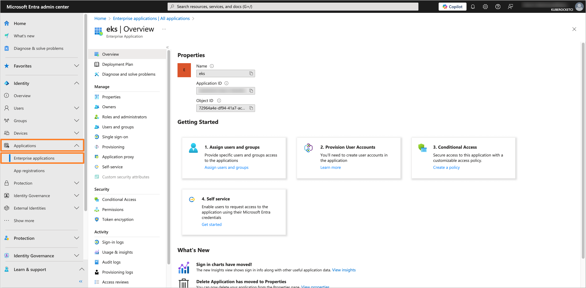

8. In the application tab, navigate to the **Single sign-on** section. In the **Attributes & Claims** tab, click on the **Edit** button:

    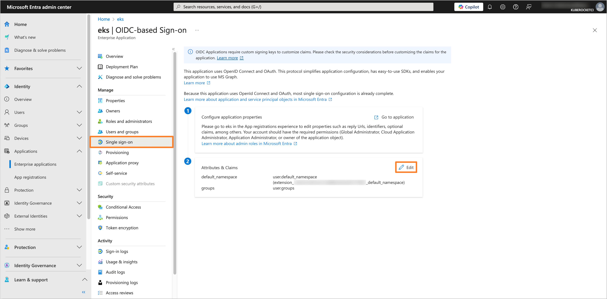

    After that, click on the **Add new claim** button:

    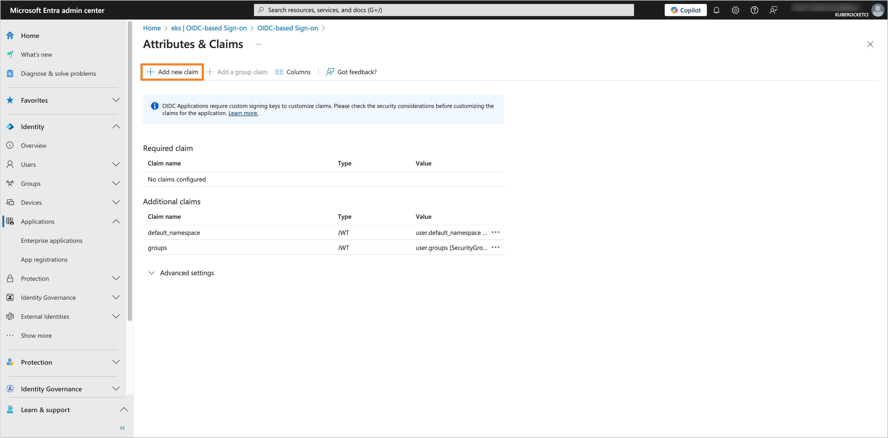

    Fill in the **Name** field with `default_namespace` and select the **Source** as `Directory schema extension`:

    

    In the **Select Application** tab, choose the application created for OIDC integration with AWS EKS and the KubeRocketCI Portal (e.g., `eks`). Click on the **Select** button:

    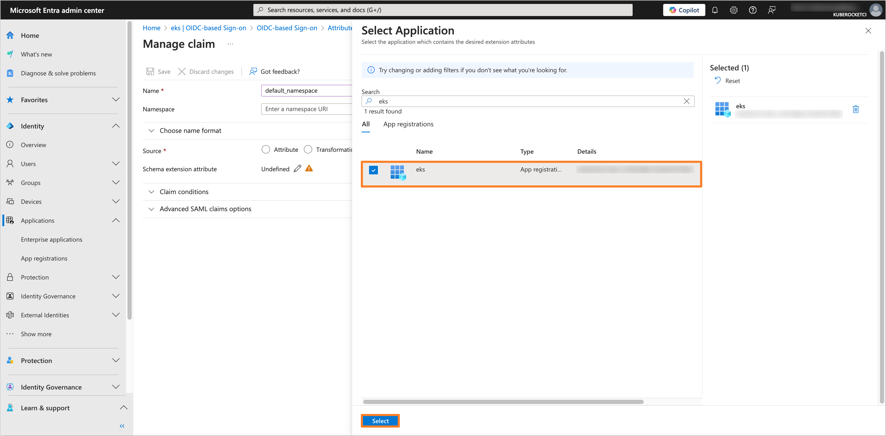

    In the **Add Extension Attributes** tab, select the `user.default_namespace` attribute and click on the **Add** button:

    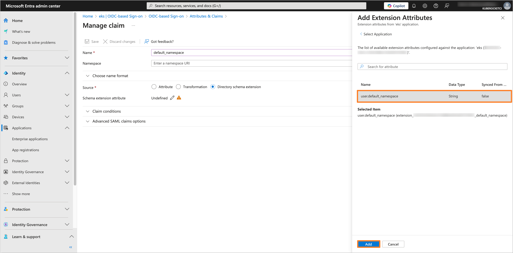

    Click on the **Save** button to apply the changes:

    

9. In the left sidebar menu, select **Applications** and navigate to the application created for OIDC integration with AWS EKS and the KubeRocketCI Portal (e.g., `eks`). In the application tab, navigate to the **Manifest** section:

    Find the `acceptMappedClaims` parameter and set it to `true`. Click on the **Save** button to apply the changes:

    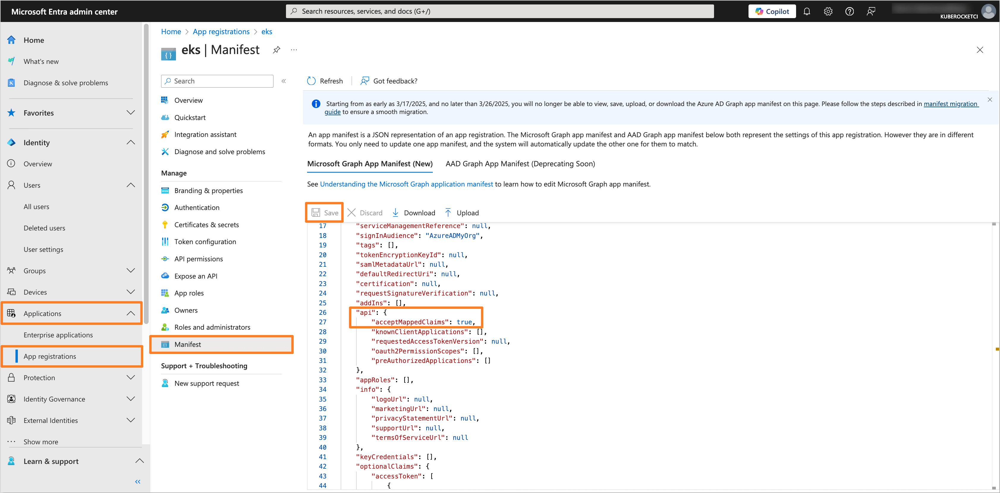

10. (Optional) Get the application access token and verify the `default_namespace` extension attribute by running the following command:

    :::note
    Before running the command, ensure that the `Redirect URI` in the Microsoft Entra application is set to `http://localhost:8000`.
    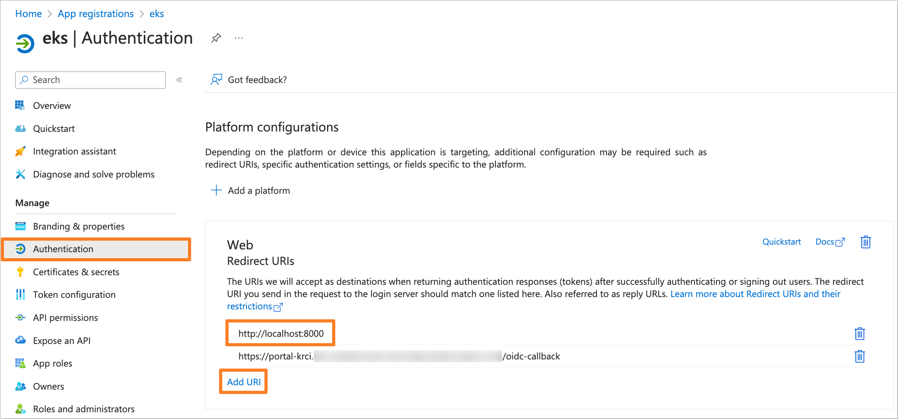
    :::

    ```bash
    kubelogin get-token --oidc-issuer-url=https://sts.windows.net/<tenant_id>/ --oidc-client-id=<application_client_id> --oidc-client-secret=<application_client_secret> --force-refresh
    ```

    Replace `<tenant_id>`, `<application_client_id>`, and `<application_client_secret>` with the corresponding values from the Microsoft Entra application.

    After that, encode the token using the [jwt.io](https://jwt.io/) tool and verify the `default_namespace` attribute in the decoded token:

    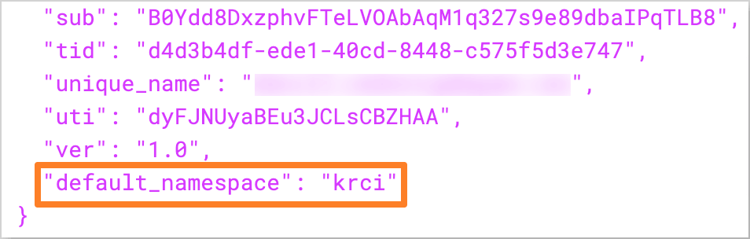

11. After configuring the `default_namespace` extension attribute, the account settings, such as the **Default namespace** and **Allowed namespaces**, will be automatically configured during login to the KubeRocketCI Portal:

    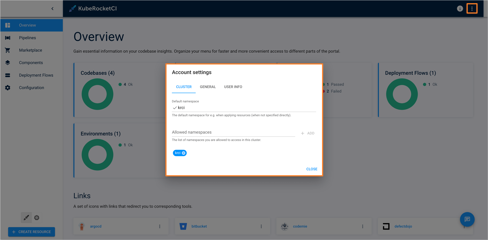

## Configure User Profile Picture

To enhance account personalization, it is possible to configure the user profile picture in the KubeRocketCI Portal using the Microsoft Entra extension attributes.

Follow the steps below to configure the user profile picture extension attribute in Microsoft Entra and assign it to the user:

1. Log in to the [Microsoft Entra Admin Center](https://entra.microsoft.com/):

    

2. In the left sidebar menu, select **Applications** and navigate to the application created during the [OIDC integration process](/blog/integrating-oidc-authentication-microsoft-entra-aws-eks) with AWS EKS and the KubeRocketCI Portal (e.g., `eks`):

    

3. In the application tab, navigate to the **API permissions** section. Click on the **Add a permission** button. Select **Microsoft Graph** and then **Application permissions**. Add the following permissions:

    - **Application.ReadWrite.All**
    - **User.ReadWrite.All**

    

    After adding the permissions, click on the **Grant admin consent for 'Tenant name'** button to grant the required permissions.

4. Navigate to the local terminal and run the following command to get the access token:

    :::note
    The Application data, such as **Application (client) ID** and **Directory (tenant) ID**, can be found in the **Overview** section of the Application in the Microsoft Entra Admin Center.
    
    :::

    :::note
    You can use the [jq](https://stedolan.github.io/jq/) tool to parse the JSON response. If you do not have it installed, you can drop the `| jq -r '.access_token'` part from the command.
    :::

    ```bash
    curl -X POST "https://login.microsoftonline.com/<tenant_id>/oauth2/v2.0/token" \
    -d "client_id=<application_client_id>" \
    -d "client_secret=<application_client_secret>" \
    -d "scope=https://graph.microsoft.com/.default" \
    -d "grant_type=client_credentials" | jq -r '.access_token'
    ```

    Replace `<tenant_id>`, `<application_client_id>`, and `<application_client_secret>` with the corresponding values from the Microsoft Entra application.

    Save the access token for further use.

5. Create the `picture` extension attribute for the Microsoft Entra application by running the following command:

    :::note
    The Application parameter **Object ID** can be found in the **Overview** section of the Application in the Microsoft Entra Admin Center.
    
    :::

    ```bash
    curl -X POST "https://graph.microsoft.com/v1.0/applications/<application_object_id>/extensionProperties" \
    -H "Authorization: Bearer <access_token>" \
    -H "Content-Type: application/json" \
    -d '{
      "name": "picture",
      "dataType": "String",
      "targetObjects": ["User"]
    }'
    ```

    Replace `<application_object_id>` with the Object ID of the Microsoft Entra application and `<access_token>` with the saved access token.

6. Assign the `picture` extension attribute to the user who needs to have the profile picture configured by running the following command:

    :::note
    The user **Object ID** parameter can be found in the **Overview** section of the user in the Microsoft Entra Admin Center.
    
    :::

    ```bash
    curl -X PATCH "https://graph.microsoft.com/v1.0/users/<user_object_id>" \
    -H "Authorization: Bearer <access_token>" \
    -H "Content-Type: application/json" \
    -d '{
      "extension_<application_client_id>_picture": "<picture_url>"
    }'
    ```

    Replace `<user_object_id>`, `<application_client_id>`, `<access_token>`, and `<picture_url>` with the user Object ID, application Client ID, saved access token, and the URL of the user profile picture, respectively.

    :::note
    The profile picture URL should refer to an image accessible via a public URL.
    :::

7. Navigate to the Microsoft Entra Admin Center. In the left sidebar menu, select **Applications** and navigate to the Enterprise application created for OIDC integration with AWS EKS and the KubeRocketCI Portal (e.g., `eks`):

    

8. In the application tab, navigate to the **Single sign-on** section. In the **Attributes & Claims** tab, click on the **Edit** button:

    

    After that, click on the **Add new claim** button:

    

    Fill in the **Name** field with `picture` and select the **Source** as `Directory schema extension`:

    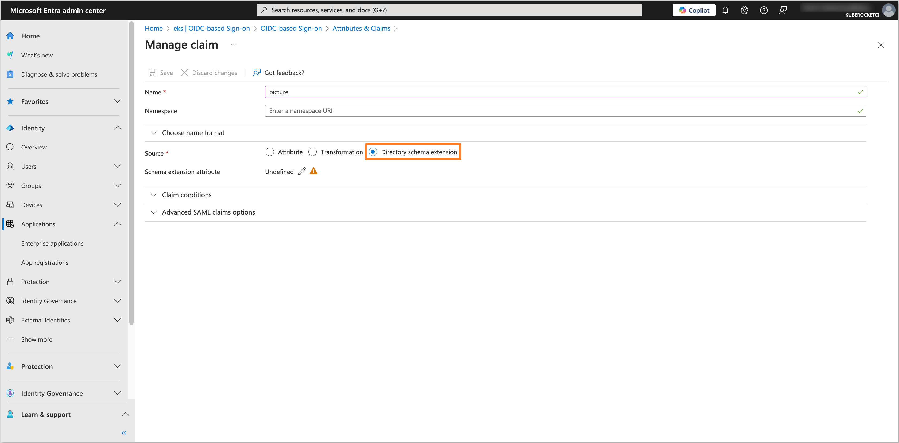

    In the **Select Application** tab, choose the application created for OIDC integration with AWS EKS and the KubeRocketCI Portal (e.g., `eks`). Click on the **Select** button:

    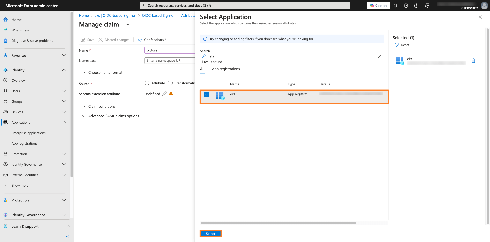

    In the **Add Extension Attributes** tab, select the `user.picture` attribute and click on the **Add** button:

    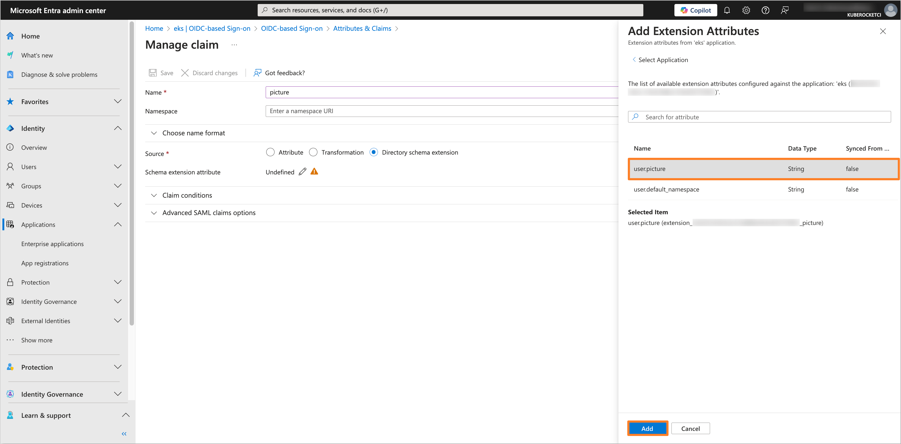

    Click on the **Save** button to apply the changes:

    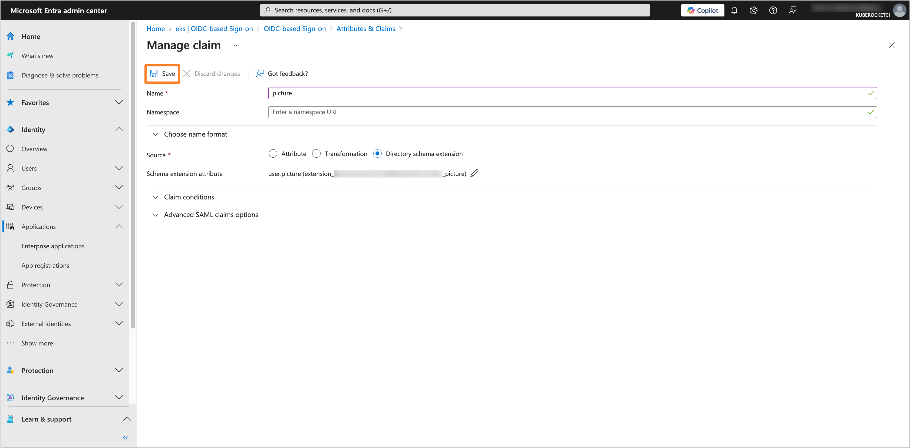

9. In the left sidebar menu, select **Applications** and navigate to the application created for OIDC integration with AWS EKS and the KubeRocketCI Portal (e.g., `eks`). In the application tab, navigate to the **Manifest** section:

    Find the `acceptMappedClaims` parameter and set it to `true`. Click on the **Save** button to apply the changes:

    

10. (Optional) Get the application access token and verify the `picture` extension attribute by running the following command:

    :::note
    Before running the command, ensure that the `Redirect URI` in the Microsoft Entra application is set to `http://localhost:8000`.
    
    :::

    ```bash
    kubelogin get-token --oidc-issuer-url=https://sts.windows.net/<tenant_id>/ --oidc-client-id=<application_client_id> --oidc-client-secret=<application_client_secret> --force-refresh
    ```

    Replace `<tenant_id>`, `<application_client_id>`, and `<application_client_secret>` with the corresponding values from the Microsoft Entra application.

    After that, encode the token using the [jwt.io](https://jwt.io/) tool and verify the `picture` attribute in the decoded token:

    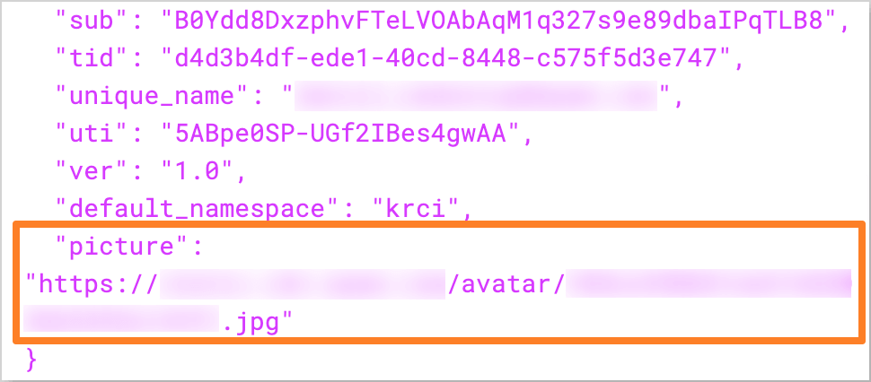

11. After configuring the `picture` extension attribute, the user profile picture will be displayed in the KubeRocketCI Portal:

    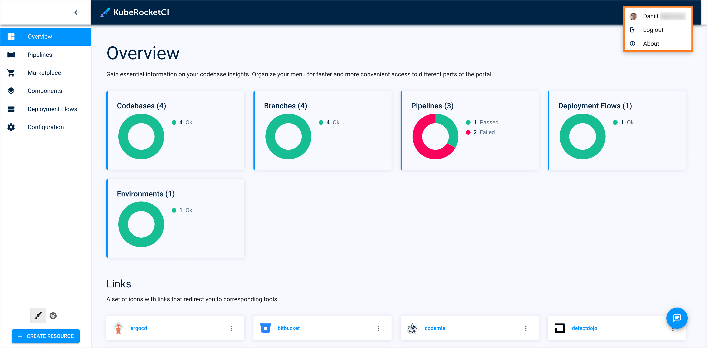

## Configure Token Lifetime for Application

The default token lifetime in Microsoft Entra ID is set to 1 hour. This can cause issues for applications needing long-running processes or extended user sessions, leading to frequent re-authentication. To avoid this, a custom Token Lifetime Policy can be created and assigned to the application to extend the lifespan of ID Tokens or Access Tokens, improving the user experience and application efficiency.

Follow the steps below to configure and assign a custom Token Lifetime Policy to the application:

1. Log in to the [Microsoft Entra Admin Center](https://entra.microsoft.com/):

    

2. In the left sidebar menu, select **Applications** and navigate to the application for which the Token Lifetime Policy needs to be configured (e.g., `eks`):

    

3. In the application tab, navigate to the **API permissions** section. Click on the **Add a permission** button. Select **Microsoft Graph** and then **Application permissions**. Add the following permissions:

    - **Policy.ReadWrite.ApplicationConfiguration**
    - **Application.ReadWrite.All**

    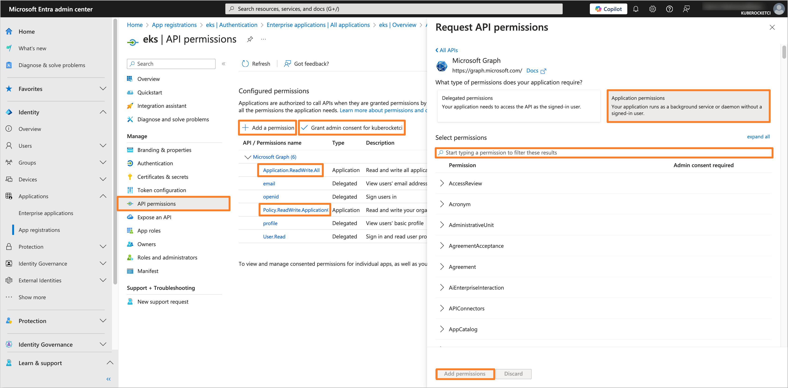

    After adding the permissions, click on the **Grant admin consent for 'Tenant name'** button to grant the required permissions.

4. Navigate to the local terminal and run the following command to get the access token:

    :::note
    You can use the [jq](https://stedolan.github.io/jq/) tool to parse the JSON response. If you do not have it installed, you can drop the `| jq -r '.access_token'` part from the command.
    :::

    ```bash
    curl -X POST "https://login.microsoftonline.com/<tenant_id>/oauth2/v2.0/token" \
    -d "client_id=<application_client_id>" \
    -d "client_secret=<application_client_secret>" \
    -d "scope=https://graph.microsoft.com/.default" \
    -d "grant_type=client_credentials" | jq -r '.access_token'
    ```

    Replace `<tenant_id>`, `<application_client_id>`, and `<application_client_secret>` with the corresponding values from the Microsoft Entra application.

    Save the access token for further use.

5. Create the custom Token Lifetime Policy by running the following command:

    :::note
    The `AccessTokenLifetime` value should be set in the format `HH:MM:SS` (e.g., `04:00:00` for 4 hours).
    :::

    ```bash
    curl -X POST https://graph.microsoft.com/v1.0/policies/tokenLifetimePolicies \
    -H "Authorization: Bearer <access_token>" \
    -H "Content-Type: application/json" \
    -d '{
        "definition": [
            "{ \"TokenLifetimePolicy\": { \"Version\": 1, \"AccessTokenLifetime\": \"04:00:00\" }}"
        ],
        "displayName": "Custom Access Token Lifetime",
        "isOrganizationDefault": false
    }'
    ```

    Replace `<access_token>` with the saved access token and set the `AccessTokenLifetime` value as needed.

    After running the command, save the `id` value from the response for further use.

    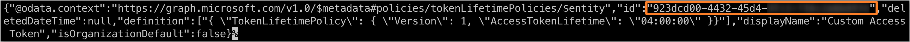

6. Assign the custom Token Lifetime Policy to the application by running the following command:

    :::note
    For UNIX-based systems, it is necessary to escape the `$` character in the `\$ref` value.
    :::

    ```bash
    curl -X POST "https://graph.microsoft.com/v1.0/applications/<application_object_id>/tokenLifetimePolicies/\$ref" \
    -H "Authorization: Bearer <access_token>" \
    -H "Content-Type: application/json" \
    -d '{
        "@odata.id": "https://graph.microsoft.com/v1.0/policies/tokenLifetimePolicies/<policy_id>"
    }'
    ```

    Replace `<application_object_id>`, `<access_token>`, and `<policy_id>` with the Object ID of the Microsoft Entra application, the saved access token, and the `id` value of the custom Token Lifetime Policy, respectively.

7. (Optional) Get the application access or ID token and verify the token lifetime by running the following command:

    :::note
    Before running the command, ensure that the `Redirect URI` in the Microsoft Entra application is set to `http://localhost:8000`.
    
    :::

    ```bash
    kubelogin get-token --oidc-issuer-url=https://sts.windows.net/<tenant_id>/ --oidc-client-id=<application_client_id> --oidc-client-secret=<application_client_secret> --force-refresh
    ```

    Replace `<tenant_id>`, `<application_client_id>`, and `<application_client_secret>` with the corresponding values from the Microsoft Entra application.

    After that, decode the token using the [jwt.io](https://jwt.io/) tool and verify the `exp` claim to check the token expiration time. The lifetime of the token should match the `AccessTokenLifetime` value set in the custom Token Lifetime Policy (e.g., the token should expire after 4 hours after issuance).

    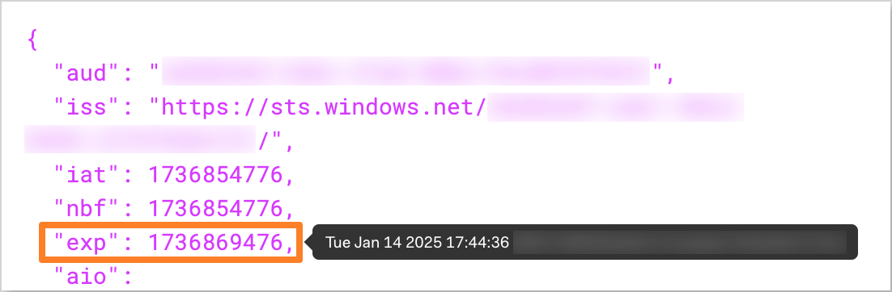

8. After configuring the custom Token Lifetime Policy, the application will issue tokens with the extended lifespan as defined in the policy.

## Related Articles

- [OpenID Connect (OIDC) Authentication Overview](./oidc-authentication-overview.md)
