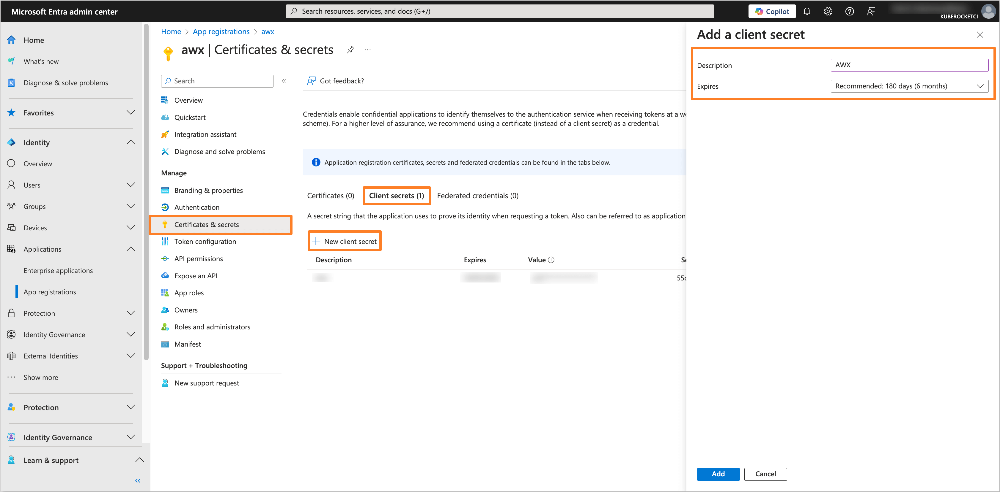
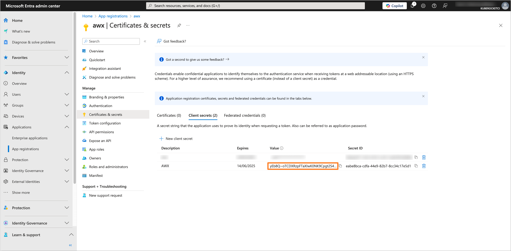
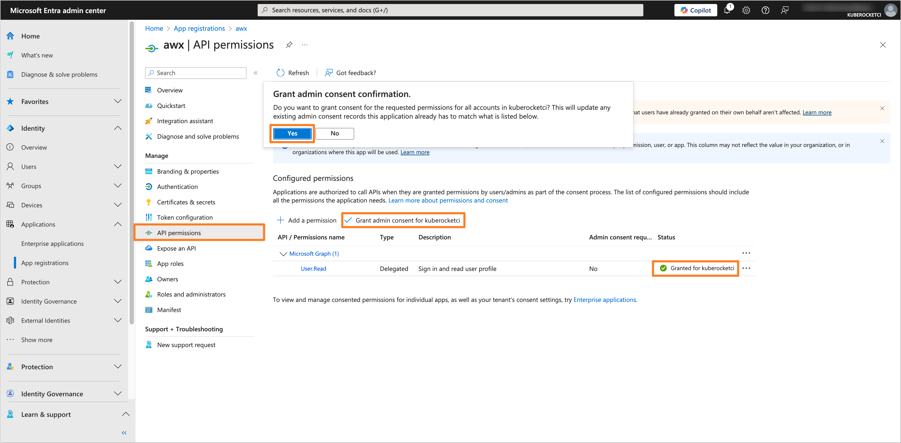
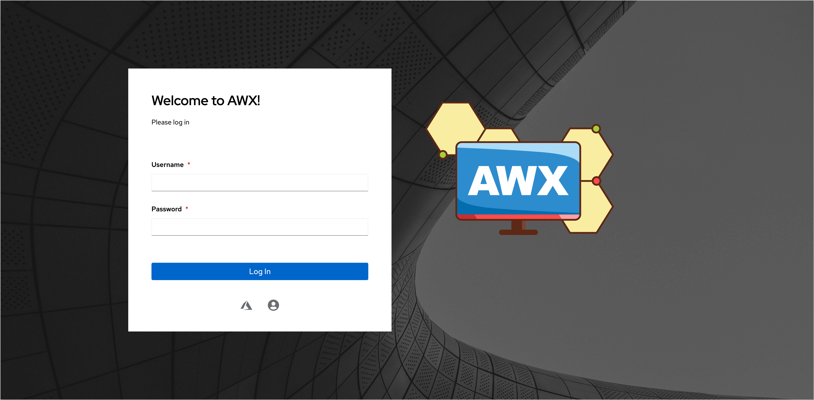
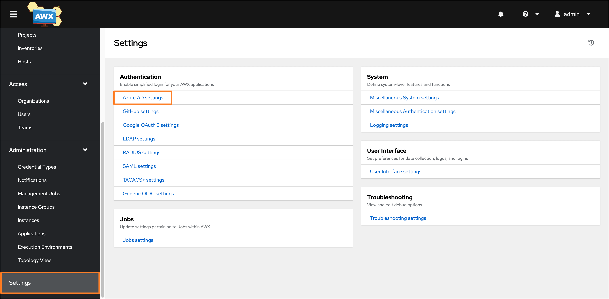

---

title: "Guide: Microsoft Entra SSO Integration With Ansible AWX"
description: "Step-by-step instructions on configuring Ansible AWX with OIDC authentication using Microsoft Entra as the Identity Provider for enhanced security."
sidebar_label: "Ansible AWX"

---
<!-- markdownlint-disable MD025 -->

# Guide: Microsoft Entra SSO Integration With Ansible AWX

<head>
  <link rel="canonical" href="https://docs.kuberocketci.io/docs/operator-guide/microsoft-entra/awx-operator-authentication" />
</head>

This guide provides instructions on how to configure Ansible AWX with OpenID Connect (OIDC) authentication using Microsoft Entra as the Identity Provider (IdP).

## Prerequisites

- Access to the [Microsoft Entra Admin Center](https://entra.microsoft.com/) with administrative privileges.
- Created Microsoft Entra Tenant.
- Installed Ansible AWX using the [AWX Operator](https://github.com/ansible-community/awx-operator-helm).

## Configuring Microsoft Entra Application

To configure Microsoft Entra as the Identity Provider for the Ansible AWX, it is necessary to create and configure an Application in the Microsoft Entra Admin Center.

1. Log in to the [Microsoft Entra Admin Center](https://entra.microsoft.com/?feature.msaljs=true#home).

    

2. In the left sidebar menu, select **Applications** and click **App registrations**.

    

3. Click on the **New registration** button.

    

4. Fill in the required fields, such as **Name**, **Supported account types** and **Redirect URI**. Click **Register** to create the application.

    :::note
    The **Redirect URI** should be in the format `https://<Ansible AWX URL>/sso/complete/azuread-oauth2/`.
    :::

    

5. In the created application, navigate to the **Certificates & secrets** section from the left sidebar menu. In the **Client secrets** tab, click on the **New client secret** button to create a new secret. Fill in the required fields and click **Add**.

    

6. Copy the generated Client secret value and store it securely.

    

7. Navigate to the **API permissions** section. Ensure that the **User.Read** permission is added under the **Microsoft Graph** API. If not, click on the **Add a permission** button, select **Microsoft Graph**, and add the **User.Read** permission. After adding the permission, click on the **Grant admin consent for 'Tenant name'** button to grant the required permissions.

    

## Configuring Ansible AWX

To integrate Ansible AWX with the configured Microsoft Entra Application, it is necessary to configure the Ansible AWX to use OIDC authentication.

1. Open the Ansible AWX web interface and log in as an administrator.

    

2. In the left sidebar menu, navigate to **Settings** section. In the **Authentication** tab, click on the **Azure AD settings**.

    

3. Fill in the required fields, such as **Azure AD OAuth2 Key** and **Azure AD OAuth2 Secret**. Click on the **Save** button to apply the changes.

    :::note
    - **Azure AD OAuth2 Key** refers to the **Application (client) ID** of your Microsoft Entra Application.
    - **Azure AD OAuth2 Secret** refers to the **Application Client Secret** value of your Microsoft Entra Application.
    :::

    

4. Verify that the OIDC authentication is configured correctly by logging in to the AWX using **Sign in with Azure AD** button.

    

After completing these steps, the Ansible AWX will be configured to use OIDC authentication with Microsoft Entra as the Identity Provider.

## Related Articles

- [OpenID Connect (OIDC) Authentication Overview](./oidc-authentication-overview.md)
