---

title: "Guide: Microsoft Entra SSO Integration With Harbor"
description: "Step-by-step guide on configuring Harbor with OIDC authentication using Microsoft Entra as the Identity Provider for secure and streamlined access."
sidebar_label: "Harbor"

---
<!-- markdownlint-disable MD025 -->

# Guide: Microsoft Entra SSO Integration With Harbor

<head>
  <link rel="canonical" href="https://docs.kuberocketci.io/docs/operator-guide/microsoft-entra/harbor-authentication" />
</head>

This guide provides instructions on how to configure Harbor with OpenID Connect (OIDC) authentication using Microsoft Entra as the Identity Provider (IdP).

## Prerequisites

Before you begin, make sure the following prerequisites are met:

- Access to the [Microsoft Entra Admin Center](https://entra.microsoft.com/) with administrative privileges.
- [Microsoft Entra](https://learn.microsoft.com/en-us/entra/fundamentals/create-new-tenant) Tenant is created.
- [Harbor](../artifacts-management/harbor-installation.md) is installed.

## Configuring Microsoft Entra Application

To configure Microsoft Entra as the Identity Provider for Harbor, it is necessary to create and configure an Application in the Microsoft Entra Admin Center:

1. Log in to the [Microsoft Entra Admin Center](https://entra.microsoft.com/?feature.msaljs=true#home):

    

2. In the left sidebar menu, select **Applications** and click **App registrations**:

    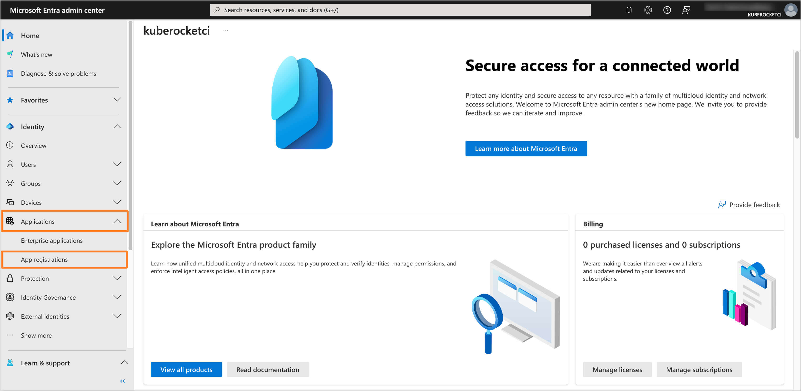

3. Click on the **New registration** button:

    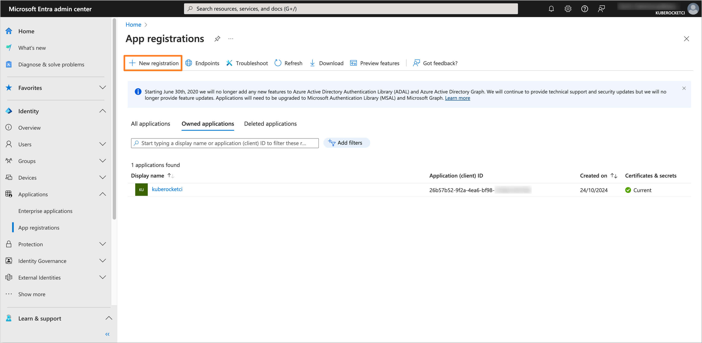

4. Fill in the required fields, such as **Name**, **Supported account types** and **Redirect URI**. Click **Register** to create the application:

    :::note
    The **Redirect URI** should be in the format `https://<Harbor URL>/c/oidc/callback`.
    :::

    

5. Navigate to the **Certificates & secrets** section from the left sidebar menu. In the **Client secrets** tab, click on the **New client secret** button to create a new secret. Fill in the required fields and click **Add**:

    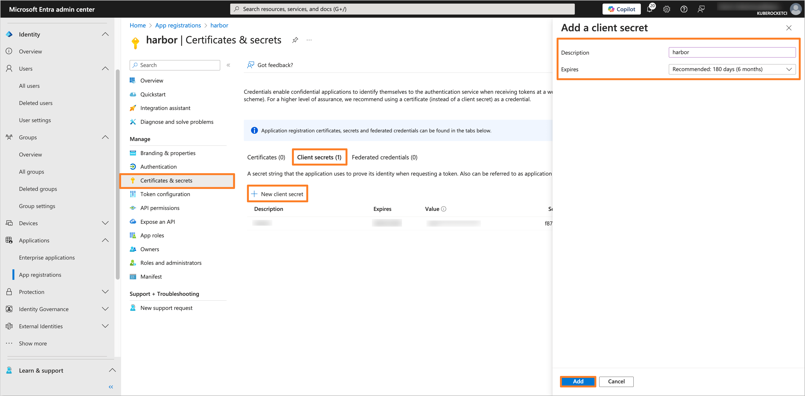

6. Copy the generated Client secret value and store it securely:

    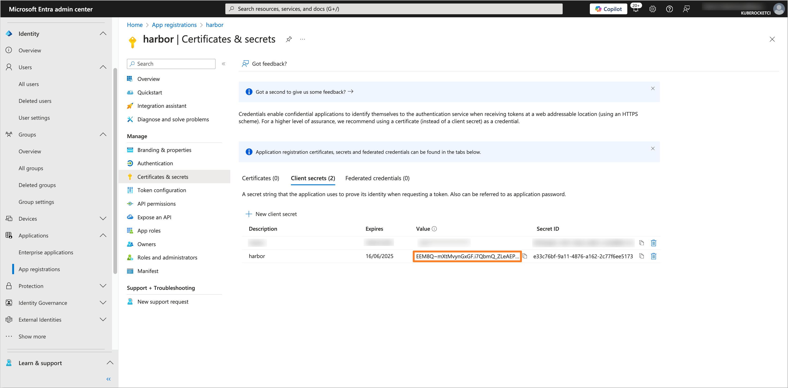

7. Navigate to the **Token configuration** section and click on **Add groups claim** button. Choose the group type as **Security Groups** and for the ID token type, select **Group ID**:

    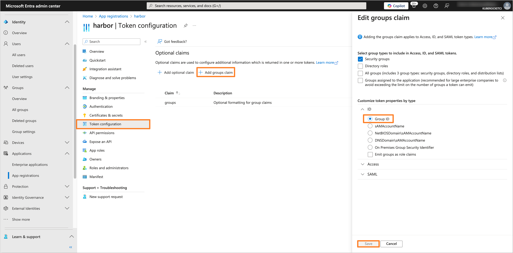

8. Navigate to the **API permissions** section. Click on the **Add a permission** button. Select **Microsoft Graph** and then **Delegated permissions**. Add the following permissions:

    - **email**
    - **openid**
    - **profile**
    - **User.Read**

    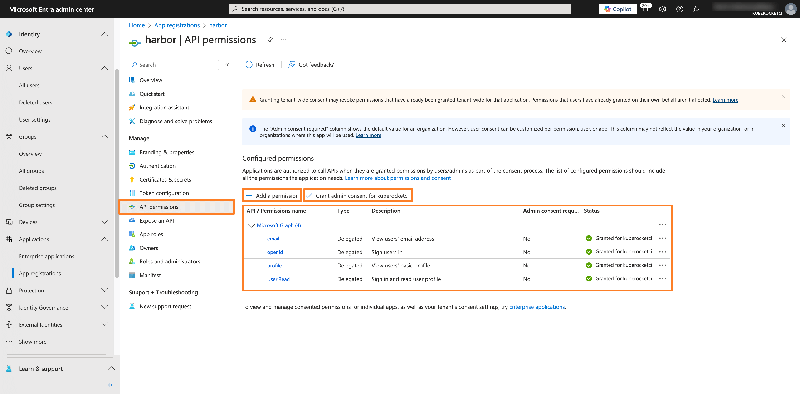

    After adding the permissions, click on the **Grant admin consent for 'Tenant name'** button to grant the required permissions.

After configuring the Microsoft Entra Application, you can proceed with the Harbor configuration.

## Creating the Groups

To manage access to Harbor, it is necessary to create the groups in Microsoft Entra and assign users to it.

1. In the Microsoft Entra Admin Center, in the left sidebar menu, select **Groups** and then **All groups**. Click on **New group** button to create a new group(s) for users who will have access to Harbor (e.g., `administrator`):

    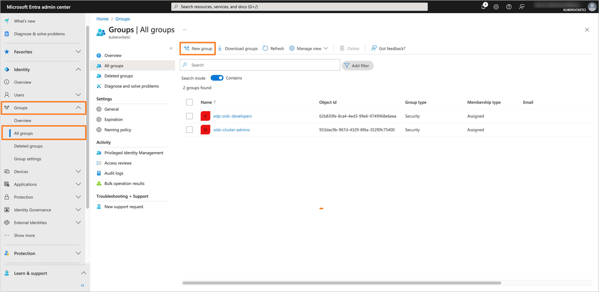

2. Fill in the required fields, such as **Groups type** and **Group name**. In the **Members** section, add users who will have access to SonarQube:

    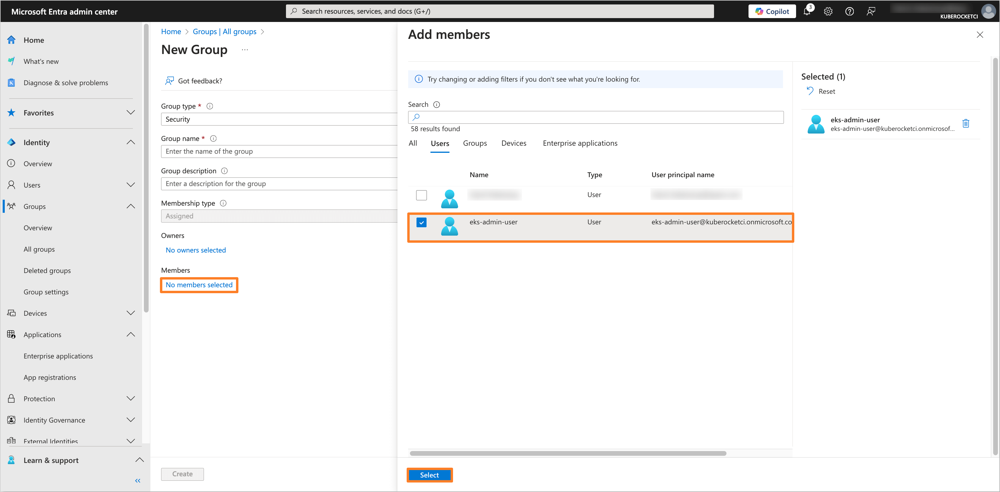

3. After adding the necessary members, review the group settings and click **Create** to save the group.

## Configuring Harbor

To integrate Harbor with the configured Microsoft Entra application, it is necessary to configure the OIDC parameters directly in Harbor.

:::note
The Application data, such as **Application (client) ID** and **Directory (tenant) ID**, can be found in the **Overview** section of the Application in the Microsoft Entra Admin Center.
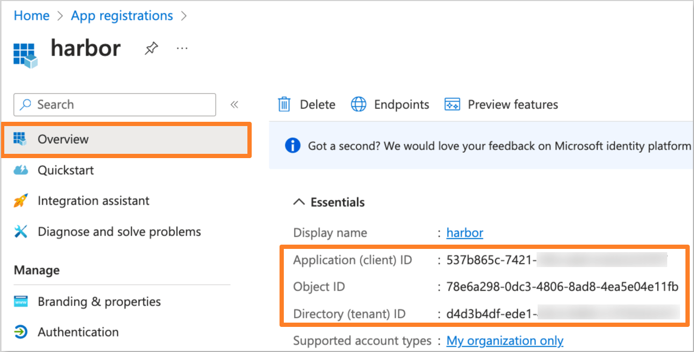
:::

:::note
The **Object ID** can be found in the **Overview** section of the group in the Microsoft Entra Admin Center.
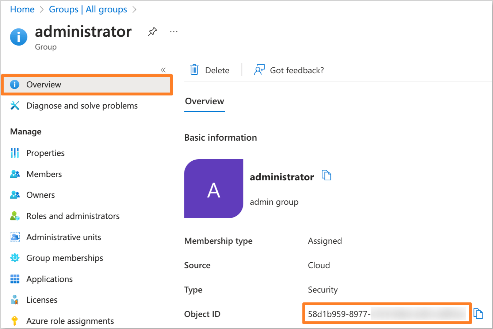
:::

1. Log in to the Harbor web interface as an administrator.

2. In the left sidebar menu, navigate to **Administration** tab and click on **Configuration** section. In the **Authentication** tab, fill in the required fields for the OIDC configuration:

    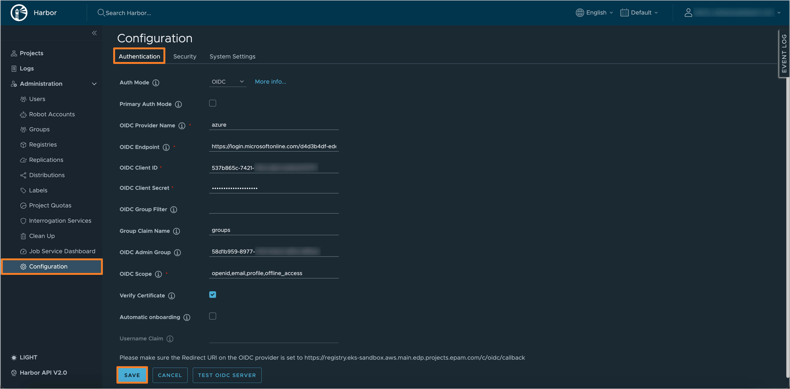

    Replace the following values with the data from the Microsoft Entra Application:
    - OIDC Provider Name: `azure`
    - OIDC Endpoint: `https://login.microsoftonline.com/<Directory (tenant) ID>/v2.0`, where `<Directory (tenant) ID>` is the Directory ID of your Microsoft Entra Tenant.
    - OIDC Client ID: The Application (client) ID of your Microsoft Entra Application.
    - OIDC Client Secret: The Client Secret value from the Microsoft Entra Application.
    - Group Claim Name: `groups`
    - OIDC Admin Group: The **Object ID** of the `administrator` group from the Microsoft Entra Admin Center.
    - OIDC Scope: `openid,profile,email,offline_access`

3. Click on the **Test OIDC Server** button to verify the configuration. If the test is successful, click on the **Save** button to apply the changes.

4. Verify that the OIDC authentication is configured correctly by logging in to the Harbor web interface using the **Login via OIDC Provider** button:

    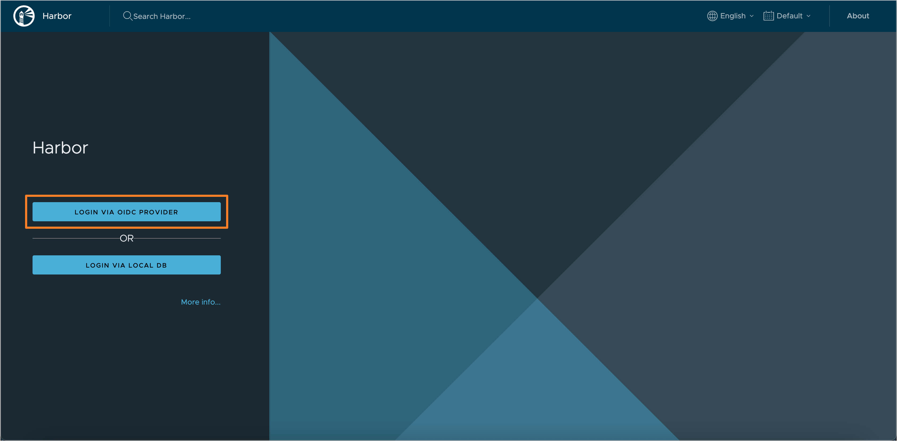

After completing these steps, Harbor is configured to use Microsoft Entra as the Identity Provider for OIDC authentication.

## Related Articles

- [OpenID Connect (OIDC) Authentication Overview](./oidc-authentication-overview.md)
