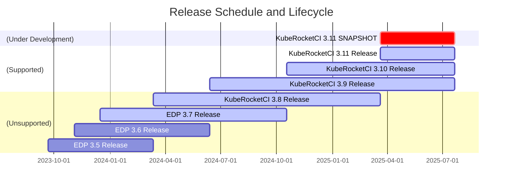

---

title: "Supported Versions and Compatibility"
description: "Details on KubeRocketCI's support for its three most recent versions, including a release schedule, lifecycle, and compatibility with EKS and OpenShift versions."
sidebar_label: "Supported Versions"

---
<!-- markdownlint-disable MD025 -->

# Supported Versions and Compatibility

<head>
  <link rel="canonical" href="https://docs.kuberocketci.io/docs/supported-versions" />
</head>

At the KubeRocketCI, our commitment to providing a robust and reliable service involves supporting the latest innovations while ensuring stability and security. To maintain this balance, we focus our active **support on our platform's three most** recent versions.
This approach allows us to dedicate our resources to delivering cutting-edge features, enhancing performance, and fortifying security measures while ensuring a consistent and optimized user experience across the platform.

By concentrating our support on the last three versions, we prioritize staying current with evolving technology landscapes. This enables us to swiftly adapt to advancements in Kubernetes and OpenShift environments, incorporating the latest enhancements, fixes, and optimizations into our platform.

This support model not only fosters innovation but also enables us to deliver a secure, high-performing, and dependable KubeRocketCI that meets the dynamic needs of our users and exceeds expectations for reliability and functionality.

Get acquainted with the list of the latest releases and component versions on which the platform is tested and verified:

:::tip Professional Services
  You can leverage our [professional services](/pricing) to upgrade your platform to the latest version or perform migration from Unsupported to Supported versions.
:::

|[Release Version](https://github.com/epam/edp-install/blob/master/RELEASES.md)|Release Date|[EKS Version](https://aws.amazon.com/eks/)|[OpenShift Version](https://github.com/okd-project/okd/releases)|
|:-:|:-:|:-:|:-:|
|3.11 |Mar 21, 2025|1.29+||
|3.10 |Oct 18, 2024|1.26+|4.12|
|3.9 |Jun 13, 2024|1.26+|4.12|
|3.8  |Mar 12, 2024|1.26+|4.12|
|3.7  |Dec 15, 2023|1.26+|4.12|
|3.6  |Nov 03, 2023|1.26+|4.12|
|3.5  |Sep 21, 2023|1.26+|4.12|
