---

title: "Scaffold and Deploy FastAPI Application"
description: "Learn how to scaffold and deploy a FastAPI application using KubeRocketCI, from setting up your development environment to deploying with GitOps."
sidebar_label: "Scaffold and Deploy FastAPI Application"

---
<!-- markdownlint-disable MD025 -->

# Scaffold and Deploy FastAPI Application

<head>
  <link rel="canonical" href="https://docs.kuberocketci.io/docs/use-cases/application-scaffolding" />
</head>

This use case outlines the process of creating and deploying a FastAPI application using KubeRocketCI.
The purpose is to provide developers with a streamlined approach to generate a functional code structure for a FastAPI web application, including basic read functionality. The process also allows for customization to meet specific requirements and deployment to a development environment. By utilizing a standardized process for code review, testing, and deployment, developers can save time and effort while ensuring high code quality and reliability.
The goal is to empower the development team to release new features and applications more efficiently, while maintaining a high level of code quality and reliability.
The KubeRocketCI is used to facilitate this process.

<div style={{ display: 'flex', justifyContent: 'center' }}>
<iframe width="560" height="315" src="https://www.youtube.com/embed/TcPcIKYvKFo" title="YouTube video player" frameborder="0" allow="accelerometer; autoplay; clipboard-write; encrypted-media; gyroscope; picture-in-picture" allowfullscreen="allowfullscreen"></iframe>
</div>

### Roles

This documentation is tailored for the Developers and Team Leads.

### Goals

- Create a new FastAPI application quickly.
- Deploy the initial code to the DEV environment.
- Check CI pipelines.
- Delivery update using the GitOps approach.

### Preconditions

- KubeRocketCI instance is [configured](../operator-guide/prerequisites.md) with [GitOps](../user-guide/gitops.md) repo.
- Developer has access to the KubeRocketCI instances using the Single-Sign-On approach.
- Developer has merge permissions in the [GitOps](../user-guide/gitops.md) repository on GitHub.

## Scenario

To scaffold and deploy FastAPI Application, follow the steps below.

### Scaffold the New FastAPI Application

1. Log in to the KubeRocketCI portal:

    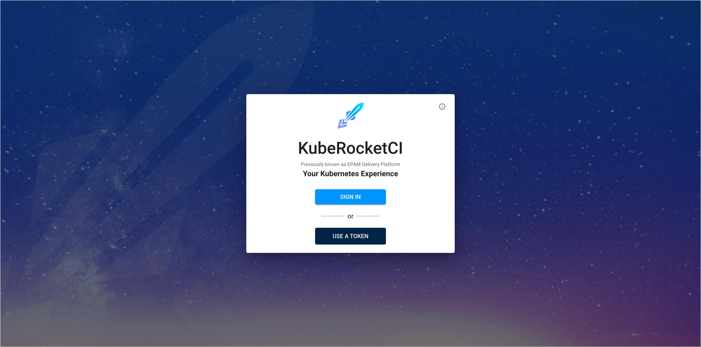

2. Navigate to the user's **Account settings** tab:

    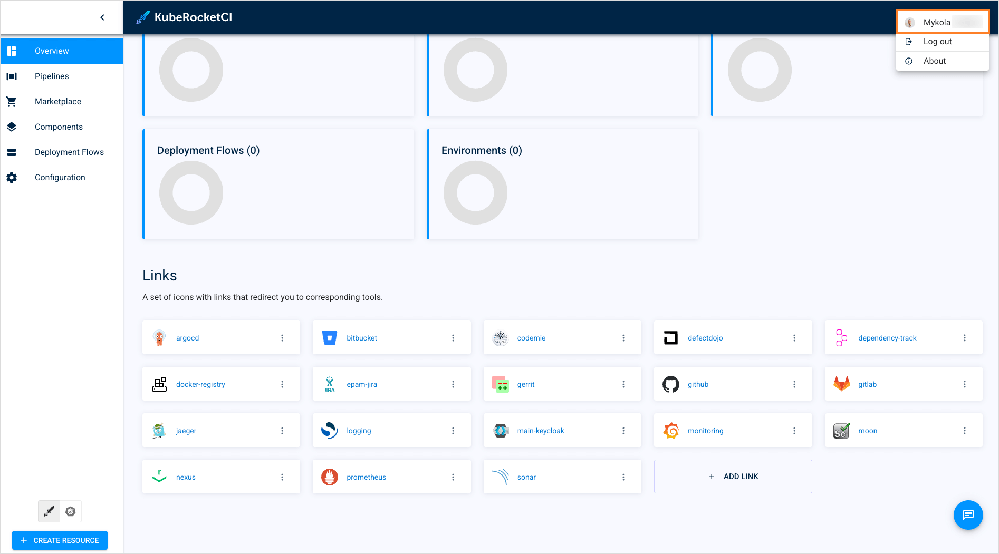

3. Ensure the `Namespace` value points to the namespace with the KubeRocketCI installation:

    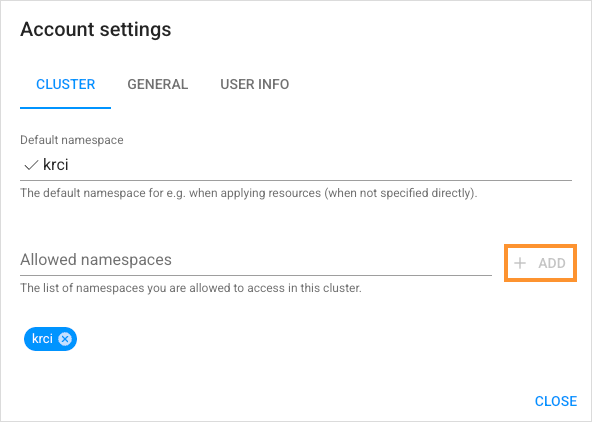

    :::note
    Don't forget to click the **+ Add** button to add the namespace to the allowed namespaces list.
    :::

4. Create a new Codebase with the `Application` type using the `Create from template` strategy. Select the **Components** section and click **+ Create component**:

    

5. Choose the `Application` Codebase type as we intend to deliver our application as a container and deploy it within the Kubernetes cluster. Click the **Next** button:

    

6. Opt for the **Create from template** strategy to scaffold our application from the template provided by the KubeRocketCI and click **Create**:

    

7. On the **Add component info** tab, define the following values and click **Next**:

    - Git server: `github`
    - Repository name: `{github_account_name}/fastapi-demo`
    - Component name: `fastapi-demo`
    - Description: `fastapi-demo`
    - Application code language: `Python`
    - Language version/framework: `FastAPI`
    - Build tool: `Python`

    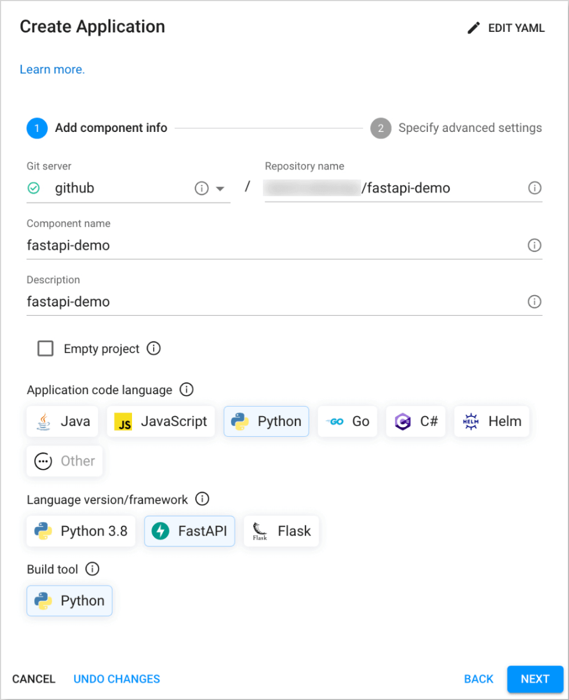

8. On the **Specify advanced settings** tab, define the values and click **Create**:

    - Default branch: `main`
    - Deployment Options: `helm-chart`
    - Codebase versioning type: `edp`
    - Start version from: `0.1.0` and `SNAPSHOT`

    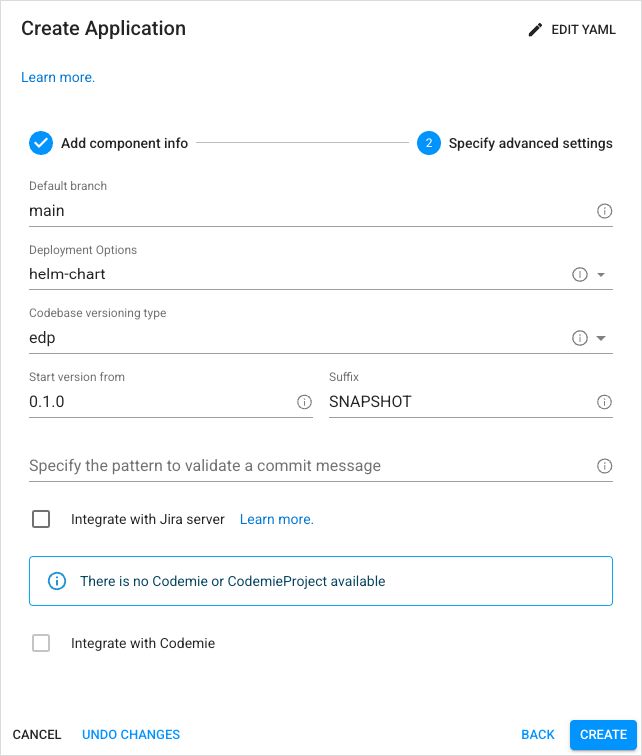

9. Check the application status. It should be green:

    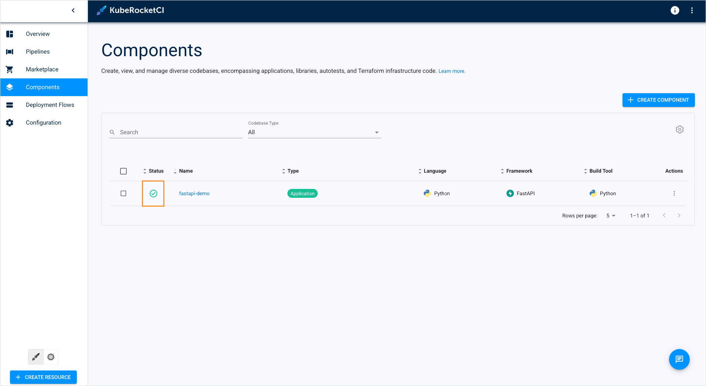

### Deploy Application to the Development Environment

This section outlines the approach for deploying the application from the latest commit on the `main` branch. The following steps are involved:

1. Build the initial version of the application from the last commit on the `main` branch. This version is generated from the provided template.

2. Set up a deployment flow to enable continuous delivery to the development environment.

3. Deploy the initial version of the application to the development environment.

To succeed with the steps above, follow the instructions below:

1. Build Container from the latest branch commit. To build the initial version of the application's `main` branch, go to the **Components** -> **fastapi-demo** -> **Branches** -> **main** and click the **Build** button:

    

2. Build pipeline for the `fastapi-demo` application starts:

    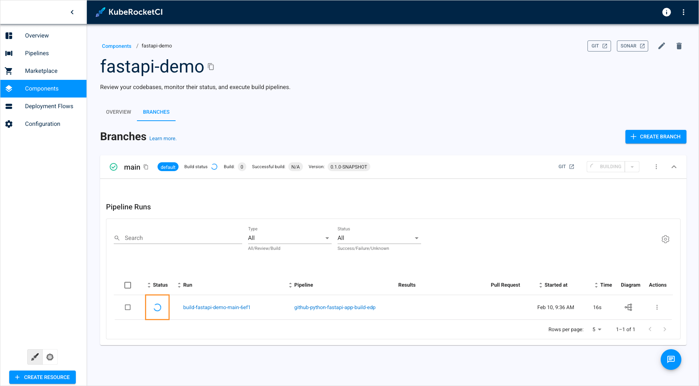

3. Track Pipeline's status by clicking the **build-fastapi-demo-main-6ef1** pipeline link.

    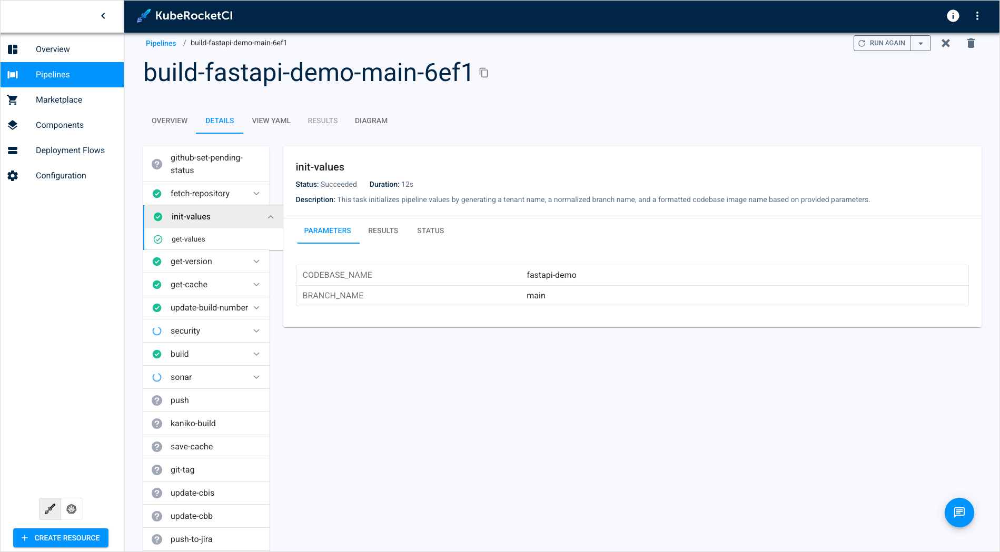

4. Ensure that Build Pipeline was successfully completed.

5. To enable application deployment create a Deployment Flow with a single environment - Development (with the name `dev`).

    :::note
    To utilize and manage various environments through the KubeRocketCI platform, the initial step is to onboard a new GitOps repository.
    :::

6. Navigate to the **Deployment Flows** tab and click the corresponding button to create new GitOps repository:

    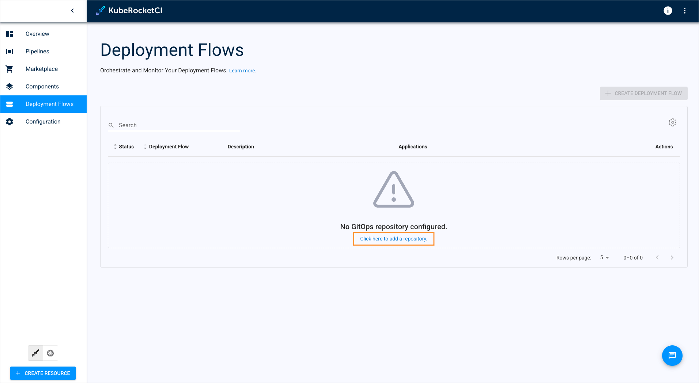

7. Click to the **+ Add GitOps repository**:

    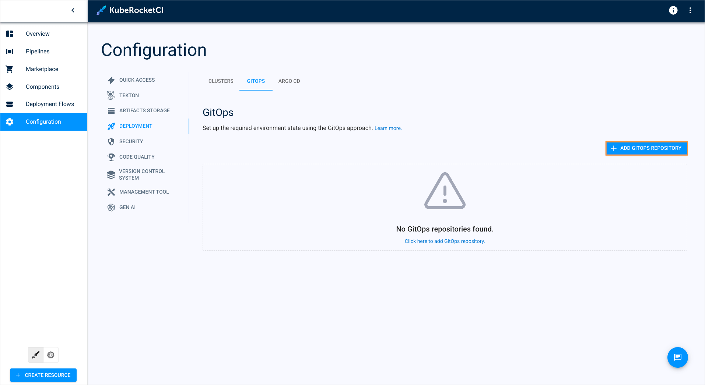

8. Select the `Create` strategy and `github` server, enter GitHub account name and click **Save**:

    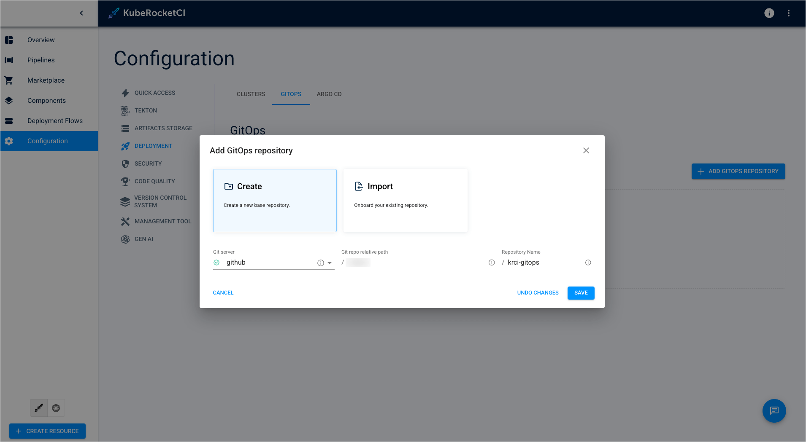

9. In the KubeRocketCI portal, navigate to **Deployment FLows** tab and click the **+ Create deployment flow** button to create pipeline:

    

10. In the **Create deployment flow** dialog, fill in the required fields:

    - **Enter name**:

      - Pipeline name: `mypipe`
      - Description: `Deployment flow for fasapi application`

      

    - **Add applications**:

      - Applications: Add `fastapi-demo` application
      - Branch: Select `main` branch
      - Promote applications: Leave unchecked

      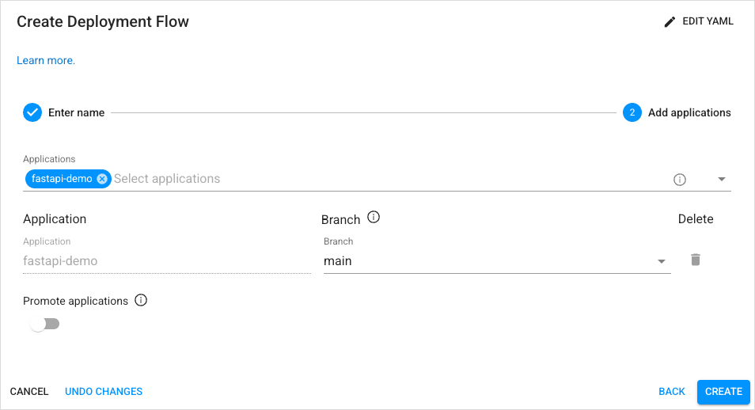

11. Now click the `Go to deployment flow` button to continue creating the environment:

    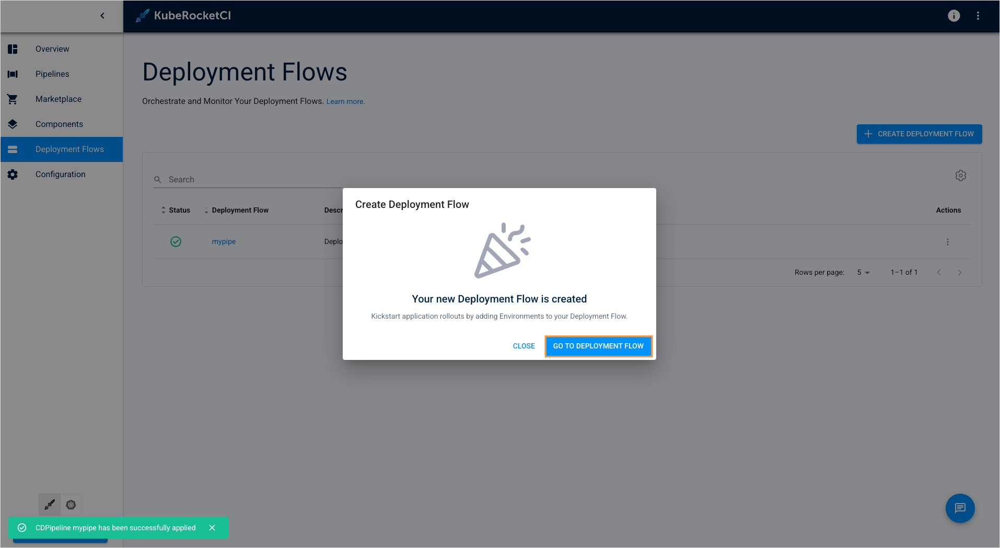

12. In the Deployment Flow details page, click the **+ Create environment** button to create new environment and fill in the required fields:

    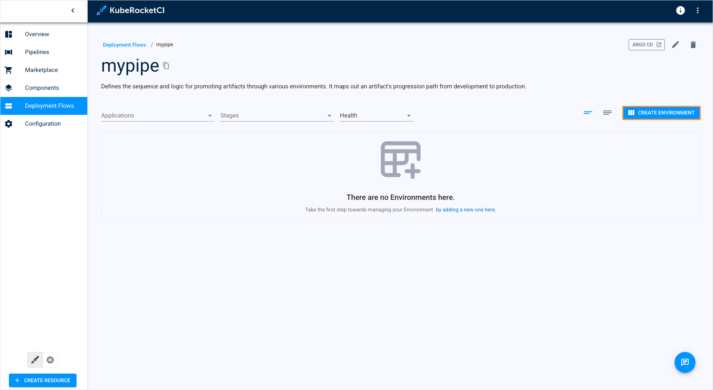

      - Cluster: `in-cluster`
      - Environment name: `dev`
      - Description: `Development Environment`
      - Trigger type: `Manual`
      - Deploy Pipeline template: `deploy`
      - Clean Pipeline template: `clean`
      - Quality gate type: `Manual`

      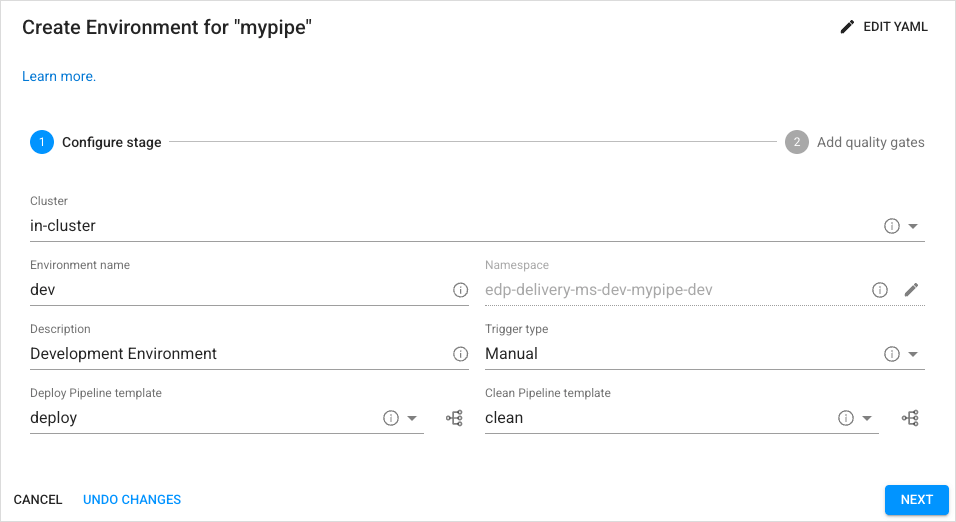

      As soon as the values is defined, click the **Create** button.

13. Deploy the initial version of the application to the development environment:

    - Open deployment flow with the name `mypipe`.
    - Select the `dev` environment from the **Environment** tab.
    - Click the **Configure deploy** button.
    - In the **Select image tag** field select version `0.1.0-SNAPSHOT.1` and click the **Start deploy** button.

    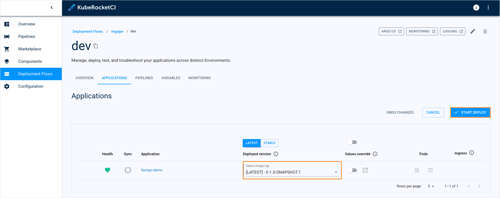

### Check the Application Status

To ensure the application is deployed successfully, follow the steps below:

1. Ensure application status is `Healthy` and `Synced`, and the `Deployed version` points to `0.1.0-SNAPSHOT.1`:

    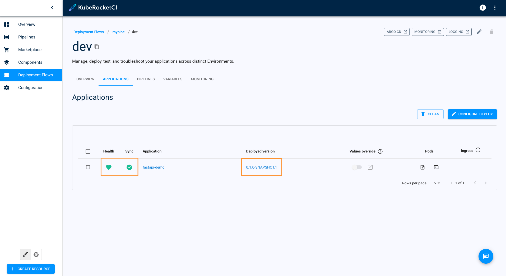

2. Check that the selected version of the container is deployed on the `dev` environment. `${KRCI_ENV}` - is the KRCI namespace name:

    ```bash
    # Check the deployment status of fastapi-demo application
    $ kubectl get deployments -n ${KRCI_ENV}-mypipe-dev
    NAME           READY   UP-TO-DATE   AVAILABLE   AGE
    fastapi-demo   1/1     1            1           14m
    ```

### Deliver New Code

This section describes the code delivery process. We need to deploy our `fastapi-demo` application that deploys `Ingress` object to expose API outside the Kubernetes cluster.

Within the [GitOps](../user-guide/gitops.md) repository, follow the naming convention `<deployment-flow>/<environment>/<application-name>-values.yaml` to create the chart values file. For our case, use `mypipe/dev/fastapi-demo-values.yaml` as the file name. To deploy application with custom application Helm chart values, follow he steps below:

1. Commit `mypipe/dev/fastapi-demo-values.yaml` file to the default branch of the GitOps repository:

  ```yaml title="mypipe/dev/fastapi-demo-values.yaml"
  ingress:
    enabled: true
  ```

2. Deploy the `fastapi-demo` application to the environment. Before the new version deployment, check the ingress object in `dev` environment:

    ```bash
    $ kubectl get ingress -n ${KRCI_ENV}-mypipe-dev
    No resources found in ${KRCI_ENV}-mypipe-dev namespace.
    ```

    No ingress object exists as expected.

3. Deploy the `fastapi-demo` application which has the ingress object in place. Since we use `Manual` deployment approach, we perform version upgrade manually:

    To ensure our application recognizes the changes in the GitOps repository related to enabling the creation of the `Ingress` resource, we need to set the **Override values** checkbox to `true` before deploying.

    - Go to the **Environments** section of the KubeRocketCI portal, select `mypipe` and choose **dev** stage.
    - In the **Select image tag** section select the version `0.1.0-SNAPSHOT.1`.
    - Set the **Values override** checkbox to `true` and click the **Start deploy** button.
    - Check that the application is deployed and application status is `Healthy` and `Synced`.

    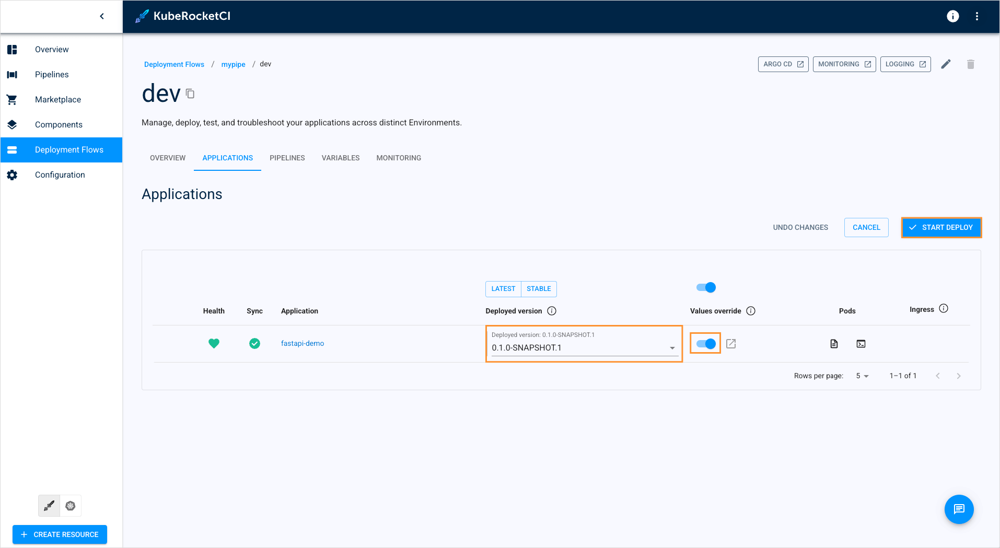

4. Check that the new version with Ingress is deployed:

    ```bash
    # Check Ingress object
    kubectl get ingress -n ${KRCI_ENV}-mypipe-dev
    NAME           CLASS    HOSTS                                     ADDRESS          PORTS   AGE
    fastapi-demo   <none>   fastapi-demo-ko1zs-example.com         10.100.182.134        80    14m

    # Check application external URL
    curl https://your-hostname-appeared-in-hosts-column-above.example.com
    {"Hello":"World"}
    ```

## Related Articles

- [Use Cases](./index.md)
- [Autotest as a Quality Gate](./autotest-as-quality-gate.md)
- [Create and Use Custom Tekton Pipelines](./custom-pipelines-flow.md)
