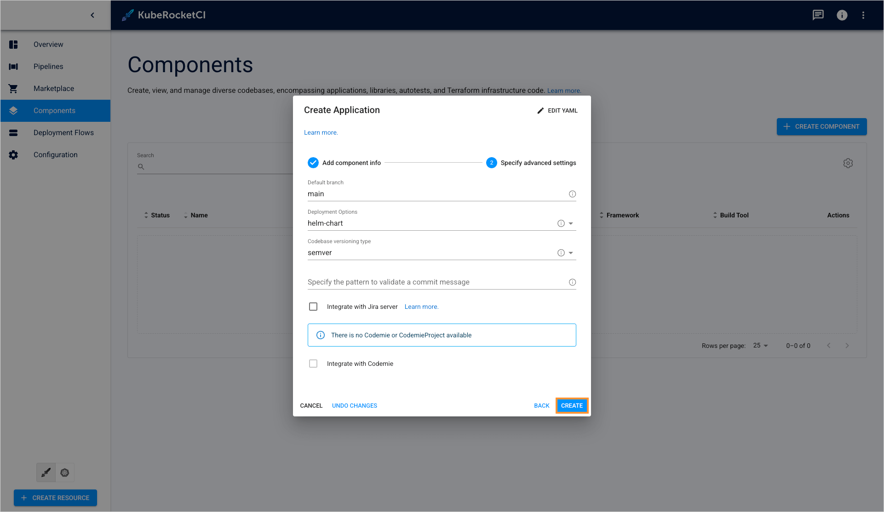

---

title: "Autotest as a Quality Gate"
description: "Explore how to integrate autotests as quality gates in CD pipelines with KubeRocketCI to ensure only stable and functional application versions are promoted."
sidebar_label: "Autotest as a Quality Gate"

---

<!-- markdownlint-disable MD025 -->

# Autotest as a Quality Gate

<head>
  <link rel="canonical" href="https://docs.kuberocketci.io/docs/use-cases/autotest-as-quality-gate" />
</head>

This use case outlines the process of integrating an autotest as a quality gate into a newly created CD pipeline. The CD pipeline includes a selected build version of an application that needs to be promoted. The purpose of incorporating autotests is to ensure that the application meets predefined criteria for stability and functionality, guaranteeing that only reliable versions are promoted. By implementing this feature, users can perform comprehensive testing, thereby enhancing the overall stability of the application.

In the KubeRocketCI platform, users can seamlessly add autotests as quality gates to their CD pipelines, enabling them to validate the application's stability and functionality before promoting it to the next stage. This ensures that only reliable versions of the application are deployed, improving the overall quality and reliability of the software.

<iframe width="560" height="315" src="https://www.youtube.com/embed/ytaO-ZaQb0c" title="KubeRocketCI: Autotests Overview" frameborder="0" allow="accelerometer; autoplay; clipboard-write; encrypted-media; gyroscope; picture-in-picture" allowfullscreen="allowfullscreen"></iframe>

## Roles

This documentation is tailored for the Developers and Quality Assurance specialists.

## Goals

- Create several applications and autotests quickly.
- Create a pipeline for Continuous Deployment.
- Perform testing.
- Update delivery by deploying the new version.

## Preconditions

- KubeRocketCI instance is [configured](../operator-guide/prerequisites.md) with GitHub, Tekton and [Argo CD](../operator-guide/cd/argocd-integration.md).
- Developer has access to the platform using the Single-Sign-On approach.
- Developer has the **Administrator** role (to perform merge in GitHub).

### Create Applications

To implement autotests as Quality Gates, follow the steps below:

1. Ensure the namespace is specified in the cluster settings. Click the **Settings** icon in the top right corner and select **Cluster settings**:

    

2. Enter the name of the default namespace, then enter your default namespace in the **Allowed namespaces** field and click the **+ ADD** button. You can also add other namespaces to the **Allowed namespaces**:

    

3. Create several applications using the **Create** strategy. Navigate to the **Components** tab and click the **+ CREATE COMPONENT** button:

    

4. Select **Application** and click **Next**:

    

5. Select **Create from template** and click **Create**:

    

    :::note
      Please refer to the [Add Application](../user-guide/add-application.md) section for details.
    :::

6. On the **Codebase info** tab, define the following values and press the **Next** button:

    - Git server: `github`
    - Repository name: `<github_account_name>/js-application`
    - Component name: `js-application`
    - Description: `js application`
    - Application code language: `JavaScript`
    - Language version/Provider: `Vue`
    - Build tool: `NPM`

    

7. On the **Advanced settings** tab, define the below values and push the **Create** button:

    - Default branch: `main`
    - Codebase versioning type: `semver`

    

8. Repeat the procedure twice to create the **go-application** and **python-application** applications. These applications will have the following parameters:

    go-application:
    - Git server: `github`
    - Repository name: `<github_account_name>/go-application`
    - Component name: `go-application`
    - Description: `go application`
    - Application code language: `Go`
    - Language version/Provider: `Gin`
    - Build tool: `Go`
    - Default branch: `main`
    - Codebase versioning type: `semver`

    python-application:
    - Git server: `github`
    - Repository name: `<github_account_name>/python-application`
    - Component name: `python-application`
    - Description: `python application`
    - Application code language: `Python`
    - Language version/Provider: `FastAPI`
    - Build tool: `Python`
    - Default branch: `main`
    - Codebase versioning type: `semver`

9. In the **Components** tab, click one of the applications name to enter the application menu:

    

10. Click the **Trigger build pipeline run** button:

    

11. Click the application run name to watch the building logs:

    

12. On the pipeline details page, you can find information about each step, pipeline status, view logs.

    

13. Wait till the build is successful:

    

14. Repeat steps 9-13 for the rest of the applications.

### Create Autotests

The steps below instruct how to create autotests in KubeRocketCI:

1. Create a couple of autotests using the **Clone** strategy. Navigate to the **Components** tab, click on the **+CREATE COMPONENT** button. Select **Autotest** and click **Next**:

    

    :::note
      Please refer to the [Add Autotest](../user-guide/add-autotest.md) section for details.
    :::

2. Select **Clone project** and click **Create**:

    

3. On the **Codebase info** tab, define the following values and press the **Proceed** button:

    - Repository URL: `https://github.com/SergK/autotests.git`
    - Git server: `github`
    - Repository name: `<github_account_name>/demo-autotest-gradle`
    - Component name: `demo-autotest-gradle`
    - Description: `demo-autotest-gradle`
    - Autotest code language: `Java`
    - Language version/framework: `Java11`
    - Build tool: `Gradle`
    - Autotest report framework: `Allure`

    

4. On the **Advanced settings** tab define the below values and push the **Create** button:

    - Default branch: `main`
    - Codebase versioning type: `semver`

    

5. Repeat the steps 1-4 to create one more autotest with the parameters below:

    - Repository URL: `https://github.com/Rolika4/autotests.git`
    - Git server: `github`
    - Repository name: `<github_account_name>/demo-autotest-maven`
    - Component name: `demo-autotest-maven`
    - Description: `demo-autotest-maven`
    - Autotest code language: `Java`
    - Language version/framework: `Java11`
    - Build tool: `Maven`
    - Autotest report framework: `Allure`
    - Default branch: `main`
    - Codebase versioning type: `semver`

### Create CD Pipeline

Now that applications and autotests are created, create pipeline for them by following the steps below:

:::note
  To utilize and manage various environments through the KubeRocketCI platform, the initial step is to onboard a new GitOps repository.
:::

1. Navigate to the **Environments** tab and click the corresponding button to create new GitOps repository:

    

2. Click to the **ADD GITOPS REPOSITORY**:

    

3. Select the `github` server, enter GitHub account name and click **SAVE**:

    

4. Return to the **Environments** tab and click **CREATE ENVIRONMENT** button:

    

5. Enter `demo-pipeline` and click the **NEXT** button:

    

6. On the **Applications** tab, add all the three applications, specify the **main** branch for all for them and check **Promote in pipeline**:

    

7. Once all the steps have been completed, you may begin creating stages.

    

8. On the **Stages** menu click to the **CREATE STAGE** button:

    

9. In the **Create stage** menu, define the following values and click **NEXT**:

    - Cluster: `In cluster`
    - Stage name: `dev`
    - Description: `dev`
    - Trigger type: `Manual`
    - Pipeline template: `deploy-with-autotests`

    

10. In the **Add quality gates** menu click **+** button. Specify the following parameters and click **Create**:

    First Quality Gate:

    - Quality gate type: `Autotest`
    - Step name: `Autotest`
    - Autotest: `demo-autotest-gradle`
    - Autotest branch: `main`

    Second Quality Gate:

    - Quality gate type: `Autotest`
    - Step name: `Autotest`
    - Autotest: `demo-autotest-maven`
    - Autotest branch: `main`

    

11. Repeat the steps 8-10 to create one more stage with the parameters below:

    - Cluster: `In cluster`
    - Stage name: `sit`
    - Description: `sit`
    - Trigger type: `manual`
    - Pipeline template: `deploy`
    - Quality gate type: `Manual`

### Run Autotests

After the CD pipeline is created, deploy applications and run autotests by following the steps below:

1. Click the **dev** stage name to expand its details:

    

2. Navigate **Applications** and click **CONFIGURE DEPLOY**. Then select latest versions of all applications and click **START DEPLOY**.

    

3. To find information about running deploy pipeline navigate **PIPELINES** and click on pipeline name:

    

4. Once promotion procedure is finished, the promoted applications will become available in the **Sit** stage. You will be able to select image stream versions for the promoted applications:

    

## Related Articles

- [Add Application](../user-guide/add-application.md)
- [Add Autotest](../user-guide/add-autotest.md)
- [Add CD Pipeline](../user-guide/add-cd-pipeline.md)
- [Add Quality Gate](../user-guide/add-quality-gate.md)
