---

title: "Create and Use Custom Tekton Pipelines"
description: "Learn how to create and integrate custom Tekton pipelines in KubeRocketCI to meet unique project requirements, enhancing flexibility and efficiency in development workflows."
sidebar_label: "Create and Use Custom Tekton Pipelines"

---

<!-- markdownlint-disable MD025 -->

# Create and Use Custom Tekton Pipelines

<head>
  <link rel="canonical" href="https://docs.kuberocketci.io/docs/use-cases/custom-pipelines-flow" />
</head>

This use case explains how to create and use custom Tekton pipelines on the KubeRocketCI Platform. While KubeRocketCI offers pre-configured Tekton pipelines for common use cases, custom pipelines allow you to adapt workflows to meet unique project requirements.
It also provides guidance on integrating and using these custom Tekton pipelines within your development processes.

## Goals

- Provide a clear method for creating and configuring custom Tekton tasks and pipelines for build, review, deployment, and clean processes within KubeRocketCI.
- Offer a detailed guide on integrating custom pipelines with the KubeRocketCI platform, ensuring seamless connection and functionality.
- Clarify the process for replacing existing build, review, deployment, and clean pipelines with custom pipelines, highlighting necessary steps and considerations.
- Demonstrate the benefits of using custom Tekton pipelines in KubeRocketCI, such as improved flexibility, scalability, and efficiency in development workflows.

## Prerequisites

Before proceeding with this use case, ensure the following prerequisites are met:

- Access to a KubeRocketCI instance with permissions to create and edit **Components** and **Environments**.
- A configured KubeRocketCI instance with at least one active [Git Server](../user-guide/add-git-server.md) (e.g., GitHub, GitLab or Bitbucket).
- Configured Argo CD instance with the [Add-ons repository](../operator-guide/add-ons-overview.md) added.

## Scenario

- Create a Tekton library in KubeRocketCI for storing and managing custom Tekton resources.
- Define custom Tekton pipelines for build, review, deployment, or clean processes based on specific project requirements.
- Integrate custom Tekton pipelines with the KubeRocketCI platform to automate build, review, and deployment workflows using Argo CD and the add-ons repository.
- Replace existing build, review, deploy, or clean pipelines with custom pipelines.

### Creating a Tekton Library for Custom Pipelines

The first step in creating and using custom Tekton pipelines is to set up a Tekton library in KubeRocketCI. This library acts as a central repository for storing and managing custom Tekton tasks, pipelines, and trigger templates.

:::note
The Tekton library template can be found in the [helm-helm-pipeline](https://github.com/epmd-edp/helm-helm-pipeline) repository.
:::

To create a Tekton library, follow these steps:

1. Open the KubeRocketCI portal. Use the **Sign-In** option:

    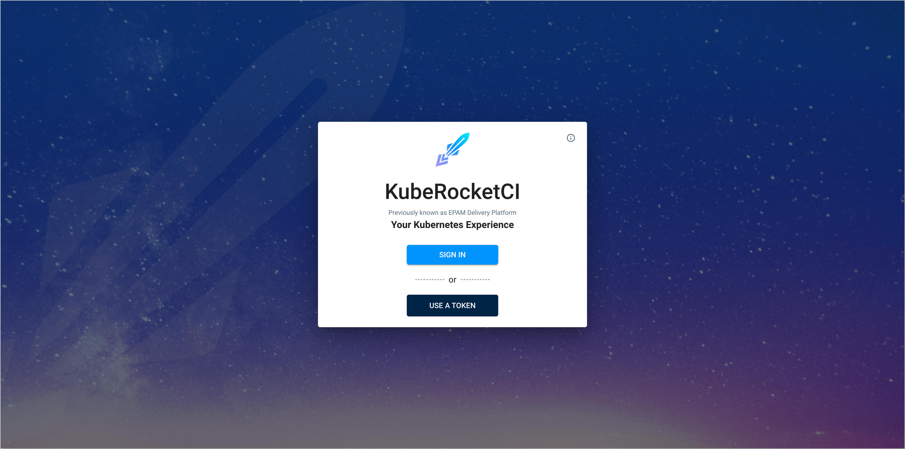

2. In the top-right corner, click the three dots (**⋮**) menu. From the dropdown, select your profile name to access additional options:

    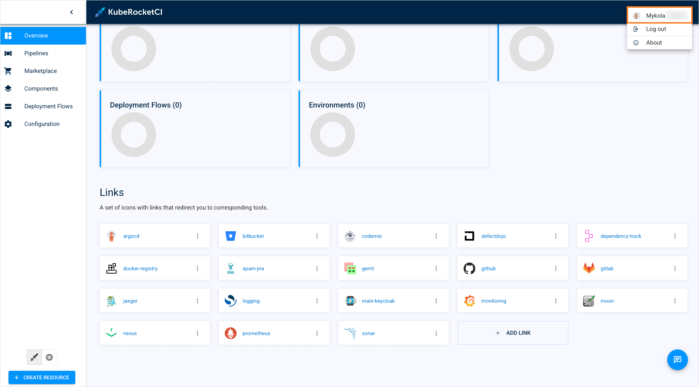

3. Ensure that both `Default namespace` and `Allowed namespaces` are set to the same namespace where you want to create the Tekton library:

    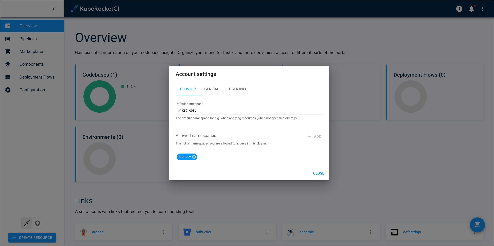

4. Click the `Components` tab in the left-hand navigation menu. Then, click the `Create Component` button. Choose the **Component type** as `Library`:

    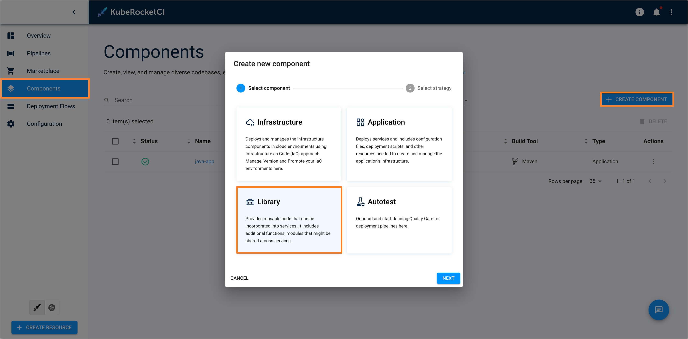

5. Select the **Strategy type** as `Create from template`:

    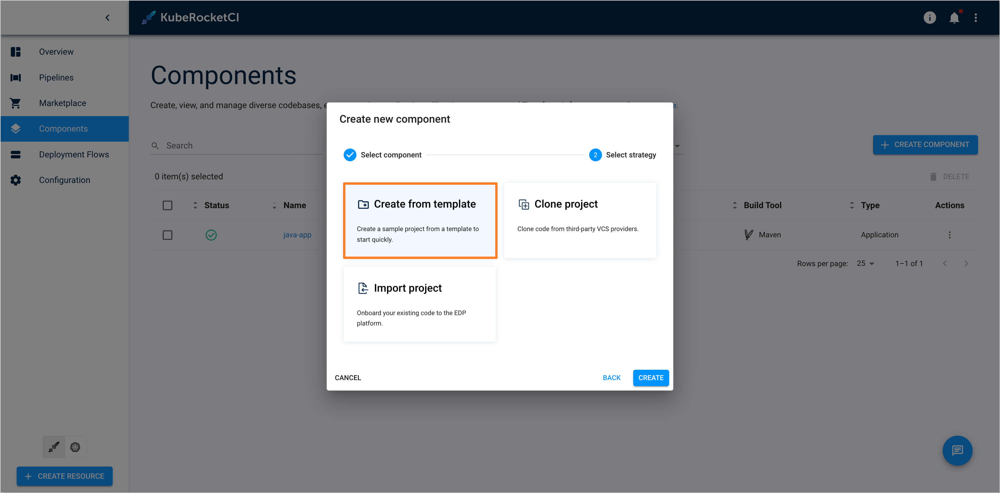

6. In the **Create Library** window, enter the following values:

    - **Repository Name**: `<git-account-name>/tekton-custom-pipelines`
    - **Component name**: `tekton-custom-pipelines`
    - **Description**: `Repository for storing and managing custom Tekton resources`
    - **Library code language**: `Helm`
    - **Language version/framework**: `Pipeline`
    - **Build tool**: `Helm`

    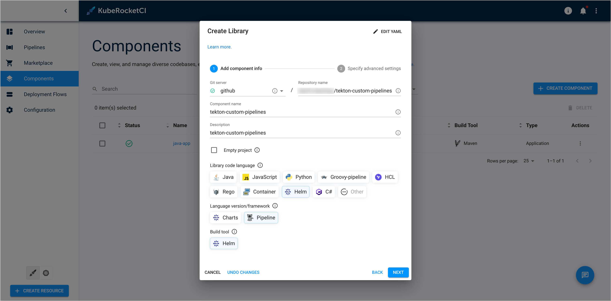

7. In the `Specify Advanced Settings` section, you can leave all fields at their default values. Click the `Create` button to create the Tekton library:

    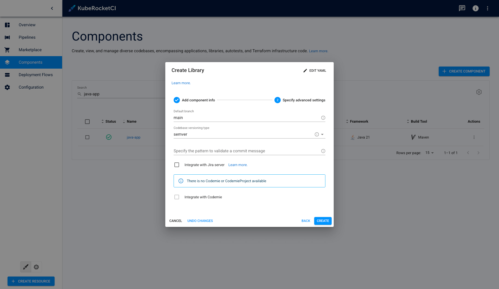

8. Once the library is created, you can start adding custom Tekton tasks, pipelines, and trigger templates to the library.

### Defining Custom Tekton Pipelines

After creating the Tekton library, the next step is to define custom Tekton pipelines for build, review or deployment processes based on your project requirements.

To define custom Tekton pipelines, follow these steps:

1. In the KubeRocketCI portal, navigate to the `Components` tab and select the newly created `tekton-custom-pipelines` library:

    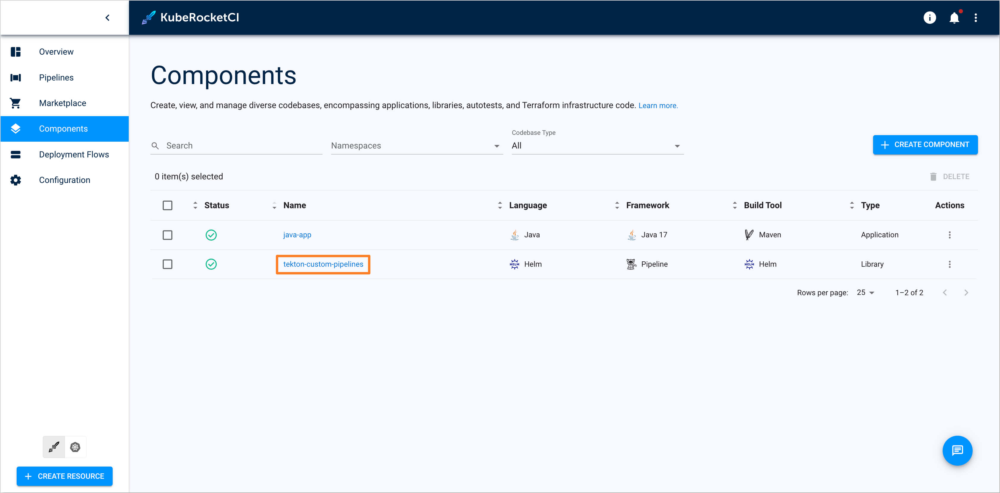

2. In the top-right corner, click the **Git** button to open the Git repository for the `tekton-custom-pipelines` library:

    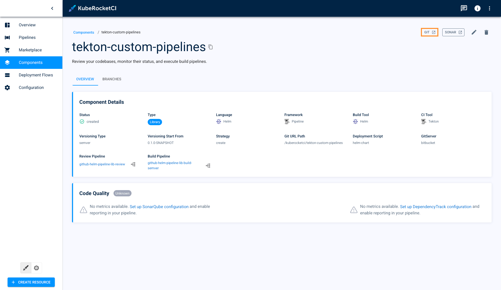

3. Clone the repository to your local machine:

    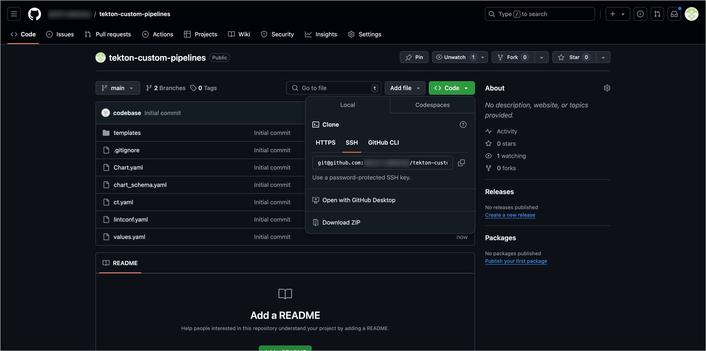

    You can use the following command to clone the repository:

    ```bash
    git clone <git-repo-url>
    ```

4. Examine the repository structure.

    By default, the repository structure looks as follows:

    ```plaintext
    tekton-custom-pipelines
    ├── Chart.yaml
    ├── templates
    │   ├── pipelines
    │   │   ├── deploy
    │   │   │   ├── custom-clean.yaml
    │   │   │   └── custom-deploy.yaml
    │   │   ├── bitbucket-build-default.yaml
    │   │   ├── bitbucket-build-edp.yaml
    │   │   ├── bitbucket-build-lib-default.yaml
    │   │   ├── bitbucket-build-lib-edp.yaml
    │   │   ├── bitbucket-review.yaml
    │   │   ├── gerrit-build-default.yaml
    │   │   ├── gerrit-build-edp.yaml
    │   │   ├── gerrit-build-lib-default.yaml
    │   │   ├── gerrit-build-lib-edp.yaml
    │   │   ├── gerrit-review.yaml
    │   │   ├── github-build-default.yaml
    │   │   ├── github-build-edp.yaml
    │   │   ├── github-build-lib-default.yaml
    │   │   ├── github-build-lib-edp.yaml
    │   │   ├── github-review.yaml
    │   │   ├── gitlab-build-default.yaml
    │   │   ├── gitlab-build-edp.yaml
    │   │   ├── gitlab-build-lib-default.yaml
    │   │   ├── gitlab-build-lib-edp.yaml
    │   │   └── gitlab-review.yaml
    │   ├── resources
    │   │   └── npm-settings.yaml
    │   ├── tasks
    │   │   ├── deploy
    │   │   │   └── hello-world-deploy.yaml
    │   │   └── hello-world.yaml
    │   └── triggers
    │       ├── custom-clean.yaml
    │       └── custom-deploy.yaml
    └── values.yaml
    ```

    - The `templates` directory is a main directory that contains templates for custom Tekton resources. This directory is divided into subdirectories for pipelines, tasks, triggers, and resources.

    - The `templates/pipelines` directory contains Tekton pipeline templates for build and review processes. For each Git server (e.g., GitHub, GitLab, Bitbucket, or Gerrit), there are specific templates, organized by component and versioning type.
      - The appropriate template should be selected based on the configuration of your component. For example:
        - If the component is created in GitHub, has the `Application` component type, and uses `edp` versioning, you should use the `github-build-edp.yaml` template.
        - If the component is created in Bitbucket, has the `Library` component type, and uses the `default` versioning, you should use the `bitbucket-build-lib-default.yaml` template.

        Here is an example illustrating the naming conventions used in template filenames:

        

    - The `templates/pipelines/deploy` directory contains Tekton pipeline templates for deploy and clean processes. Select the appropriate template based on the deployment process requirements.
    - The `templates/tasks` directory contains Tekton task templates for specific tasks that are part of the build, review, or deployment processes.
    - The `templates/triggers` directory contains Tekton trigger templates for triggering the deployment or clean processes.
    - The `templates/resources` directory is intended for various templates, such as config maps and secrets, which can be mounted into custom Tekton tasks as needed.

5. Modify the existing pipeline and task templates or create new ones based on your project requirements.

    **Result**: This step will demonstrate an example of creating custom Tekton resources. After completing this step, you will have a custom Tekton task, pipeline, and trigger template.

    **Usage**: The created custom Tekton resources can be used later for components on the KubeRocketCI platform. This flow serves as an example that can be used when creating your own, specific custom Tekton resources for your project's needs

    Consider the scenario where a custom task `hello-world` needs to be created and used in a custom Tekton pipeline. Follow the steps below to achieve this:

    1. Create a custom Tekton task.

        Create a custom Tekton task called `hello-world` to be used in a custom build pipeline. This task should be created in the `templates/tasks` directory with the name `hello-world.yaml`. The task will accept two parameters: `BASE_IMAGE` and `username`. The `BASE_IMAGE` parameter specifies the base Docker image to be used for the task, while the `username` parameter is used to personalize the task's output.

        Here is an example of the `hello-world.yaml` task template:

        ```yaml
        apiVersion: tekton.dev/v1beta1
        kind: Task
        metadata:
          name: hello-world
          labels:
            {{- include "edp-tekton.labels" . | nindent 4 }}
        spec:
          params:
          - name: BASE_IMAGE
            type: string
            default: "alpine"
            description: "The base Docker image to use for the task"
          - name: username
            type: string
            description: "The username to personalize the task's output"
          workspaces:
            - description: A workspace that contains fetched git repo.
              name: source
          steps:
            - name: hello-world
              image: $(params.BASE_IMAGE)
              workingDir: $(workspaces.source.path)
              script: |
                #!/bin/sh
                echo "Hello $(params.username), the repository contains the following files:"
                ls -al
        ```

    2. Create a Custom Tekton Pipeline.

        Define a custom Tekton pipeline that uses the `hello-world` custom task. Since the application for which this pipeline will be used is located in GitHub, has the component type `Application`, and has the versioning type `edp`,
        use the template `github-build-edp.yaml` in the `templates/pipelines` directory. First, set the parameters in the `spec.params` field that will be used in the custom task:

        ```yaml
        spec:
          params:
            - default: "World"
              description: "Example parameter"
              name: username
              type: string
            - default: 'alpine:3.18.9'
              name: image-version
              type: string
        ```

        Then, in the `spec.tasks` field, after the `get-version` task, describe the custom `hello-world` task. Also, in the subsequent `git-tag` task, specify the `runAfter: hello-world` field to maintain the sequence of execution.

        Here is an example of part of the `github-build-edp.yaml` pipeline template:

        ```yaml
        apiVersion: tekton.dev/v1
        kind: Pipeline
        metadata:
          name: github-build-edp
          labels:
            app.edp.epam.com/pipelinetype: build
        spec:
          tasks:
            ...
            - name: hello-world
              taskRef:
                name: hello-world
              runAfter:
                - get-version
              params:
                - name: BASE_IMAGE
                  value: "$(params.image-version)"
                - name: username
                  value: "$(params.username)"
              workspaces:
                - name: source
                  workspace: shared-workspace
                  subPath: source

            - name: git-tag
              params:
                - name: GIT_USER_EMAIL
                  value: edp-ci@edp.ci-user
                - name: GIT_USER_NAME
                  value: edp-ci
                - name: GIT_SCRIPT
                  value: |
                    git tag -a "$(tasks.get-version.results.VCS_TAG)" -m "Tag is added automatically by CI user"
                    git push --tags
              runAfter:
                - hello-world  # Ensure to update the runAfter field for task that should run after the custom task with the correct task name
              taskRef:
                kind: Task
                name: git-cli
            ...
        ```

    3. Create a Custom Tekton Trigger Template.

        Create a Tekton Trigger Template to invoke the custom `github-build-edp pipeline`. Use the `custom-deploy.yaml` template in the `templates/triggers` directory. Modify the `.spec.resourcetemplates.spec.pipelineRef.name` field to reference the custom pipeline that uses the `hello-world` custom Tekton task, in this case, `custom-deploy`.

        Here is the relevant part of the `custom-deploy.yaml` trigger template:

        ```yaml
        apiVersion: triggers.tekton.dev/v1beta1
        kind: TriggerTemplate
        metadata:
          name: custom-deploy
          labels:
            app.edp.epam.com/pipelinetype: deploy
        ...
        spec:
          resourcetemplates:
            - apiVersion: tekton.dev/v1beta1
              kind: PipelineRun
              ...
              spec:
                pipelineRef:
                  name: custom-deploy
              ...
        ```

    4. Optional: Specify the `dnsWildCard` field in the `values.yaml` file.

        If custom Tekton review pipelines have been created, it is necessary to specify the `dnsWildCard` field in the `values.yaml` file. This field will be used to form the `pipelineUrl` variable, which is utilized in merge and pull requests to navigate to the KubeRocketCI Portal.

        Here is an example of the `values.yaml` file:

        ```yaml
        dnsWildCard: "example.com"
        ```

6. Commit and push the changes to the Git repository.

    After modifying the pipeline and task templates, commit and push the changes to the Git repository. Use the following commands to commit and push the changes:

    ```bash
    git add .
    git commit -m "Add custom task and pipeline templates"
    git push origin main
    ```

### Deliver Custom Tekton Pipelines to the Cluster

To deploy custom pipelines to the cluster, you can use Argo CD, which includes a repository with [add-ons](https://github.com/epam/edp-cluster-add-ons/tree/main).

:::note
Before proceeding, ensure you have added Add-Ons repository and application according to the [Install via Add-Ons](../operator-guide/add-ons-overview.md) page.
:::

To deliver custom Tekton pipelines to the cluster, follow these steps:

1. Clone the private repository with add-ons and make the following changes. In the `clusters/core/apps/values.yaml` file, set the `repoUrl` and `namespace` fields to specify the Git URL of the `tekton-custom-pipelines` repository and the namespace where the KubeRocketCI platform is deployed. Also, set the `kuberocketci-pipelines.enabled` field to `true` to enable the deployment of the `tekton-custom-pipelines` Argo CD Application:

    ```yaml
    kuberocketci-pipelines:
      enable: true
      namespace: <krci-namespace>
      repoUrl: ssh://git@github.com:22/<account-name>/tekton-custom-pipelines.git
    ```

2. Commit and push the changes to the repository.

    After making the necessary changes, commit and push the changes to the repository. Use the following commands to commit and push the changes:

    ```bash
    git add .
    git commit -m "Enable custom Tekton pipelines deployment"
    git push origin main
    ```

3. After pushing the changes, access **Argo CD**, navigate to the Application that corresponds to the repository with the **add-ons**, and initiate the `Sync` process. This will apply the `tekton-custom-pipelines` Helm Chart to the cluster within the specified namespace.

    

### Replace Existing Pipelines for Components With Custom Pipelines

This section demonstrates how to replace existing build, review, deploy, and clean pipelines with custom pipelines in KubeRocketCI. Two cases are covered: replacing build and review pipelines for a created component, and replacing deploy and clean pipelines for an existing deployment flow.

1. To replace existing review or build pipelines for a component with custom pipelines, follow these steps:

    1. Open the KubeRocketCI portal. Navigate to the **Components** tab and select the component for which you want to replace the build or review pipeline:

        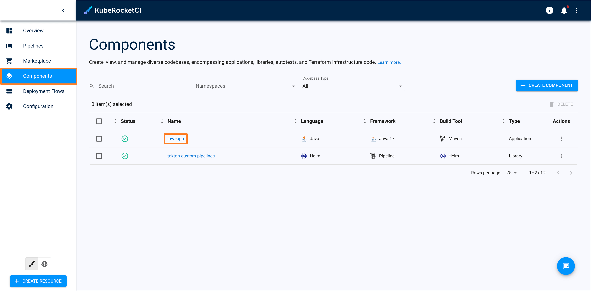

    2. In the **Branches** tab, select the branch for which you want to replace the pipeline. Click the three dots (**⋮**) menu and click **Edit**:

        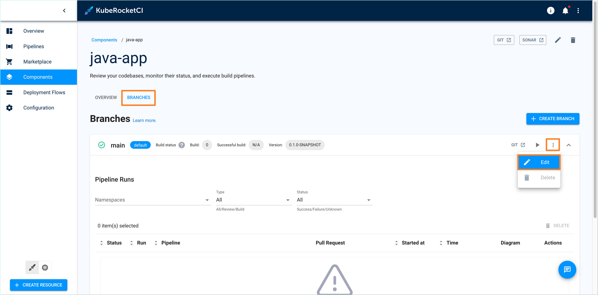

    3. In the **Edit branch** dialog, select the required build or review pipeline from the dropdown list:

        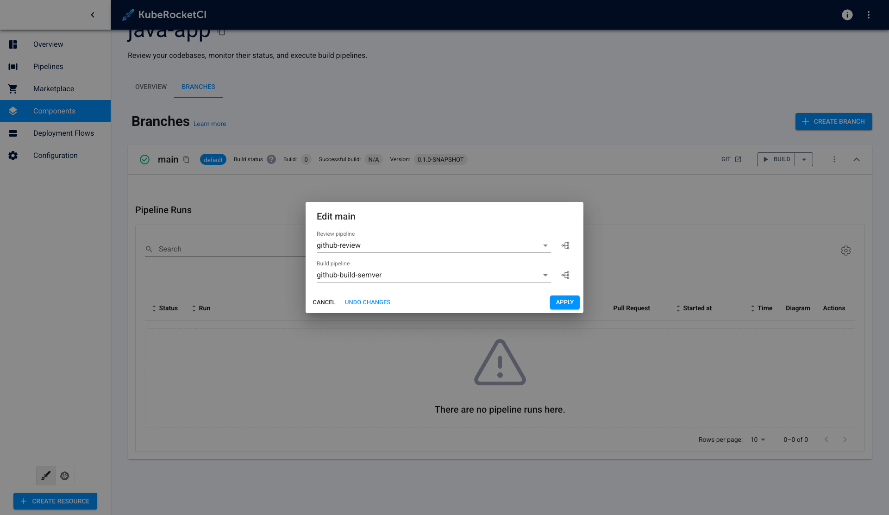

2. To replace existing deploy or clean pipelines for a deployment flow with custom pipelines, follow these steps:

    1. Open the KubeRocketCI portal. Navigate to the **Deployment Flows** tab and select the deployment flow for which you want to replace the deploy or clean pipeline:

        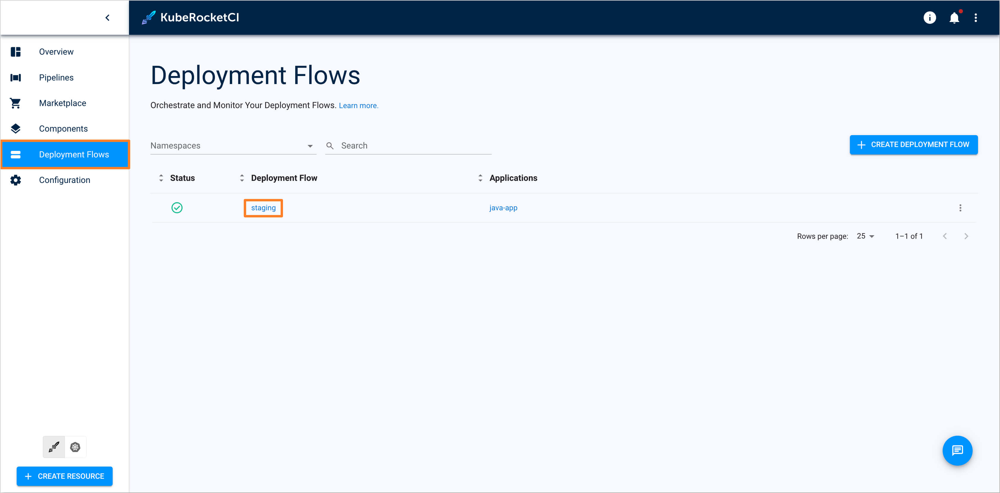

    2. Choose the required Environment:

        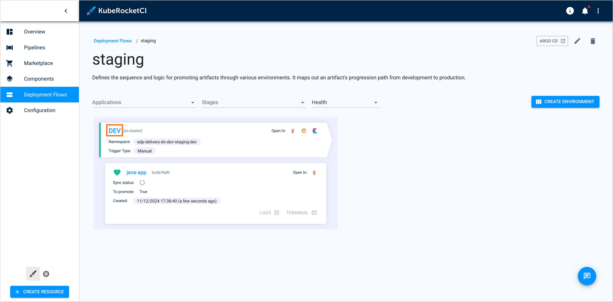

    3. In the **Edit Environment** dialog, select the required deploy or clean pipeline from the dropdown list:

        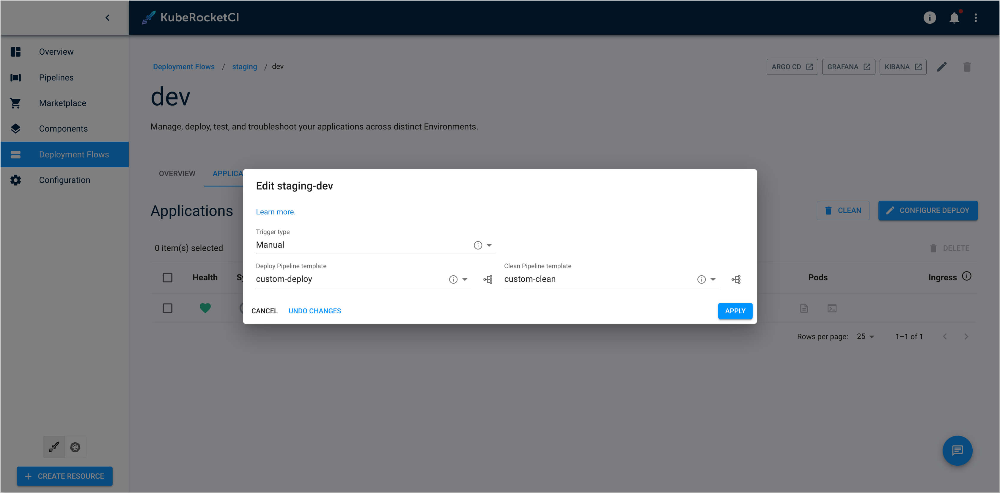

## Related Articles

- [Tekton Overview](../operator-guide/ci/tekton-overview.md)
- [Add Application using KubeRocketCI Portal](../user-guide/add-application.md)
- [Add Deployment Flow using KubeRocketCI Portal](../user-guide/add-cd-pipeline.md)
- [Argo CD Overview](../quick-start/integrate-argocd.md)
- [Cluster Add-Ons Overview](../operator-guide/add-ons-overview.md)
