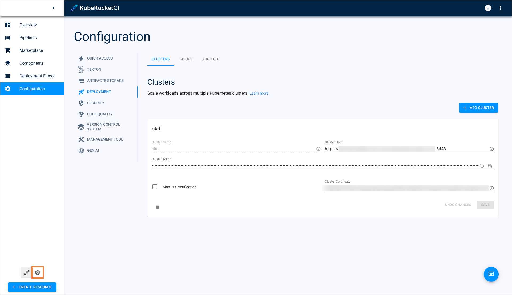

---

title: "Add Cluster"
sidebar_label: "Add Cluster"
description: "Step-by-step guide on integrating external clusters into KubeRocketCI for multi-cluster deployment, enhancing environment segregation and management."

---
<!-- markdownlint-disable MD025 -->

import Tabs from '@theme/Tabs';
import TabItem from '@theme/TabItem';

# Add Cluster

<head>
  <link rel="canonical" href="https://docs.kuberocketci.io/docs/user-guide/add-cluster" />
</head>

This page provides comprehensive instructions on how to integrate an external cluster into the KubeRocketCI workloads. By doing so, it creates an opportunity for users to employ multi-cluster deployment, thereby facilitating the segregation of different environments across various clusters.

<iframe width="560" height="315" src="https://www.youtube.com/embed/3Gm8YLj-0x4" title="Deploying Applications to Remote Kubernetes Clusters with KubeRocketCI and Argo CD" frameborder="0" allow="accelerometer; autoplay; clipboard-write; encrypted-media; gyroscope; picture-in-picture" allowfullscreen="allowfullscreen"></iframe>

## Prerequisites

Before moving ahead, ensure you have already performed the guidelines outlined in the [Argo CD Integration](../operator-guide/cd/argocd-integration.md#deploy-argo-cd-application-to-remote-cluster-optional) page. Besides, user needs to have a cluster admin role to add clusters.

## Integrate External Cluster

To deploy an application to a remote cluster, follow the steps below:

1. Navigate to **Configuration** -> **Deployment** -> **Clusters** and click the **+ Add cluster** button:

    

2. In the **Add cluster** window, choose the credentials type and specify the required fields. Click the **Save** button to add the cluster:

    <Tabs
      defaultValue="bearer"
      values={[
        {label: 'Bearer Token', value: 'bearer'},
        {label: 'IRSA', value: 'irsa'},
      ]}>

        <TabItem value="bearer">

            * **Cluster Name**: a unique and descriptive name for the external cluster;
            * **Cluster Host**: the cluster’s endpoint URL (e.g., example-cluster-domain.com);
            * **Cluster Token**: a Kubernetes token with permissions to access the cluster. This token is required for proper authorization;
            * **Skip TLS verification**: allows connect to cluster without cluster certificate verification;
            * **Cluster Certificate**: a Kubernetes certificate essential for authentication. Obtain this certificate from the configuration file of the user account you intend to use for accessing the cluster.

            :::note
              The `Cluster Certificate` field is hidden if the `skip TLS verification` option is enabled.
            :::

              

        </TabItem>

        <TabItem value="irsa">

            * **Cluster Name**: a unique and descriptive name for the external cluster (e.g., prod-cluster);
            * **Cluster Host**: the cluster’s endpoint URL (e.g., example-cluster-domain.com);
            * **Certificate Authority Data**: base64-encoded Kubernetes certificate essential for authentication. Obtain this certificate from the configuration file of the user account you intend to use for accessing the cluster;
            * **Role ARN**: arn:aws:iam::\<AWS_ACCOUNT_A_ID\>:role/AWSIRSA_\{cluster_name\}_CDPipelineOperator.

            :::note
              For more details on how to work with clusters integrated using IRSA approach, please refer to the [Deploy Application In Remote Cluster via IRSA](../operator-guide/cd/deploy-application-in-remote-cluster-via-irsa.md) page.
            :::

              

        </TabItem>
    </Tabs>

3. As soon as the cluster is added, switch the KubeRocketCI portal to the **Kubernetes** mode:

    

4. In the **Configuration** section, select **Config maps**:

    

5. In the Config maps list, enter the **krci-config** config map:

    

6. In the **krci-config** config map, click the pencil icon in the top right corner of the screen:

    

7. In the YAML file, add the `available_clusters` parameter, insert the cluster name, and click **Save & apply**:

    

8. Ensure the `available_clusters` parameter is added into the config map:

    

9. When adding a new environment, select the remote cluster in the **Cluster** field:

    

## Related Articles

* [Argo CD Integration](../operator-guide/cd/argocd-integration.md)
* [Add Application](add-application.md)
* [Add Library](add-library.md)
* [Add Autotest](add-autotest.md)
* [Add Deployment Flow](add-cd-pipeline.md)
