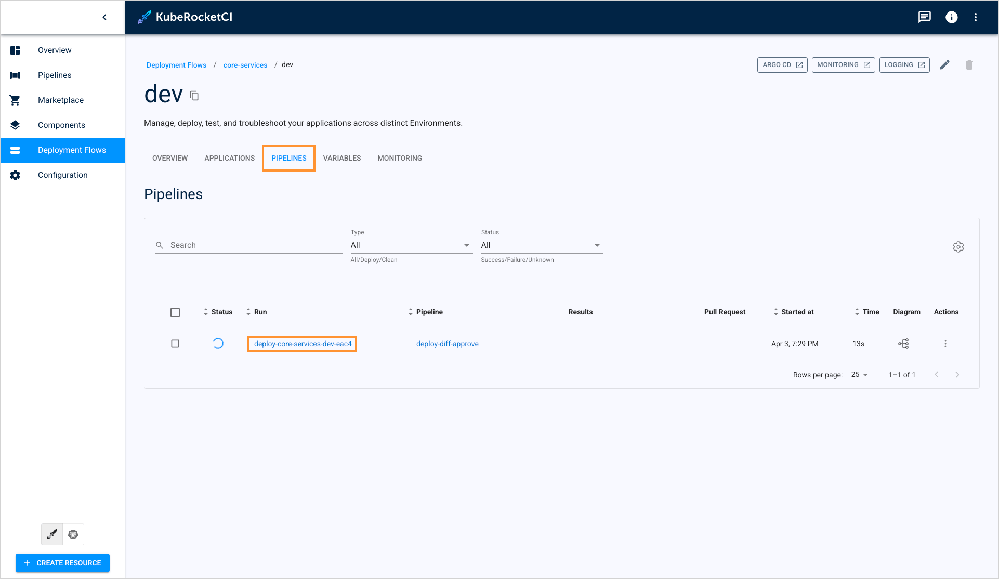

<!-- markdownlint-disable MD025 -->

<head>
  <link rel="canonical" href="https://docs.kuberocketci.io/docs/user-guide/argo-cd-preview" />
</head>

# Preview Argo CD Diff in Deploy Pipelines

Comprehensive oversight of deployment procedures is critical when introducing changes to environments, particularly in production contexts. The **deploy-diff-approve** pipeline addresses this requirement by enabling a controlled deployment review process. Prior to approving or rejecting a deployment, the pipeline presents a link to the corresponding Argo CD Application resource in the logs. This integration allows operators to examine the precise Kubernetes resource changes that will be applied during deployment using Argo CD's native diff visualization capabilities.

This GitOps-aligned approach significantly enhances deployment control, minimizing the risk of failures and improving overall application stability through visual verification of changes before they reach production environments.

## Set Argo CD Diff Pipeline

To leverage the **deploy-diff-approve** pipeline, select it when creating or editing an Environment:

  

For advanced use cases where you need to incorporate the Argo CD diff functionality into a custom deploy pipeline, please refer to the [Customize Deploy Pipeline](../operator-guide/cd/customize-deploy-pipeline.md) documentation. The [deploy-diff-approve](https://github.com/epam/edp-tekton/blob/master/charts/pipelines-library/templates/pipelines/cd/deploy-diff-approve.yaml) pipeline template provides a reference implementation that can be adapted to your specific requirements.

## Pipeline Usage

To utilize the pipeline with Argo CD preview functionality, follow this sequence:

1. Configure the **deploy-diff-approve** pipeline in your Environment as detailed in the [previous section](#set-argo-cd-diff-pipeline).

2. Initiate the deployment of your application. For comprehensive deployment instructions, consult the [Deploy Application](../quick-start/deploy-application.md#application-deployment) documentation.

3. Navigate to the Environment details page, select the **Pipelines** tab, and access the pipeline by selecting its name:

  

4. Within the Pipeline details page, locate the **approve-diff** Step within the **preview-changes** Task. The Argo CD application link will be displayed in the logs. Select this link to open the corresponding Argo CD application:

  

5. Authenticate with Argo CD if prompted.

6. In the Argo CD Application details interface, select the **Diff** button to view the comparison:

  

7. Review the Application diff visualization that displays:
   - Resources being added (highlighted in green)
   - Resources being removed (highlighted in red)
   - Resources being modified (showing both previous and new configurations)

   Verify that these changes align with your expected deployment modifications:

  

8. Return to the KubeRocketCI pipeline interface to approve or reject the deployment based on your review.

## Related Articles

* [Customize Deploy Pipeline](../operator-guide/cd/customize-deploy-pipeline.md)
* [Deployment Strategies in KubeRocketCI](../operator-guide/cd/auto-stable-trigger-type.md)
* [Argo CD Integration](../operator-guide/cd/argocd-integration.md)
