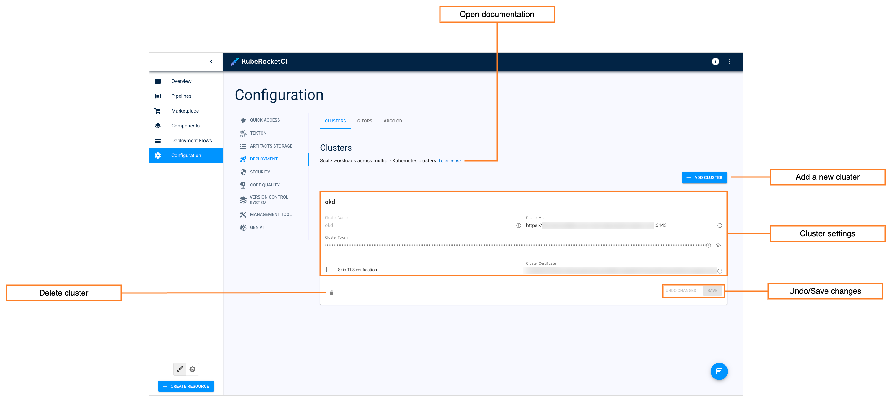

---

title: "Manage Clusters"
description: "Learn how to manage Kubernetes clusters within KubeRocketCI Portal, including viewing authentication data and deleting clusters for streamlined infrastructure management."
sidebar_label: "Manage Clusters"

---
<!-- markdownlint-disable MD025 -->

# Manage Clusters

<head>
  <link rel="canonical" href="https://docs.kuberocketci.io/docs/user-guide/cluster" />
</head>

This section describes the subsequent possible actions that can be performed with the newly added or existing clusters.

In a nutshell, cluster in KubeRocketCI Portal is a Kubernetes secret that stores credentials and endpoint to connect to the another cluster. Adding new clusters allows users to deploy applications in several clusters, thus improving flexibility of your infrastructure.

The added cluster will be listed in the clusters list allowing you to do the following:



* **Open documentation** - opens the cluster related documentation page.
* **Add a new cluster** - displays the cluster creation form.
* **Cluster properties** - shows the specified cluster properties.
* **Delete cluster** - remove cluster by clicking the recycle bin icon.
* **Undo/Save changes** - these buttons apply or revert changes made to the cluster configuration.

## View Authentication Data

To view authentication data that is used to log in to the cluster, run the `kubectl describe` command:

  ```bash
  kubectl describe secret cluster_name -n krci
  ```

## Delete Cluster

To delete cluster, use the `kubectl delete` command as follows:

  ```bash
  kubectl delete secret cluster_name -n krci
  ```

## Related Articles

* [Add Cluster](../user-guide/add-cluster.md)
* [Add Application](../user-guide/add-application.md)
