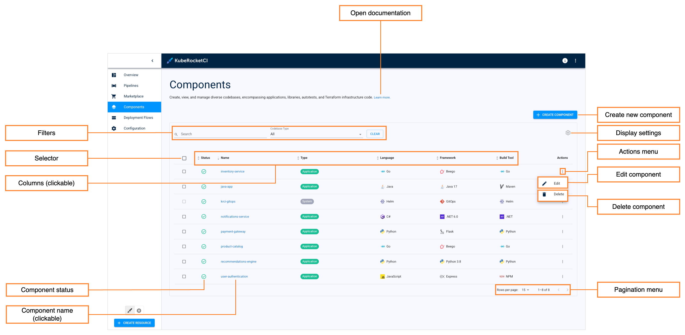
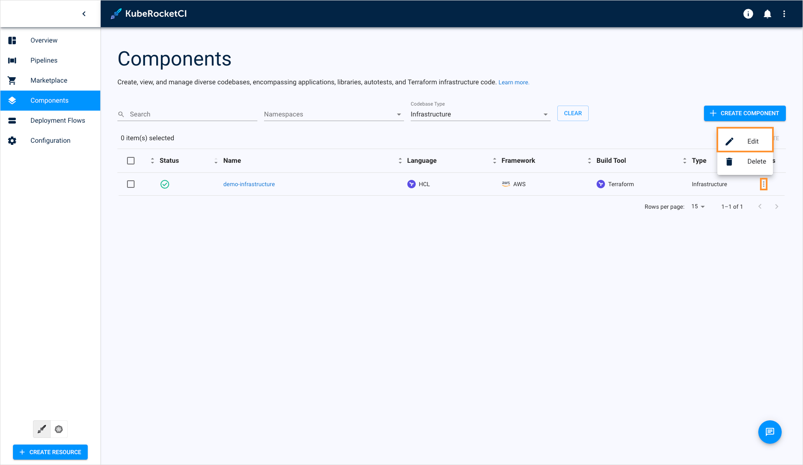
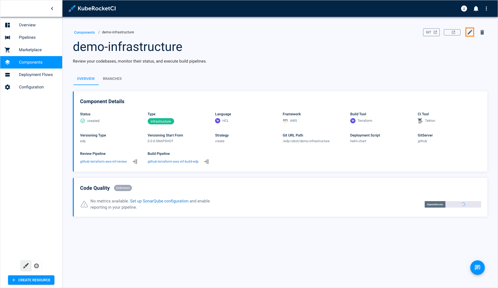
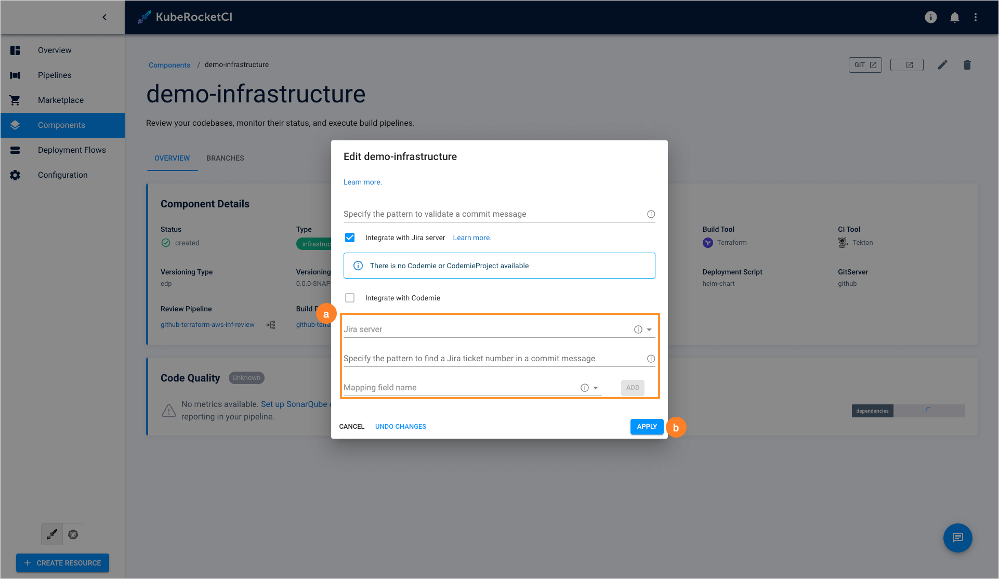

---

title: "Manage Infrastructures"
sidebar_label: "Manage Infrastructures"
description: "Guide to managing infrastructures in KubeRocketCI, including setup, modification, and integration with Jira for comprehensive development management."

---
<!-- markdownlint-disable MD025 -->

# Manage Infrastructures

<head>
  <link rel="canonical" href="https://docs.kuberocketci.io/docs/user-guide/infrastructure" />
</head>

This section describes the subsequent possible actions that can be performed with the newly added or existing infrastructures.

## Check and Remove Infrastructure

As soon as the infrastructure is successfully provisioned, the following will be created:

* An Infrastructure Codebase type will appear in the Codebase list of the Components section.
* With the **Create** strategy, a new project will be generated on GitHub or another integrated VCS. When **Clone** is chosen, the repository will be forked from the original and copied to the KubeRocketCI-integrated repository. If **Import** is selected, the platform connects to the chosen repository.

The added infrastructure will be listed in the infrastructure list allowing you to do the following:

* **Open documentation** - Opens the infrastructure related documentation page.
* **Create new component** - Opens the **Create new component** menu when clicking.
* **Display settings** - This button allows to show/hide columns to display in the codebase list. By default, all the columns are shown.
* **Actions menu** - Provides additional options for each individual infrastructure, such as **Edit** and **Delete**.
* **Edit component** - Allows you to modify the infrastructure's settings. You can access this option by clicking the options icon (vertical ellipsis) next to the infrastructure's name in the list, and then selecting **Edit**. For more details, see the [Edit Existing Infrastructure](#edit-existing-infrastructure) section.
* **Delete component** - Deletes the selected infrastructure.
* **Component status** - displays the infrastructure status. Can be red or green depending on if the KubeRocketCI portal managed to connect to the Git Server with the specified credentials or not.
* **Component name (clickable)** - Displays the infrastructure name set during the infrastructure creation.

  :::warning
    The application that is used in a CD pipeline cannot be removed.
  :::

There are also options to sort the infrastructures:

* **Pagination menu** - select a number of infrastructures displayed per page (15, 25 or 50 rows) and navigate between pages if the number of infrastructures exceeds the capacity of a single page.

* **Filters** - Filter codebases by their name and type. Additionally, sort the existing infrastructures in a table by clicking the sorting icons in the table header. Sort the infrastructures alphabetically by their name, language, build tool, framework, and CI tool. You can also sort the infrastructures by their status: Created, Failed, or In progress.

* **Selector** - Allows you to select multiple infrastructures for bulk delete.

* **Columns (clickable)** - Sort the existing infrastructures in a list by clicking the sorting icons in the list header.

## Edit Existing Infrastructure

KubeRocketCI portal provides the ability to enable, disable or edit the Jira Integration functionality for infrastructures.

1. To edit an infrastructure directly from the infrastructures overview page or when viewing the infrastructure data:

    * Select **Edit** in the options icon menu:

    

    

    * The **Edit Infrastructure** dialog opens.

2. To enable Jira integration, in the **Edit Infrastructure** dialog do the following:

    

    a. Mark the **Integrate with Jira server** check box and fill in the necessary fields. Please see steps d-h on the [Add Infrastructure page](add-infrastructure.md).

    b. Select the **Apply** button to apply the changes.

3. To disable Jira integration, in the **Edit Infrastructure** dialog do the following:

    a. Clear the **Integrate with Jira server** check box.

    b. Select the **Apply** button to apply the changes.

4. To create, edit and delete infrastructure branches, please refer to the [Manage Branches](../user-guide/manage-branches.md) page.

## Related Articles

* [Add Infrastructure](add-infrastructure.md)
* [Manage Branches](../user-guide/manage-branches.md)
