---

title: "Manage Branches"
sidebar_label: "Manage Branches"
description: "Explore branch management in KubeRocketCI, from adding new branches, editing properties, to integrating pipelines for applications, libraries, and more."

---
<!-- markdownlint-disable MD025 -->

# Manage Branches

<head>
  <link rel="canonical" href="https://docs.kuberocketci.io/docs/user-guide/manage-branches" />
</head>

This page describes how to manage branches in the created component, whether it is an application, library, autotest or infrastructure. It also briefly explains two approaches of managing custom pipelines for codebases.

## Pipeline Management

There are two approaches to define a codebases with Tekton pipelines:

  * Using [build tool and framework](../use-cases/tekton-custom-pipelines.md)
  * Using codebase [branch settings](../use-cases/custom-pipelines-flow.md)

### Build Tool/Framework Approach

This approach involves [adding your application](../use-cases/tekton-custom-pipelines.md) operating with language type and framework.

In this approach, it is essential to create a pipeline name using the pattern: `git_server_name-build_tool-framework-codebase_type-pipeline_type-codebase_versioning_type`.

Follow this approach if you need to define multiple similar applications with identical settings, as this approach would be more beneficial.

### Codebase Branch Settings

This approach involves creating a component with Tekton pipelines and selecting it in the codebase branch settings.

In contrast to the approach based on [build tool and framework](../use-cases/tekton-custom-pipelines.md), this one offers two main advantages:

  * **Simplified management**: This method eliminates the requirement for strict resource naming conventions. With this approach, pipelines can be created without following any predefined pattern.
  * **Branch-based logic**: With this method, pipelines can be defined not just for an application but also for specific branches within the application.

If you need to frequently and quickly redefine a build or review pipeline, this approach is highly recommended.

## Add New Branch

:::note
  When working with libraries, pay attention when specifying the branch name: the branch name is involved in the formation of the library version, so it must comply with the [semantic versioning](https://semver.org/) rules for the library.
:::

When adding a component, the default branch is a **main** branch. In order to add a new branch, follow the steps below:

1. Navigate to the **Branches** block by clicking the component name link in the Components list.

2. Click the **+ Create branch** button:

  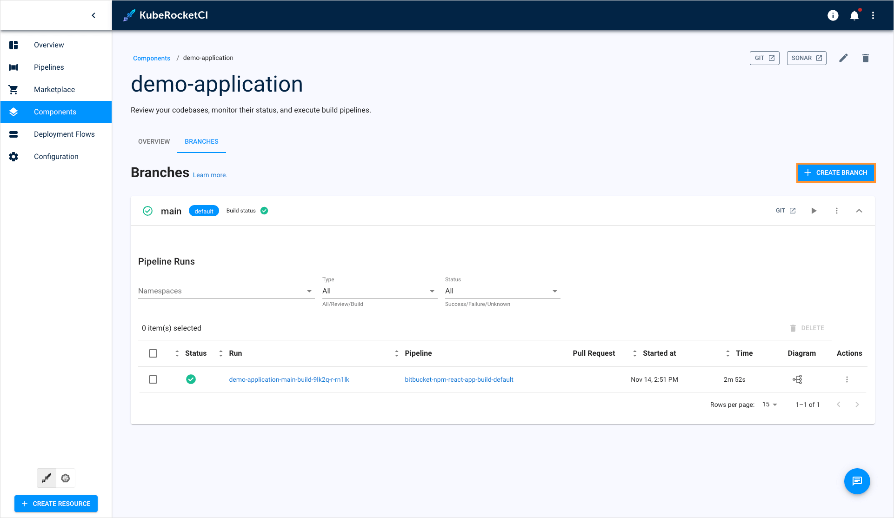

  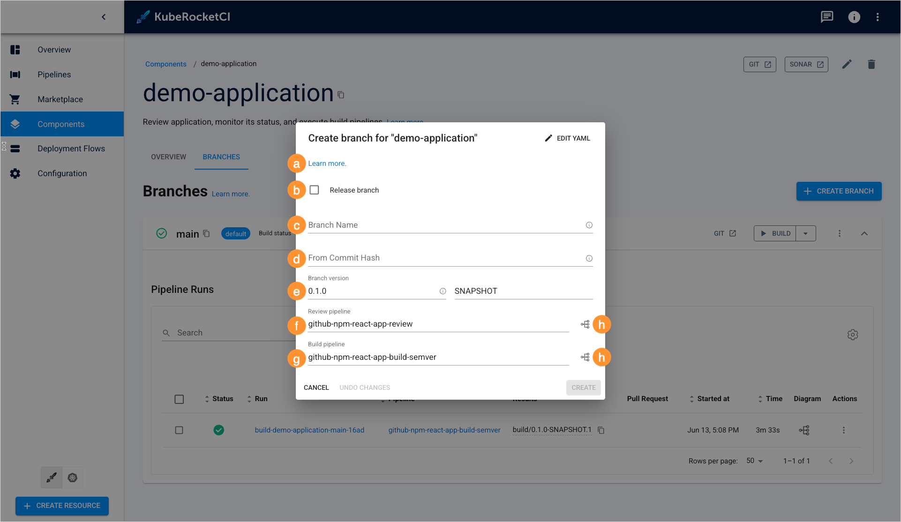

    a. **Branch name** - type the branch name. Pay attention that this field remains static if you create a release branch. For the **Clone** and **Import** strategies: if you want to use the existing branch, enter its name into this field.

    b. **From commit hash** - paste the commit hash from which the branch will be created. For the **Clone** and **Import** strategies: Note that if the **From commit hash** field is empty, the latest commit from the branch name will be used.

    c. **Build pipeline** - select the build pipeline you want to use to build the application or leave the default one.

    d. **Review pipeline** - select the review pipeline you want to use to review the application or leave the default one.

    e. **View diagram** - view the pipeline to verify this is the exact pipeline you need:

    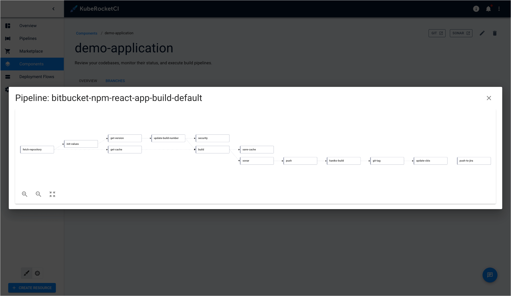

  :::note
  To get the most out of managing build/review pipelines via KubeRocketCI portal, you should follow the **Add-Ons** approach for pipeline management.
  :::

3. Click **Edit YAML** in the upper-right corner of the dialog to open the YAML editor and add a branch. Otherwise, fill in the required fields in the dialog:

  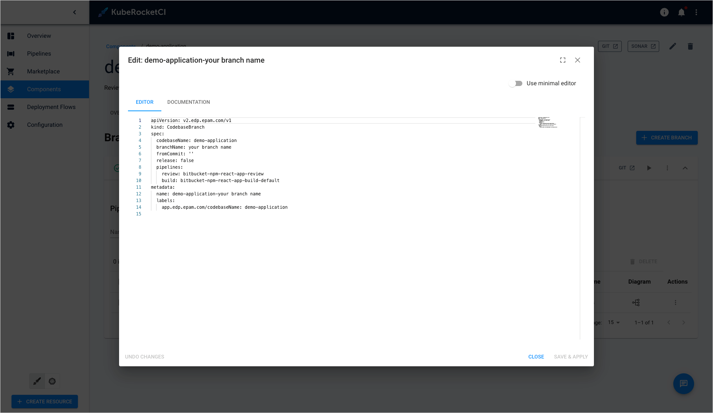

  :::info
    Adding of a new branch is indicated in the context of the `semver` versioning type.
  :::

## Edit Existing Branch

To edit branch properties, follow the steps below:

1. Navigate to the **Branches** block by clicking the library name link in the Libraries list.

2. Click the actions button and select **Edit**:

  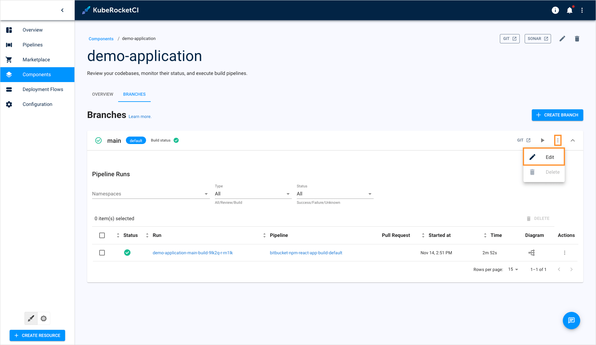

3. Change the branch options and click **Apply**:

  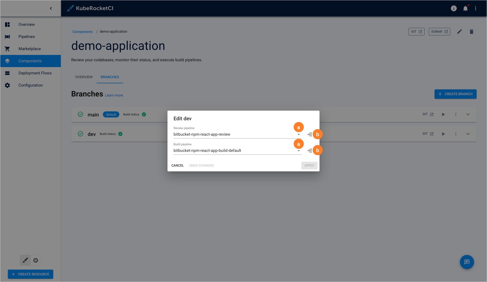

  a. Select another pipeline from the drop-down list.

  b. Click the **View diagram** button.

  c. View the pipeline structure and verify these are the exact pipelines you need.

## Build Branch

In order to build branch from the latest commit, do the following:

1. Navigate to the **Branches** block by clicking the library name link in the Libraries list.

2. Click the **Build** button:

  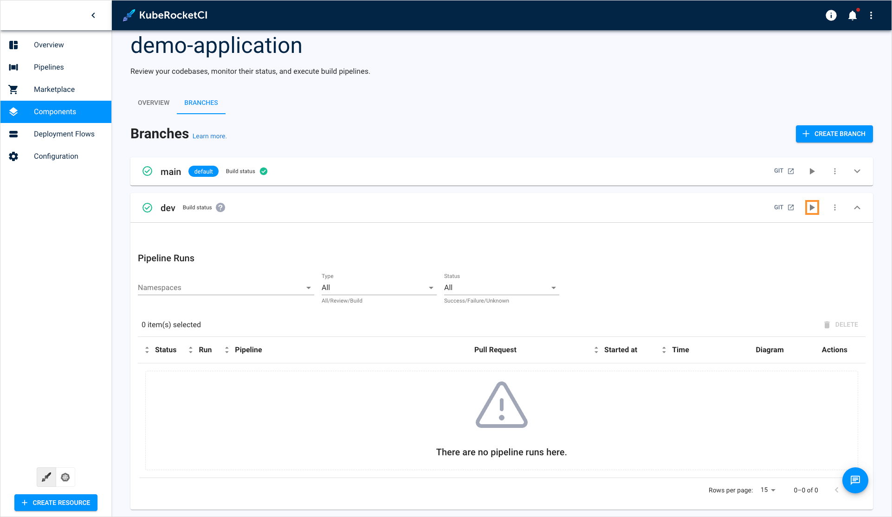

The pipeline run status is displayed near the branch name in the **Branches** block:

  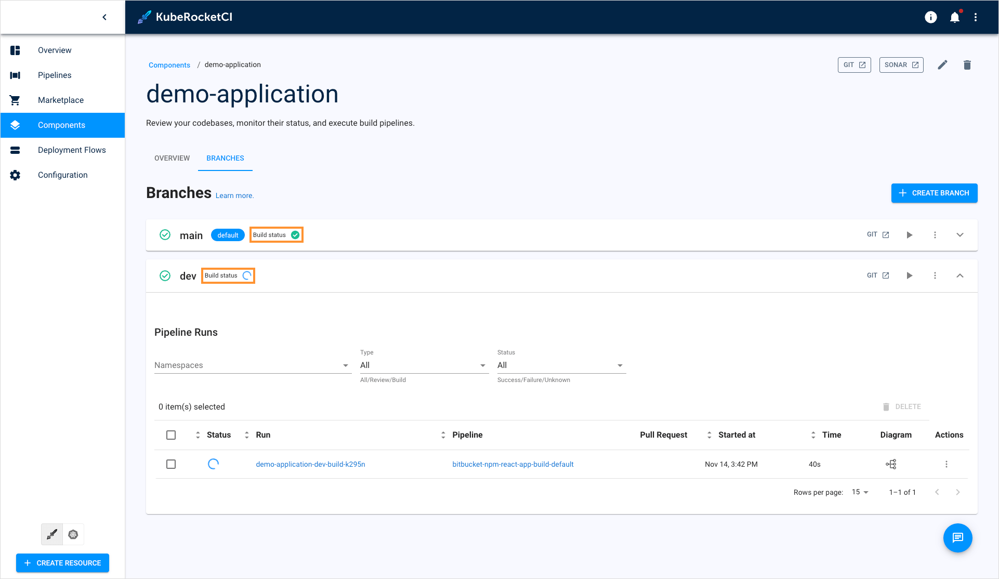

The corresponding item appears in the **Pipelines** section:

  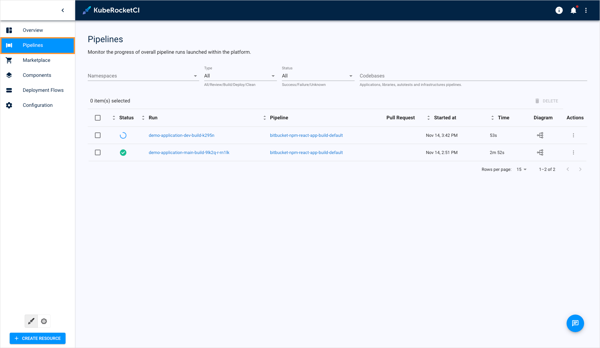

As an alternative way, click the tree diagram icon to observe the real-time status of the pipeline run:

  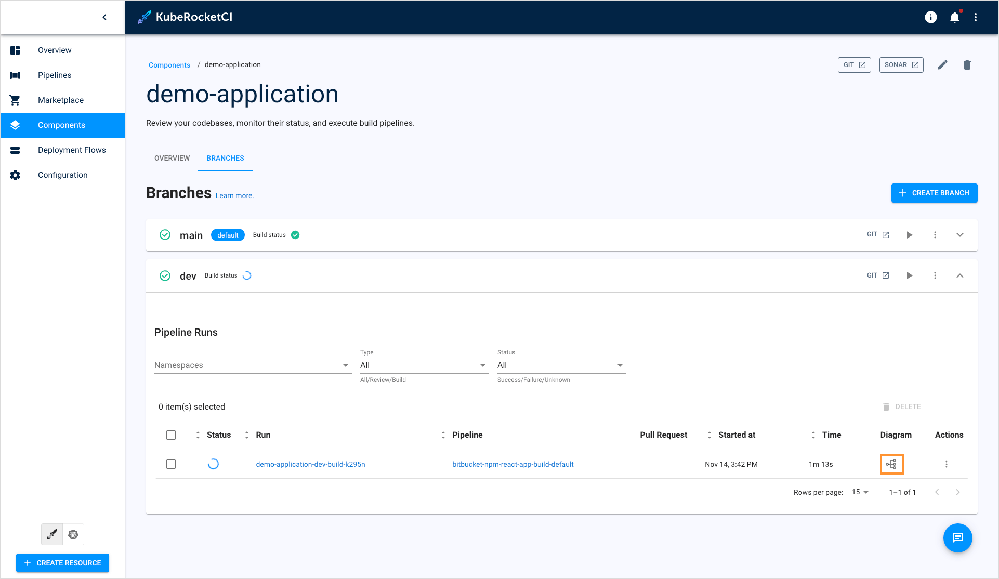

The tree diagram window is presented below:

  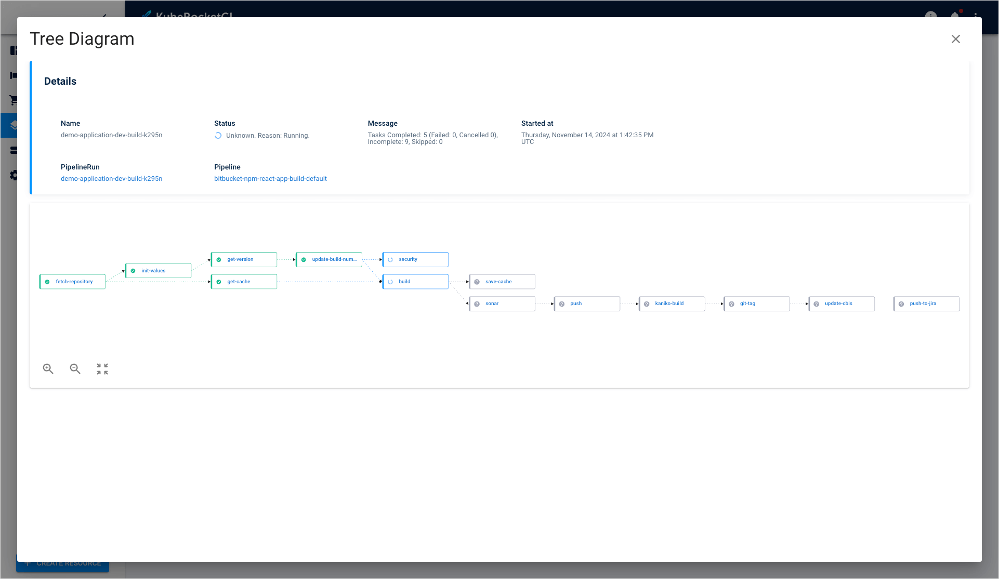

## Delete Branch

:::note
  The default **master/main** branch cannot be removed.
:::

In order to delete the added branch with the corresponding record in the KubeRocketCI portal database, do the following:

1. Navigate to the **Branches** block by clicking the component name link in the components list.
2. Select the name related to the necessary branch and then click delete **Bucket** icon:

  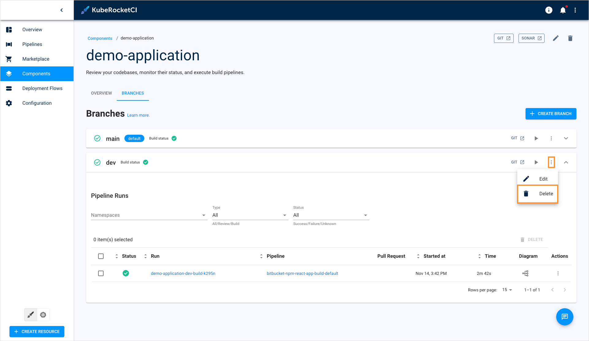

## Related Articles

* [Add Application](../user-guide/add-application.md)
* [Add Library](../user-guide/add-library.md)
* [Add Autotest](../user-guide/add-autotest.md)
