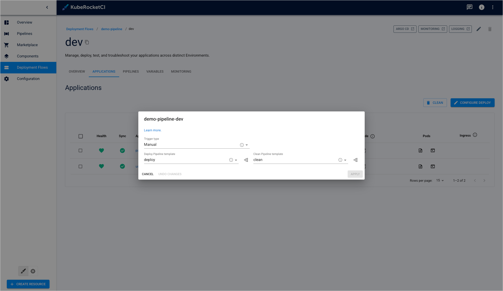

---

title: "Manage Deployment Flows"
sidebar_label: "Manage Deployment Flows"
description: "Navigate deployment flow management in KubeRocketCI, from viewing details to editing, deleting, and troubleshooting deployment environments."

---
<!-- markdownlint-disable MD025 -->

# Manage Deployment Flows

<head>
  <link rel="canonical" href="https://docs.kuberocketci.io/docs/user-guide/manage-environments" />
</head>

This page describes actions that can be performed to an already created deployment flow. If no deployment flows are created yet, navigate to the [Add Deployment Flow](add-cd-pipeline.md) page:

  

* **Deployment flow status** - displays the deployment flow status. Can be red or green depending on if the KubeRocketCI portal managed to connect to the Git Server with the specified credentials or not.
* **Deployment flow name** (clickable) - displays the Git Server name set during the Git Server creation.
* **Open documentation** - opens the [Add Deployment Flow](./add-cd-pipeline.md) page.
* **Enable filtering** - enables filtering by Git Server name and namespace where this deployment flow is located in.
* **Create new deployment flow** - displays the Create new component menu.
* **Edit deployment flow** - edit the deployment flow by selecting the options icon next to its name in the deployment flow list, and then selecting Edit. For details see the [Edit Existing Deployment Flow](#edit-existing-deployment-flow) section.
* **Delete deployment flow** - remove deployment flow by clicking the vertical ellipsis button and then selecting Delete.
* **Chat assistant** - opens the chat window with AI assistant.

  :::note
    Please keep in mind that after deleting the deployment flow, all the created resources within the deployment flow will be deleted.
  :::

## View Deployment Flow Details

To view deployment flow details, click the deployment flow name in the deployment flows list. Once clicked, the following data will be displayed:

  

* **Filters** - enables filtering by stage name, stage applications and stage health status.
* **Open deployment flow in Argo CD** - opens the corresponding resource in Argo CD.
* **Edit deployment flow** - allows to edit some parameters of the deployment flow.
* **Delete deployment flow** - allows to remove the deployment flow.
* **Create new stage** - displays the **Create stage** menu.
* **Stage name (clickable)** - opens the stage details page.
* **Stage status** - displays the status of the created stage.
* **Create new stage** - displays the **Create stage** menu.
* **Application name (clickable)** - opens the details of the application that is deployed within the stage.
* **Application deployment status** - displays the deployed application.
* **Open application logs** - opens the the application container logs.
* **Open application terminal** - opens the container terminal window.
* **Open application resource in Argo CD** - opens a new tab with Argo CD resources related to the application.
* **Open stage in Argo CD / Grafana / Kibana** - allows to view the stage in Argo CD, Grafana or Kibana.

### Edit Existing Deployment Flow

Edit the deployment flow directly from the deployment flow overview page or when viewing the deployment flow data:

1. Select **Edit** in the options icon menu next to the deployment flow name:

    

2. Apply the necessary changes (edit the list of applications for deploy, application branches, and promotion in the pipeline). Add new extra stages by clicking the plus sign icon and filling in the application branch and promotion in the pipeline.

    

3. Click the **Apply** button to confirm the changes.

### Add a New Environment

In order to create a new environment for the existing deployment flow, follow the steps below:

1. Navigate to the **Environments** block by clicking the deployment flow name link in the deployment flows list.

2. Click the **Create environment** button:

    

3. Fill in the required fields in the dialog. Alternatively, click **Edit YAML** in the upper-right corner of the **Create environment** dialog to open the YAML editor and add an environment. Please see the [Stages Menu](../user-guide/add-cd-pipeline.md) section for details.

4. Click the **Apply** button.

### Edit Environment

In order to edit an environment for the existing deployment flow, follow the steps below:

1. Click the environment name in the deployment flows list to enter its details page.

2. In the upper-right corner of the page, click the **Edit** button:

    

3. In the **Edit environment** dialog, change the environment trigger type and deploy pipeline template:

    

4. Click the **Apply** button.

### Delete Environment

:::warning
  You cannot remove the last environment, as the deployment flow does not exist without at least one.
::::

In order to delete an environment for the existing deployment flow, follow the steps below:

1. Navigate to the **Environments** block by clicking the deployment flow name link in the deployment flows list.

2. Click the name of the environment that needs to be deleted:

    

3. Click the recycle bin button to open the environment deletion menu:

    

4. Enter the environment name and click **Confirm**:

    

### View Environment Data

To view the environment data for the existing environment, follow the steps below:

1. Navigate to the **Stages** block by clicking the deployment flow name link in the deployment flows list;

    

2. Click the environment name. The following blocks will be displayed:

    

    a. **Overview** - general information and configuration of current environment.

    b. **Applications** - displays the status of the applications related to the environment and allows for [deploying applications](#deploy-application). Applications health and sync statuses are returned from the Argo CD tool.

    c. **Pipelines** - displays all the deploy pipeline runs launched for this environment.

    d. **Monitoring** - opens the Grafana window that allows for watching various metrics.

### Deploy Application

To deploy an application, follow the steps below:

1. Navigate to the **Applications** block and click the **Configure deploy** button:

  

2. Set deployment properties you need:

  

  a. Select the image stream version from the drop-down list.

  b. (Optional) Enable setting custom values for Helm Charts. For more details, please refer to the [Manage GitOps](gitops.md) page.

  c. Click the **Start Deploy** button to start a pipeline with the deploy script.

  :::info
    In case of using OpenShift internal registry, if the deployment fails with the ImagePullBackOff error, delete the pod that was created for this application.
  :::

To uninstall the application, click the **Delete** button:

As a result, the application will be uninstalled in the Argo CD tool as well.

Alternatively, you can use the **Clean** button. This way will be appropriate when you have some specific requirements to the environment cleanup procedure. Note that you need to make up your own logic in the cleanup pipeline to use the button or choose one of the pre-defined pipelines offered by KubeRocketCI:

### Troubleshoot Application

There is a couple of KubeRocketCI portal capabilities that will help in monitoring and troubleshooting deployed applications, namely, terminal and logs.

To inspect the deployed application in KubeRocketCI portal, take the following steps:

1. Open the application logs by clicking the `Show Logs` button:

    

2. Inspect the shown logs:

    

3. Open the application terminal by clicking the `Show Terminal` button:

    

4. Operate the terminal to fix the problem if any:

    

### Monitor Application

KubeRocketCI portal offers monitoring capabilities powered by Grafana and Prometheus Operator.

:::info
  To view the deployment monitoring data, you need to have Grafana and Prometheus Operator installed. We recommend installing it using our [add-ons](https://github.com/epam/edp-cluster-add-ons/blob/3fc8a60ccfbca1c7aa757cb36226a0daf2c8a224/clusters/core/addons/prometheus-operator/values.yaml).
:::

To monitor an application using Grafana, follow the steps below:

1. Navigate to the Environment details page.

2. In the Environment details page, open the **Monitoring** tab:

    

3. In the **Monitoring** tab, view the deployment metrics:

    

The **Monitoring** tab provides the visual representation of the basic application deployment metrics, such as CPU and Memory requests and limits.

### Delete Application

There are two buttons on the environment page that can be utilized to delete application in the portal:

  

  * **Delete** - Deletes selected applications and associated resources.
  * **Clean** - Manages custom cleanup actions, such as deleting cloud resources and databases, rolling back transactions, etc.

The **Delete** button is optimized for applications based on a single, simple helm chart that can be deployed independently without any specific dependencies.

The **Clean** button activates a deletion process (triggers a delete pipeline) that includes any custom logic you have defined. This option is most suitable for applications that require complex configurations to function properly. It ensures that any associated resources with the same lifecycle are deleted when the application is no longer needed.

KubeRocketCI provides an intuitive and streamlined pipeline by default. Initially, there is no distinction between the **Delete** and **Clean** buttons, as both perform identical actions. This default behavior encompasses the straightforward deletion of applications, which involves the uninstallation of the associated Helm chart. However, this functionality evolves once a custom delete pipeline is established, enabling manual configuration of the logic behind the **Clean** button. This customization allows for a more tailored approach to managing application lifecycles within KubeRocketCI.

For more details on how to create a custom delete pipeline, navigate to the [Customize Environment Cleanup](../operator-guide/cd/customize-environment-deletion.md)

### Related Articles

* [Customize Environment Cleanup](../operator-guide/cd/customize-environment-deletion.md)
* [Add Deployment Flow](add-cd-pipeline.md)
* [Add Quality Gate](../user-guide/add-quality-gate.md)
