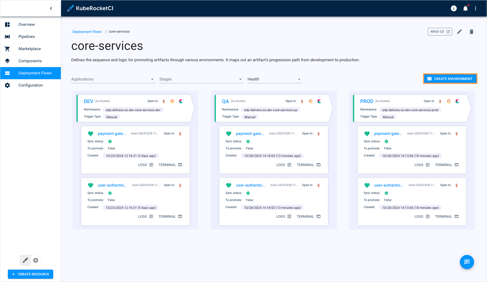
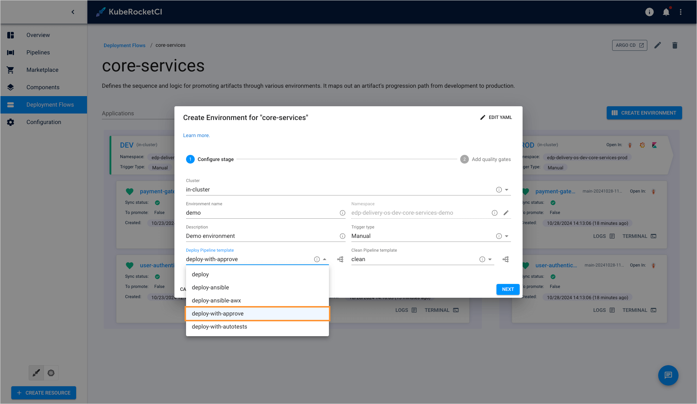
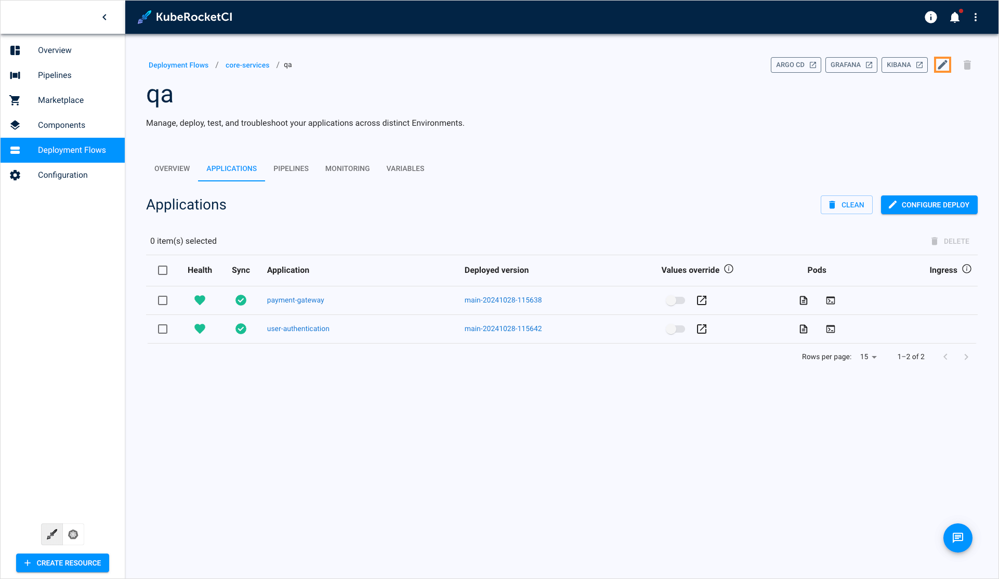
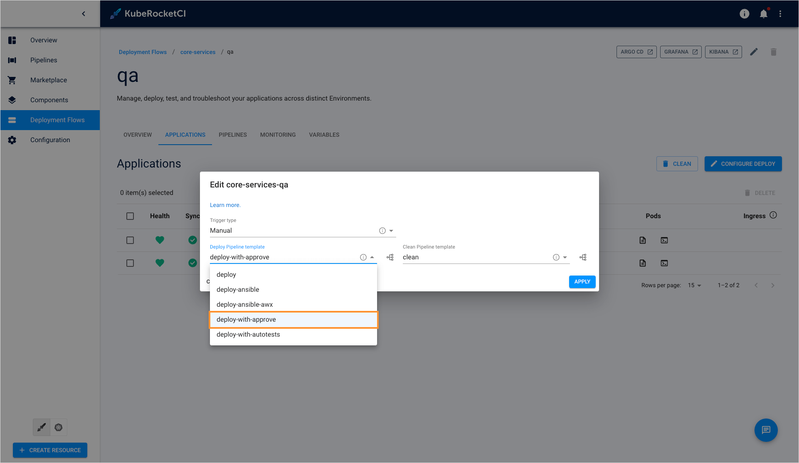
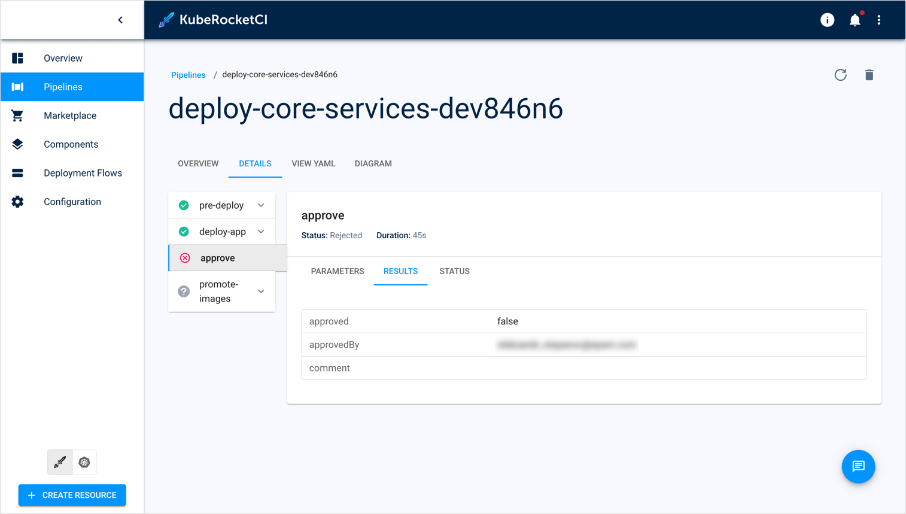
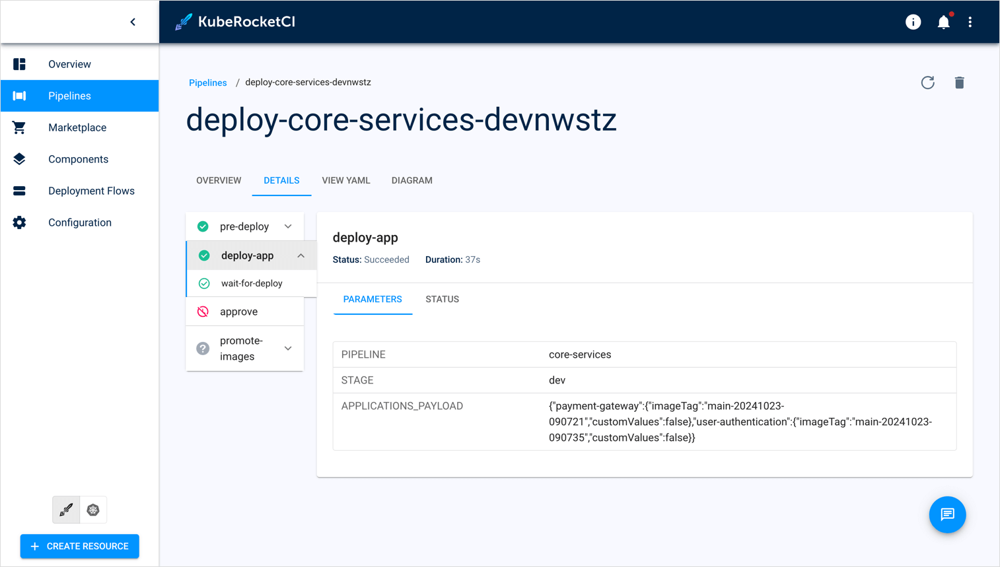
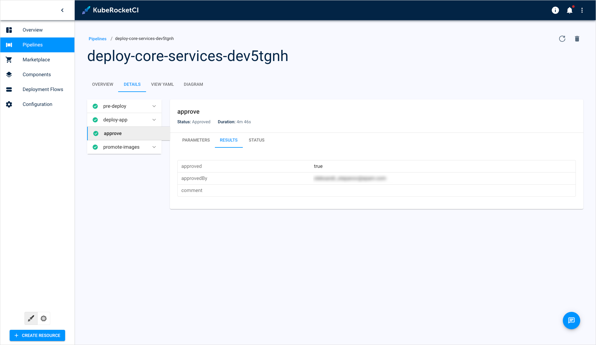

<!-- markdownlint-disable MD025 -->

# Manual Approval in Pipelines

<head>
  <link rel="canonical" href="https://docs.kuberocketci.io/docs/operator-guide/cd/manual-approval" />
</head>

The manual approval feature gives users a smooth and controlled process of promoting applications from lower, non-critical environments, such as development or QA, to mission-critical environments like production. Additionally, it ensures that only thoroughly tested and verified changes are deployed to production, minimizing the risk of causing errors or instability.

Manual approval, at its simplest, is an integrable Tekton [task](https://github.com/epam/edp-tekton/blob/v0.13.0/charts/pipelines-library/templates/pipelines/cd/deploy-with-approve.yaml#L61) that can be integrated into common Tekton pipelines. Its purpose is to pause pipeline execution until a user approves or rejects the task.

## Prerequisites

Please note that using the approval task requires you to install the [tekton-custom-task](https://github.com/KubeRocketCI/tekton-custom-task/tree/main) Helm chart.

## Enable Pipeline With Manual Approval

KubeRocketCI offers a pre-defined deploy pipeline called **deploy-with-approve**. It contains an approval task and can be used for most application deployment cases. If you leverage the default deploy pipeline, you can easily switch it to **deploy-with-approve**. You can apply this pipeline to both existing and new environments.

### New Environments

To apply the **deploy-with-approve** pipeline template to your environments, follow the steps below:

1. In the deployment flow details page, click the **Create environment** button:

  

2. In the **Create environment** window, select the **deploy-with-approve** pipeline:

  

### Existing Environments

If you need to change the default deploy pipeline template in an already existing environment, follow the steps below:

1. Navigate to the environment details page and click the **Edit** button:

  

2. In the **Edit environment** window, select another deploy pipeline:

  

## Approve/Reject Deployment

Once the deploy pipeline has been launched and reached the approval step, you will see a corresponding notification on the pipeline details page:

  

If the approval is rejected, the pipeline status will be failed:

  

If you don’t make a selection within the pipeline processing time, which is **60 minutes** by default, you’ll see a crossed clock icon as the task run status, indicating that the pipeline has timed out:

  

:::note
  You can set a custom timeout duration in the relevant [TriggerTemplate](https://github.com/epam/edp-tekton/blob/v0.13.0/charts/pipelines-library/templates/triggers/cd/deploy-with-approve.yaml#L46).
:::

If you choose the **Approve** option, the pipeline will proceed running:

  

## Create Pipeline With Approval Task

The custom deploy pipeline usage flow involves the following steps:

```mermaid
graph LR;
    A(Create TriggerTemplate resource) --> B(Create Pipeline resource) --> C(Apply changes to environment) --> D(Run deploy pipeline) --> E(Approve/reject deployment)
```

To create a deploy pipeline with a manual approval task, follow the steps below:

1. Create and apply the **TriggerTemplate** custom resource. Refer to the example [TriggerTemplate](https://github.com/epam/edp-tekton/blob/v0.13.0/charts/pipelines-library/templates/triggers/cd/deploy-with-approve.yaml). Make sure to specify the correct pipeline type in the labels and provide the pipeline reference in the specifications:

  ```bash
  ...
  labels:
      app.edp.epam.com/pipelinetype: deploy
  ...
  ```

  ```bash
  ...
  spec:
    taskRunTemplate:
      serviceAccountName: tekton
    pipelineRef:
      name: deploy-with-promote-approval
  ...
  ```

2. Create and apply the **Pipeline** custom resource. Refer to the example [Pipeline](https://github.com/epam/edp-tekton/blob/v0.13.0/charts/pipelines-library/templates/pipelines/cd/deploy-with-approve.yaml). Ensure you set the concrete approval task to run:

  ```bash
  - name: approve
    params:
      - name: description
        value: Promote versions to the next Environment?
    runAfter:
      - deploy-app
    taskRef:
      apiVersion: edp.epam.com/v1alpha1s
      kind: ApprovalTask
      name: approve
  ```

3. When [creating](#new-environments) or [modifying](#existing-environments) the deploy pipeline, select your newly added custom deploy pipeline.

## Related Articles

* [Customize Environment Cleanup](../operator-guide/cd/customize-environment-deletion.md)
* [Customize Deploy Pipeline](../operator-guide/cd/customize-deploy-pipeline.md)
* [Add Deployment Flow](../user-guide/add-cd-pipeline.md)
* [Manage Deployment Flows](../user-guide/manage-environments.md)
