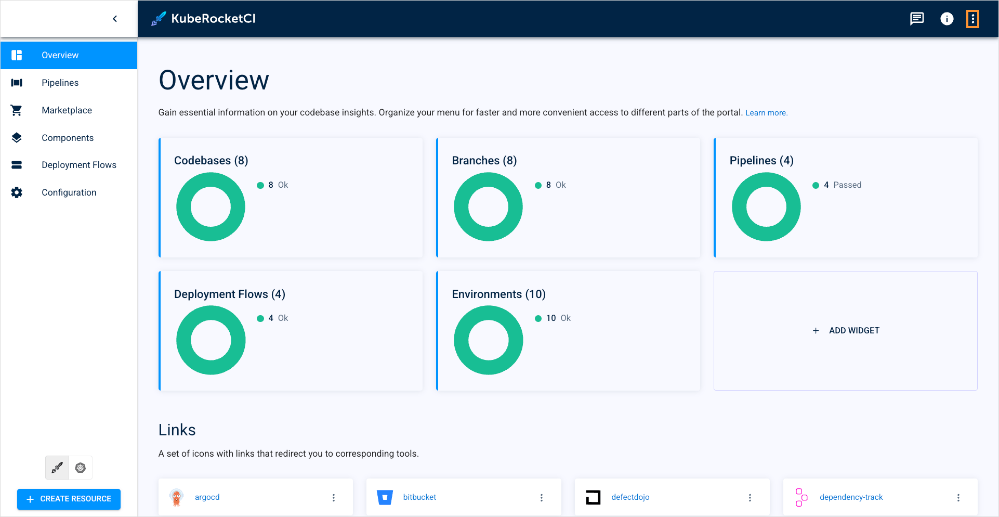
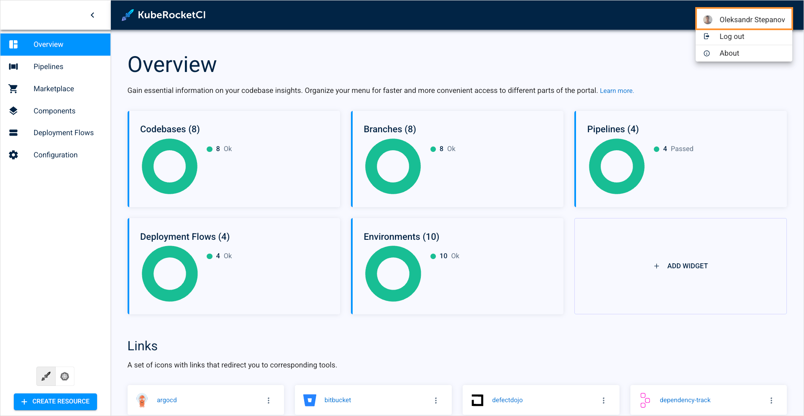
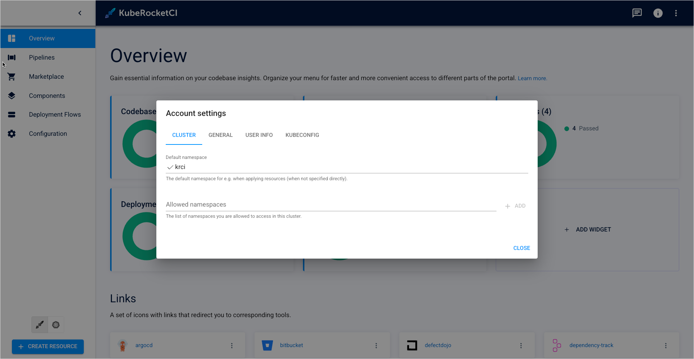
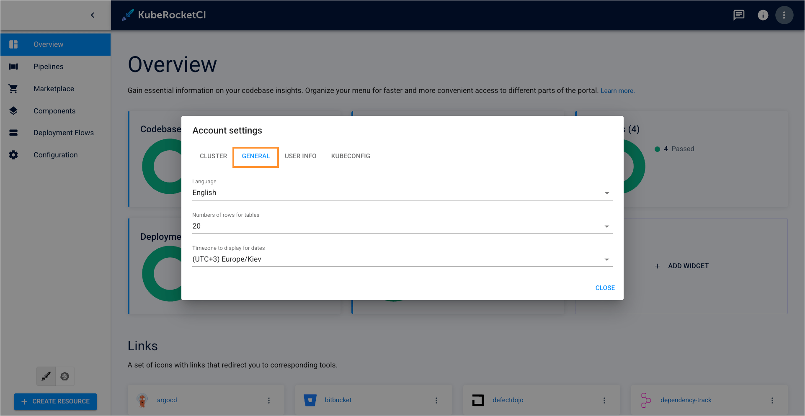
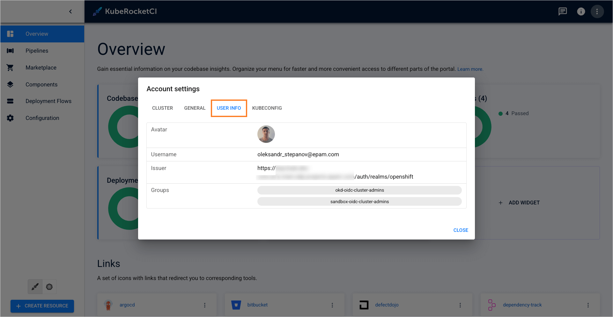
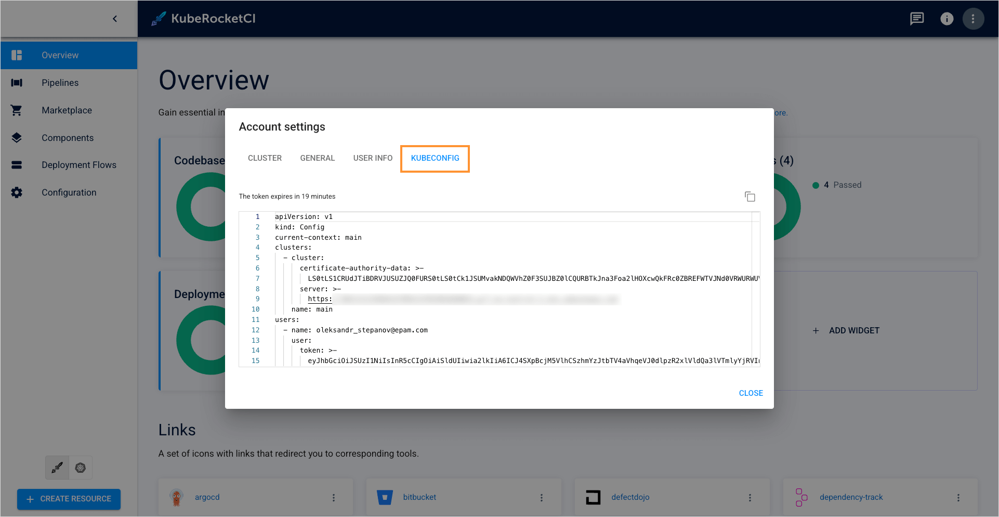
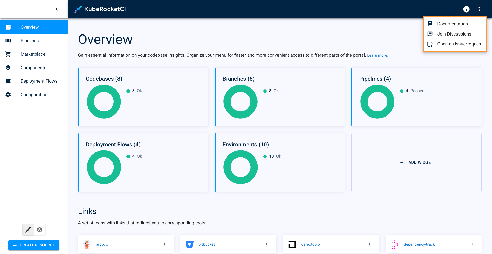

<!-- markdownlint-disable MD025 -->

<head>
  <link rel="canonical" href="https://docs.kuberocketci.io/docs/user-guide/portal-settings" />
</head>

# Portal Settings

This page describes all the general settings related to KubeRocketCI portal. It explains how to adjust resource view, namespace visibility, and use the kubeconfig file provided by the portal.

## Overview

KubeRocketCI portal settings are located at the top right corner of the screen:

  

Once clicked, it shows a dropdown window that displays username, and logout button. Click the username to open the KubeRocketCI portal settings:

  

Once clicked, it shows a dropdown window that displays username and logout button.

## Cluster

Click the username to open the KubeRocketCI portal settings:

  

  In the **Cluster** tab, you can view the namespace accessibility configuration you are supposed to specify at your first login. Here you can also edit the default and allowed namespaces:

  * **Default namespace** – when you create a resource within the portal, it will be deployed in this namespace. You can set only one default namespace. By default, the namespace where the KubeRocketCI instance is deployed will be set here.
  * **Allowed namespace** – resources from these namespaces will be visible in the portal.

:::note
  You can't view resources in the namespaces that you are not allowed to access according to your RBAC configuration. KubeRocketCI portal doesn't grant you extra access rights.
:::

## General

General settings allow for changing appearance:

  

* **Language**: change the supported language;
* **Numbers of rows for tables**: this setting allows for changing the number of object when you see tables of Codebases, Deployment Flows, PipelineRuns, and other.

## User Info

On the **User Info** tab, you can view your personal information:

  

* **Avatar**: displays your user icon;
* **Username**: displays your Keycloak username;
* **Issuer**: displays the Keycloak realm you are member of;
* **Groups**: displays your Keycloak group membership.

## Kubeconfig

On the **Kubeconfig** tab, you can see the kubeconfig file used by the portal:

  

Here you can view the current kubeconfig file and its expiry time. Additionally, you can also copy this kubeconfig file to use it locally. To access KubeRocketCI resources from your local machine, follow the steps below:

1. Copy the kubeconfig file from the portal.

2. Open your terminal and navigate to the **./ssh** directory.

3. Create a file and paste the kubeconfig data there.

4. Switch to this kubeconfig file:

```bash
export KUBECONFIG=/Users/<username>/.ssh/<filename>
```

5. Verify you can access KubeRocketCI resources.

## Community Button

Click the **Community** button to access helpful resources and support options:

  

When clicked, the following options are displayed:

  

* **Documentation**: opens the product documentation site;
* **Join discussions**: opens the GitHub Discussions page for the product, where you can participate in community conversations;
* **Open an issue/request**: Opens the GitHub page where you can create a new issue or feature request for the product.

## Related Articles

* [Authentication and Authorization: Overview](../operator-guide/auth/platform-auth-model#keycloak-roles-and-groups)
* [Install Keycloak](../operator-guide/auth/keycloak#configuration)
