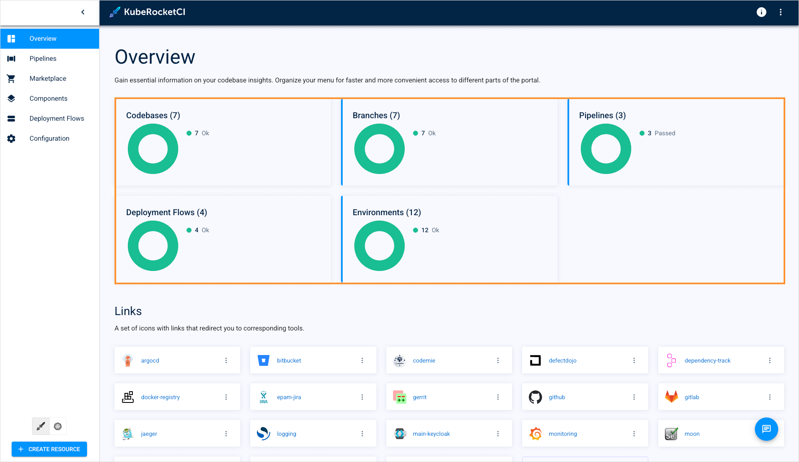
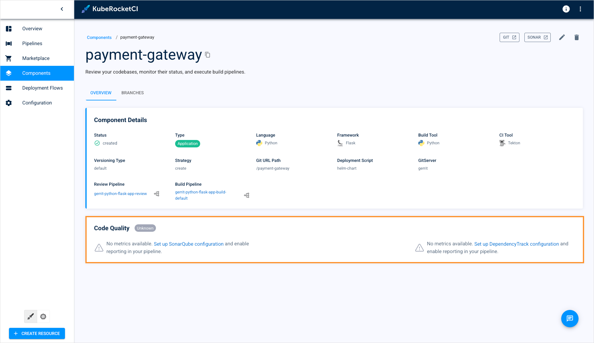
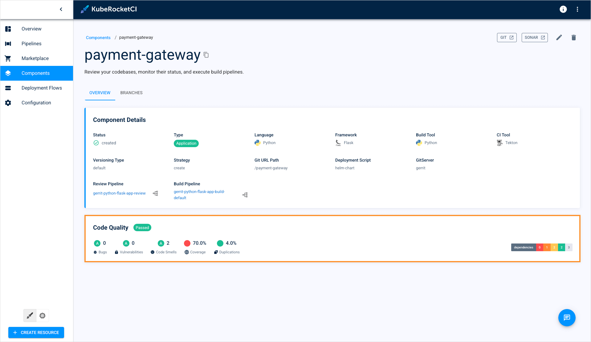
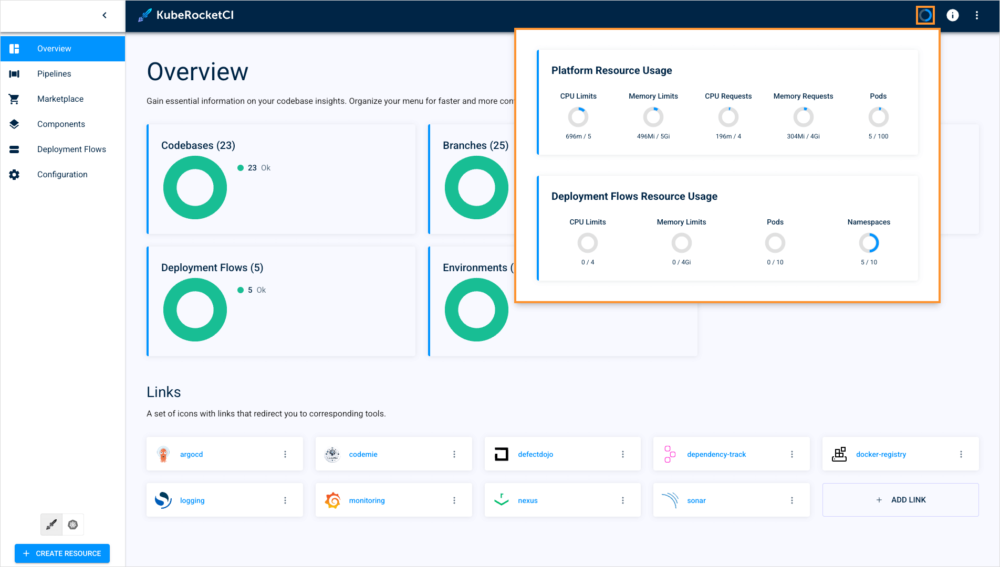

<!-- markdownlint-disable MD025 -->

# KubeRocketCI Widgets

<head>
  <link rel="canonical" href="https://docs.kuberocketci.io/docs/user-guide/widgets" />
</head>

KubeRocketCI offers widgets as data visualization tools to observe the status of both the platform and its resources.
This page describes all the widgets presented in KubeRocketCI.

## Widgets Overview

The first widgets users view when using KubeRocketCI portal are KubeRocketCI resource widgets:

  

These widgets reflect all the resources in the **default namespace**:

* **Codebases**: Displays all the created codebases;
* **Branches**: Shows the total amount of codebase branches;
* **Pipelines**: Shows all the initiated pipeline runs;
* **Deployment Flows**: Displays all the created deployment flows;
* **Environments**: Shows the total amount of created environments.

The status of the resources is displayed real-time and doesn't require any preliminary configuration for widgets to work. Not only these widgets display the amount of resources but also their statuses (success, fail, in progress).

## SonarQube & Dependency-Track Widgets

KubeRocketCI also offers widgets to track codebases' code quality directly from the KubeRocketCI portal. These widgets pull codebase-related data from SonarQube and Dependency-Track tools:

  

To enable these widgets, you need to pass the following steps:

1. Integrate platform with [SonarQube](../operator-guide/code-quality/sonarqube.md) and/or [Dependency-Track](../operator-guide/devsecops/dependency-track.md).
2. Install and configure the [KrakenD](../operator-guide/extensions/krakend.md) tool.
3. Trigger the review pipeline in a codebase, allowing SonarQube and Dependency-Track to scan your code.

:::note
At least one build pipeline must be run for the codebase to activate the widgets.
:::

4. Verify the widgets started working for the codebase:

  

:::note
The SonarQube and Dependency-Track widgets only track the default branch.
:::

## Resource Quota Widget

The last available widget is a resource quota widget. To open the widget, click the circle icon in the top-left corner of the screen:

  

This widget shows resource requests and limits (CPU, Memory, Namespace) of both the deployment flows and the entire platform.

To enable the widget, you need to deploy KubeRocketCI in a [Capsule](../operator-guide/advanced-installation/capsule.md) tenant.

## Related Articles

* [SonarQube Integration](../operator-guide/code-quality/sonarqube.md)
* [Integrate Dependency-Track](../operator-guide/devsecops/dependency-track.md)
* [KrakenD Integration](../operator-guide/extensions/krakend.md)
