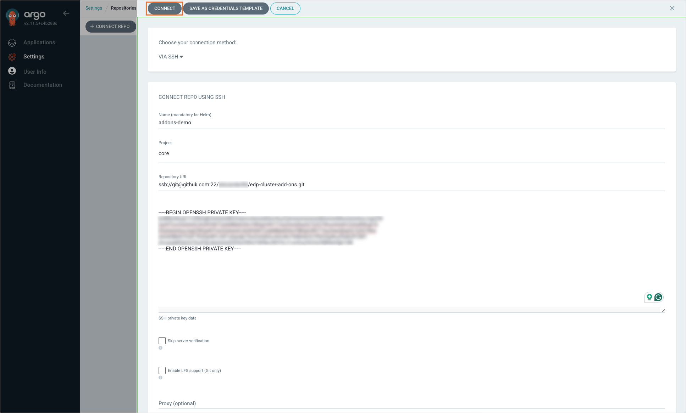

---

title: "Install via Add-Ons"
description: "Overview of Cluster Add-Ons for KubeRocketCI, explaining how to seamlessly integrate additional components like SonarQube, Nexus, Keycloak, and Jira using Argo CD applications."
sidebar_label: "Install via Add-Ons"

---
<!-- markdownlint-disable MD025 -->

# Install via Add-Ons

<head>
  <link rel="canonical" href="https://docs.kuberocketci.io/docs/operator-guide/add-ons-overview" />
</head>

This page provides an overview of Cluster Add-Ons for KubeRocketCI, including their purpose, benefits, and usage.

## What Are Add-Ons

KubeRocketCI Add-Ons is essentially a Kubernetes-based deployment pattern that allows users to easily install additional components for the platform using Argo CD applications.

Add-Ons have been introduced into KubeRocketCI starting from version 3.4.0. They empower users to seamlessly integrate the platform with various additional components, such as SonarQube, Nexus, Keycloak, Jira, and more. This eliminates the need for manual installations, as described in the [Install KubeRocketCI](../operator-guide/install-kuberocketci.md) page.

In a nutshell, Add-Ons are separate Helm Charts that can be installed with just one click using the Argo CD tool.

## Add-Ons Repository Structure

All the Add-Ons for KubeRocketCI are stored in our [GitHub repository](https://github.com/epam/edp-cluster-add-ons) following the GitOps approach. In addition to default Helm and Git files, the repository contains custom resources called Applications for Argo CD and application source code. The repository adheres to the GitOps approach, allowing for easy rollback of changes when necessary. The structure of the repository is as follows:

    <details>
    <summary><b>View: edp-cluster-add-ons repo structure</b></summary>
    ```bash
    edp-cluster-add-ons
    ├── argo-cd
    │   ├── Chart.yaml
    │   ├── README.md
    │   ├── templates
    │   │   ├── appProjectCore.yaml
    │   │   ├── appProjectKRCI.yaml
    │   │   ├── ...
    │   └── values.yaml
    ├── ...
    ├── clusters
    │   ├── core
    │   │   ├── addons
    │   │   │   ├── atlantis
    │   │   │   │   ├── Chart.yaml
    │   │   │   │   ├── README.md
    │   │   │   │   ├── templates
    │   │   │   │   └── values.yaml
    │   │   │   ├── aws-efs-csi-driver
    │   │   │   │   ├── Chart.yaml
    │   │   │   │   ├── README.md
    │   │   │   │   ├── templates
    │   │   │   │   └── values.yaml
    │   │   │   ├── ...
    │   │   ├── apps
    │   │   │   ├── templates
    │   │   │   │   ├── atlantis.yaml
    │   │   │   │   ├── aws-efs-csi-driver.yaml
    │   │   │   │   ├── ...
    │   │   │   ├── Chart.yaml
    │   │   │   ├── README.md
    │   │   │   └── values.yaml
    │   │   └── bootstrap-addons.yaml
    │   └── prod
    ├── ...
    ```
    </details>

* **argo-cd** - The directory containing the Helm chart for deploying the main Argo CD instance and prepared project templates.

* **clusters** - A directory for organizing configurations and Helm charts specific to individual clusters. Each subdirectory corresponds to a particular cluster environment (e.g., core, prod, or dev).

* **addons** - The directory containing subdirectories with Helm charts for applications to install, such as Nexus, SonarQube, Keycloak, etc. See the full add-ons list [below](#available-add-ons-list).

* **apps** - Contains application `templates` directory used to create Argo CD application. The deployment of these applications is managed by modifying the `apps/values.yaml` file, where you can enable or disable specific applications.

* **bootstrap-addons.yaml** - The manifest file defining the app of apps application responsible for deploying all enabled application to the cluster. This manifest is applied manually.

## Enable KubeRocketCI Add-Ons

To enable Add-Ons, it is necessary to have the configured Argo CD, and connect and synchronize the forked repository. To do this, follow the guidelines below:

1. Create a fork of the [Add-Ons repository](https://github.com/epam/edp-cluster-add-ons) in your personal Git account.

2. Align **repoUrl** in [/clusters/core/apps/values.yaml](https://github.com/epam/edp-cluster-add-ons/blob/main/clusters/core/apps/values.yaml#L14), [/clusters/core/bootstrap-addons.yaml](https://github.com/epam/edp-cluster-add-ons/blob/main/clusters/core/bootstrap-addons.yaml#L16) and **repoSource** in the [/argo-cd/templates/appProjectCore.yaml](https://github.com/epam/edp-cluster-add-ons/blob/main/argo-cd/templates/appProjectCore.yaml#L36), [/argo-cd/templates/appProjectCore.yaml](https://github.com/epam/edp-cluster-add-ons/blob/main/argo-cd/templates/appProjectKRCI.yaml#L55) files of the repository, specify the SSH URL of your fork. For GitHub, replace `kuberocketci` with your `<github_account_name>`.

3. Clone a forked add-ons repository to your local machine and install pre-configured **Argo CD** Helm chart from `/argo-cd` folder using the command below:

```bash
helm install argocd argo-cd -n argocd --create-namespace
```

4. (Optional) If you don't have an ingress controller created in your Kubernetes cluster, enable port-forwarding for the Argo CD service using the command below:

```bash
kubectl port-forward -n argocd service/argo-cd-argocd-server 65080:80
```

This will forward the Argo CD service to `http://localhost:65080` on your local machine. Open this URL in your browser to access the Argo CD interface.

5. As soon as Helm chart is deployed, open your Argo CD endpoint and navigate to **Settings** -> **Repositories**. Connect your repository where you have the values.yaml files changed by clicking the **+ CONNECT REPO** button:

    

6. In the appeared window, fill in the following fields and click the **CONNECT** button:

    * Choose your connection method - `VIA SSH`;
    * Name - `addons-demo` (optional);
    * Project - select project;
    * Repository URL - enter the `SSH URL` of your forked repository (ssh://git@github.com:22/`<github_account_name>`/edp-cluster-add-ons.git);

    

7. As soon as the repository is connected, the new item will appear in the repository list:

    

8. Apply the add-ons management application manifest and open **Application** tab:

    ```bash
    kubectl apply -f edp-cluster-add-ons/clusters/core/bootstrap-addons.yaml -n argocd
    ```

    

9. Click the **addon-core** application to open its details:

    

## Install Add-Ons

Now that Add-Ons are enabled in Argo CD, they can be installed by following the steps below:

1. Choose the Add-On to install.

2. Enable the Add-Ons chosen in the [/clusters/core/apps/values.yaml](https://github.com/epam/edp-cluster-add-ons/blob/main/clusters/core/apps/values.yaml) file. You can also re-define Add-On parameters. Refer to the example below:

```bash
sonar:
  createNamespace: true
  enable: true

sonar-operator:
  createNamespace: true
  enable: true
```

3. Navigate to the Argo CD Add-Ons application. On the chosen Add-On, click the **⋮** button and then **Details**:

    

4. To install the Add-On, click the **⋮** button -> **Sync**:

    

5. Once the Add-On is installed, the *Sync OK* message will appear in the Add-On status bar:

    

6. Open the application details by clicking on the little square with an arrow underneath the Add-On name:

    

7. By default in all addons application `auto sync is not enabled` to install application click **Sync** button.

    

8. Track application resources and status in the **App details** menu:

    

Argo CD provides excellent observability and monitoring capabilities for its resources, which is particularly beneficial when utilizing KubeRocketCI Add-Ons.

## Available Add-Ons List

The list of the available Add-Ons:

:::info
  Consult repository [README.md](https://github.com/epam/edp-cluster-add-ons?tab=readme-ov-file#available-add-ons) for the most up-to-date information.
:::

|Name|Description|Default|
|:-|:-|:-:|
|Argo CD|A GitOps continuous delivery tool that helps automate the deployment, configuration, and lifecycle management of applications in Kubernetes clusters.|false|
|AWS EFS CSI Driver|A Container Storage Interface (CSI) driver that enables the dynamic provisioning of Amazon Elastic File System (EFS) volumes in Kubernetes clusters.|false|
|Cert Manager|A native Kubernetes certificate management controller that automates the issuance and renewal of TLS certificates.|false|
|Capsule|A multi-tenancy solution for Kubernetes clusters that provides each tenant with a dedicated namespace where they can freely run their workloads with resource quotas.|false|
|Capsule tenant|A specific tenant within the Capsule multi-tenancy solution. Each tenant has its own isolated environment within the Kubernetes cluster.|false|
|DefectDojo|A security vulnerability management tool that allows tracking and managing security findings in applications.|false|
|DependencyTrack|A Software Composition Analysis (SCA) platform that helps identify and manage open-source dependencies and their associated vulnerabilities.|false|
|KubeRocketCI(EDP)|An internal platform created by EPAM to enhance software delivery processes using DevOps principles and tools.|false|
|Extensions OIDC|KubeRocketCI Helm chart to provision OIDC clients for different Add-Ons using EDP Keycloak Operator.|false|
|External Secrets|A Kubernetes Operator that fetches secrets from external secret management systems and injects them as Kubernetes Secrets.|false|
|Fluent Bit|A lightweight and efficient log processor and forwarder that collects and routes logs from various sources in Kubernetes clusters.|false|
|Harbor|A cloud-native container image registry that provides support for vulnerability scanning, policy-based image replication, and more.|false|
|Ingress nginx|An Ingress controller that provides external access to services running within a Kubernetes cluster using Nginx as the underlying server.|false|
|Jaeger Operator|An operator for deploying and managing Jaeger, an end-to-end distributed tracing system, in Kubernetes clusters.|false|
|Keycloak|An open-source Identity and Access Management (IAM) solution that enables authentication, authorization, and user management in Kubernetes clusters.|false|
|Keycloak PostgreSQL|A PostgreSQL database operator that simplifies the deployment and management of PostgreSQL instances in Kubernetes clusters.|false|
|MinIO Operator|An operator that simplifies the deployment and management of MinIO, a high-performance object storage server compatible with Amazon S3, in Kubernetes clusters.|false|
|Nexus|Serves as a repository manager, enabling the proxying, aggregation, and management of dependencies, as well as the storage of artifacts.|false|
|Nexus Operator|A tool designed to streamline the handling of Nexus resources and configurations, facilitating the proxying, collection, and management of dependencies within a repository manager.|false|
|OpenSearch|A community-driven, open-source search and analytics engine that provides scalable and distributed search capabilities for Kubernetes clusters.|false|
|OpenTelemetry Operator|An operator for automating the deployment and management of OpenTelemetry, a set of observability tools for capturing, analyzing, and exporting telemetry data.|false|
|PostgreSQL Operator|An operator for running and managing PostgreSQL databases in Kubernetes clusters with high availability and scalability.|false|
|Report Portal|An powered test automation dashboard that allows you to analyze test results, identify issues, and track testing progress.|false|
|Prometheus Operator|An operator that simplifies the deployment and management of Prometheus, a monitoring and alerting toolkit, in Kubernetes clusters.|false|
|Redis Operator|An operator for managing Redis, an in-memory data structure store, in Kubernetes clusters, providing high availability and horizontal scalability.|false|
|Sonar|A comprehensive open-source platform dedicated to the continuous evaluation of code quality, automatically scrutinizing code to identify bugs, code smells, and security vulnerabilities.|false|
|Sonar Operator|An operator that simplifies the management and configuration of SonarQube.|false|
|StorageClass|A Kubernetes resource that provides a way to define different classes of storage with different performance characteristics for persistent volumes.|false|
|Tekton|A flexible and cloud-native framework for building, testing, and deploying applications using Kubernetes-native workflows.|false|
|Tekton-cache||false|
|Vault|An open-source secrets management solution that provides secure storage, encryption, and access control for sensitive data in Kubernetes clusters.|false|
|Velero|An open source tool to safely backup and restore, perform disaster recovery, and migrate Kubernetes cluster resources and persistent volumes.|false|
