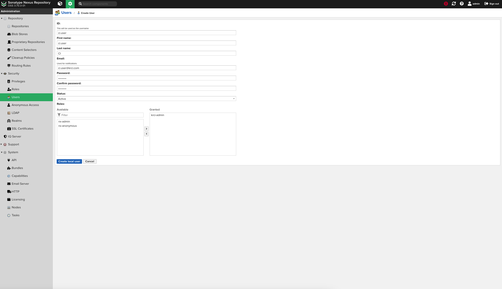

<!-- markdownlint-disable MD025 -->

import Tabs from '@theme/Tabs';
import TabItem from '@theme/TabItem';

# Sonatype Nexus Repository OSS Integration

<head>
  <link rel="canonical" href="https://docs.kuberocketci.io/docs/operator-guide/artifacts-management/nexus-sonatype" />
</head>

This documentation guide provides comprehensive instructions for integrating Sonatype Nexus Repository OSS (Nexus) with KubeRocketCI.

<div style={{ display: 'flex', justifyContent: 'center' }}>
<iframe width="560" height="315" src="https://www.youtube-nocookie.com/embed/ger8yoXB24U" title="Integrate KubeRocketCI with Nexus" frameborder="0" allow="accelerometer; autoplay; clipboard-write; encrypted-media; gyroscope; picture-in-picture" allowfullscreen="allowfullscreen"></iframe>
</div>

## Prerequisites

Before proceeding, ensure the following prerequisites are met:

* Kubectl version 1.32.0+ is installed. Please refer to the [Kubernetes official website](https://kubernetes.io/releases/download/) for details.
* [Helm](https://helm.sh) version 3.14.0+ is installed. Please refer to the [Helm page](https://github.com/helm/helm/releases) on GitHub for details.

## Installation

To install Nexus in environment, it's recommended to use the resources provided in the [Cluster Add-Ons](https://github.com/epam/edp-cluster-add-ons) repository. This approach involves installing both the Nexus repository manager and the [nexus-operator](https://github.com/epam/edp-nexus-operator). Leveraging the Cluster Add-Ons simplifies the deployment and management process, providing a streamlined method to integrate Nexus into infrastructure:

1. **Nexus Repository Manager**: First, navigate to the forked cluster Add-Ons repository and align the [nexus values.yaml](https://github.com/epam/edp-cluster-add-ons/tree/main/clusters/core/addons/nexus/values.yaml) and [nexus-operator values.yaml](https://github.com/epam/edp-cluster-add-ons/tree/main/clusters/core/addons/nexus-operator/values.yaml) files. Follow the instructions to deploy Nexus, ensuring it's correctly configured to serve as artifact repository.

2. Update the configuration to enable **nexus** and **nexus-operator** in [Add-Ons](https://github.com/epam/edp-cluster-add-ons/blob/main/clusters/core/apps/values.yaml) repository:

    ```yaml title="clusters/core/apps/values.yaml"
    nexus:
      createNamespace: true
      enable: true

    nexus-operator:
      createNamespace: true
      enable: true
    ```

3. Sync resources and wait till the all **nexus** and **nexus-operator** resources is created:

    

4. **Sign In** into **Nexus Repository Manager** using the default credentials **Username**: `admin` and **Password**: `admin123` and update the default password for better security:

    

## Configuration

With [Add-ons approach](https://github.com/epam/edp-cluster-add-ons/blob/main/clusters/core) `nexus-operator` create the necessary roles, **Service Account** `ci.user`, blob stores, repository, scripts, cleanup policies automatically.

KubeRocketCI organizes artifacts within Nexus according to the following hierarchy:

```bash
├── krci-dotnet-group
   │   ├── krci-dotnet-proxy
   │   ├── krci-dotnet-releases
   │   ├── krci-dotnet-snapshots
   │   └── krci-dotnet-hosted
   krci-maven-group
   │   ├── krci-maven-proxy
   │   ├── krci-maven-releases
   │   ├── krci-maven-snapshots
   krci-npm-group
   │   ├── krci-npm-proxy
   │   ├── krci-npm-releases
   │   ├── krci-npm-snapshots
   │   └── krci-npm-hosted
   krci-python-group
   │   ├── krci-python-proxy
   │   ├── krci-python-releases
   │   ├── krci-python-snapshots
   krci-yum-group
   ├── krci-yum-releases
   ├── krci-yum-snapshots
   └── krci-container-hosted
```

Below is a comprehensive guide on how to create all the resources manually.

### Configure Nexus Repository Manager With nexus-operator

1. Create a Kubernetes Secret that the **nexus-operator** will use to connect to the **Nexus Repository Manager** and create all resources:

  <Tabs
    defaultValue="manifests"
    values={[
      {label: 'Manifests', value: 'manifests'},
      {label: 'External Secrets Operator', value: 'externalsecret'},
    ]}>
    <TabItem value="manifests">
      ```yaml
      apiVersion: v1
      kind: Secret
      metadata:
        name: nexus-admin-password
        namespace: nexus
      type: Opaque
      data:
        user: YWRtaW4=     # base64-encoded value of "admin"
        password: cGFzcw== # base64-encoded value of "pass"
      ```
    </TabItem>
    <TabItem value="externalsecret">
      ```json
      "nexus-admin-password":
      {
        "user": "XXXXXXX",
        "password": "XXXXXXX"
      }
      ```
      </TabItem>
  </Tabs>

2. Create a secret using `manifests` or with `External Secrets Operator` to enable the **edp-nexus-operator** to connect to the **Nexus Repository Manager** for provisioning:

  <Tabs
    defaultValue="manifests"
    values={[
      {label: 'Manifests', value: 'manifests'},
      {label: 'External Secrets Operator', value: 'externalsecret'},
    ]}>
    <TabItem value="manifests">
      ```yaml
      apiVersion: v1
      kind: Secret
      metadata:
        name: ci-nexus
        namespace: nexus
      type: Opaque
      stringData:
        password: <nexus-user-password>
      ```
    </TabItem>
    <TabItem value="externalsecret">
      ```json
      "ci-nexus":
      {
        "password": "XXXXXXX"
      }
      ```
      </TabItem>
  </Tabs>

### Configure Nexus Repository Manager Without nexus-operator

Without using the **nexus-operator**, manual updates are required for the Helm chart values of the **Nexus Repository Manager**, as well as the creation of blob stores, repositories, roles, and the **Service Account** `ci.user`:

1. Create blob store. Open the Nexus UI and navigate to **Server administration and configuration** -> **Repository** -> **Blob Stores** and click **Create Blob Store**, fill the following fields and click **Save** button:

    <Tabs
      defaultValue="java"
      values={[
        {label: 'Java', value: 'java'},
        {label: 'JavaScript', value: 'javascript'},
        {label: 'DotNet', value: 'dotnet'},
        {label: 'Python', value: 'python'},
        {label: 'RPM', value: 'rpm'}
      ]}>

      <TabItem value="java">
        * **Type**: `File`
        * **Name**: `krci-maven`
      </TabItem>
      <TabItem value="javascript">
        * **Type**: `File`
        * **Name**: `krci-npm`
      </TabItem>
      <TabItem value="dotnet">
        * **Type**: `File`
        * **Name**: `krci-dotnet`
      </TabItem>
      <TabItem value="python">
        * **Type**: `File`
        * **Name**: `krci-python`
      </TabItem>
      <TabItem value="rpm">
        * **Type**: `File`
        * **Name**: `krci-yum`
      </TabItem>
    </Tabs>

2. KubeRocketCI operates using a specific repository naming convention, where all repository names adhere to predefined standards. To align with this, navigate to **Server administration and configuration** -> **Repository** -> **Repositories** within Nexus. Here, repository creation is limited to those that match the required programming language, ensuring consistency and compliance with the KubeRocketCI framework.

    

    <Tabs
      defaultValue="java"
      values={[
        {label: 'Java', value: 'java'},
        {label: 'JavaScript', value: 'javascript'},
        {label: 'DotNet', value: 'dotnet'},
        {label: 'Python', value: 'python'},
        {label: 'RPM', value: 'rpm'}
      ]}>

      <TabItem value="java">
        a) Click Create a repository by selecting `maven2(proxy)` fill the following fields and click **Create repository**:
        * **Name** `krci-maven-proxy`
        * **Remote storage URL** `https://repo1.maven.org/maven2/`
        * **Blob store** `krci-maven`
        * **HTTP request settings** `check`
        * **Use-agent customization** `user-agent-suffix`
        * **Connection retries** `10`
        * **Connection timeout** `1440`
        <br/>
        b) Click Create a repository by selecting `maven2(hosted)` fill the following fields  and click **Create repository**:
        * **Name** `krci-maven-snapshots`
        * **Version policy** `snapshots`
        * **Blob store** `krci-maven`
        <br/>
        c) Click Create a repository by selecting `maven2(hosted)` fill the following fields and click **Create repository**:
        * **Name** `krci-maven-releases`
        * **Version policy** `release`
        * **Blob store** `krci-maven`
        <br/>
        d) Click Create a repository by selecting `maven2(group)` fill the following fields and click **Create repository**:
        * **Name** `krci-maven-group`
        * **Version policy** `release`
        * **Member repositories** `krci-maven-proxy`, `krci-maven-snapshots`, `krci-maven-releases`
      </TabItem>

      <TabItem value="javascript">
        a) Click Create a repository by selecting `npm(proxy)` fill the following fields **Create repository**:
        * **Name** `krci-npm-proxy`
        * **Remote storage URL** `https://registry.npmjs.org`
        * **Blob store** `krci-npm`
        * **HTTP request settings** `check`
        * **Use-agent customization** `user-agent-suffix`
        * **Connection retries** `10`
        * **Connection timeout** `1440`
        <br/>
        b) Click Create a repository by selecting `npm(hosted)` fill the following fields and click **Create repository**:
        * **Name** `krci-npm-snapshots`
        * **Blob store** `krci-npm`
        <br/>
        c) Click Create a repository by selecting `npm(hosted)` fill the following fields and click **Create repository**:
        * **Name** `krci-npm-releases`
        * **Blob store** `krci-npm`
        <br/>
        d) Click Create a repository by selecting `npm(hosted)` fill the following fields and click **Create repository**:
        * **Name** `krci-npm-hosted`
        * **Blob store** `krci-npm`
        <br/>
        e) Click Create a repository by selecting `npm(group)` fill the following fields and click **Create repository**:
        * **Name** `krci-npm-group`
        * **Member repositories** `krci-npm-proxy`, `krci-npm-snapshots`, `krci-npm-releases`, `krci-npm-hosted`
      </TabItem>

      <TabItem value="dotnet">
        a) Click Create a repository by selecting `nuget(proxy)` fill the following fields and click **Create repository**:
        * **Name** `krci-dotnet-proxy`
        * **Protocol version NuGet V3** `check`
        * **Remote storage URL** `https://api.nuget.org/v3/index.json`
        * **Blob store** `krci-dotnet`
        * **HTTP request settings** `check`
        * **Use-agent customization** `user-agent-suffix`
        * **Connection retries** `10`
        * **Connection timeout** `1440`
        <br/>
        b) Click Create a repository by selecting `nuget(hosted)` fill the following fields and click **Create repository**:
        * **Name** `krci-dotnet-snapshots`
        * **Blob store** `krci-dotnet`
        <br/>
        c) Click Create a repository by selecting `nuget(hosted)` fill the following fields and click **Create repository**:
        * **Name** `krci-dotnet-releases`
        * **Blob store** `krci-dotnet`
        <br/>
        d) Click Create a repository by selecting `nuget(hosted)` fill the following fields and click **Create repository**:
        * **Name** `krci-dotnet-hosted`
        * **Blob store** `krci-dotnet`
        <br/>
        e) Click Create a repository by selecting `nuget(group)` fill the following fields and click **Create repository**:
        * **Name** `krci-dotnet-group`
        * **Member repositories** `krci-dotnet-proxy`, `krci-dotnet-snapshots`, `krci-dotnet-releases`, `krci-dotnet-hosted`
      </TabItem>

      <TabItem value="python">
        a) Click Create a repository by selecting `pypi(proxy)` fill the following fields and click **Create repository**:
        * **Name** `krci-python-proxy`
        * **Remote storage URL** `https://pypi.org`
        * **Blob store** `krci-python`
        * **HTTP request settings** `check`
        * **Use-agent customization** `user-agent-suffix`
        * **Connection retries** `10`
        * **Connection timeout** `1440`
        <br/>
        b) Click Create a repository by selecting `pypi(hosted)` fill the following fields and click **Create repository**:
        * **Name** `krci-python-snapshots`
        * **Blob store** `krci-python`
        <br/>
        c) Click Create a repository by selecting `pypi(hosted)` fill the following fields and click **Create repository**:
        * **Name** `krci-python-releases`
        * **Blob store** `krci-python`
        <br/>
        d) Click Create a repository by selecting `pypi(group)` fill the following fields and click **Create repository**:
        * **Name** `krci-python-group`
        * **Member repositories** `krci-python-proxy`, `krci-python-snapshots`, `krci-python-releases`
        <br/>
      </TabItem>

      <TabItem value="rpm">
        a) Click Create a repository by selecting `yum(proxy)` fill the following fields and click **Create repository**:
        * **Name** `krci-yum-proxy`
        * **Remote storage URL** `http://fedora.ip-connect.info/linux/development/rawhide/Everything/x86_64/os/`
        * **Blob store** `krci-yum`
        * **HTTP request settings** `check`
        * **Use-agent customization** `user-agent-suffix`
        * **Connection retries** `10`
        * **Connection timeout** `1440`
        <br/>
        b) Click Create a repository by selecting `yum(hosted)` fill the following fields and click **Create repository**:
        * **Name** `krci-yum-snapshots`
        * **Repo data Depth** `3`
        * **Blob store** `krci-yum`
        <br/>
        c) Click Create a repository by selecting `yum(hosted)` fill the following fields and click **Create repository**:
        * **Name** `krci-yum-releases`
        * **Repo data Depth** `3`
        * **Blob store** `krci-yum`
        <br/>
      </TabItem>

    </Tabs>

3. Open the Nexus UI and navigate to **Server administration and configuration** -> **Security** -> **Roles**. Click the **Create Role** button, fill the following fields and click **Save** button:

    * **Type**: `Nexus role`
    * **Role ID**: `krci-admin`
    * **Role Name**: `krci-admin`
    * **Role Descriptions**: `Read and write access to all repos and scripts`
    * **Applied Privileges**: `nx-apikey-all`, `nx-repository-view-*-*-add`, `nx-repository-view-*-*-browse`,`nx-repository-view-*-*-edit`, `nx-repository-view-*-*-read`, `nx-script-*-add`, `nx-script-*-delete`, `nx-script-*-read`, `nx-script-*-run`

    

4. Create repository Service Account `ci.user`. Open the Nexus UI and navigate to **Server administration and configuration** -> **Security** -> **User**. Click the `Create local user` button to create a new user:

    

5. Type the `ci.user` username, fill the following fields and click the **Create local user** button to create the ***Service Account**, fill the following fields and click **Save** button::

    * **ID**: `ci.user`
    * **First name**: `ci.user`
    * **Last name**: `CI`
    * **Email**: `ci.user@krci.com`
    * **Password**: `<nexus-user-password>`
    * **Status**: `Active`
    * **Roles**: `krci-admin`

    

## Integrate Nexus Repository Manager With KubeRocketCI

For provision secret using manifest, KubeRocketCI portal or with the externalSecrets operator:

  <Tabs
    defaultValue="kuberocketci"
    values={[
      {label: 'KubeRocketCI portal', value: 'kuberocketci'},
      {label: 'Manifests', value: 'manifests'},
      {label: 'External Secrets Operator', value: 'externalsecret'},
    ]}>
    <TabItem value="kuberocketci">
      Go to **Portal** -> **Configuration** -> **ARTIFACTS STORAGE** -> **NEXUS**. Update or click **+ ADD INTEGRATION** fill the following fields and click the `SAVE` button:
      * **Quick link URL** `https://nexus.example.com`
      * **URL** `http://nexus.nexus:8081`
      * **User** `nexus-user-id`
      * **Password** `nexus-user-password`

      
    </TabItem>
    <TabItem value="manifests">
      ```yaml
      apiVersion: v1
      kind: Secret
      metadata:
        name: ci-nexus
        namespace: krci
        labels:
          app.edp.epam.com/secret-type: nexus
          app.edp.epam.com/integration-secret: "true"
      type: Opaque
      stringData:
        url: https://nexus.example.com
        username: <nexus-user-id>
        password: <nexus-user-password>
      ```
    </TabItem>
    <TabItem value="externalsecret">
      ```json
      "ci-nexus":
      {
        "url": "https://nexus.example.com",
        "username": "XXXXXXX",
        "password": "XXXXXXX"
      },
      ```

      Go to **Portal** -> **Configuration** -> **ARTIFACTS STORAGE** -> **NEXUS** and see `Managed by External Secret` message:

      

      More detail of External Secrets Operator Integration can found on [the following page](../secrets-management/external-secrets-operator-integration.md)
      </TabItem>
  </Tabs>

## Related Articles

* [Install KubeRocketCI](../install-kuberocketci.md)
* [Install External Secrets Operator](../secrets-management/install-external-secrets-operator.md)
* [External Secrets Operator Integration](../secrets-management/external-secrets-operator-integration.md)
* [Cluster Add-Ons Overview](../add-ons-overview.md)
