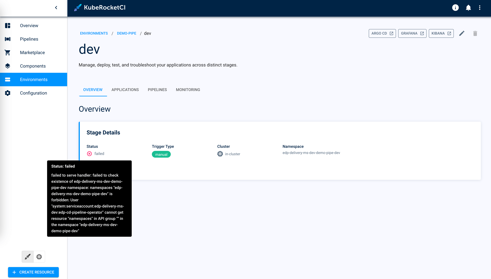
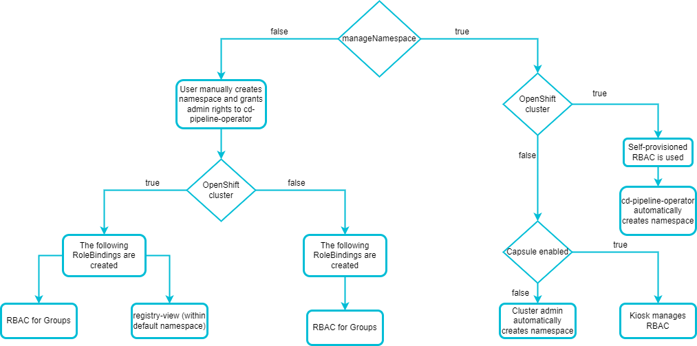

<!-- markdownlint-disable MD025 -->

# Kubernetes Namespace Management

<head>
  <link rel="canonical" href="https://docs.kuberocketci.io/docs/operator-guide/auth/namespace-management" />
</head>

KubeRocketCI [deploys](../../user-guide/add-cd-pipeline.md) applications to namespaces. By default, the platform automatically creates these namespaces. This page provides information on an alternative approach to namespace management.

## Overview

Namespaces are created by the platform when user creates CD Pipelines. The operator creates them according to the specific format: `<platform-namespace>-<application-name>-<stage-name>`.
The [cd-pipeline-operator](https://github.com/epam/edp-cd-pipeline-operator) should have the permissions to automatically create namespaces when deploying applications and delete them when uninstalling applications.

## Disable Automatic Namespace Creation

In certain scenarios, the automatic generation of namespaces might be restricted. For instance, project-specific security protocols might necessitate disabling this feature. This can be achieved by adjusting the `manageNamespace` parameter within the [values.yaml](https://github.com/epam/edp-cd-pipeline-operator/blob/release/2.20/deploy-templates/values.yaml#L96) file.
By default, `manageNamespace` is enabled (true), but it can be toggled off (false). Consequently, users might encounter issues when attempting to deploy applications through the KubeRocketCI Portal UI due to permission constraints:

  

The error highlighted above indicates the necessity for users to manually create a namespace following the `<platform-namespace>-<application-name>-<stage-name>` naming convention prior to stage creation. Moreover, the cd-pipeline-operator requires administrative rights to manage the namespace effectively. For instructions on manually creating a namespace, proceed with the steps outlined below:

1. Create the namespace by running the command below:

    ```bash
      kubectl create namespace <platform-namespace>-<application-name>-<stage-name>
    ```

    :::note
      The `<platform-namespace>-<application-name>-<stage-name>` format for namespaces is set by default but is not mandatory. You can set your custom namespace when creating an Environment.
    :::

2. Create the administrator RoleBinding resource by applying the file below with the `kubectl apply -f grant_admin_permissions.yaml` command:

    :::note grant_admin_permissions.yaml

      ```yaml
      kind: RoleBinding
      apiVersion: rbac.authorization.k8s.io/v1
      metadata:
        name: edp-cd-pipeline-operator-admin
        namespace: <platform-namespace>-<application-name>-<stage-name>
      subjects:
        - kind: ServiceAccount
          name: edp-cd-pipeline-operator
          namespace: krci
      roleRef:
        apiGroup: rbac.authorization.k8s.io
        kind: ClusterRole
        name: admin
      ```

    :::

3. Restart the cd-pipeline-operator deployment, to speedup reconciliation.

## CD Pipeline Operator RBAC Model

The `manageNamespace` parameter also defines the resources that will be created depending on the cluster deployed whether it is OpenShift or Kubernetes. This scheme displays the nesting of operator input parameters:



:::note
  When deploying application on the OpenShift cluster, the `registry-view` RoleBinding is created in the main namespace.
:::

## Related Articles

* [KubeRocketCI Access Model](platform-auth-model.md)
* [EKS OIDC With Keycloak](configure-keycloak-oidc-eks.md)
