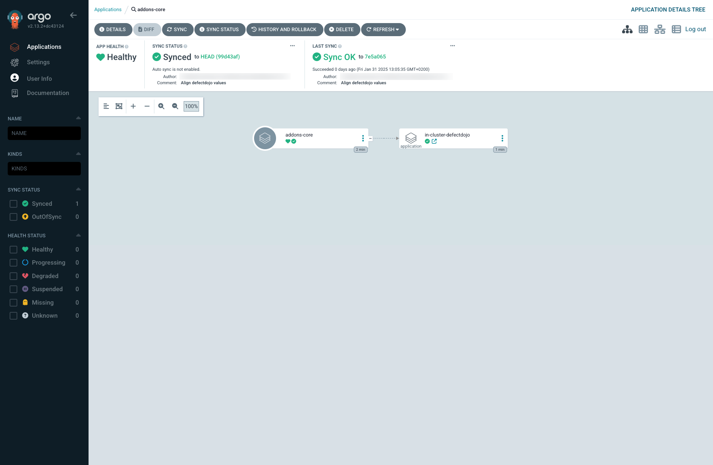
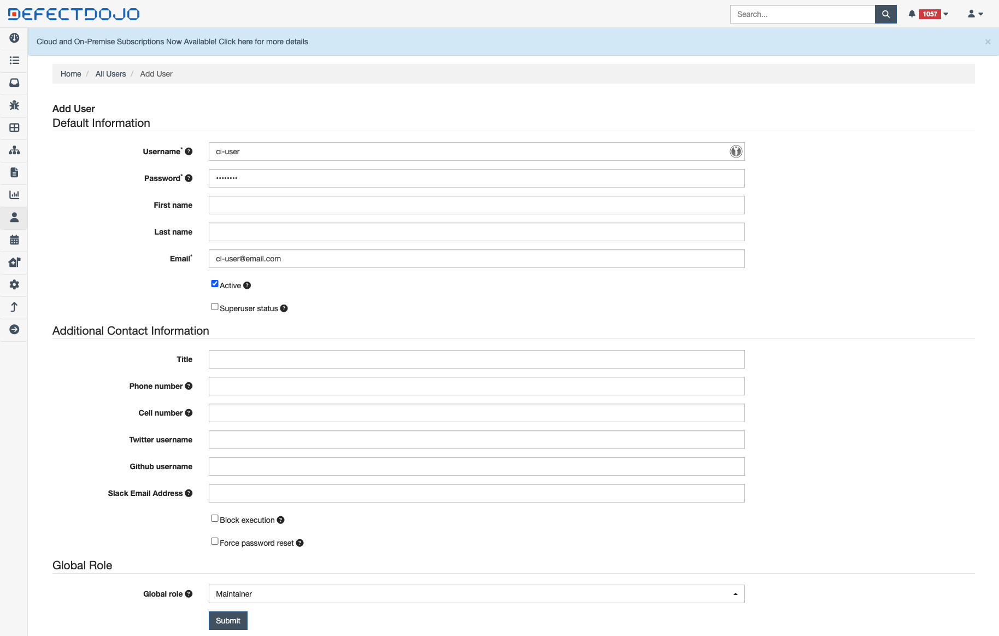
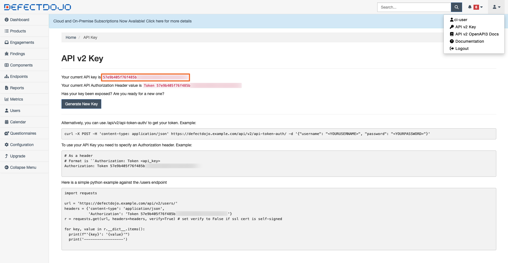
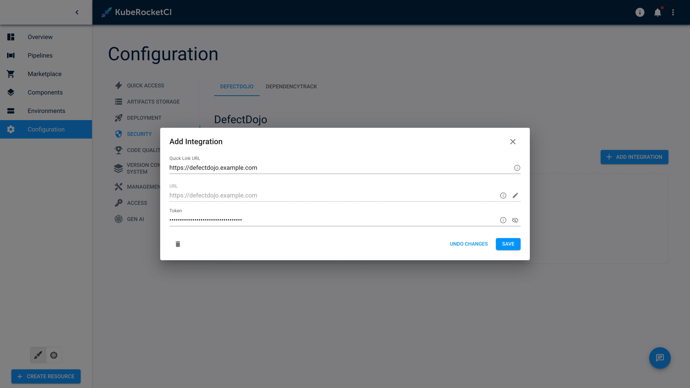
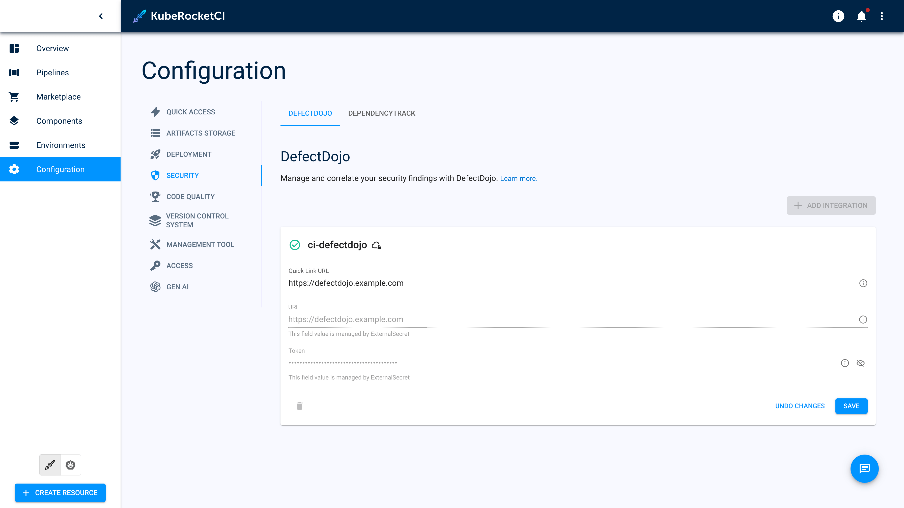

<!-- markdownlint-disable MD025 -->

import Tabs from '@theme/Tabs';
import TabItem from '@theme/TabItem';

# Integrate DefectDojo

<head>
  <link rel="canonical" href="https://docs.kuberocketci.io/docs/operator-guide/devsecops/defectdojo" />
</head>

Inspect the main steps to perform for installing DefectDojo via Helm Chart.

:::info
  It is also possible to install DefectDojo using the add-ons approach. For details, please refer to the [KubeRocketCI addons approach](https://github.com/epam/edp-cluster-add-ons).
:::

## Prerequisites

* Kubectl version 1.32.0+ is installed. Please refer to the [Kubernetes official website](https://kubernetes.io/releases/download/) for details.
* [Helm](https://helm.sh) version 3.14.0+ is installed. Please refer to the [Helm page](https://github.com/helm/helm/releases) on GitHub for details.

## Installation

:::info
  Please refer to the [DefectDojo Helm Chart](https://github.com/DefectDojo/django-DefectDojo/tree/master/helm/defectdojo)
  and [Deploy DefectDojo into the Kubernetes cluster](https://github.com/DefectDojo/django-DefectDojo/blob/dev/readme-docs/KUBERNETES.md) sections for details.
:::

## Installation DefectDojo Cluster Add-On Approach

To install DefectDojo in environment, it's recommended to use the resources provided in the [Cluster Add-Ons](https://github.com/epam/edp-cluster-add-ons) repository. Leveraging the Cluster Add-Ons simplifies the deployment and management process, providing a streamlined method to integrate DefectDojo into infrastructure.

1. Navigate to the forked cluster Add-Ons repository and align the [defectdojo values.yaml](https://github.com/epam/edp-cluster-add-ons/tree/main/clusters/core/addons/defectdojo/values.yaml) file. Follow the instructions to deploy DefectDojo.

2. Update the configuration to enable **DefectDojo** in [Add-Ons](https://github.com/epam/edp-cluster-add-ons/blob/main/clusters/core/apps/values.yaml) repository:

    ```yaml title="clusters/core/apps/values.yaml"
    defectdojo:
      createNamespace: true
      enable: true
    ```

3. Sync resources and wait till the all **DefectDojo** resources is created:

    

## Installation DefectDojo Helm Chart Approach

1. Check that a security namespace is created. If not, run the following command to create it:

    ```bash
    kubectl create namespace defectdojo
    ```

    :::warning For the OpenShift users
        When using the OpenShift platform, install the `SecurityContextConstraints` resource. In case of using a custom namespace for `defectdojo`, change the namespace in the `users` section.

      <details>
      <summary><b>View: defectdojo-scc.yaml</b></summary>
          ```yaml
          allowHostDirVolumePlugin: false
          allowHostIPC: false
          allowHostNetwork: false
          allowHostPID: false
          allowHostPorts: false
          allowPrivilegeEscalation: true
          allowPrivilegedContainer: false
          allowedCapabilities: null
          apiVersion: security.openshift.io/v1
          allowedFlexVolumes: []
          defaultAddCapabilities: []
          fsGroup:
            type: MustRunAs
            ranges:
              - min: 999
                max: 65543
          groups: []
          kind: SecurityContextConstraints
          metadata:
            annotations:
                "helm.sh/hook": "pre-install"
            name: defectdojo
          priority: 1
          readOnlyRootFilesystem: false
          requiredDropCapabilities:
          - KILL
          - MKNOD
          - SETUID
          - SETGID
          runAsUser:
            type: MustRunAsRange
            uidRangeMin: 1
            uidRangeMax: 65543
          seLinuxContext:
            type: MustRunAs
          supplementalGroups:
            type: RunAsAny
          users:
          - system:serviceaccount:defectdojo:defectdojo
          - system:serviceaccount:defectdojo:defectdojo-rabbitmq
          - system:serviceaccount:defectdojo:default
          volumes:
          - configMap
          - downwardAPI
          - emptyDir
          - persistentVolumeClaim
          - projected
          - secret
          ```
      </details>
    :::

2. Add a chart repository:

    ```bash
    helm repo add defectdojo 'https://raw.githubusercontent.com/DefectDojo/django-DefectDojo/helm-charts'
    helm repo update
    ```

3. Create PostgreSQL admin secret:

    ```bash
    kubectl -n defectdojo create secret generic defectdojo-postgresql-specific \
    --from-literal=postgresql-password=<postgresql_password> \
    --from-literal=postgresql-postgres-password=<postgresql_postgres_password>
    ```

    :::note
      The `postgresql_password` and `postgresql_postgres_password` passwords must be 16 characters long.
    :::

4. Create Rabbitmq admin secret:

    ```bash
    kubectl -n defectdojo create secret generic defectdojo-rabbitmq-specific \
    --from-literal=rabbitmq-password=<rabbitmq_password> \
    --from-literal=rabbitmq-erlang-cookie=<rabbitmq_erlang_cookie>
    ```

    :::note
      The `rabbitmq_password` password must be 10 characters long.

      The `rabbitmq_erlang_cookie` password must be 32 characters long.
    :::

5. Create DefectDojo admin secret:

    ```bash
    kubectl -n defectdojo create secret generic defectdojo \
    --from-literal=DD_ADMIN_PASSWORD=<dd_admin_password> \
    --from-literal=DD_SECRET_KEY=<dd_secret_key> \
    --from-literal=DD_CREDENTIAL_AES_256_KEY=<dd_credential_aes_256_key> \
    --from-literal=METRICS_HTTP_AUTH_PASSWORD=<metric_http_auth_password>
    ```

    :::note
      The `dd_admin_password` password must be 22 characters long.

      The `dd_secret_key` password must be 128 characters long.

      The `dd_credential_aes_256_key` password must be 128 characters long.

      The `metric_http_auth_password` password must be 32 characters long.
    :::

6. Install DefectDojo v.2.22.4 using [defectdojo/defectdojo](https://github.com/DefectDojo/django-DefectDojo/tree/master/helm/defectdojo) Helm chart v.1.6.69:

    ```bash
    helm upgrade --install \
    defectdojo \
    --version 1.6.69 \
    defectdojo/defectdojo \
    --namespace defectdojo \
    --values values.yaml
    ```

    Check out the *values.yaml* file sample of the DefectDojo customization:

    <details>
    <summary><b>View: values.yaml</b></summary>

      ```yaml
      tag: 2.22.4
      fullnameOverride: defectdojo
      host: defectdojo.<ROOT_DOMAIN>
      site_url: https://defectdojo.<ROOT_DOMAIN>
      alternativeHosts:
        - defectdojo-django.defectdojo

      initializer:
        # should be false after initial installation was performed
        run: true
      django:
        ingress:
          enabled: true # change to 'false' for OpenShift
          activateTLS: false
        uwsgi:
          livenessProbe:
            # Enable liveness checks on uwsgi container. Those values are use on nginx readiness checks as well.
            # default value is 120, so in our case 20 is just fine
            initialDelaySeconds: 20
      ```

    </details>

7. For the OpenShift platform, install a Route:

    <details>
    <summary><b>View: defectdojo-route.yaml</b></summary>

      ```yaml
      kind: Route
      apiVersion: route.openshift.io/v1
      metadata:
        name: defectdojo
        namespace: defectdojo
      spec:
        host: defectdojo.<ROOT_DOMAIN>
        path: /
        tls:
          insecureEdgeTerminationPolicy: Redirect
          termination: edge
        to:
          kind: Service
          name: defectdojo-django
        port:
          targetPort: http
        wildcardPolicy: None

      ```

    </details>

## Configuration DefectDojo ci-user

To prepare DefectDojo for integration with KubeRocketCI, follow the steps below:

1. Create ci user in DefectDojo UI:

    * Login to DefectDojo UI using `admin` credentials:

      ```bash
      echo "DefectDojo admin password: $(kubectl \
      get secret defectdojo \
      --namespace=defectdojo \
      --output jsonpath='{.data.DD_ADMIN_PASSWORD}' \
      | base64 --decode)"
      ```

    * Go to User section

    * Create new user Global role `Maintainer` permission:

      

2. Get a token of the DefectDojo user:

    * Login to the DefectDojo UI using the credentials from previous steps.

    * Click on profile button select the `API v2 key`.

    * Copy the API key.

      

## Integration DefectDojo with KubeRocketCI

Provision the secret using `Portal UI`, `Manifest` or with the `externalSecrets` operator:

    <Tabs
      defaultValue="portal"
      values={[
        {label: 'Portal UI', value: 'portal'},
        {label: 'Manifest', value: 'manifest'},
        {label: 'External Secrets Operator', value: 'eso'}
      ]}>
      <TabItem value="portal">
      Go to the **Portal** open **Configuration** -> **SECURITY** -> **DEFECTDOJO**. Update or click **+ ADD INTEGRATION** fill fields `Quick Link URL`, `URL` and `Token` click the `save` button.

      
      </TabItem>

      <TabItem value="manifest">
      ```yaml
      apiVersion: v1
      kind: Secret
      metadata:
        name: ci-defectdojo
        namespace: krci
        labels:
          app.edp.epam.com/secret-type: defectdojo
          app.edp.epam.com/integration-secret: "true"
      stringData:
        url: https://defectdojo.example.com
        token: <token>
      ```
      </TabItem>

      <TabItem value="eso">
        Store defectdojo URL and Token in AWS Parameter Store with following format:

      ```json
      "ci-defectdojo":
      {
        "url": "https://defectdojo.example.com",
        "token": "XXXXXXXXXXXX"
      }
      ```

      Go to the **Portal** open **Configuration** -> **SECURITY** -> **DefectDojo** and see the `Managed by External Secret` message.

      

      More details about the External Secrets Operator integration procedure can be found in the [External Secrets Operator Integration](../secrets-management/external-secrets-operator-integration.md) page.
      </TabItem>
    </Tabs>

After following the instructions provided, you should be able to integrate your DefectDojo with the KubeRocketCI using one of the available scenarios.

## Related Articles

* [Install External Secrets Operator](../secrets-management/install-external-secrets-operator.md)
* [External Secrets Operator Integration](../secrets-management/external-secrets-operator-integration.md)
* [Install Harbor](../artifacts-management/harbor-installation.md)
