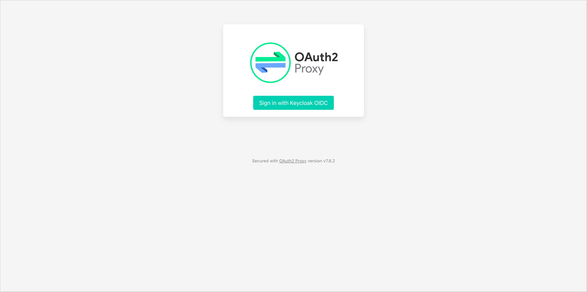

<!-- markdownlint-disable MD025 -->

import Tabs from '@theme/Tabs';
import TabItem from '@theme/TabItem';

<head>
  <link rel="canonical" href="https://docs.kuberocketci.io/docs/operator-guide/infrastructure-providers/atlantis-installation" />
</head>

# Atlantis: Enterprise-Grade Terraform Automation for Kubernetes

Atlantis is an enterprise-ready tool for automating Terraform workflows in Kubernetes environments. It provides a robust web interface and seamlessly integrates with version control systems (VCS) to automatically run Terraform operations as part of the pull request process. This enables teams to systematically review, approve, and apply infrastructure changes in a consistent, secure, and auditable manner.

This guide covers the full process of installing and configuring Atlantis as Helm chart. It includes setting up authentication, configuring integration with supported version control systems (such as Bitbucket, GitHub, or GitLab), and preparing Atlantis to automate Terraform workflows triggered by pull/merge requests.

## Prerequisites

To install and configure Atlantis, ensure the following prerequisites are met:

- A running [AWS EKS](../deploy-aws-eks.md) cluster with the necessary [IAM](https://aws.amazon.com/iam) permissions to create IAM roles.
- A Git repository containing Terraform code with the required repository [structure](https://www.runatlantis.io/docs/requirements.html#repository-structure) is created.
- An Atlantis Git [user](https://www.runatlantis.io/docs/access-credentials.html#create-an-atlantis-user-optional) is created with a generated [Access Token](https://www.runatlantis.io/docs/access-credentials.html#generating-an-access-token).
- A forked copy of the [edp-cluster-add-ons](https://github.com/epam/edp-cluster-add-ons) repository for managing the Atlantis installation is cloned to the local machine.
- [Helm](https://helm.sh) is installed and configured.
- [kubectl](https://kubernetes.io/docs/tasks/tools/) is installed and configured.
- (Optional) [Argo CD](../install-argocd.md) is installed and configured.
- (Optional) [External Secrets Operator](../secrets-management/external-secrets-operator-integration) is installed and configured.
- (Optional) [Keycloak](../auth/keycloak) and [keycloak-operator](https://github.com/epam/edp-keycloak-operator) is installed and configured.

## Configuring Atlantis

:::important
All configuration steps described in this section are based on the [Atlantis](https://github.com/epam/edp-cluster-add-ons/tree/main/clusters/core/addons/atlantis) Helm chart that can be found in the [edp-cluster-add-ons](https://github.com/epam/edp-cluster-add-ons/tree/main) repository.
:::

This section describes how to configure Atlantis for integration with supported version control systems (VCS), including setting up authentication for Atlantis Web Server, configuring Webhooks, and creating the AWS IAM Role which is required for Atlantis to perform Terraform operations on the selected provider.

## Authentication Configuration

By default, Atlantis Web Server is deployed without any authentication mechanism, which means it is publicly accessible. This setup is not recommended, as it exposes the Atlantis UI and related operations to unauthorized access.

This section describes two approaches to configure authentication for Atlantis Web Server:

1. **Basic Authentication**: A simple method that restricts access using a static username and password, stored as a Kubernetes secret.
2. **External Authentication Proxy**: A more advanced method that delegates authentication to an external identity provider (e.g., Keycloak) using an authentication proxy tools like [oauth2-proxy](https://oauth2-proxy.github.io/oauth2-proxy/). This method provides role-based access control and centralized user management.

### Basic Authentication

:::note
For more details on configuring basic authentication, refer to the [Atlantis Security documentation](https://www.runatlantis.io/docs/security#enable-authentication-on-atlantis-web-server) page.
:::

To configure Basic Authentication for Atlantis Web Server, follow the steps below:

1. Create a Kubernetes secret containing the username and password for Basic Authentication:

    There are two ways to create a secret: manually using the `kubectl` command or using the External Secrets Operator (ESO).

        <details>
          <summary><b>kubectl</b></summary>

        Run the following command to create a secret:
        ```bash
        kubectl create secret generic atlantis-creds -n atlantis \
          --from-literal=username=<username> \
          --from-literal=password=<password>
        ```

        The `username` and `password` are the credentials that will be used to access the Atlantis Web Server.

        </details>

        <details>
          <summary><b>External Secrets Operator</b></summary>

        Enable ESO section in the `values.yaml` file and configure the necessary parameters. For example:
        ```yaml
        eso:
          # -- Install components of the ESO.
          enabled: true
          # -- Defines provider type. One of `aws`, `generic`, or `vault`.
          provider: "aws"
          # -- Defines the path to the secret in the provider. If provider is `vault`, this is the path must be prefixed with `secret/`.
          secretPath: "/infra/core/addons/atlantis"
          # -- AWS configuration (if provider is `aws`).
          aws:
            # -- AWS region.
            region: "eu-central-1"
            # -- AWS role ARN for the ExternalSecretOperator to assume.
            roleArn: "arn:aws:iam::012345678910:role/AWSIRSA_Shared_ExternalSecretOperatorAccess"
        ```

        Specify the `username` and `password` fields in the AWS Parameter Store object. For example:
        ```json
        {
          "oauth2-proxy": {
            "client-id": "",
            "cookie-secret": ""
          },
          "bitbucket_token": "",
          "bitbucket_secret": "",
          "username": "<username>",
          "password": "<password>",
          "clientSecret": ""
        }
        ```

        After configuring the ESO section, the External Secrets Operator will automatically create the Kubernetes secret `atlantis-creds` during installation or upgrade of the Atlantis Helm chart.

        </details>

2. Update the `values.yaml` file to enable Basic Authentication by setting the `atlantis.basicAuthSecretName` field to the name of the secret created in the previous step. For example:

    ```yaml title="values.yaml"
    atlantis:
      basicAuthSecretName: atlantis-creds
    ```

3. Apply the changes by using the `helm upgrade` command or syncing the Argo CD application.

After configuring and enabling Basic Authentication, users will be required to provide the username and password to access the Atlantis Web Server.

### External Authentication Proxy (OAuth2 Proxy)

To configure an external authentication proxy (e.g., OAuth2 Proxy) with Keycloak for Atlantis Web Server, follow the steps below:

1. Ensure that the Keycloak and [keycloak-operator](https://github.com/epam/edp-keycloak-operator) are installed and configured.

2. Update the `values.yaml` by setting the `oidc.enabled` field to `true` for enabling KeycloakClient resource creation. For example:

    ```yaml title="values.yaml"
    oidc:
      enabled: true
    ```

3. Create a Kubernetes secret containing the Keycloak client credentials. The secret should include the `clientSecret` field with the value of the Keycloak client secret. For example:

    :::note
    The `keycloak-client-atlantis-secret` is used by keycloak-operator to create the `KeycloakClient` resource.
    :::

    <details>
      <summary><b>kubectl</b></summary>

    Run the following command to create a secret:

    ```bash
    kubectl create secret generic keycloak-client-atlantis-secret -n atlantis \
      --from-literal=clientSecret=<keycloak_client_secret>
    ```

    The `clientSecret` is a random generated string that is used to authenticate the Atlantis client with Keycloak. It can be generated using the following command:

    ```bash
    openssl rand -base64 32 | head -c 32
    ```

    </details>

    <details>
      <summary><b>External Secrets Operator</b></summary>

    Enable ESO section in the `values.yaml` file and configure the necessary parameters. For example:

    ```yaml
    eso:
      # -- Install components of the ESO.
      enabled: true
      # -- Defines provider type. One of `aws`, `generic`, or `vault`.
      provider: "aws"
      # -- Defines the path to the secret in the provider. If provider is `vault`, this is the path must be prefixed with `secret/`.
      secretPath: "/infra/core/addons/atlantis"
      # -- AWS configuration (if provider is `aws`).
      aws:
        # -- AWS region.
        region: "eu-central-1"
        # -- AWS role ARN for the ExternalSecretOperator to assume.
        roleArn: "arn:aws:iam::012345678910:role/AWSIRSA_Shared_ExternalSecretOperatorAccess"
    ```

    Specify the `clientSecret` field in the AWS Parameter Store object. For example:

    ```json
    {
      "oauth2-proxy": {
        "client-id": "",
        "cookie-secret": ""
      },
      "bitbucket_token": "",
      "bitbucket_secret": "",
      "username": "",
      "password": "",
      "clientSecret": "<keycloak_client_secret>"
    }
    ```

    The `clientSecret` is a random generated string that is used to authenticate the Atlantis client with Keycloak. It can be generated using the following command:

    ```bash
    openssl rand -base64 32 | head -c 32
    ```

    After configuring the ESO section, the External Secrets Operator will automatically create the Kubernetes secret `keycloak-client-atlantis-secret` during installation or upgrade of the Atlantis Helm chart.

    </details>

4. Enable the `oauth2-proxy` section in the `values.yaml` file and configure the necessary parameters for the external authentication proxy. For example:

    ```yaml title="values.yaml"
    oauth2-proxy:
      enabled: true
      extraArgs:
        # Skip authentication for /events endpoint to allow Git webhook access
        skip-auth-regex: "^/events$"
      config:
        configFile: |-
          allowed_roles = ["administrator", "developer"]
          client_id = "atlantis"
          code_challenge_method="S256"
          cookie_csrf_expire="5m"
          cookie_csrf_per_request="true"
          cookie_domains = ["atlantis.example.com"]
          cookie_secure = "true"
          email_domains = [ "*" ]
          insecure_oidc_allow_unverified_email = "true"
          oidc_issuer_url = "https://keycloak.example.com/realms/<realm_name>"
          pass_access_token = "true"
          pass_authorization_header = "true"
          pass_basic_auth = "false"
          provider = "keycloak-oidc"
          redirect_url = "https://atlantis.example.com/oauth2/callback"
          skip_jwt_bearer_tokens = "true"
          upstreams = [ "http://atlantis:80" ]
          whitelist_domains = [".example.com"]
          silence_ping_logging = "true"

        existingSecret: oauth2-proxy

      ingress:
        enabled: true
        hosts:
          - atlantis.example.com
    ```

5. Create a Kubernetes secret `oauth2-proxy` containing the `client-id`, `client-secret`, and `cookie-secret` values. The `client-id` and `client-secret` values should match the Keycloak client credentials. The `cookie-secret` value is a random string used to encrypt the session cookies:

    <details>
      <summary><b>kubectl</b></summary>

    Run the following command to create a secret:

    ```bash
    kubectl create secret generic oauth2-proxy -n atlantis \
      --from-literal=client-id=atlantis \
      --from-literal=client-secret=<keycloak_client_secret> \
      --from-literal=cookie-secret=<random_generated_string>
    ```

    The `client-secret` is the random string generated in the previous step.

    The `cookie-secret` is a random generated string that is used to encrypt the session cookies. It can be generated using the following command:

    ```bash
    openssl rand -base64 32 | head -c 32
    ```

    </details>

    <details>
      <summary><b>External Secrets Operator</b></summary>

    Enable ESO section in the `values.yaml` file and configure the necessary parameters. For example:

    ```yaml
    eso:
      # -- Install components of the ESO.
      enabled: true
      # -- Defines provider type. One of `aws`, `generic`, or `vault`.
      provider: "aws"
      # -- Defines the path to the secret in the provider. If provider is `vault`, this is the path must be prefixed with `secret/`.
      secretPath: "/infra/core/addons/atlantis"
      aws:
        # -- AWS region.
        region: "eu-central-1"
        # -- AWS role ARN for the ExternalSecretOperator to assume.
        roleArn: "arn:aws:iam::012345678910:role/AWSIRSA_Shared_ExternalSecretOperatorAccess"
    ```

    Specify the `oauth2-proxy` section in the AWS Parameter Store object. Also, make sure that the `clientSecret` field is included. For example:

    ```json
    {
      "oauth2-proxy": {
        "client-id": "atlantis",
        "cookie-secret": "<random_generated_string>"
      },
      "bitbucket_token": "",
      "bitbucket_secret": "",
      "username": "",
      "password": "",
      "clientSecret": "<keycloak_client_secret>"
    }
    ```

    The `clientSecret` is the random string generated in the previous step.

    The `oauth2-proxy.cookie-secret` is a random generated string that is used to encrypt the session cookies. It can be generated using the following command:

    ```bash
    openssl rand -base64 32 | head -c 32
    ```

    After configuring the ESO section, the External Secrets Operator will automatically create the Kubernetes secret `oauth2-proxy` during installation or upgrade of the Atlantis Helm chart.

    </details>

6. Apply the changes by using the `helm upgrade` command or syncing the Argo CD application.

7. After configuring the external authentication proxy, users will be required to authenticate using Keycloak credentials to access the Atlantis Web Server:

    

## Webhook Configuration

:::note
For more details on configuring webhooks, refer to the [Atlantis Webhook documentation](https://www.runatlantis.io/docs/configuring-webhooks.html).
:::

Atlantis requires a webhook to be configured in the Git repository to trigger Terraform operations. The webhook should be set up to send events to the Atlantis Web Server URL.

For each supported VCS, follow the steps below to configure the webhook:

    <Tabs
      defaultValue="github"
      values={[
        {label: 'GitHub', value: 'github'},
        {label: 'GitLab', value: 'gitlab'},
        {label: 'Bitbucket', value: 'bitbucket'}
      ]}>

      <TabItem value="github">
      To configure the Atlantis webhook in GitHub, follow these steps:

      * In the GitHub repository, navigate to **Settings** -> **Webhooks**.
      * Click **Add webhook**.
      * Set the **Payload URL** to `http://<atlantis-url>/events` or `https://<atlantis-url>/events` (if using SSL).
      * Set the **Content type** to `application/json`.
      * In the **Secret** field, provide the [secret](https://www.runatlantis.io/docs/webhook-secrets.html) generated for the webhook.
      * Select **Let me select individual events** and choose the events you want to trigger the webhook, such as:
        - **Pull request reviews**
        - **Pushes**
        - **Issue comments**
        - **Pull requests**
      * Leave the **Active** option enabled.
      * Click **Add webhook** to save the configuration.

      
      </TabItem>

      <TabItem value="gitlab">
      To configure the Atlantis webhook in GitLab, follow these steps:

      * In the GitLab repository, navigate to **Settings** -> **Webhooks**.
      * Click **Add new webhook**.
      * Set the **Name** to `atlantis`.
      * Set the **URL** to `http://<atlantis-url>/events` or `https://<atlantis-url>/events` (if using SSL).
      * In the **Secret token** field, provide the [secret](https://www.runatlantis.io/docs/webhook-secrets.html) generated for the webhook.
      * Select the events you want to trigger the webhook, such as:
        - **Push events**
        - **Comments**
        - **Merge Request events**
      * Click **Add webhook** to save the configuration.

      
      </TabItem>

      <TabItem value="bitbucket">
      To configure the Atlantis webhook in Bitbucket, follow these steps:

      * In the Bitbucket repository, navigate to **Repository Settings**. Under the **Workflow** section, select **Webhooks**.
      * Click **Add webhook**.
      * Set the **Title** to `atlantis`.
      * Set the **URL** to `http://<atlantis-url>/events` or `https://<atlantis-url>/events` (if using SSL).
      * In the **Secret** field, provide the [secret](https://www.runatlantis.io/docs/webhook-secrets.html) generated for the webhook.
      * In the **Triggers** section, uncheck all options for **Repository** and **Issue** events. For **Pull Request** events, select the following:
        - **Created**
        - **Updated**
        - **Merged**
        - **Declined**
        - **Comment**
      * Click **Save** to save the configuration.

      
      </TabItem>
    </Tabs>

After configuring the webhook, it is necessary to create the Atlantis webhook Kubernetes secret. This secret should contain the **Access Token** and **Secret** fields, which are used to authenticate the webhook requests sent from the VCS to the Atlantis Web Server.

1. Create a Kubernetes webhook secret containing the **Access Token** and **Secret** parameters.

    <details>
      <summary><b>kubectl</b></summary>

    :::note
    It is also possible to specify tokens and webhook secrets for multiple providers in the same Kubernetes secret. Atlantis will automatically use the appropriate fields based on the provider specified in the webhook configuration.
    :::

    Run the following command to create a secret with the Git provider credentials.

    For Bitbucket, run the following command:

    ```bash
    kubectl create secret generic atlantis-webhook \
      --from-literal=bitbucket_token=<bitbucket_token> \
      --from-literal=bitbucket_secret=<bitbucket_secret>
    ```

    The `bitbucket_token` is the generated [Access Token](https://www.runatlantis.io/docs/access-credentials.html#generating-an-access-token) for the Bitbucket user.

    The `bitbucket_secret` is the generated [secret](https://www.runatlantis.io/docs/webhook-secrets.html) for the Bitbucket webhook.

    For GitHub, run the following command:

    ```bash
    kubectl create secret generic atlantis-webhook \
      --from-literal=github_token=<github_token> \
      --from-literal=github_secret=<github_secret>
    ```

    The `github_token` is the generated [Access Token](https://www.runatlantis.io/docs/access-credentials.html#generating-an-access-token) for the GitHub user.

    The `github_secret` is the generated [secret](https://www.runatlantis.io/docs/webhook-secrets.html) for the GitHub webhook.

    For GitLab, run the following command:

    ```bash
    kubectl create secret generic atlantis-webhook \
      --from-literal=gitlab_token=<gitlab_token> \
      --from-literal=gitlab_secret=<gitlab_secret>
    ```

    The `gitlab_token` is the generated [Access Token](https://www.runatlantis.io/docs/access-credentials.html#generating-an-access-token) for the GitLab user.

    The `gitlab_secret` is the generated [secret](https://www.runatlantis.io/docs/webhook-secrets.html) for the GitLab webhook.

    </details>

    <details>
      <summary><b>External Secrets Operator</b></summary>

    Enable ESO section in the `values.yaml` file and configure the necessary parameters. For example:

    ```yaml
    eso:
      # -- Install components of the ESO.
      enabled: true
      # -- Defines provider type. One of `aws`, `generic`, or `vault`.
      provider: "aws"
      # -- Defines the path to the secret in the provider. If provider is `vault`, this is the path must be prefixed with `secret/`.
      secretPath: "/infra/core/addons/atlantis"
      aws:
        # -- AWS region.
        region: "eu-central-1"
        # -- AWS role ARN for the ExternalSecretOperator to assume.
        roleArn: "arn:aws:iam::012345678910:role/AWSIRSA_Shared_ExternalSecretOperatorAccess"
    ```

    Specify the Git provider token and Webhook secret in the AWS Parameter Store object.

    :::note
    It is also possible to specify tokens and webhook secrets for multiple providers in the same AWS Parameter Store object. The External Secrets Operator will automatically create the `atlantis-webhook` Kubernetes secret with the multiple fields based on the provided parameters.
    :::

    For Bitbucket:

    ```json
    {
      "oauth2-proxy": {
        "client-id": "",
        "cookie-secret": ""
      },
      "bitbucket_token": "<bitbucket_token>",
      "bitbucket_secret": "<bitbucket_secret>",
      "username": "",
      "password": "",
      "clientSecret": ""
    }
    ```

    The `bitbucket_token` is the generated [Access Token](https://www.runatlantis.io/docs/access-credentials.html#generating-an-access-token) for the Bitbucket user.

    The `bitbucket_secret` is the generated [secret](https://www.runatlantis.io/docs/webhook-secrets.html) for the Bitbucket webhook.

    For GitHub:

    ```json
    {
      "oauth2-proxy": {
        "client-id": "",
        "cookie-secret": ""
      },
      "github_token": "<github_token>",
      "github_secret": "<github_secret>",
      "username": "",
      "password": "",
      "clientSecret": ""
    }
    ```

    The `github_token` is the generated [Access Token](https://www.runatlantis.io/docs/access-credentials.html#generating-an-access-token) for the GitHub user.

    The `github_secret` is the generated [secret](https://www.runatlantis.io/docs/webhook-secrets.html) for the GitHub webhook.

    For GitLab:

    ```json
    {
      "oauth2-proxy": {
        "client-id": "",
        "cookie-secret": ""
      },
      "gitlab_token": "<gitlab_token>",
      "gitlab_secret": "<gitlab_secret>",
      "username": "",
      "password": "",
      "clientSecret": ""
    }
    ```

    The `gitlab_token` is the generated [Access Token](https://www.runatlantis.io/docs/access-credentials.html#generating-an-access-token) for the GitLab user.

    The `gitlab_secret` is the generated [secret](https://www.runatlantis.io/docs/webhook-secrets.html) for the GitLab webhook.

    After configuring the ESO section, the External Secrets Operator will automatically create the Kubernetes secret `atlantis-webhook` during installation or upgrade of the Atlantis Helm chart.

    </details>

2. Update the `values.yaml` file to enable the webhook secret by setting the `atlantis.vcsSecretName` field to the name of the secret created in the previous step. For example:

    ```yaml title="values.yaml"
    atlantis:
      vcsSecretName: atlantis-webhook
    ```

3. Apply the changes by using the `helm upgrade` command or syncing the Argo CD application.

After configuring the webhook secret, Atlantis will be able to authenticate incoming webhook requests from the VCS.

## Provider Credentials

:::note
For more details on configuring provider credentials, refer to the [Atlantis Provider Credentials documentation](https://www.runatlantis.io/docs/provider-credentials).
:::

Depending on the selected provider, Atlantis needs to be provided with the necessary permissions to perform Terraform operations. In this section, it is described how to create the required AWS IAM Role or use the built-in Atlantis IAM Role from the [terraform-aws-platform](https://github.com/KubeRocketCI/terraform-aws-platform) repository.

### Creating Atlantis IAM Role

To create the AWS IAM Role for Atlantis, follow the steps below:

1. Navigate to the AWS Management Console and open the [IAM](https://aws.amazon.com/iam/) service.
2. Under the **Access management** section, select **Roles**.
3. Click **Create role**.
4. Select **Web identity** as the trusted entity type.
5. In the **Web identity** section, select the OIDC provider for appropriate EKS cluster and the audience (`sts.amazonaws.com`).
6. Add the condition to the trust policy to allow the Atlantis service account to assume the role. The condition should include the following values:

    - **Key** - `oidc.eks.<region>.amazonaws.com/id/<OIDC_PROVIDER>:sub`
    - **Condition** - `StringLike`
    - **Value** - `system:serviceaccount:<atlantis-namespace>:<atlantis-service-account-name>`

    

7. Click **Next** to proceed to the permissions page.
8. On the **Add permissions** page, attach the necessary policies for Atlantis to perform Terraform operations. Select the permissions boundary if required.

    

9. Click **Next** to proceed to the review page.
10. Provide a name for the role and review the configuration. Click **Create role** to create the role.

    

After creating the AWS IAM Role, it is necessary to attach the role to the Atlantis service account. This can be done by updating the `values.yaml` file of the Atlantis Helm chart.

1. Navigate to the `clusters/core/addons/atlantis` directory of the forked [edp-cluster-add-ons](https://github.com/epam/edp-cluster-add-ons) repository.
2. Open the `values.yaml` file and update the `atlantis.serviceAccount.annotations` field to include the ARN of the created AWS IAM Role. For example:

    ```yaml title="values.yaml"
    atlantis:
      serviceAccount:
        annotations:
          eks.amazonaws.com/role-arn: arn:aws:iam::<AWS_ACCOUNT_ID>:role/<ROLE_NAME>
    ```

3. Apply the changes by using the `helm upgrade` command or syncing the Argo CD application.

After configuring the AWS IAM Role, Atlantis will be able to assume the role and perform Terraform operations using the provided permissions.

### Using built-in Atlantis IAM Role

:::note
For more details about Atlantis IAM Role creation, refer to the [terraform-aws-platform](https://github.com/KubeRocketCI/terraform-aws-platform/tree/master/eks/atlantis.tf) repository.
:::

In case of using the [terraform-aws-platform](https://github.com/KubeRocketCI/terraform-aws-platform) repository to manage the AWS infrastructure, Atlantis can use the built-in **Atlantis** IAM Role created by the repository. This IAM Role is automatically created and configured with the necessary permissions to assume the **KRCIDeployerRole** IAM Role for performing Terraform operations.

To use the built-in Atlantis IAM Role, follow the steps below:

1. Navigate to the AWS Management Console and open the [IAM](https://aws.amazon.com/iam/) service.
2. Under the **Access management** section, select **Roles**. Ensure that the **Atlantis** IAM Role is created. If not, create the role using the [Deploy AWS EKS Cluster](../deploy-aws-eks.md#deploy-aws-eks-cluster) guide.
3. Navigate to the `clusters/core/addons/atlantis` directory of the forked [edp-cluster-add-ons](https://github.com/epam/edp-cluster-add-ons) repository.
4. Open the `values.yaml` file and update the `atlantis.serviceAccount.annotations` field to include the ARN of the Atlantis IAM Role. For example:

    ```yaml title="values.yaml"
    atlantis:
      serviceAccount:
        annotations:
          eks.amazonaws.com/role-arn: arn:aws:iam::<AWS_ACCOUNT_ID>:role/Atlantis
    ```

5. Apply the changes by using the `helm upgrade` command or syncing the Argo CD application.

After configuring the AWS IAM Role, Atlantis will be able to assume the **KRCIDeployerRole** IAM Role and perform Terraform operations using the provided permissions.

## Installing Atlantis

There are two approaches to install Atlantis using [edp-cluster-add-ons](https://github.com/epam/edp-cluster-add-ons) repository:

- **Using Argo CD**: This approach implies installing Atlantis as an Argo CD Application resource.
- **Using Helm**: This approach involves installing Atlantis via common Helm commands.

### Approach 1: Using Argo CD

:::note
For more information on configuring [edp-cluster-add-ons](https://github.com/epam/edp-cluster-add-ons) repository, refer to the [Install via Add-Ons](../add-ons-overview.md) page.
:::

The first approach is to deploy Atlantis using Argo CD. Follow the steps below to install Atlantis using Argo CD:

1. Clone the forked [edp-cluster-add-ons](https://github.com/epam/edp-cluster-add-ons) repository.

2. Navigate to the `clusters/core/addons/atlantis` directory and configure the `values.yaml` file with the necessary values for the Atlantis installation.

3. After configuring the Atlantis Helm chart values, navigate to the `clusters/core/apps` directory. In the `values.yaml` file, update the `atlantis` section by specifying the `enable` field as `true` to enable Argo CD Application creation for the Atlantis. Modify the `createNamespace` and `namespace` fields as needed. For example:

    ```yaml
    atlantis:
      createNamespace: true
      enable: true
      namespace: atlantis
    ```

4. Commit and push the changes to the remote repository. After the changes are pushed, navigate to the Argo CD and sync the Atlantis application. Verify that the Atlantis is successfully deployed:

    

### Approach 2: Deploy Using Helm

The second approach is to deploy Atlantis using Helm. Follow the steps below to install Atlantis using Helm:

1. Clone the forked [edp-cluster-add-ons](https://github.com/epam/edp-cluster-add-ons) repository.

2. Navigate to the `clusters/core/addons/atlantis` directory and configure the `values.yaml` file with the necessary values for the Atlantis installation.

3. After configuring the Atlantis Helm chart values, run the following command to deploy the Atlantis:

    ```bash
    helm upgrade --install atlantis . -n atlantis --create-namespace
    ```

4. Verify that the Atlantis is successfully deployed.

## Related Articles

- [Install via Add-Ons](../add-ons-overview.md)
- [Install Keycloak](../auth/keycloak.md)
- [Install Argo CD](../install-argocd.md)
