---

title: "Guide: Microsoft Entra SSO Integration With Dependency-Track"
description: "Learn how to configure Dependency-Track with OIDC authentication using Microsoft Entra as the Identity Provider for secure and efficient access management."
sidebar_label: "Dependency-Track"

---
<!-- markdownlint-disable MD025 -->

# Guide: Microsoft Entra SSO Integration With Dependency-Track

<head>
  <link rel="canonical" href="https://docs.kuberocketci.io/docs/operator-guide/microsoft-entra/dependency-track-authentication" />
</head>

This guide provides instructions on how to configure Dependency-Track with OpenID Connect (OIDC) authentication using Microsoft Entra as the Identity Provider (IdP).

## Prerequisites

Before you begin, make sure the following prerequisites are met:

- Access to the [Microsoft Entra Admin Center](https://entra.microsoft.com/) with administrative privileges.
- [Microsoft Entra](https://learn.microsoft.com/en-us/entra/fundamentals/create-new-tenant) Tenant is created.
- [Dependency-Track](../devsecops/dependency-track.md) is installed (can be installed during **Configuring Helm chart** step).
- [Crunchy PostgreSQL Operator](https://github.com/CrunchyData/postgres-operator) is installed.
- A forked copy of the [edp-cluster-add-ons](https://github.com/epam/edp-cluster-add-ons) repository is created.

## Configuring Microsoft Entra Application

To configure Microsoft Entra as the Identity Provider for Dependency-Track, it is necessary to create and configure an Application in the Microsoft Entra Admin Center:

1. Log in to the [Microsoft Entra Admin Center](https://entra.microsoft.com/?feature.msaljs=true#home):

    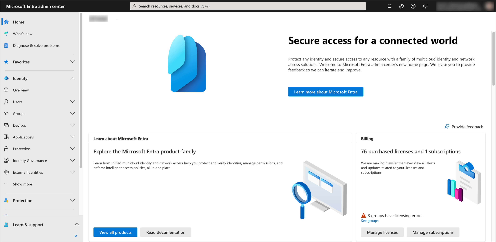

2. In the left sidebar menu, select **Applications** and click **App registrations**:

    

3. Click on the **New registration** button:

    

4. Fill in the required fields, such as **Name**, **Supported account types** and **Redirect URI** with platform type `Single-page application` (You can skip setting the **Redirect URI** if you don't deploy Dependency-Track yet). Click **Register** to create the application:

    :::note
    The **Redirect URI** should be in the format `https://<Dependency-Track URL>/static/oidc-callback.html`.
    **Platform type** should be `Single-page application`.
    :::

    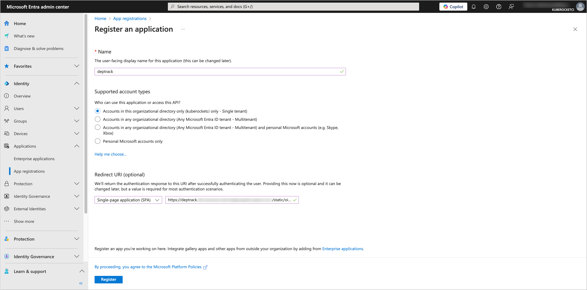

5. In the created application, navigate to the **Authentication** section from the left sidebar menu. In the **Implicit grant and hybrid flows** section, select **ID tokens** for the token type. In the **Allow public client flows** section, set the value to **No**:

    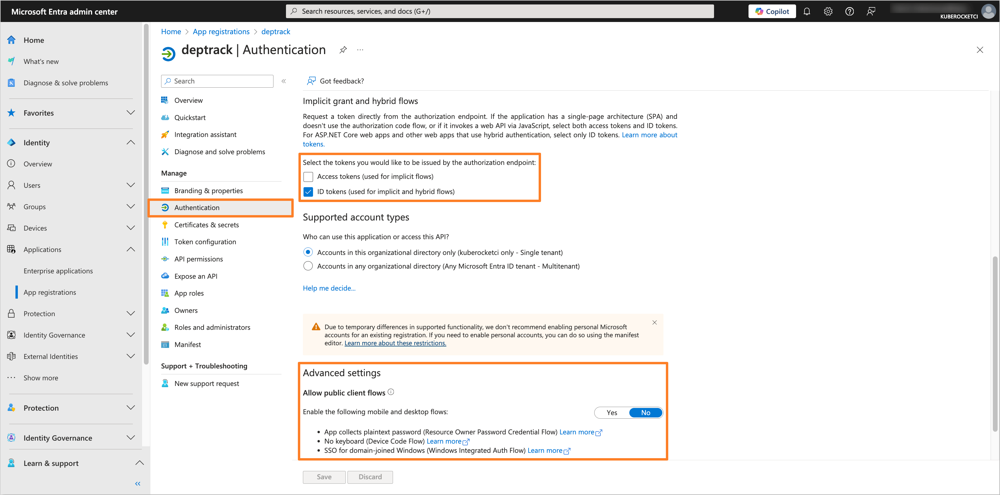

6. Navigate to the **Token configuration** section and click on **Add groups claim** button. Choose the group type as **Security Groups** and for the ID token type, select **sAMAaccountName**:

    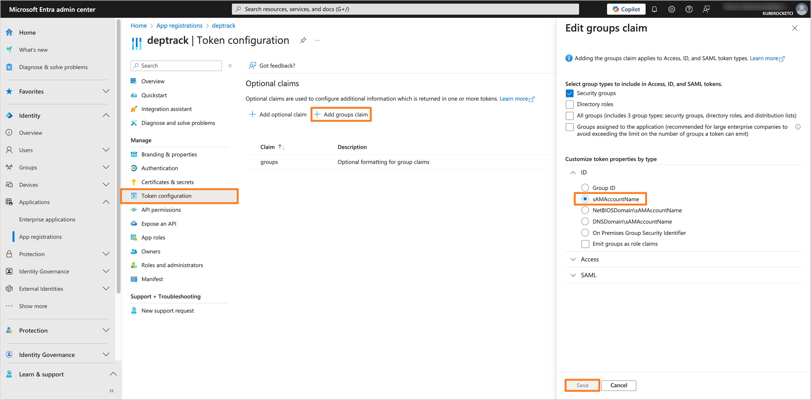

7. Navigate to the **API permissions** section. Click on the **Add a permission** button. Select **Microsoft Graph** and then **Delegated permissions**. Add the following permissions:

    - **email**
    - **openid**
    - **profile**
    - **User.Read**
    - **GroupMember.Read.All**

    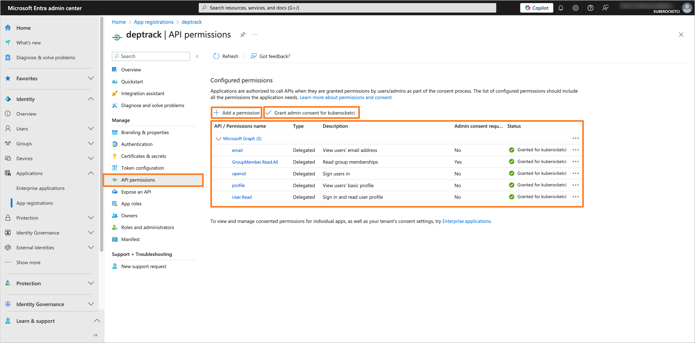

    After adding the permissions, click on the **Grant admin consent for 'Tenant name'** button to grant the required permissions.

After configuring the Microsoft Entra Application, you can proceed with the Dependency-Track configuration.

## Creating the Groups

To manage access to Dependency-Track, it is necessary to create the groups in Microsoft Entra and assign users to it.

1. In the Microsoft Entra Admin Center, in the left sidebar menu, select **Groups** and then **All groups**. Click on **New group** button to create a new group(s) for users who will have access to Dependency-Track (e.g., `administrator`, `developer`):

    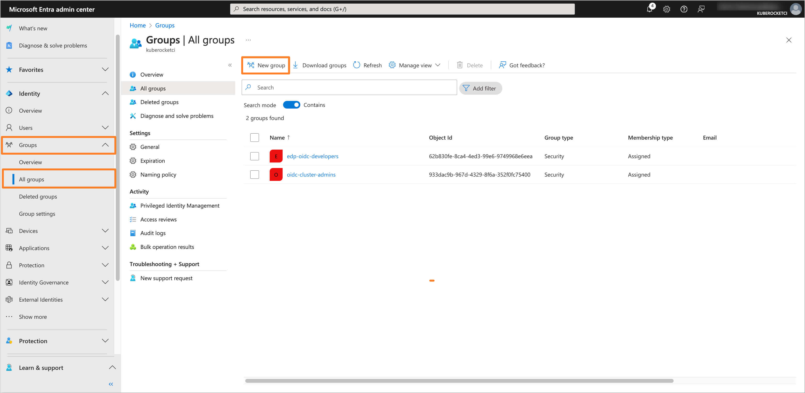

2. Fill in the required fields, such as **Groups type** and **Group name**. In the **Members** section, add users who will be part of the group:

    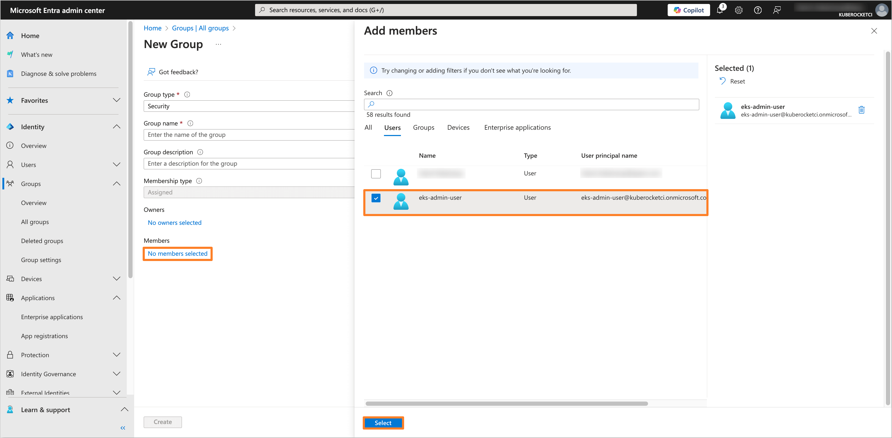

3. After adding the necessary members, review the group settings and click **Create** to save the group. Repeat this process for each required group.

## Configuring Dependency-Track Helm chart

To integrate Dependency-Track with configured Microsoft Entra Application, it is necessary to configure the Dependency-Track Helm chart. In this example, we will use the [edp-cluster-add-ons](https://github.com/epam/edp-cluster-add-ons) repository to deploy Dependency-Track to the Kubernetes (e.g. AWS EKS) cluster.

:::note
The Application data, such as **Application (client) ID** and **Directory (tenant) ID**, can be found in the **Overview** section of the Application in the Microsoft Entra Admin Center.
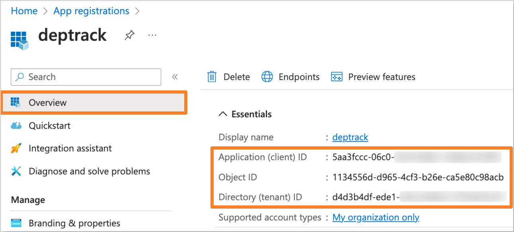
:::

1. Navigate to the forked [Cluster Add-Ons repository](https://github.com/epam/edp-cluster-add-ons) and locate the `values.yaml` file in the `clusters/core/addons/dependency-track` directory:

    Update the `frontend` section in the `values.yaml` file with the following values:

    ```yaml title="clusters/core/addons/dependency-track/values.yaml"
    dependency-track:
      frontend:
        apiBaseUrl: "https://deptrack.example.com"
        extraEnv:
          - name: OIDC_ISSUER
            value: "https://login.microsoftonline.com/<Directory (tenant) ID>/v2.0"
          - name: OIDC_CLIENT_ID
            value: "<Application (client) ID>"
          - name: OIDC_LOGIN_BUTTON_TEXT
            value: "Login with Entra"
    ```

    Replace the following values with the data from the Microsoft Entra Application:
    - `<Directory (tenant) ID>`: The Directory ID of your Microsoft Entra Tenant.
    - `<Application (client) ID>`: The Application (client) ID of your Microsoft Entra Application.
    - `https://deptrack.example.com`: The URL of your Dependency-Track instance.

    Update the `apiServer` section in the `values.yaml` file with the following values:

    ```yaml title="clusters/core/addons/dependency-track/values.yaml"
    dependency-track:
      apiServer:
        extraEnv:
          - name: ALPINE_OIDC_ENABLED
            value: "true"
          - name: ALPINE_OIDC_CLIENT_ID
            value: "<Application (client) ID>"
          - name: ALPINE_OIDC_ISSUER
            value: "https://login.microsoftonline.com/<Directory (tenant) ID>/v2.0"
          - name: ALPINE_OIDC_USERNAME_CLAIM
            value: "name"
          - name: ALPINE_OIDC_USER_PROVISIONING
            value: "true"
          - name: ALPINE_OIDC_TEAMS_CLAIM
            value: "groups"
          - name: ALPINE_OIDC_TEAM_SYNCHRONIZATION
            value: "true"
    ```

    Replace the following values with the data from the Microsoft Entra Application:
    - `<Directory (tenant) ID>`: The Directory ID of your Microsoft Entra Tenant.
    - `<Application (client) ID>`: The Application (client) ID of your Microsoft Entra Application.

2. After updating the `values.yaml` file, commit the changes to the repository and apply the changes with Helm or Argo CD.

3. Navigate to the Microsoft Entra Application and add the **Redirect URI** in the **Authentication** section if you haven't done it before:

    :::note
    The **Redirect URI** should be in the format `https://<Dependency-Track URL>/static/oidc-callback.html`.
    **Platform type** should be `Single-page application`.
    :::

    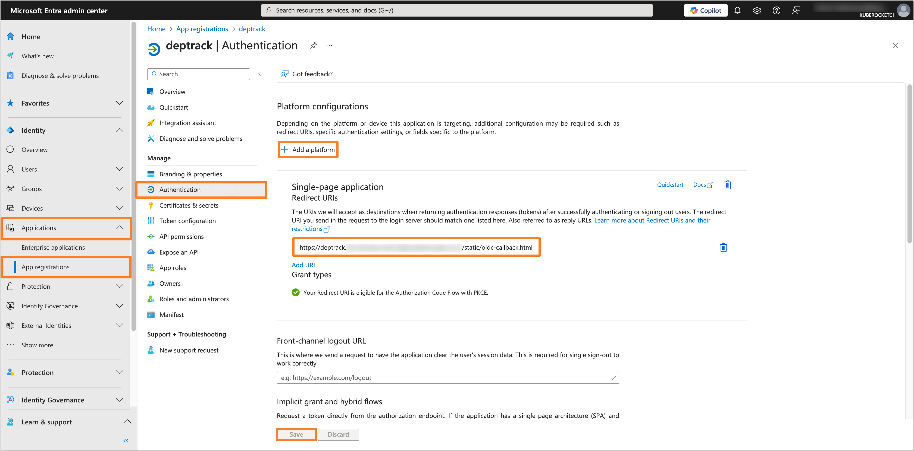

4. Log in to the Dependency-Track web interface as an Admin user. Navigate to the **Administration** tab and click on the **Access Management** section. Select the **OpenID Connect Groups** tab and click on the **Create Group** button to create a new OpenID Connect group:

    :::note
    The **Object ID** can be found in the **Overview** section of the group in the Microsoft Entra Admin Center.
    
    :::

    Make sure that the group name matches the **Group ID** of the group in the Microsoft Entra Admin Center. Here is as example of how the **Administrator** group should appear in Dependency-Track:

    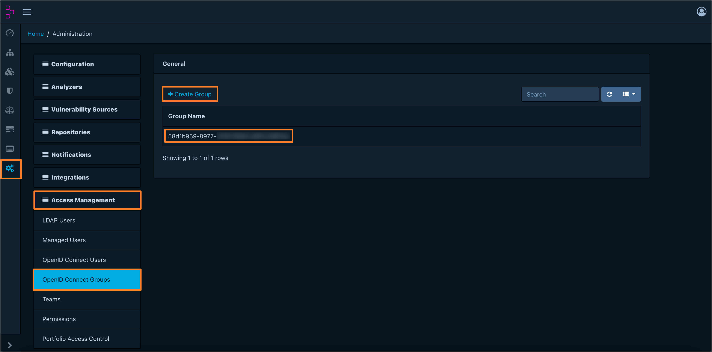

5. Verify that the OpenID Connect Group is correctly mapped to the Dependency-Track Team. Here is an example of how the **Administrator** OpenID Connect group should map to the Dependency-Track **Administrators** Team:

    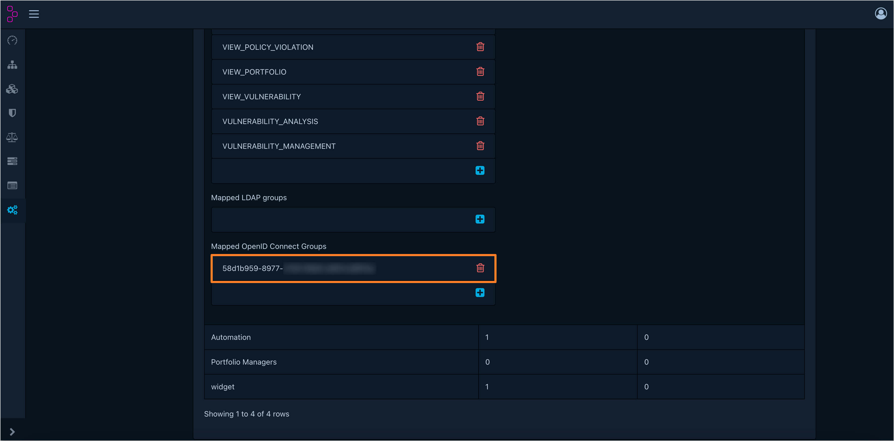

6. Verify that the OIDC authentication is working correctly by log in to the Dependency-Track web interface using the **Login with Entra** button:

    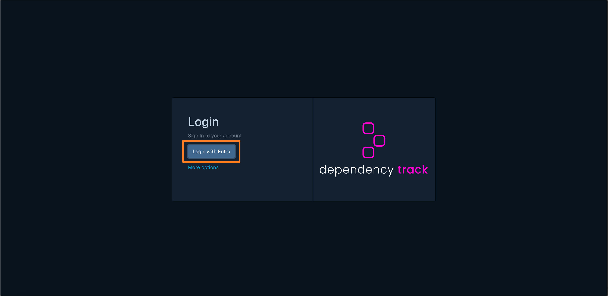

After completing these steps, Dependency-Track is configured to use Microsoft Entra as the Identity Provider for OIDC authentication.

## Related Articles

- [OpenID Connect (OIDC) Authentication Overview](./oidc-authentication-overview.md)
