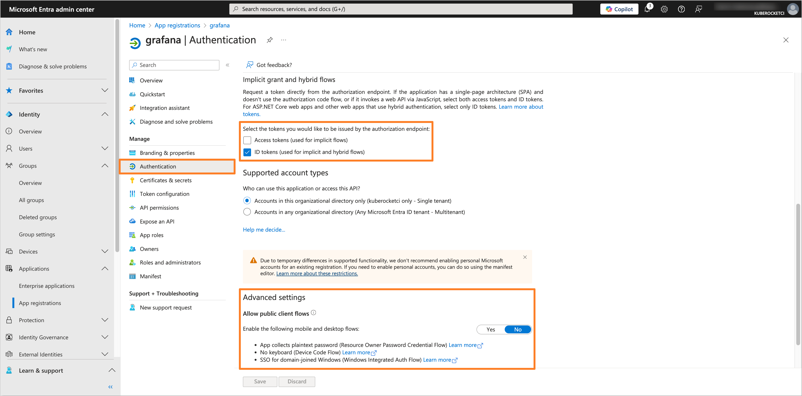
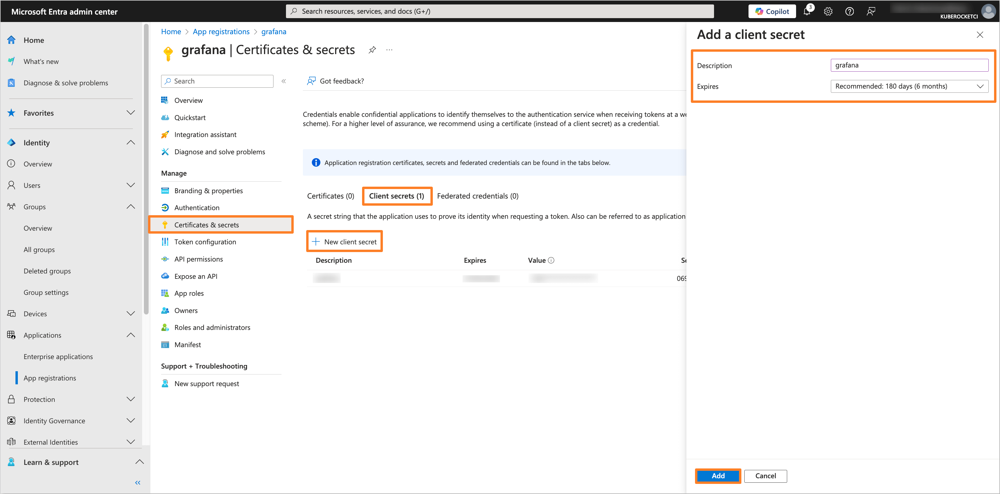
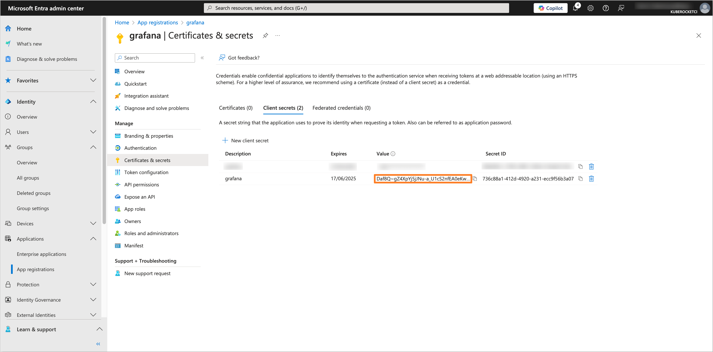
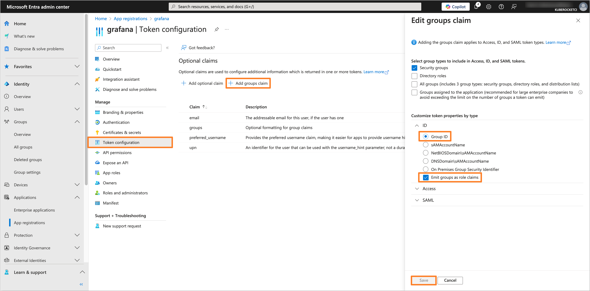
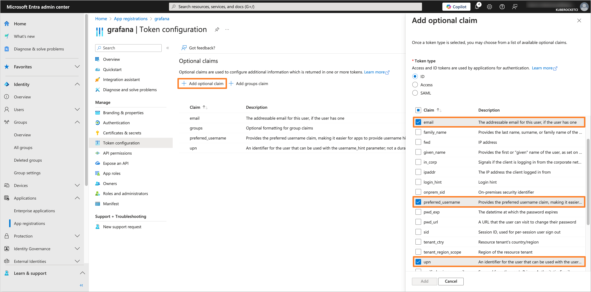
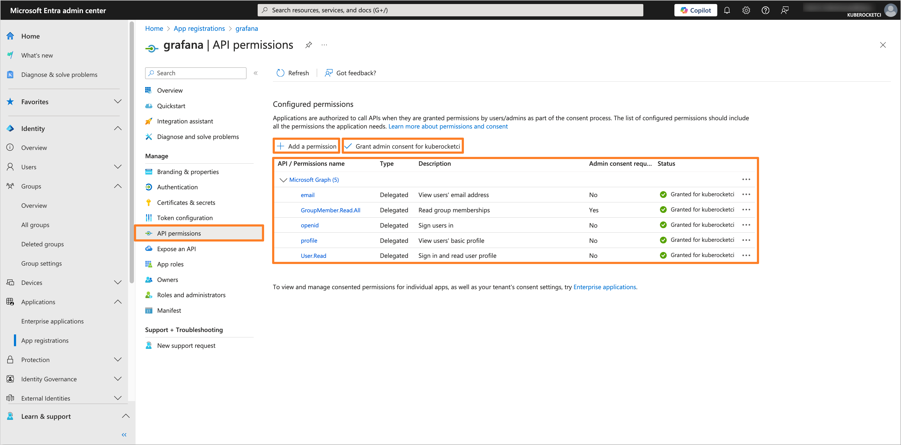
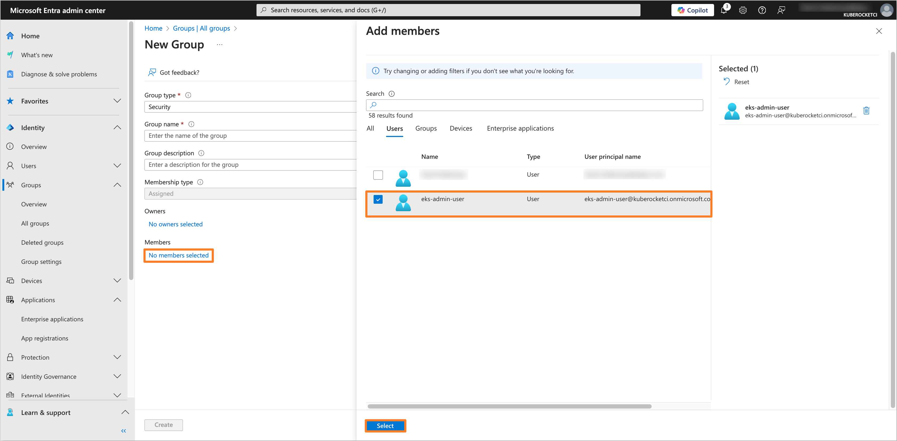
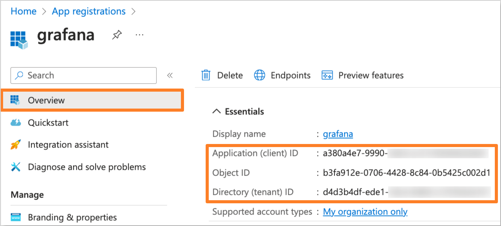
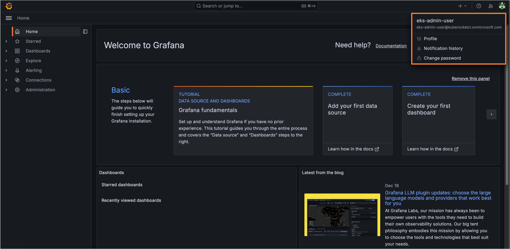

---

title: "Guide: Microsoft Entra SSO Integration With Grafana"
description: "Step-by-step guide on configuring Grafana with OpenID Connect authentication using Microsoft Entra as the Identity Provider for enhanced access management."
sidebar_label: "Grafana"

---
<!-- markdownlint-disable MD025 -->

# Guide: Microsoft Entra SSO Integration With Grafana

<head>
  <link rel="canonical" href="https://docs.kuberocketci.io/docs/operator-guide/microsoft-entra/grafana-authentication" />
</head>

This guide provides instructions on configuring OpenID Connect (OIDC) authentication with Microsoft Entra for Grafana.

## Prerequisites

Before you begin, make sure the following prerequisites are met:

- Access to the [Microsoft Entra Admin Center](https://entra.microsoft.com/) with administrative privileges.
- [Microsoft Entra](https://learn.microsoft.com/en-us/entra/fundamentals/create-new-tenant) Tenant is created.
- [Grafana](https://github.com/epam/edp-cluster-add-ons/blob/3fc8a60ccfbca1c7aa757cb36226a0daf2c8a224/clusters/core/addons/prometheus-operator/values.yaml#L74) is installed (can be installed during **Configuring Helm chart** step).
- A forked copy of the [edp-cluster-add-ons](https://github.com/epam/edp-cluster-add-ons) repository is created.
- (Optional) [External Secrets Operator](../secrets-management/install-external-secrets-operator.md) is installed.

## Configuring Microsoft Entra Application

To configure Microsoft Entra as the Identity Provider for Grafana, it is necessary to create and configure an Application in the Microsoft Entra Admin Center:

1. Log in to the [Microsoft Entra Admin Center](https://entra.microsoft.com/?feature.msaljs=true#home):

    

2. In the left sidebar menu, select **Applications** and click **App registrations**:

    

3. Click on the **New registration** button:

    

4. Fill in the required fields, such as **Name**, **Supported account types** and **Redirect URI** (You can skip setting the **Redirect URI** if you don't deploy Grafana yet). Click **Register** to create the application:

    :::note
    The **Redirect URI** should be in the format `https://<Grafana URL>/login/generic_oauth`.
    :::

    

5. In the created application, navigate to the **Authentication** section from the left sidebar menu. In the **Implicit grant and hybrid flows** section, select **ID tokens** for the token type. In the **Allow public client flows** section, set the value to **No**:

    

6. Navigate to the **Certificates & secrets** section. In the **Client secrets** tab, click on the **New client secret** button to create a new secret. Fill in the required fields and click **Add**:

    

7. Copy the generated client secret value and store it securely. You will need this value to configure the Grafana Helm chart:

    

8. Navigate to the **Token configuration** section and click on **Add groups claim** button. Choose the group type as **Security Groups** and for the ID token type, select **Group ID**. Also, choose the **Emit groups as role claims** option:

    

    Also, add the **preferred_username**, **email** and **upn** optional claims:

    

9. Navigate to the **API permissions** section. Click on the **Add a permission** button. Select **Microsoft Graph** and then **Delegated permissions**. Add the following permissions:

    - **email**
    - **openid**
    - **profile**
    - **User.Read**
    - **GroupMember.Read.All**

    

    After adding the permissions, click on the **Grant admin consent for 'Tenant name'** button to grant the required permissions.

After configuring the Microsoft Entra Application, you can proceed with configuring the Grafana Helm chart.

## Creating the Groups

To manage access to Grafana, it is necessary to create the groups in Microsoft Entra and assign users to it.

1. In the Microsoft Entra Admin Center, in the left sidebar menu, select **Groups** and then **All groups**. Click on **New group** button to create a new group(s) for users who will have access to Grafana (e.g., `administrator`, `developer`):

    

2. Fill in the required fields, such as **Groups type** and **Group name**. In the **Members** section, add users who will be part of the group:

    

3. After adding the necessary members, review the group settings and click **Create** to save the group. Repeat this process for each required group.

## Configuring Grafana Helm chart

To integrate Grafana with configured Microsoft Entra Application, it is necessary to configure the Grafana Helm chart. In this example, we will use the [edp-cluster-add-ons](https://github.com/epam/edp-cluster-add-ons) repository and the **prometheus-operator** Helm chart to deploy Grafana to the Kubernetes (e.g. AWS EKS) cluster.

:::note
The Application data, such as **Application (client) ID** and **Directory (tenant) ID**, can be found in the **Overview** section of the Application in the Microsoft Entra Admin Center.

:::

:::note
The **Object ID** can be found in the **Overview** section of the group in the Microsoft Entra Admin Center.

:::

1. Navigate to the forked [Cluster Add-Ons repository](https://github.com/epam/edp-cluster-add-ons) and locate the `values.yaml` file in the `clusters/core/addons/prometheus-operator` directory:

    Update the `grafana` section in the `values.yaml` file with the following values:

    ```yaml title="clusters/core/addons/prometheus-operator/values.yaml"
    kube-prometheus-stack:
      grafana:
        grafana.ini:
          auth.generic_oauth:
            enabled: true
            client_secret: ${GF_AUTH_AZUREAD_CLIENT_SECRET}
            client_id: "<Application (client) ID>"
            allow_sign_up:  true
            scopes:  openid email profile
            auth_url: "https://login.microsoftonline.com/<Directory (tenant) ID>/oauth2/v2.0/authorize"
            token_url: "https://login.microsoftonline.com/<Directory (tenant) ID>/oauth2/v2.0/token"
            role_attribute_strict: false
            role_attribute_path: contains(roles[*], '<Object ID of the Administrator group>') && 'Admin' || contains(roles[*], 'Object ID of the Developer group') && 'Editor' || 'Viewer'
            skip_org_role_sync: false
            api_url: "https://graph.microsoft.com/oidc/userinfo"
    ```

    Replace the following placeholders with the actual values:
    - `<Application (client) ID>` - The Application ID from the Microsoft Entra Application settings.
    - `<Directory (tenant) ID>` - The Directory ID of your Microsoft Entra Tenant.
    - `<Object ID of the Administrator group>` - The Object ID of the `administrator` group created in Microsoft Entra.
    - `<Object ID of the Developer group>` - The Object ID of the `developer` group created in Microsoft Entra.

2. Update or create the `keycloak-client-grafana-secret` secret with the Application Client Secret value:

    - Using External Secrets Operator:

      Navigate to the `clusters/core/addons/prometheus-operator/templates/external-secrets/externalsecret-keycloak-client-grafana-secret.yaml` file and set the `spec.data.secretKey` field to the `GF_AUTH_AZUREAD_CLIENT_SECRET` value.

      ```yaml title="clusters/core/addons/prometheus-operator/templates/external-secrets/externalsecret-keycloak-client-grafana-secret.yaml"
      {{- if .Values.eso.enabled }}
      {{- $secretName := .Values.eso.secretName }}
      apiVersion: external-secrets.io/v1beta1
      kind: ExternalSecret
      metadata:
        name: keycloak-client-grafana-secret
      spec:
        refreshInterval: 1h
        secretStoreRef:
          kind: SecretStore
          name: {{ .Values.eso.secretStoreName }}
        data:
        - secretKey: GF_AUTH_AZUREAD_CLIENT_SECRET
          remoteRef:
            conversionStrategy: Default
            decodingStrategy: None
            key: {{ $secretName }}
            metadataPolicy: None
            property: keycloak-client-grafana-secret.clientSecret
       {{- end }}
      ```

      Be sure to update the AWS Parameter Store object path specified in the `clusters/core/addons/prometheus-operator/values.yaml` file in the `eso.secretName` field with the Application Client Secret value.

      ```json title="AWS Parameter Store object"
      {
        "keycloak-client-grafana-secret": {
          "clientSecret": "<Application Client Secret>"
        }
      }
      ```

      Replace the `<Application Client Secret>` placeholder with the actual Client Secret value.

    - Manual approach:

      Create the `keycloak-client-grafana-secret` secret manually using the following template:

      ```yaml title="keycloak-client-grafana-secret.yaml"
      apiVersion: v1
      kind: Secret
      metadata:
        name: keycloak-client-grafana-secret
        namespace: <namespace>
      data:
        GF_AUTH_AZUREAD_CLIENT_SECRET: <Application Client Secret>
      ```

      Replace the `<Application Client Secret>` placeholder with the actual Client Secret value.

3. After updating the `values.yaml` file and creating the `keycloak-client-grafana-secret` secret, commit the changes to the repository and apply the changes with Helm or Argo CD.

4. Verify that the OIDC authentication is configured correctly by logging in to Grafana using the Microsoft Entra credentials:

    

After completing these steps, Grafana will be configured to use Microsoft Entra as the Identity Provider for authentication.

## Related Articles

- [OpenID Connect (OIDC) Authentication Overview](./oidc-authentication-overview.md)
