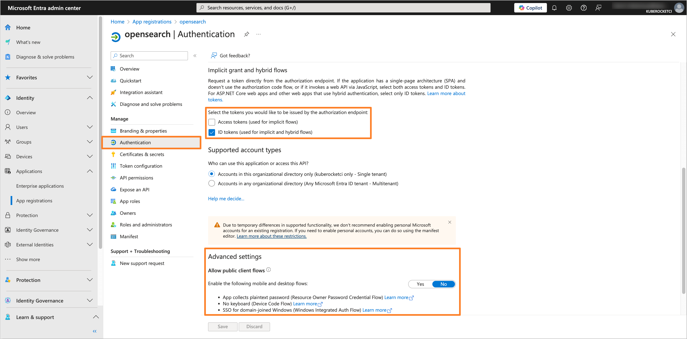
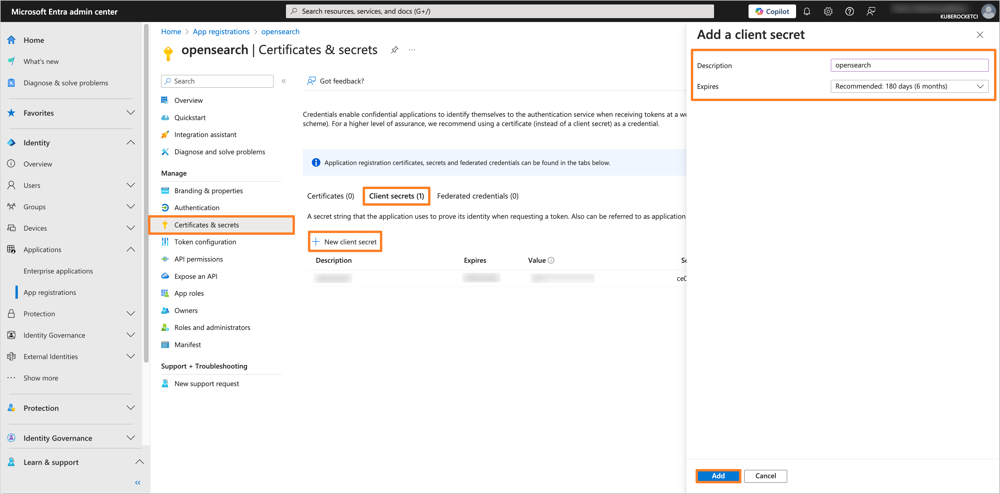
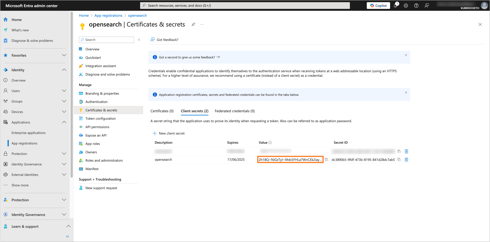
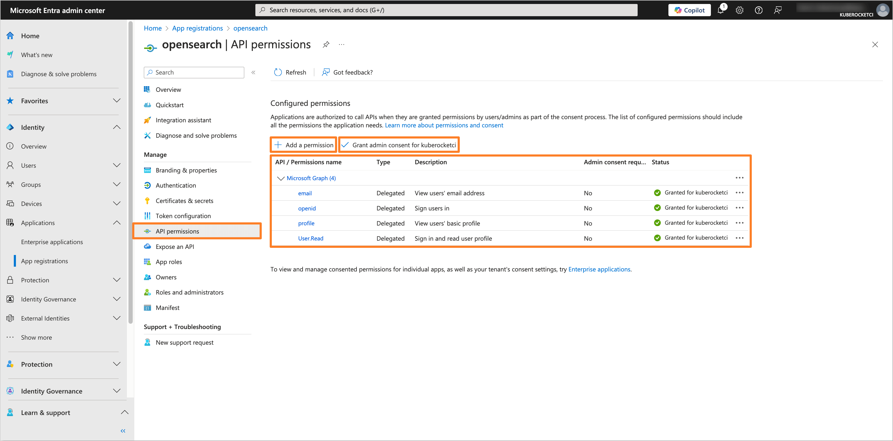
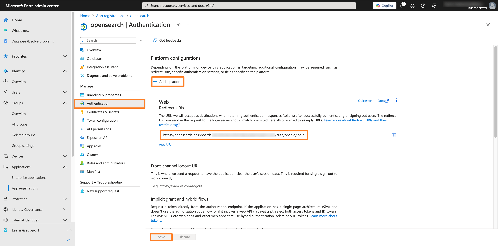
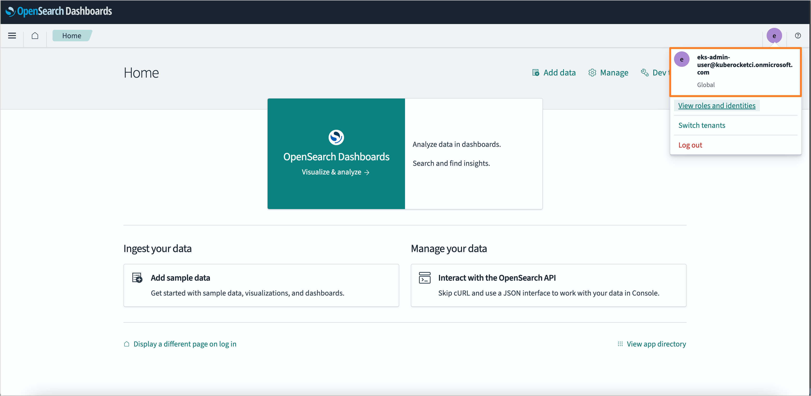

---

title: "Guide: Microsoft Entra SSO Integration With OpenSearch"
description: "Step-by-step guide on configuring OpenSearch with OIDC authentication using Microsoft Entra as the Identity Provider for enhanced security."
sidebar_label: "OpenSearch"

---
<!-- markdownlint-disable MD025 -->

# Guide: Microsoft Entra SSO Integration With OpenSearch

<head>
  <link rel="canonical" href="https://docs.kuberocketci.io/docs/operator-guide/microsoft-entra/opensearch-authentication" />
</head>

This guide provides instructions on how to configure OpenSearch with OpenID Connect (OIDC) authentication using Microsoft Entra as the Identity Provider (IdP).

## Prerequisites

Before you begin, make sure the following prerequisites are met:

- Access to the [Microsoft Entra Admin Center](https://entra.microsoft.com/) with administrative privileges.
- [Microsoft Entra](https://learn.microsoft.com/en-us/entra/fundamentals/create-new-tenant) Tenant is created.
- [OpenSearch](https://github.com/epam/edp-cluster-add-ons/blob/main/clusters/core/apps/values.yaml#L208) is installed (can be installed during **Configuring Helm chart** step).
- A forked copy of the [edp-cluster-add-ons](https://github.com/epam/edp-cluster-add-ons) repository is created.
- (Optional) [External Secrets Operator](../secrets-management/install-external-secrets-operator.md) is installed.

## Configuring Microsoft Entra Application

To configure Microsoft Entra as the Identity Provider for OpenSearch, it is necessary to create and configure an Application in the Microsoft Entra Admin Center:

1. Log in to the [Microsoft Entra Admin Center](https://entra.microsoft.com/?feature.msaljs=true#home):

    

2. In the left sidebar menu, select **Applications** and click **App registrations**:

    

3. Click on the **New registration** button:

    

4. Fill in the required fields, such as **Name**, **Supported account types** and **Redirect URI** (You can skip setting the **Redirect URI** if you don't deploy OpenSearch yet). Click **Register** to create the application:

    :::note
    The **Redirect URI** should be in the format `https://<OpenSearch Dashboard URL>/auth/openid/login`.
    :::

    

5. In the created application, navigate to the **Authentication** section from the left sidebar menu. In the **Implicit grant and hybrid flows** section, select **ID tokens** for the token type. In the **Allow public client flows** section, set the value to **No**:

    

6. Navigate to the **Certificates & secrets** section. In the **Client secrets** tab, click on the **New client secret** button to create a new secret. Fill in the required fields and click **Add**:

    

7. Copy the generated client secret value and store it securely. You will need this value to configure the OpenSearch Helm chart:

    

8. Navigate to the **Token configuration** section and click on **Add groups claim** button. Choose the group type as **Security Groups** and for the ID token type, select **Group ID**. Also, choose the **Emit groups as role claims** option:

    

9. Navigate to the **API permissions** section. Click on the **Add a permission** button. Select **Microsoft Graph** and then **Delegated permissions**. Add the following permissions:

    - **email**
    - **openid**
    - **profile**
    - **User.Read**

    

    After adding the permissions, click on the **Grant admin consent for 'Tenant name'** button to grant the required permissions.

After configuring the Microsoft Entra Application, you can proceed with the OpenSearch configuration.

## Creating the Groups

To manage access to OpenSearch, it is necessary to create the groups in Microsoft Entra and assign users to it.

1. In the Microsoft Entra Admin Center, in the left sidebar menu, select **Groups** and then **All groups**. Click on **New group** button to create a new group(s) for users who will have access to OpenSearch (e.g., `administrator`, `developer`):

    

2. Fill in the required fields, such as **Groups type** and **Group name**. In the **Members** section, add users who will be part of the group:

    

3. After adding the necessary members, review the group settings and click **Create** to save the group. Repeat this process for each required group.

## Configuring OpenSearch Helm chart

To integrate OpenSearch with configured Microsoft Entra Application, it is necessary to configure the OpenSearch Helm chart. In this example, we will use the [edp-cluster-add-ons](https://github.com/epam/edp-cluster-add-ons) repository to deploy OpenSearch to the Kubernetes (e.g. AWS EKS) cluster.

:::note
The Application data, such as **Application (client) ID** and **Directory (tenant) ID**, can be found in the **Overview** section of the Application in the Microsoft Entra Admin Center.

:::

:::note
The **Object ID** can be found in the **Overview** section of the group in the Microsoft Entra Admin Center.

:::

1. Navigate to the forked [Cluster Add-Ons repository](https://github.com/epam/edp-cluster-add-ons) and locate the `values.yaml` file in the `clusters/core/addons/opensearch` directory:

    Update the `opensearch` section in the `values.yaml` file with the following values:

    ```yaml title="clusters/core/addons/opensearch/values.yaml"
    opensearch:
      securityConfig:
        config:
          data:
            config.yml: |-
              config:
                dynamic:
                  authc:
                    openid_auth_domain:
                      http_enabled: true
                      transport_enabled: true
                      order: 1
                      http_authenticator:
                        type: openid
                        challenge: false
                        config:
                          subject_key: preferred_username
                          roles_key: roles
                          openid_connect_url: https://login.microsoftonline.com/<Directory (tenant) ID>/v2.0/.well-known/openid-configuration
                          openid_connect_idp:
                            enable_ssl: false
                            verify_hostnames: false
                      authentication_backend:
                        type: noop
            roles_mapping.yml: |-
              _meta:
                type: "rolesmapping"
                config_version: 2
              all_access:
                reserved: true
                backend_roles:
                - "<Object ID of the Administrator group>"
                - "admin"
                description: "Maps EDP administrator role and internal admin role to all_access"
              logstash:
                reserved: true
                backend_roles:
                - "logstash"
                description: "Maps log injection role to logstash. It might be logstash, fluent-bit, fluentd, ..."
              kibana_user:
                reserved: false
                backend_roles:
                - "kibanauser"
                - "<Object ID of the Developer group>"
                description: "Maps kibanauser and EDP developer role to kibana_user"
              kibana_server:
                reserved: true
                users:
                - "kibanaserver"
              edp_developer:
                reserved: false
                backend_roles:
                - "<Object ID of the Developer group in Microsoft Entra>"
                description: "Maps EDP developer role to view kube index"
    ```

    Replace the following placeholders with the actual values:
    - `<Directory (tenant) ID>`: The Directory ID of your Microsoft Entra Tenant.
    - `<Object ID of the Administrator group>`: The Object ID of the `administrator` group from the Microsoft Entra Admin Center.
    - `<Object ID of the Developer group>`: The Object ID of the `developer` group from the Microsoft Entra Admin Center.

    Update the `opensearch-dashboards` section in the `values.yaml` file with the following values:

    ```yaml title="clusters/core/addons/opensearch/values.yaml"
    opensearch-dashboards:
      config:
        opensearch_dashboards.yml:
          server:
            auth.type: openid
            openid:
              connect_url: https://login.microsoftonline.com/<Directory (tenant) ID>/v2.0/.well-known/openid-configuration
              base_redirect_url: https://opensearch-dashboards.example.com
              client_id: <Application (client) ID>
              client_secret: ${OIDC_CLIENT_SECRET}
              scope: openid profile email
              header: Authorization
              verify_hostnames: false
              trust_dynamic_headers: true
    ```

    Replace the following placeholders with the actual values:
    - `https://opensearch-dashboards.example.com`: The base URL of the OpenSearch Dashboards.
    - `<Directory (tenant) ID>`: The Directory ID of your Microsoft Entra Tenant.
    - `<Application (client) ID>`: The Application ID from the Microsoft Entra Application settings.

2. Update or create the `opensearch-dashboards-account` secret with the Application Client Secret value:

    - Using External Secrets Operator:

      Be sure to update the AWS Parameter Store object path specified in the `clusters/core/addons/opensearch/values.yaml` file in the `eso.secretName` field with the `username`, `password`, `cookie` and `OIDC_CLIENT_SECRET` values.

      ```json title="AWS Parameter Store object"
      {
        "opensearch-dashboard": {
          "username": "<Username>",
          "password": "<Password>",
          "cookie": "<Randomly generated cookie value>",
          "OIDC_CLIENT_SECRET": "<Application Client Secret>"
        }
      }
      ```

    - Manual approach:

      Create the `opensearch-dashboards-account` secret manually using the following template:

      ```yaml title="opensearch-dashboards-account.yaml"
      apiVersion: v1
      kind: Secret
      metadata:
        name: opensearch-dashboards-account
        namespace: <namespace>
      type: Opaque
      data:
        username: <Username>
        password: <Password>
        cookie: <Randomly generated cookie value>
        OIDC_CLIENT_SECRET: <Application Client Secret>
      ```

3. After updating the `values.yaml` file and creating the `opensearch-dashboards-account` secret, commit the changes to the repository and apply the changes with Helm or Argo CD.

4. Navigate to the Microsoft Entra Application and add the **Redirect URI** in the **Authentication** section if you haven't done it before:

    :::note
    The **Redirect URI** should be in the format `https://<OpenSearch Dashboard URL>/auth/openid/login`.
    :::

    

5. Verify that the OIDC authentication is configured correctly by logging in to OpenSearch using the Microsoft Entra credentials:

    

After completing these steps, OpenSearch will be configured with OIDC authentication using Microsoft Entra as the Identity Provider.

## Related Articles

- [OpenID Connect Authentication Overview](./oidc-authentication-overview.md)
