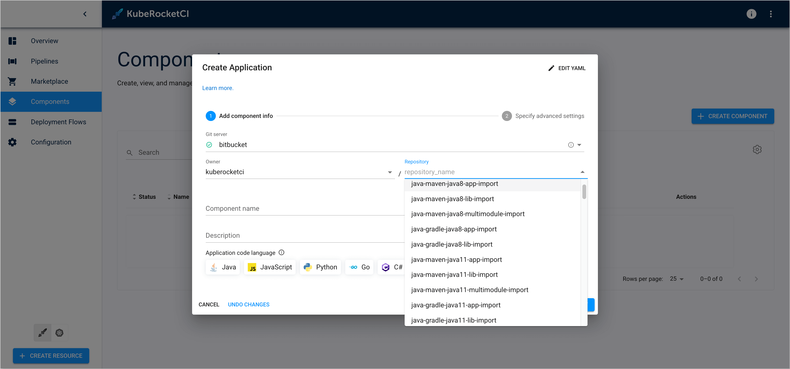

<!-- markdownlint-disable MD025 -->

import Tabs from '@theme/Tabs';
import TabItem from '@theme/TabItem';

# Upgrade KubeRocketCI v3.11 to 3.12

<head>
  <link rel="canonical" href="https://docs.kuberocketci.io/docs/operator-guide/upgrade/upgrade-krci-3.12" />
</head>

This section provides detailed instructions for upgrading KubeRocketCI to version 3.12. Follow the steps and requirements outlined below:

:::important
We suggest backing up the KubeRocketCI environment before starting the upgrade procedure.
:::

:::important
In version 3.12, the `docker.io/epamedp/tekton-cache` image has been [deprecated](https://github.com/epam/edp-tekton/issues/511) and replaced with `ghcr.io/kuberocketci/krci-cache`. In case of using the [tekton-cache](https://github.com/epam/edp-tekton/tree/master/charts/tekton-cache) Helm chart, the image will be automatically updated during the upgrade process.
:::

1. (Optional) Update Tekton Custom Pipelines

    :::note
    For more information about using Tekton custom pipelines in KubeRocketCI, refer to the [Create and Use Custom Tekton Pipelines](../../use-cases/custom-pipelines-flow.md) use case.
    :::

    In case of using Tekton custom pipelines, it is necessary to update them to ensure compatibility with the new version of KubeRocketCI.

    1. Branch Name Validation Update

        Starting from version 3.12, the KubeRocketCI portal [supports](https://github.com/epam/edp-headlamp/issues/753) adding branches with long names (more than 30 characters), including support for special characters and uppercase letters. Due to this change, it is necessary to update the passing parameters for the `update-cbis` task in the Tekton custom build pipelines to ensure compatibility with the new version of KubeRocketCI.

        The `update-cbis` Tekton task now accepts the `CODEBASEBRANCH_NAME` parameter instead of `CBIS_NAME`. Update the `update-cbis` passing parameters in the Tekton custom build pipelines as follows:

        <Tabs
          defaultValue="3.11"
          values={[
            {label: '3.11', value: '3.11'},
            {label: '3.12', value: '3.12'}
          ]}>

          <TabItem value="3.11">
          ```yaml title="Pipeline"
          apiVersion: tekton.dev/v1
          kind: Pipeline
          metadata:
            labels:
              app.edp.epam.com/pipelinetype: build
              app.edp.epam.com/triggertemplate: github-build-template
            name: custom-build-pipeline
          spec:
            ...
            tasks:
              - name: update-cbis
                params:
                  - name: CBIS_NAME
                    value: $(tasks.init-values.results.RESULT_IMAGE_NAME)
                  - name: IMAGE_TAG
                    value: $(tasks.get-version.results.IS_TAG)
                runAfter:
                  - git-tag
                taskRef:
                  kind: Task
                  name: update-cbis
          ```
          </TabItem>

          <TabItem value="3.12">
          ```yaml title="Pipeline"
          apiVersion: tekton.dev/v1
          kind: Pipeline
          metadata:
            labels:
              app.edp.epam.com/pipelinetype: build
              app.edp.epam.com/triggertemplate: github-build-template
            name: custom-build-pipeline
          spec:
            ...
            tasks:
              - name: update-cbis
                params:
                  - name: CODEBASEBRANCH_NAME
                    value: $(params.CODEBASEBRANCH_NAME)
                  - name: IMAGE_TAG
                    value: $(tasks.get-version.results.IS_TAG)
                runAfter:
                  - git-tag
                taskRef:
                  kind: Task
                  name: update-cbis
          ```
          </TabItem>
        </Tabs>

        Updated `update-cbis` task in the KubeRocketCI version 3.12 is provided below for reference:

        <details>
          <summary><b>update-cbis</b></summary>

          Updated `update-cbis` task in KubeRocketCI version 3.12:

        ```yaml
        apiVersion: tekton.dev/v1
        kind: Task
        metadata:
          name: update-cbis
        spec:
          description: >-
            This task updates a Codebase ImageStream (CBIS) with a new image tag. It checks for the presence of tags in the specified CBIS and adds the new tag if it doesn't already exist.
            The task utilizes kubectl commands and is customizable with parameters for CBIS
          params:
            - name: CODEBASEBRANCH_NAME
              type: string
              description: "CodebaseBranch name with only letters and dashes"
            - name: IMAGE_TAG
              type: string
            - name: BASE_IMAGE
              description: The base image for the task.
              type: string
              default: {{ include "edp-tekton.registry" . }}/bitnami/kubectl:1.25.4
          steps:
            - name: update-cbis
              image: $(params.BASE_IMAGE)
              env:
                - name: CODEBASEBRANCH_NAME
                  value: "$(params.CODEBASEBRANCH_NAME)"
                - name: IMAGE_TAG
                  value: "$(params.IMAGE_TAG)"
              script: |
                #!/usr/bin/env bash
                set -e

                cbisName=$(kubectl get cbis.v2.edp.epam.com -l app.edp.epam.com/codebasebranch="${CODEBASEBRANCH_NAME}" -o jsonpath='{.items[0].metadata.name}')
                if [ -z "${cbisName}" ]; then
                    echo "[TEKTON][ERROR] No CBIS found with label app.edp.epam.com/codebasebranch=${CODEBASEBRANCH_NAME}"
                    exit 1
                fi

                cbisCrTags=$(kubectl get cbis.v2.edp.epam.com ${cbisName} --output=jsonpath={.spec.tags})
                dateFormat=$(date -u '+%Y-%m-%dT%H:%M:%SZ')
                newcbisTag="{\"name\":\"${IMAGE_TAG}\",\"created\":\"${dateFormat}\"}"

                if [ "${cbisCrTags}" = "" ] ; then
                    echo "[TEKTON][DEBUG] There're no tags in imageStream ${cbisName} ... the first one will be added."
                    kubectl patch cbis.v2.edp.epam.com ${cbisName} --type=merge -p "{\"spec\":{\"tags\":[${newcbisTag}]}}"
                fi

                cbisTagsList=$(kubectl get cbis.v2.edp.epam.com ${cbisName} --output=jsonpath={.spec.tags[*].name})
                if [[ ! ${cbisTagsList} == *"${IMAGE_TAG}"* ]]; then
                    echo "[TEKTON][DEBUG] ImageStream ${cbisName} doesn't contain ${IMAGE_TAG} tag ... it will be added."
                    kubectl patch cbis.v2.edp.epam.com ${cbisName} --type json -p="[{\"op\": \"add\", \"path\": \"/spec/tags/-\", \"value\": ${newcbisTag} }]"
                fi
        ```
        </details>

    2. Build Pipeline Task Condition Update

        :::note
        This change is relevant only for build pipelines with `semver` versioning type.
        :::

        In version 3.12, the execution condition for the `update-cbb` Tekton task has been [updated](https://github.com/epam/edp-tekton/issues/509) to ensure that the `Successful build` field for the Component branch is properly updated in the KubeRocketCI portal. Now, the `update-cbb` task will also be executed if build pipelines are triggered manually and have the `Completed` status.

        Update the `update-cbb` task condition in the Tekton custom build pipelines as follows:

        <Tabs
          defaultValue="3.11"
          values={[
            {label: '3.11', value: '3.11'},
            {label: '3.12', value: '3.12'}
          ]}>

          <TabItem value="3.11">
          ```yaml title="Pipeline"
          apiVersion: tekton.dev/v1
          kind: Pipeline
          metadata:
            labels:
              app.edp.epam.com/pipelinetype: build
              app.edp.epam.com/triggertemplate: github-build-template
            name: custom-build-semver
          spec:
            ...
            finally:
              - name: update-cbb
                params:
                  - name: CODEBASEBRANCH_NAME
                    value: $(params.CODEBASEBRANCH_NAME)
                  - name: CURRENT_BUILD_NUMBER
                    value: $(tasks.get-version.results.BUILD_ID)
                taskRef:
                  kind: Task
                  name: update-cbb
                when:
                  - input: $(tasks.status)
                    operator: in
                    values:
                      - Succeeded
          ```
          </TabItem>

          <TabItem value="3.12">
          ```yaml title="Pipeline"
          apiVersion: tekton.dev/v1
          kind: Pipeline
          metadata:
            labels:
              app.edp.epam.com/pipelinetype: build
              app.edp.epam.com/triggertemplate: github-build-template
            name: custom-build-semver
          spec:
            ...
            finally:
              - name: update-cbb
                params:
                  - name: CODEBASEBRANCH_NAME
                    value: $(params.CODEBASEBRANCH_NAME)
                  - name: CURRENT_BUILD_NUMBER
                    value: $(tasks.get-version.results.BUILD_ID)
                taskRef:
                  kind: Task
                  name: update-cbb
                when:
                  - input: $(tasks.status)
                    operator: in
                    values:
                      - Succeeded
                      - Completed
          ```
          </TabItem>
        </Tabs>

    3. Deploy Pipeline Parameters Renaming

        :::note
        For detailed information about parameter changes in Tekton tasks, refer to the [edp-tekton](https://github.com/epam/edp-tekton/tree/master/charts/pipelines-library/templates/tasks) repository.
        :::

        In version 3.12, the deprecated parameters `PIPELINE` and `STAGE` were [renamed](https://github.com/epam/edp-tekton/issues/503) in the Tekton tasks used in deployment pipelines to align with the KubeRocketCI portal naming conventions. Due to this change, it is necessary to update the passing parameters for the custom deploy pipelines that use the following Tekton tasks such as `init-autotests`, `clean`, `deploy-ansible-awx`, `deploy-ansible`, `deploy-applicationset-cli`, `run-quality-gate`, `run-clean-gate`, `sync-app`, and `promote-images`.

        For tasks such as `run-clean-gate`, `clean`, `run-quality-gate`, `deploy-ansible-awx`, `deploy-ansible`, `sync-app`, and `deploy-applicationset-cli`, it is necessary to rename the passing parameters from `PIPELINE` to `DEPLOYMENT_FLOW` and from `STAGE` to `ENVIRONMENT` in the Tekton custom deploy pipelines as follows:

        <Tabs
          defaultValue="3.11"
          values={[
            {label: '3.11', value: '3.11'},
            {label: '3.12', value: '3.12'}
          ]}>

          <TabItem value="3.11">
          ```yaml title="Pipeline"
          apiVersion: tekton.dev/v1
          kind: Pipeline
          metadata:
            labels:
              app.edp.epam.com/pipelinetype: deploy
              app.edp.epam.com/triggertemplate: deploy
            name: custom-deploy-pipeline
          spec:
            ...
            tasks:
              - name: deploy-app
                params:
                  - name: PIPELINE
                    value: $(params.CDPIPELINE)
                  - name: STAGE
                    value: $(params.CDSTAGE)
                  ...
                taskRef:
                  kind: Task
                  name: deploy-applicationset-cli
          ```
          </TabItem>

          <TabItem value="3.12">
          ```yaml title="Pipeline"
          apiVersion: tekton.dev/v1
          kind: Pipeline
          metadata:
            labels:
              app.edp.epam.com/pipelinetype: deploy
              app.edp.epam.com/triggertemplate: deploy
            name: custom-deploy-pipeline
          spec:
            ...
            tasks:
              - name: deploy-app
                params:
                  - name: DEPLOYMENT_FLOW
                    value: $(params.CDPIPELINE)
                  - name: ENVIRONMENT
                    value: $(params.CDSTAGE)
                  ...
                taskRef:
                  kind: Task
                  name: deploy-applicationset-cli
          ```
          </TabItem>
        </Tabs>

        For the `init-autotests` task, it is necessary to rename the passing parameters from `cd-pipeline-name` to `DEPLOYMENT_FLOW` and from `stage-name` to `ENVIRONMENT` in the Tekton custom deploy pipelines as follows:

        <Tabs
          defaultValue="3.11"
          values={[
            {label: '3.11', value: '3.11'},
            {label: '3.12', value: '3.12'}
          ]}>

          <TabItem value="3.11">
          ```yaml title="Pipeline"
          apiVersion: tekton.dev/v1
          kind: Pipeline
          metadata:
            labels:
              app.edp.epam.com/pipelinetype: deploy
              app.edp.epam.com/triggertemplate: deploy
            name: custom-deploy-pipeline
          spec:
            ...
            tasks:
              - name: init-autotests
                params:
                  - name: cd-pipeline-name
                    value: $(params.CDPIPELINE)
                  - name: stage-name
                    value: $(params.CDSTAGE)
                  ...
                taskRef:
                  kind: Task
                  name: init-autotests
          ```
          </TabItem>

          <TabItem value="3.12">
          ```yaml title="Pipeline"
          apiVersion: tekton.dev/v1
          kind: Pipeline
          metadata:
            labels:
              app.edp.epam.com/pipelinetype: deploy
              app.edp.epam.com/triggertemplate: deploy
            name: custom-deploy-pipeline
          spec:
            ...
            tasks:
              - name: init-autotests
                params:
                  - name: DEPLOYMENT_FLOW
                    value: $(params.CDPIPELINE)
                  - name: ENVIRONMENT
                    value: $(params.CDSTAGE)
                  ...
                taskRef:
                  kind: Task
                  name: init-autotests
          ```
          </TabItem>
        </Tabs>

        For the `promote-images` task, it is necessary to rename the passing parameters from `CDPIPELINE_CR` to `DEPLOYMENT_FLOW` and from `CDPIPELINE_STAGE` to `ENVIRONMENT` in the Tekton custom deploy pipelines as follows:

        <Tabs
          defaultValue="3.11"
          values={[
            {label: '3.11', value: '3.11'},
            {label: '3.12', value: '3.12'}
          ]}>

          <TabItem value="3.11">
          ```yaml title="Pipeline"
          apiVersion: tekton.dev/v1
          kind: Pipeline
          metadata:
            labels:
              app.edp.epam.com/pipelinetype: deploy
              app.edp.epam.com/triggertemplate: deploy
            name: custom-deploy-pipeline
          spec:
            ...
            tasks:
              - name: promote-images
                params:
                  - name: CDPIPELINE_CR
                    value: $(params.CDPIPELINE)
                  - name: CDPIPELINE_STAGE
                    value: $(params.CDSTAGE)
                  ...
                taskRef:
                  kind: Task
                  name: promote-images
          ```
          </TabItem>

          <TabItem value="3.12">
          ```yaml title="Pipeline"
          apiVersion: tekton.dev/v1
          kind: Pipeline
          metadata:
            labels:
              app.edp.epam.com/pipelinetype: deploy
              app.edp.epam.com/triggertemplate: deploy
            name: custom-deploy-pipeline
          spec:
            ...
            tasks:
              - name: promote-images
                params:
                  - name: DEPLOYMENT_FLOW
                    value: $(params.CDPIPELINE)
                  - name: ENVIRONMENT
                    value: $(params.CDSTAGE)
                  ...
                taskRef:
                  kind: Task
                  name: promote-images
          ```
          </TabItem>
        </Tabs>

2. (Optional) Enable Repository Discovery

    :::warning
    In case of using GitFusion with the Bitbucket Git provider, it is necessary to update the Bitbucket API token permissions to include the `account:read` scope. For more details on how to create a Bitbucket app password with the required permissions, refer to the [Add Git Server](../../user-guide/add-git-server.md) guide.
    :::

    :::note
    For more information about the GitFusion microservice, refer to the [GitFusion](https://github.com/KubeRocketCI/gitfusion) repository.
    :::

    :::note
    For more details about KrakenD integration with KubeRocketCI, refer to the [KrakenD installation](../extensions/krakend.md) guide.
    :::

    Starting from version 3.12, KubeRocketCI supports integration with the [GitFusion](https://github.com/KubeRocketCI/gitfusion) microservice. This integration enables automatic discovery of repositories, branches, and organizations from various Git providers during the component or branch creation process in the KubeRocketCI portal. GitFusion act as a bridge between the KubeRocketCI portal and the Git provider, allowing the portal to access repository-related information without requiring direct access to the Git provider.

    To enable the GitFusion integration in KubeRocketCI, follow the steps below:

    1. Enable the GitFusion dependency in the `values.yaml` file for `edp-install` Helm chart by setting the `gitfusion.enabled` parameter to `true`:

        ```yaml title="values.yaml"
        gitfusion:
          enabled: true
        ```

    2. Update the KrakenD configuration to include the GitFusion API endpoints.

        :::note
        The latest KrakenD configuration can be found in the [edp-cluster-add-ons](https://github.com/epam/edp-cluster-add-ons/tree/main/clusters/core/addons/krakend) repository.
        :::

        1. Clone the forked [edp-cluster-add-ons](https://github.com/epam/edp-cluster-add-ons) repository.

        2. Navigate to the `clusters/core/addons/krakend` directory and update the `values.yaml` file to include the GitFusion API endpoints:

            <details>
              <summary><b>values.yaml</b></summary>

            Add new GitFusion API endpoints to the `krakend.config` section:
            ```yaml
            krakend:
              config: |
                {
                  "$schema": "https://www.krakend.io/schema/krakend.json",
                  "version": 3,
                  "name": "KrakenD - API Gateway",
                  "timeout": "6000ms",
                  "cache_ttl": "300s",
                  "output_encoding": "json",
                  "client_tls": {
                    "@comment": "Skip SSL verification when connecting to backends",
                    "allow_insecure_connections": true
                  },
                  "extra_config": {
                    "router": {
                      "logger_skip_paths": [
                        "/__health"
                      ]
                    },
                    "auth/jwk-client": {
                        "@comment": "Enable a JWK shared cache amongst all endpoints of 60 minutes",
                        "shared_cache_duration": 3600
                    }
                  },
                  "endpoints": [
                    {
                      "endpoint": "/widgets/sonarqube/measures/component",
                      "method": "GET",
                      "output_encoding": "json",
                      "input_query_strings": [
                        "component",
                        "metricKeys"
                      ],
                      "extra_config": {
                        "auth/validator": {
                          "alg": "RS256",
                          "cache_duration": 3600,
                          "cache": true,
                          "disable_jwk_security": false,
                          "jwk_url": "{{ env "JWK_URL" }}"
                        }
                      },
                      "backend": [
                        {
                          "url_pattern": "/api/measures/component",
                          "encoding": "json",
                          "sd": "static",
                          "method": "GET",
                          "host": [
                            "{{ env "SONARQUBE_URL" }}"
                          ],
                          "extra_config": {
                            "qos/http-cache": {},
                            "modifier/martian": {
                              "header.Append": {
                                "scope": [
                                  "request"
                                ],
                                "name": "Authorization",
                                "value": "Basic {{ env "SONARQUBE_TOKEN" }}"
                              }
                            }
                          }
                        }
                      ]
                    },
                    {
                      "endpoint": "/widgets/deptrack/project",
                      "method": "GET",
                      "output_encoding": "json",
                      "input_query_strings": [
                        "name"
                      ],
                      "extra_config": {
                        "auth/validator": {
                          "alg": "RS256",
                          "cache_duration": 3600,
                          "cache": true,
                          "disable_jwk_security": false,
                          "jwk_url": "{{ env "JWK_URL" }}"
                        }
                      },
                      "backend": [
                        {
                          "url_pattern": "/api/v1/project",
                          "encoding": "json",
                          "sd": "static",
                          "method": "GET",
                          "host": [
                            "{{ env "DEPTRACK_URL" }}"
                          ],
                          "is_collection": true,
                          "extra_config": {
                            "qos/http-cache": {},
                            "modifier/martian": {
                              "header.Append": {
                                "scope": [
                                  "request"
                                ],
                                "name": "X-Api-Key",
                                "value": "{{ env "DEPTRACK_TOKEN" }}"
                              }
                            }
                          }
                        }
                      ]
                    },
                    {
                      "endpoint": "/widgets/deptrack/metrics/project/{uuid}/current",
                      "method": "GET",
                      "output_encoding": "json",
                      "input_query_strings": [
                        "name"
                      ],
                      "extra_config": {
                        "auth/validator": {
                          "alg": "RS256",
                          "cache_duration": 3600,
                          "cache": true,
                          "disable_jwk_security": false,
                          "jwk_url": "{{ env "JWK_URL" }}"
                        }
                      },
                      "backend": [
                        {
                          "url_pattern": "/api/v1/metrics/project/{uuid}/current",
                          "encoding": "json",
                          "sd": "static",
                          "method": "GET",
                          "host": [
                            "{{ env "DEPTRACK_URL" }}"
                          ],
                          "is_collection": false,
                          "extra_config": {
                            "qos/http-cache": {},
                            "modifier/martian": {
                              "header.Append": {
                                "scope": [
                                  "request"
                                ],
                                "name": "X-Api-Key",
                                "value": "{{ env "DEPTRACK_TOKEN" }}"
                              }
                            }
                          }
                        }
                      ]
                    },
                    {
                      "endpoint": "/search/logs",
                      "method": "POST",
                      "output_encoding": "json",
                      "extra_config": {
                        "auth/validator": {
                          "alg": "RS256",
                          "cache_duration": 3600,
                          "cache": true,
                          "disable_jwk_security": false,
                          "jwk_url": "{{ env "JWK_URL" }}"
                        }
                      },
                      "backend": [
                        {
                          "url_pattern": "/logstash-edp-*/_search",
                          "method": "POST",
                          "host": [
                            "{{ env "OPENSEARCH_URL" }}"
                          ],
                          "encoding": "json",
                          "extra_config": {
                            "qos/http-cache": {},
                            "modifier/martian": {
                              "header.Append": {
                                "scope": [
                                  "request"
                                ],
                                "name": "Authorization",
                                "value": "Basic {{ env "OPENSEARCH_CREDS" }}"
                              }
                            }
                          }
                        }
                      ]
                    },
                    {
                      "endpoint": "/gitfusion/repositories",
                      "method": "GET",
                      "input_query_strings": ["*"],
                      "output_encoding": "json",
                      "extra_config": {
                        "auth/validator": {
                          "alg": "RS256",
                          "cache_duration": 3600,
                          "cache": true,
                          "disable_jwk_security": false,
                          "jwk_url": "{{ env "JWK_URL" }}"
                        }
                      },
                      "backend": [
                        {
                          "url_pattern": "/api/v1/repositories",
                          "encoding": "json",
                          "sd": "static",
                          "method": "GET",
                          "host": [
                            "{{ env "GITFUSION_URL" }}"
                          ],
                          "extra_config": {
                            "qos/http-cache": {}
                          }
                        }
                      ]
                    },
                    {
                      "endpoint": "/gitfusion/repository",
                      "method": "GET",
                      "input_query_strings": ["*"],
                      "output_encoding": "json",
                      "extra_config": {
                        "auth/validator": {
                          "alg": "RS256",
                          "cache_duration": 3600,
                          "cache": true,
                          "disable_jwk_security": false,
                          "jwk_url": "{{ env "JWK_URL" }}"
                        }
                      },
                      "backend": [
                        {
                          "url_pattern": "/api/v1/repository",
                          "encoding": "json",
                          "sd": "static",
                          "method": "GET",
                          "host": [
                            "{{ env "GITFUSION_URL" }}"
                          ],
                          "extra_config": {
                            "qos/http-cache": {}
                          }
                        }
                      ]
                    },
                    {
                      "endpoint": "/gitfusion/organizations",
                      "method": "GET",
                      "input_query_strings": ["*"],
                      "output_encoding": "json",
                      "extra_config": {
                        "auth/validator": {
                          "alg": "RS256",
                          "cache_duration": 3600,
                          "cache": true,
                          "disable_jwk_security": false,
                          "jwk_url": "{{ env "JWK_URL" }}"
                        }
                      },
                      "backend": [
                        {
                          "url_pattern": "/api/v1/user/organizations",
                          "encoding": "json",
                          "sd": "static",
                          "method": "GET",
                          "host": [
                            "{{ env "GITFUSION_URL" }}"
                          ],
                          "extra_config": {
                            "qos/http-cache": {}
                          }
                        }
                      ]
                    },
                    {
                      "endpoint": "/gitfusion/branches",
                      "method": "GET",
                      "input_query_strings": ["*"],
                      "output_encoding": "json",
                      "extra_config": {
                        "auth/validator": {
                          "alg": "RS256",
                          "cache_duration": 3600,
                          "cache": true,
                          "disable_jwk_security": false,
                          "jwk_url": "{{ env "JWK_URL" }}"
                        }
                      },
                      "backend": [
                        {
                          "url_pattern": "/api/v1/branches",
                          "encoding": "json",
                          "sd": "static",
                          "method": "GET",
                          "host": [
                            "{{ env "GITFUSION_URL" }}"
                          ],
                          "extra_config": {
                            "qos/http-cache": {}
                          }
                        }
                      ]
                    },
                    {
                      "endpoint": "/gitfusion/invalidate",
                      "method": "POST",
                      "input_query_strings": ["*"],
                      "output_encoding": "json",
                      "extra_config": {
                        "auth/validator": {
                          "alg": "RS256",
                          "cache_duration": 3600,
                          "cache": true,
                          "disable_jwk_security": false,
                          "jwk_url": "{{ env "JWK_URL" }}"
                        }
                      },
                      "backend": [
                        {
                          "url_pattern": "/api/v1/cache/invalidate",
                          "encoding": "json",
                          "sd": "static",
                          "method": "DELETE",
                          "host": [
                            "{{ env "GITFUSION_URL" }}"
                          ],
                          "extra_config": {
                            "qos/http-cache": {}
                          }
                        }
                      ]
                    }
                  ]
                }
            ```
            </details>

        3. Update the KrakenD secret with the GitFusion URL variable.

            :::note
            The `GITFUSION_URL` variable should point to the GitFusion service URL, e.g., `http://gitfusion.<krci-namespace>:8080`.
            :::

            Update the `krakend` secret to include the `GITFUSION_URL` variable:

            ```yaml title="KrakenD secret"
            kind: Secret
            apiVersion: v1
            metadata:
              name: krakend
              namespace: krakend
            data:
              ...
              GITFUSION_URL: http://gitfusion.<krci-namespace>:8080
            type: Opaque
            ```

            In case of using the External Secrets Operator with AWS Parameter Store, update the Parameter Store object to include the `GITFUSION_URL` variable:

            ```yaml title="AWS Parameter Store"
            {
              "SONARQUBE_URL": "http://sonar.sonar:9000",
              "SONARQUBE_TOKEN": "<sonarqube-token",
              "DEPTRACK_URL": "http://dependency-track-api-server.dependency-track:8080",
              "DEPTRACK_TOKEN": "<dependency-track-token>",
              "JWK_URL": "https://keycloak.example.com/realms/<realmName>/protocol/openid-connect/certs",
              "OPENSEARCH_URL": "https://opensearch-cluster-master.logging:9200",
              "OPENSEARCH_CREDS": "opensearch-base64-encoded-credentials",
              "GITFUSION_URL": "http://gitfusion.<krci-namespace>:8080"
            }
            ```

        4. Commit and push the changes to the `edp-cluster-add-ons` repository. After the changes are pushed, navigate to the Argo CD and sync the KrakenD application to apply the updated configuration.

        After upgrading KubeRocketCI to version 3.12, the GitFusion microservice will be automatically used for repository discovery in the KubeRocketCI portal.

        Example of repository discovery in the KubeRocketCI portal during the component onboarding process:

        

3. To upgrade KubeRocketCI to the v3.12, run the following commands:

   :::note
   To verify the installation, it is possible to test the deployment before applying it to the cluster with the `--dry-run` key:
   `helm upgrade krci epamedp/edp-install -n krci --values values.yaml --version=3.12.0 --dry-run`
   :::

   ```bash
   helm repo update epamedp
   helm upgrade krci epamedp/edp-install -n krci --values values.yaml --version=3.12.0
   ```
