<!-- markdownlint-disable MD025 -->

import Tabs from '@theme/Tabs';
import TabItem from '@theme/TabItem';

# Application and Pipeline Statuses

<head>
  <link rel="canonical" href="https://docs.kuberocketci.io/docs/user-guide/application-and-pipeline-statuses" />
</head>

KubeRocketCI uses Argo CD to manage the deployment of applications, and Tekton Pipelines to manage the CI/CD process. So, it's important to understand the differences between the statuses of Argo CD applications and KubeRocketCI pipelines, their meanings, purposes, and how to interpret them.

This guide explains all types of Argo CD application and KubeRocketCI pipeline statuses, providing various use cases and troubleshooting recommendations.

## Argo CD Application Statuses

When deploying applications through the KubeRocketCI portal, each deployable application is represented as an Argo CD application. For each application, Argo CD provides a status that indicates the current state of the application. There are two main types of statuses:

- **Application Health Status**: Indicates the overall health of the application.
- **Sync Status**: Indicates the synchronization status of the application with desired state in the Git repository.

### Application Health Status

The application health status represents the overall health of the application. The following table lists the possible health statuses and their meanings:

|   Status    | Description                                                                                                       |
|:-----------:|-------------------------------------------------------------------------------------------------------------------|
|   Healthy   | Application and its resources are successfully deployed and synced.                                               |
| Progressing | Application is in the process of synchronizing its resources but has not yet reached a stable state.              |
|  Degraded   | One or more resources in application have issues or failed to reach a healthy state.                              |
|   Unknown   | Health status of application cannot be determined, possibly due to lack of information from the cluster.          |
|   Missing   | Application exists in Argo CD but has not been deployed yet, or its resources have been deleted from the cluster. |
|  Suspended  | Application is paused and awaiting an external event or manual intervention to resume.                            |

### Sync Status

The sync status represents the synchronization status of the application with the desired state in the Git repository. The following table lists the possible sync statuses and their meanings:

|  Status   | Description                                                                                                                                       |
|:---------:|---------------------------------------------------------------------------------------------------------------------------------------------------|
|  Synced   | Resources in the cluster match the expected state in the Git repository.                                                                          |
| OutOfSync | Resources in the cluster differ from the expected state in the Git repository. Changes may have been made manually or a new version is available. |
|  Unknown  | Sync status cannot be determined. Resources might not be deployed yet, or the application has issues preventing status retrieval.                 |

## KubeRocketCI Statuses

KubeRocketCI uses Tekton Pipelines to manage the CI/CD process. For each pipeline, KubeRocketCI provides a status that indicates the current state of the pipeline.

### Pipeline Status

The pipeline status represents the current state of the pipeline. The following table lists the possible pipeline statuses and their meanings:

|       Status        | Description                                                                                                                     |
|:-------------------:|---------------------------------------------------------------------------------------------------------------------------------|
| Completed/Succeeded | The pipeline has completed successfully, and all tasks have been executed without errors.                                       |
|       Failed        | The pipeline has encountered an error, causing execution to stop before completion. Some tasks may have failed or been skipped. |
|       Unknown       | The pipeline status cannot be determined. In most cases this status indicates some errors with starting pipeline.               |

Example of pipeline status is provided below:

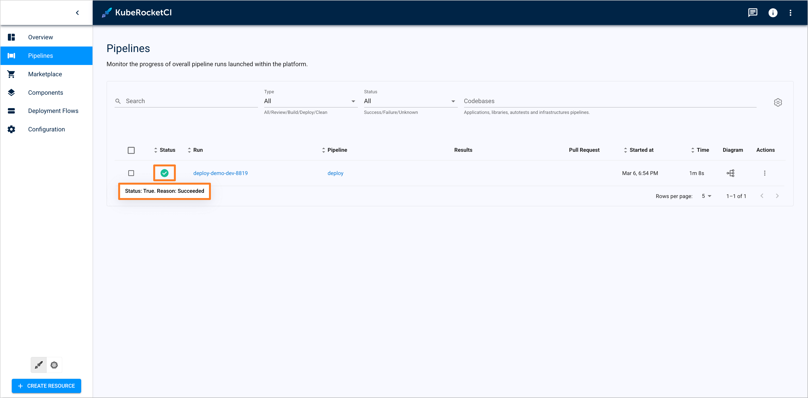

### Application Status

:::note
Pipeline status is not directly related to the application status. The application status can change independently of the pipeline status after the deployment process is completed.
:::

After the deployment of an application, KubeRocketCI provides an application status that indicates the current state of the application. These statuses are related to the Argo CD application health status and sync status.

The application status can be found under the **Applications** tab for the appropriate environment. These statuses are updated in real-time and provide a quick overview of the application health and sync status regarding the Argo CD application.

Example of application statuses is provided below:

## Use Cases

:::note
In the following use cases, `fast-api` is used as an example application for deployment scenarios. For more information on creating and deploying `fast-api` application, refer to the [Scaffold and Deploy FastAPI Application](../use-cases/application-scaffolding.md) use case.
:::

To better understand the Argo CD application and KubeRocketCI pipelines statuses, there are several use cases that showcase the statuses in different scenarios.

### Use Case 1: Healthy Application

In this scenario, we will cover the status of a healthy application that has been successfully deployed and synced.

Suppose we have `fast-api` application to be deployed in the `demo-dev` environment. Follow the steps below to deploy the application:

1. Navigate to the KubeRocketCI portal.

2. In the left sidebar, navigate to the **Deployment Flows** tab and select the **demo** (or any other appropriate) environment where the application should be deployed.

    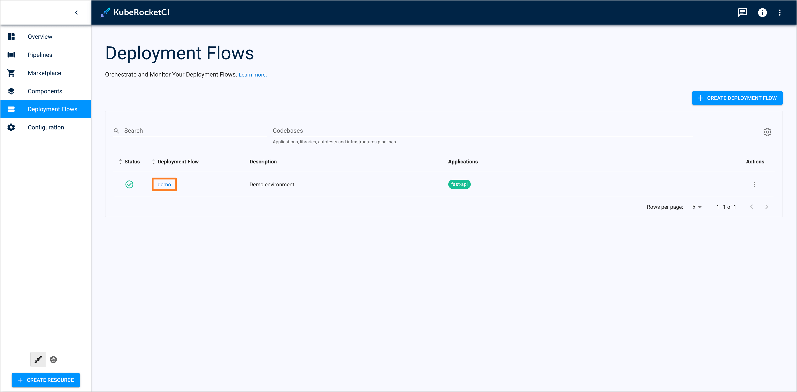

3. Select the **dev** environment and navigate to the **Applications** tab. Click on the **Configure Deploy** button to deploy the application.

    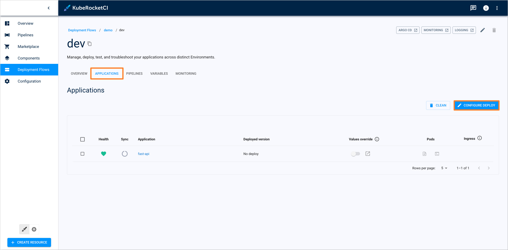

4. Choose the appropriate application version and click on the **Start Deploy** button to deploy the application.

    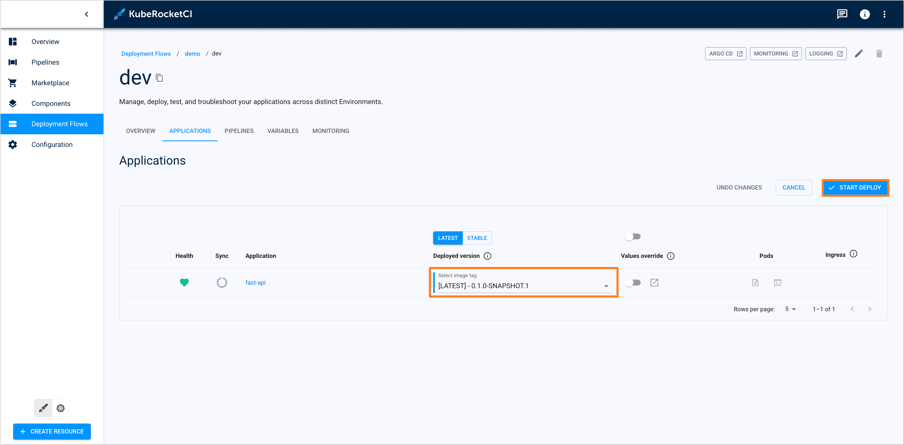

5. After the deployment process is started, navigate to the **Pipelines** tab to monitor the pipeline status. Ensure that the pipeline status is `Succeeded`.

    

    This status indicates that the pipeline has completed successfully. All tasks have been executed without errors. Application is now deployed and synced.

6. To ensure that the application is healthy and synced, navigate back to the **dev** environment of the **demo** deployment flow. Under the **Applications** tab, the application status should be `Healthy` and `Synced`.

    

    These statuses indicate that the Argo CD application is healthy and all resources are successfully deployed and synced.

7. Also, to verify the application status in Argo CD, navigate to the Argo CD UI and check the application status. The application should be `Healthy` and `Synced`.

    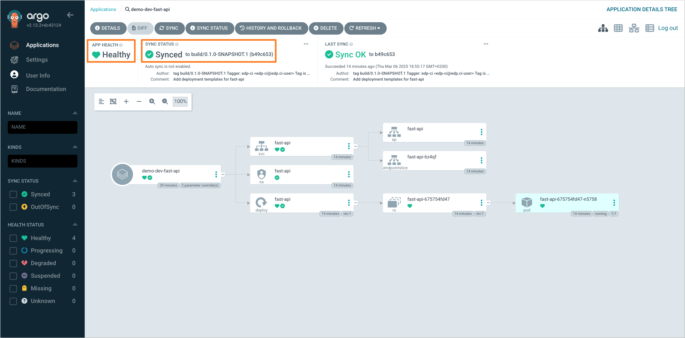

This use case demonstrates the statuses of a healthy application that has been successfully deployed and synced.

### Use Case 2: OutOfSync Application

In this scenario, we will cover the status of an application that is out of sync with the desired state in the Git repository.

Suppose we have successfully deployed the `fast-api` application in the `demo-dev` environment. Follow the steps below to make the application out of sync:

1. In KubeRocketCI portal, navigate to the **Applications** tab under the **dev** environment of the **demo** deployment flow. Ensure that the application status is `Healthy` and `Synced`.

    

    Also, verify the application status in Argo CD. The application should be `Healthy` and `Synced`.

    

2. Make changes to the application resources directly in the cluster. This action will make the application out of sync.

    :::note
    Ensure that the correct `Default namespace` and `Allowed namespaces` values are defined in the **Account setting** of the KubeRocketCI portal.
    :::

    For example, navigate to the Kubernetes section of the KubeRocketCI portal and scale the deployment of the `fast-api` application to 0 replicas.

    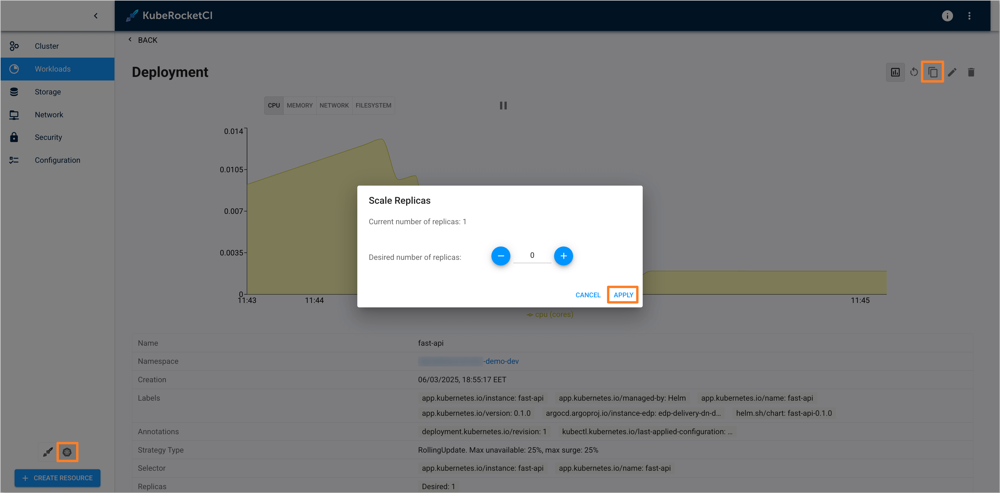

3. After making the changes, navigate back to the **Applications** tab under the **dev** environment of the **demo** deployment flow. The application status should now be `Healthy`, but `OutOfSync`.

    

    This status indicates that the application is healthy, but the resources in the cluster differ from the expected state in the Git repository.

4. Also, verify the application status in Argo CD. The application status should be `Healthy`, but the sync status should be `OutOfSync`.

    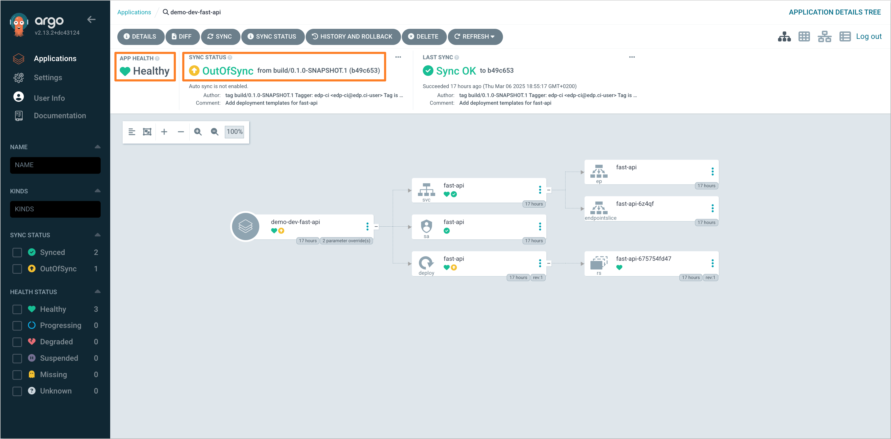

    Argo CD highlights the resources that are out of sync, making it easier to identify the changes that need to be synchronized. To identify the differences between the cluster and the Git repository states, click on the **Diff** button at the top of the screen.

    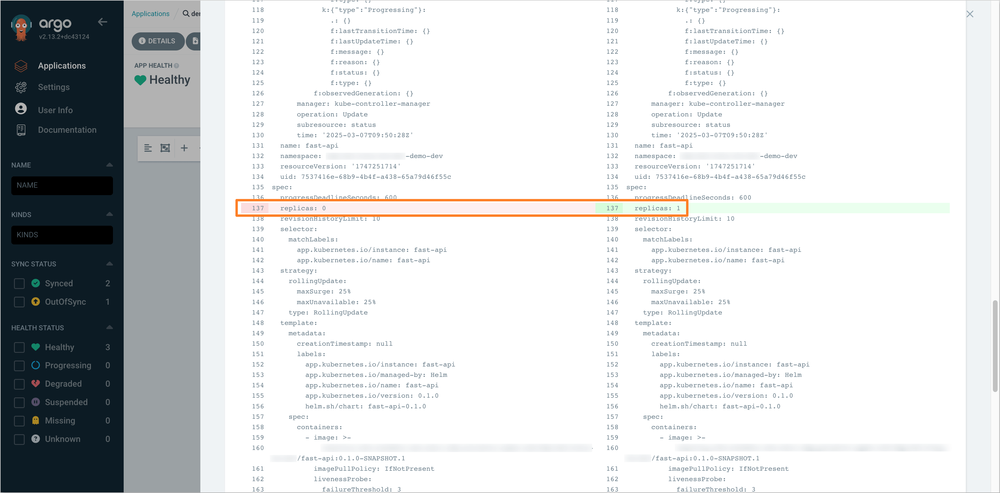

This use case demonstrates the statuses of an application that is out of sync with the desired state in the Git repository.

### Use Case 3: Degraded Application

In this scenario, we will cover the status of an application that has one or more resources with issues or failed to reach a healthy state.

Suppose we have successfully deployed the `fast-api` application in the `demo-dev` environment. Follow the steps below to make the application degraded:

1. In KubeRocketCI portal, navigate to the **Applications** tab under the **dev** environment of the **demo** deployment flow. Ensure that the application status is `Healthy` and `Synced`.

    

    Also, verify the application status in Argo CD. The application should be `Healthy` and `Synced`.

    

2. Make changes to the application resources directly in the cluster that will cause one or more resources to fail.

    For example, navigate to the Kubernetes section of the KubeRocketCI portal and edit the `fast-api` deployment with incorrect service account name (e.g., `fast-api-degraded`). Save the changes to apply the configuration.

    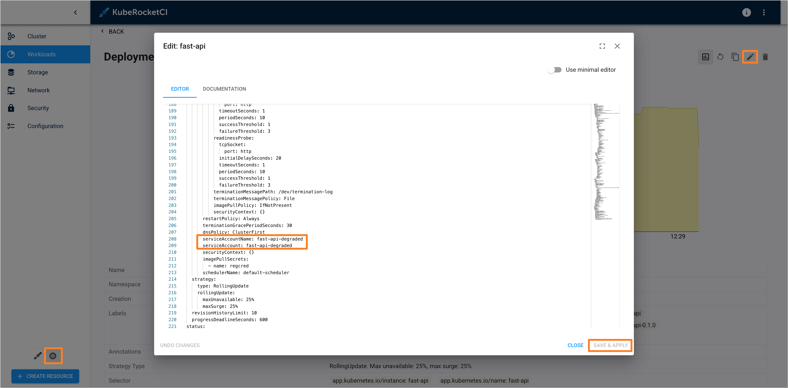

3. After making the changes, navigate back to the **Applications** tab under the **dev** environment of the **demo** deployment flow. The application status should now be `Progressing` and `OutOfSync`.

    

4. Also, verify the application status in Argo CD. The application status should be `Progressing` and `OutOfSync`.

    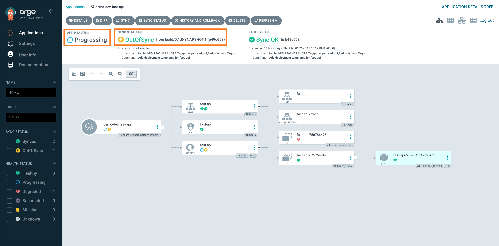

    In this case, the application is in the process of synchronizing its resources but has not yet reached a stable state.

5. After a few minutes, the application status should change to `Degraded`, indicating that one or more resources in the application have issues or failed to reach a healthy state.

    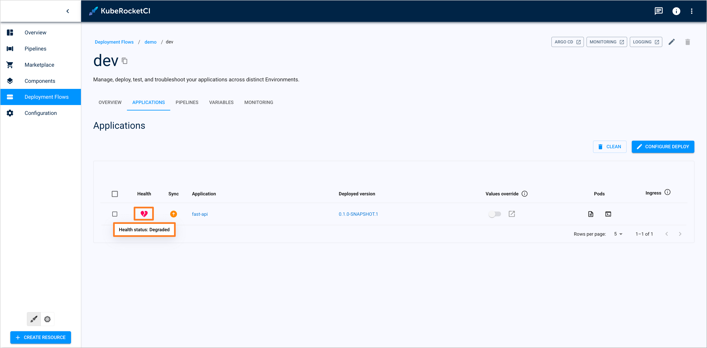

    In the Argo CD, the application status will also change to `Degraded`. The resources that have issues will be highlighted in red.

    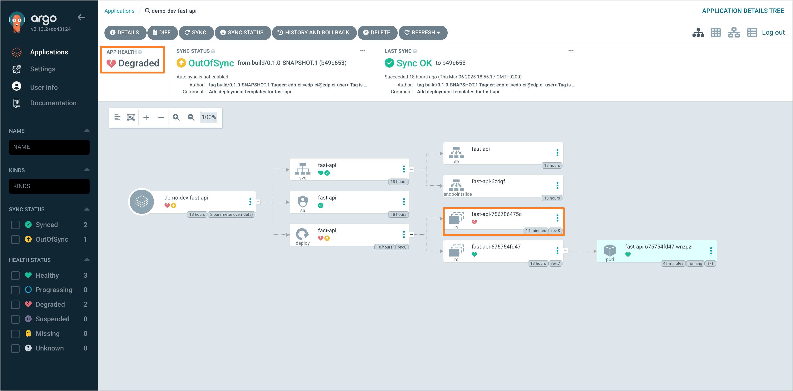

This use case demonstrates the statuses of an application that has one or more resources with issues or failed to reach a healthy state.

## Troubleshooting

In case of issues with the application or pipeline statuses, follow the troubleshooting recommendations below:

### Application OutOfSync Status

If the application status is `OutOfSync`, it means that the deployed resources in the cluster differ from the expected state in the Git repository. To resolve this issue, follow the steps below:

1. Navigate to the Argo CD and click on the **Diff** button to identify the differences between the cluster and the Git repository states.

    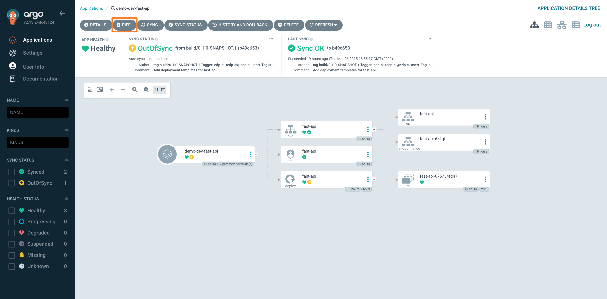

2. Review the differences to understand what changes need to be synchronized. Re-run the deployment pipeline to sync the resources with the desired state, or manually click on the **Sync** button in the Argo CD UI.

    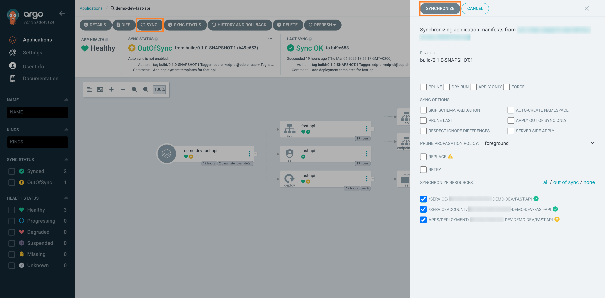

### Application Progressing/Degraded Status

If the application status is `Progressing` or `Degraded`, it means that one or more resources in the application have issues or failed to reach a healthy state. To resolve this issue, follow the steps below:

1. Navigate to the Argo CD and check the application status. If the application is `Progressing` or `Degraded`, the deployment process is not completed successfully.

2. At the top of the screen, click on the **Sync Status** button to view the synchronization status of the application. Identify the resources that are causing the issue.

    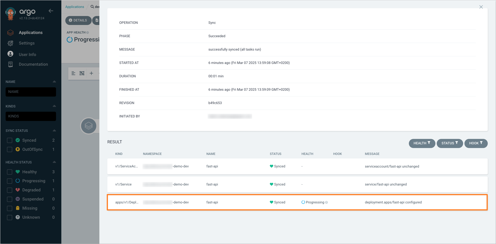

3. Find and navigate to the resource that is causing the issue. Click on the **Events** tab to view the events related to the resource. Review the events to identify the root cause of the issue.

    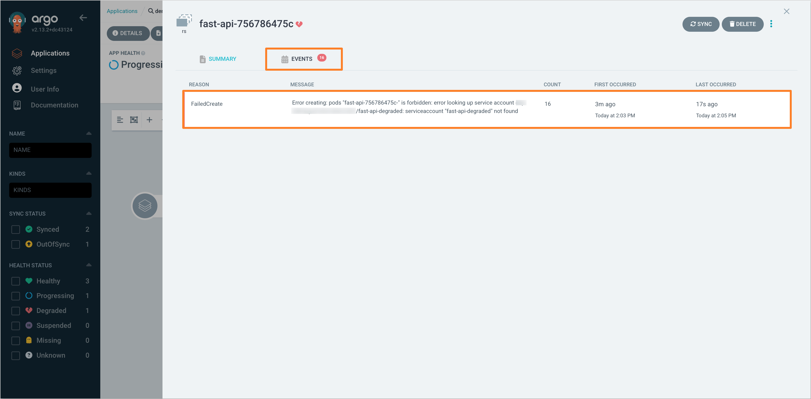

4. Resolve the issue by updating the resource configuration or fixing the underlying problem. After resolving the issue, re-run the deployment pipeline to sync the resources with the desired state.

## Related Articles

- [Install Argo CD](../operator-guide/install-argocd.md)
- [Install Tekton Pipelines](../operator-guide/install-tekton.md)
