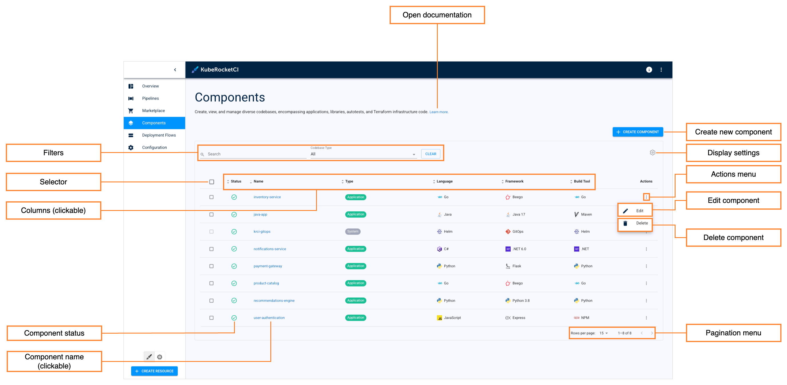
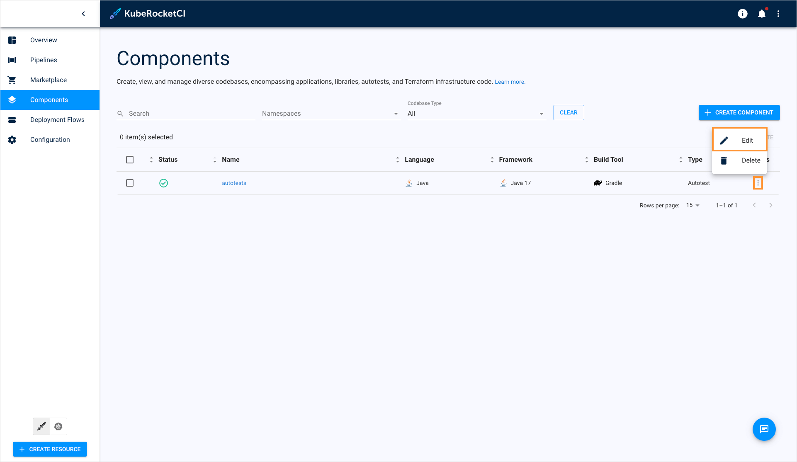
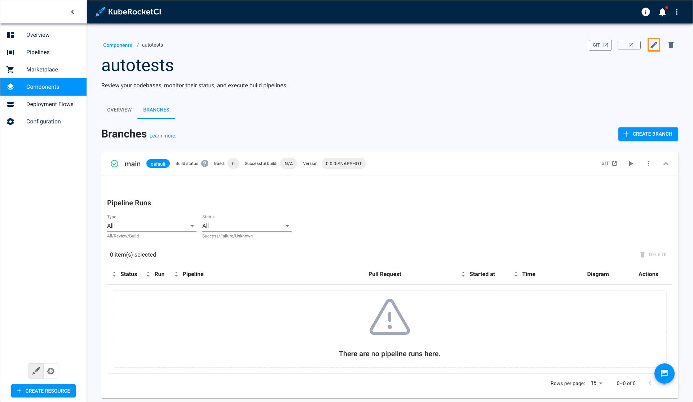
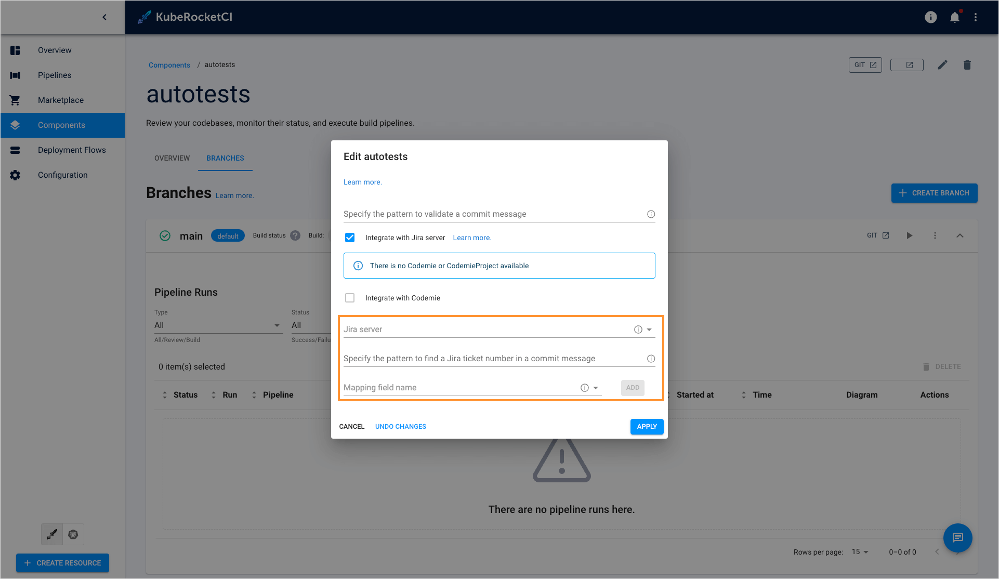

---

title: "Manage Autotests"
sidebar_label: "Manage Autotests"
description: "Guide to managing autotests in KubeRocketCI, including editing, integrating with Jira, and adding as quality gates in CI/CD workflows."

---
<!-- markdownlint-disable MD025 -->

# Manage Autotests

<head>
  <link rel="canonical" href="https://docs.kuberocketci.io/docs/user-guide/autotest" />
</head>

This section describes the subsequent possible actions that can be performed with the newly added or existing autotests.

## Check and Remove Autotest

As soon as the autotest is successfully provisioned, the following will be created:

* An Autotest Codebase type will appear in the Codebase list of the Components section.
* With the **Create** strategy, a new project will be generated on GitHub or another integrated VCS. When **Clone** is chosen, the repository will be forked from the original and copied to the KubeRocketCI-integrated repository. If **Import** is selected, the platform connects to the chosen repository.

:::info
  To navigate quickly to Tekton, Version Control System, SonarQube, Nexus, and other resources, click the **Overview** section on the navigation bar and hit the necessary link.
:::

The added autotest will be listed in the Autotests list allowing you to do the following:

* **Open documentation** - Opens the autotest related documentation page.
* **Create new component** - Opens the **Create new component** menu when clicking.
* **Display settings** - This button allows to show/hide columns to display in the codebase list. By default, all the columns are shown.
* **Actions menu** - Provides additional options for each individual autotest, such as **Edit** and **Delete**.
* **Edit component** - Allows you to modify the autotest's settings. You can access this option by clicking the options icon (vertical ellipsis) next to the autotest's name in the list, and then selecting **Edit**. For more details, see the [Edit Existing Autotest](#edit-existing-autotest) section.
* **Delete component** - Deletes the selected autotest.
* **Component status** - displays the autotest status. Can be red or green depending on if the KubeRocketCI portal managed to connect to the Git Server with the specified credentials or not.
* **Component name (clickable)** - Displays the autotest name set during the autotest creation.

  :::warning
    The application that is used in a CD pipeline cannot be removed.
  :::

There are also options to sort the autotests:

* **Pagination menu** - select a number of autotests displayed per page (15, 25 or 50 rows) and navigate between pages if the number of autotests exceeds the capacity of a single page.

* **Filters** - Filter codebases by their name and type. Additionally, sort the existing autotests in a table by clicking the sorting icons in the table header. Sort the autotests alphabetically by their name, language, build tool, framework, and CI tool. You can also sort the autotests by their status: Created, Failed, or In progress.

* **Selector** - Allows you to select multiple autotests for bulk delete.

* **Columns (clickable)** - Sort the existing autotests in a list by clicking the sorting icons in the list header.

## Edit Existing Autotest

KubeRocketCI portal provides the ability to enable, disable or edit the Jira Integration functionality for autotests.

1. To edit an autotest directly from the Autotests overview page or when viewing the autotest data:

      Select **Edit** in the options icon menu:

      

      

2. To enable Jira integration, on the **Edit Autotest** page do the following:

    

    a. Mark the **Integrate with Jira server** check box and fill in the necessary fields. Please see steps d-h on the [Add Autotests](add-autotest.md) page.

    b. Click the **Apply** button to apply the changes.

    :::note
      To adjust the Jira integration functionality, first apply the necessary changes described on the [Adjust Jira Integration](../operator-guide/project-management-and-reporting/jira-integration.md).
    :::

3. To disable Jira integration, in the **Edit Autotest** dialog do the following:

    * Clear the **Integrate with Jira server** check box.

    * Click the **Apply** button to apply the changes.

4. To create, edit and delete autotest branches, please refer to the [Manage Branches](../user-guide/manage-branches.md) page.

## Add Autotest as a Quality Gate

In order to add an autotest as a quality gate to a newly added CD pipeline, do the following:

1. Create a CD pipeline with the necessary parameters. Please refer to the [Add CD Pipeline](add-cd-pipeline.md) section for the details.

2. In the **Stages** menu, select the **Autotest** quality gate type. It means the promoting process should be confirmed by the successful passing of the autotests.

3. In the additional fields, select the previously created autotest name and specify its branch.

4. After filling in all the necessary fields, click the Create button to start the provisioning of the pipeline. After the CD pipeline is added, the new namespace containing the stage name will be created in Kubernetes (in OpenShift, a new project will be created) with the following name pattern: _[cluster name]-[cd pipeline name]-[stage name]_.

## Configure Autotest Launch at Specific Stage

In order to configure the added autotest launch at the specific stage with necessary parameters, do the following:

1. Add the necessary stage to the CD pipeline. Please refer to the [Add CD Pipeline](add-cd-pipeline.md) documentation for the details.

2. Navigate to the **run.json** file and add the stage name and the specific parameters.

## Launch Autotest Locally

There is an ability to run the autotests locally using the IDEA (Integrated Development Environment Application, such as IntelliJ, NetBeans etc.). To launch the autotest project for the local verification, perform the following steps:

1. Clone the project to the local machine.

2. Open the project in IDEA and find the **run.json** file to copy out the necessary command value.

3. Paste the copied command value into the Command line field and run it with the necessary values and namespace.

4. As a result, all the launched tests will be executed.

## Related Articles

* [Add Application](add-application.md)
* [Add Autotests](add-autotest.md)
* [Add CD Pipeline](add-cd-pipeline.md)
* [Adjust Jira Integration](../operator-guide/project-management-and-reporting/jira-integration.md)
* [Manage Branches](../user-guide/manage-branches.md)
