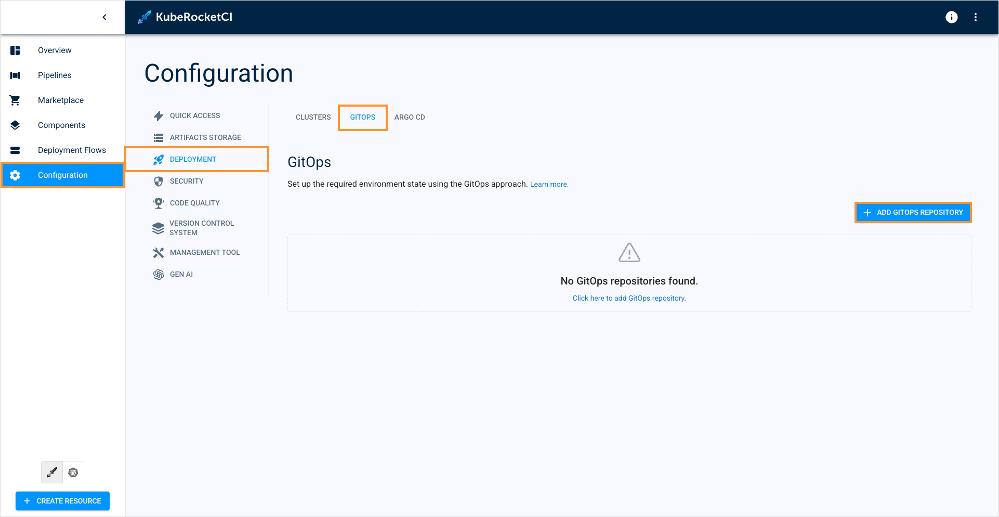
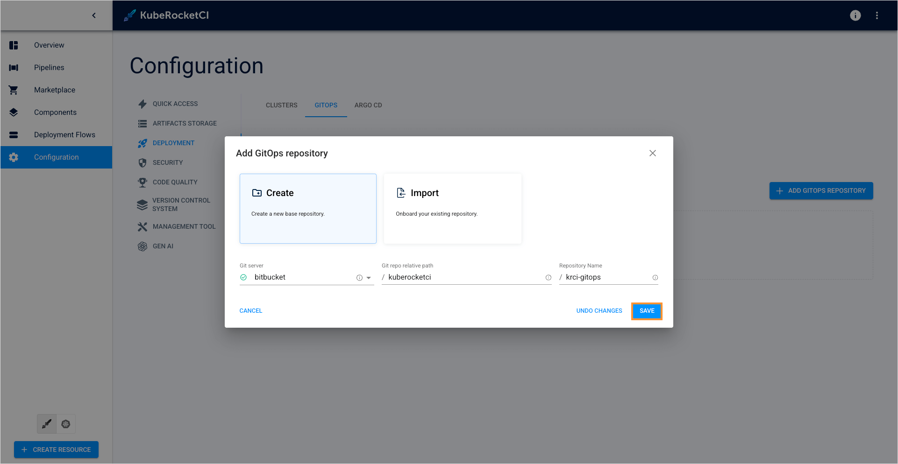
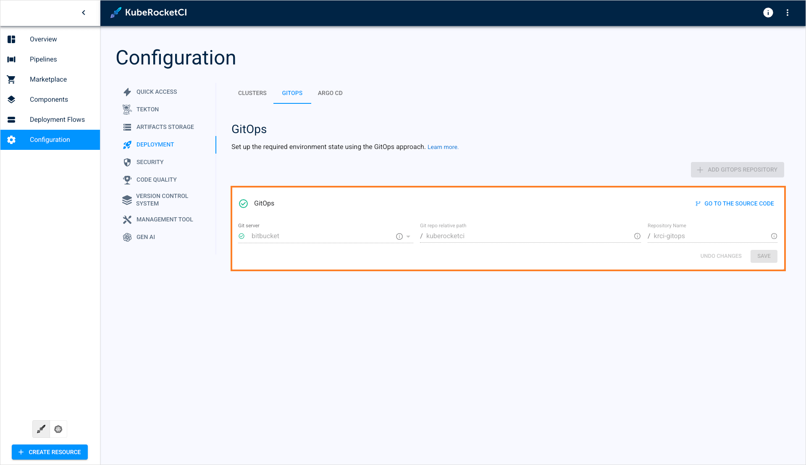
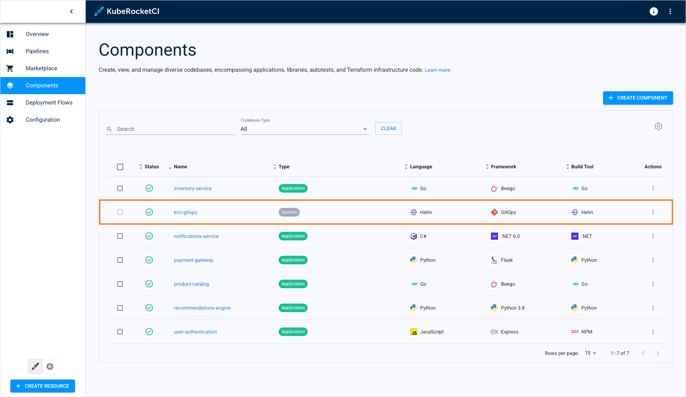

---

title: "Manage GitOps"
description: "Explore the GitOps section in KubeRocketCI for automating infrastructure and application deployments with a Git repository-driven approach."
sidebar_label: "Manage GitOps"

---
<!-- markdownlint-disable MD025 -->

import Tabs from '@theme/Tabs';
import TabItem from '@theme/TabItem';

# Manage GitOps

<head>
  <link rel="canonical" href="https://docs.kuberocketci.io/docs/user-guide/gitops" />
</head>

This page is dedicated to the `GitOps` section of the `Configuration` tab, the process of establishing the GitOps repository, outline benefits it extends to users within the platform capabilities. GitOps, short for "Git Operations", is a modern approach to managing and automating infrastructure and application deployments. In GitOps, the desired state of your environment is declared and stored in a Git repository. With GitOps, you can ensure that your infrastructure and applications are always in sync with your intended configurations and readily adapt to changing requirements.

## Overview

The purpose of the `GitOps` section is to provide users with the ability to customize the state of their environments with the help of GitOps approach that enables you to store your entire deployment configuration in a Git repository, providing version control for changes, consistent collaboration, and automated deployments. Enforcing GitOps allows you to declaratively define and automate your configurations, ensuring consistency, version control, and collaboration within your team.

## Add GitOps Repository

GitOps repository is added in two steps:

1. Navigate to **Configuration** -> **Deployment**-> **GitOps** and click the **+ Add GitOps Repository** button:

    

2. Select the creation strategy, fill in the required fields, and click **Save**:

  <Tabs
    defaultValue="create"
    values={[
      { label: 'Create', value: 'create' },
      { label: 'Import', value: 'import' },
    ]}>

    <TabItem value="create">

      The **Create** strategy allows you to create a new repository from scratch:

        

        * **Git server**: Select the [added Git server](./add-git-server.md) where the GitOps repository will be created.
        * **Git repo relative path**: Enter your Git account.
        * **Repository name**: Specify the name for the new repository.

    </TabItem>

    <TabItem value="import">

      Select the **Import** strategy if you already have a repository that stores your application Helm charts' configurations:

        

        * **Git server**: Select the [added Git server](./add-git-server.md) that has credentials to access the GitOps repository.
        * **Git repo relative path**: Enter your Git account.
        * **Repository name**: Specify the name of the repository to import.

    </TabItem>

  </Tabs>

3. Check the GitOps repository connected to the platform:

    

    As the result, the `Codebase` of `system` type will be added to the Codebase list of the **Components** section:

    

:::warning
  The platform allows only one GitOps repository at a time.
:::

## GitOps Usage

Once the GitOps repository is added to the platform, you can set custom parameters for the deployed Helm Chart. To redefine the parameters, follow the steps below:

1. Within the GitOps repository, follow the naming convention `<deployment-flow>/<environment>/<application-name>-values.yaml` to create the chart values file, e.g. `mypipe/dev/fastapi-demo-values.yaml`.

2. Add the necessary custom values to the `mypipe/dev/fastapi-demo-values.yaml` file, and then commit the file to the default branch of the GitOps repository.

3. Navigate to the **Environments** section. Open the created environment, open its stage and deploy it with the **Values override** checkbox selected as it is shown below:

    

## Customize Yamllint Scan Rules

:::note
Ability to customize yamllint rules is available starting from platform version 3.11.
:::

Review and build pipelines for a GitOps repository use `yamllint` to scan YAML files. By default, predefined rules are applied automatically. However, it is possible to customize and extend the default rules by adding a `.yamllint` configuration file to the root of the GitOps repository. This file should define the required rules and parameters. For example:

    ```yaml title=".yamllint"
    # yamllint configuration file
    # Extends the default configuration:
    # https://yamllint.readthedocs.io/en/stable/configuration.html#default-configuration

    extends: default

    ignore:
      - '.yamllint'

    rules:
      line-length: disable     # Disable line-length rule
      document-start: disable  # Disable rule for requiring '---' at the document start
    ```

In this example, the `line-length` and `document-start` rules are disabled. For more details on available rules and their configurations, refer to the yamllint [documentation](https://yamllint.readthedocs.io/en/stable/rules.html).

After creating the `.yamllint` file, commit it to the main branch of the GitOps repository. Once the changes are applied, the `yamllint` scan in review and build pipelines will use the custom rules defined in the `.yamllint` file.

  

## Delete GitOps Repository

In case you need to delete the GitOps repository, do the following:

1. Delete the GitOps repository in the Git provider.

2. Delete the Codebase custom resource using the `kubectl delete` command:

    ```bash
    kubectl delete Codebase krci-gitops -n krci
    ```

## Related Articles

* [Add CD Pipeline](../user-guide/add-cd-pipeline.md)
* [Cluster Add-Ons Overview](../operator-guide/add-ons-overview.md)
* [Manage Clusters](cluster.md)
