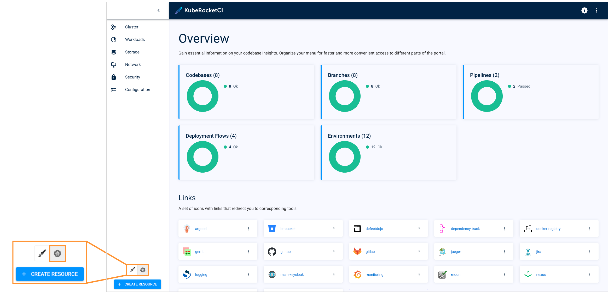
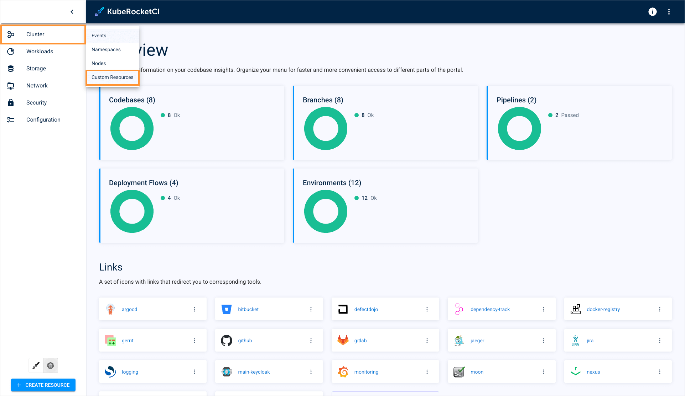
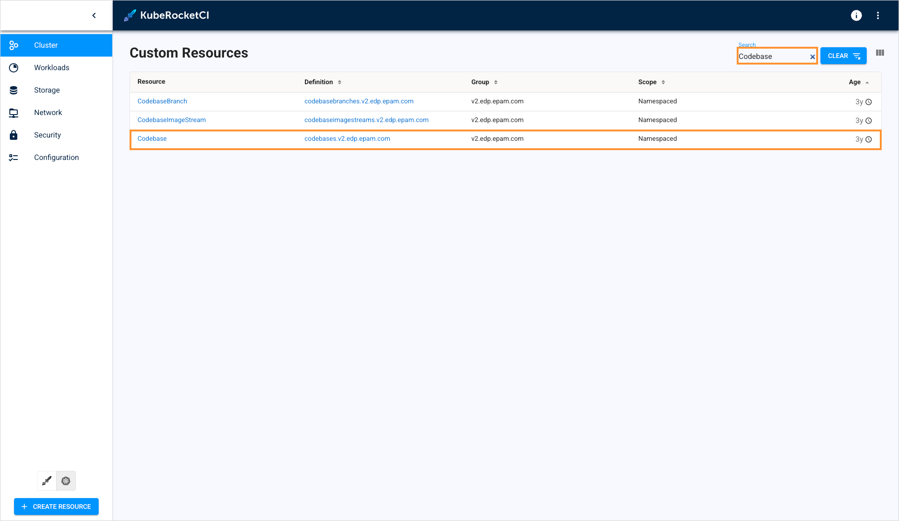
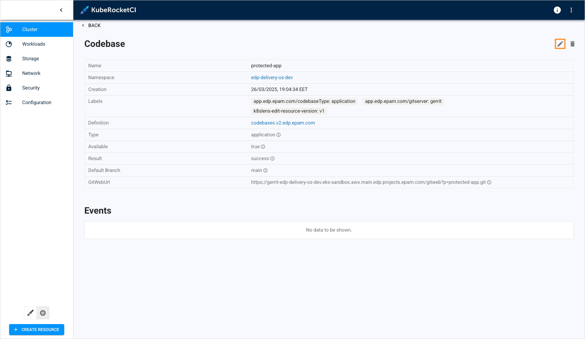
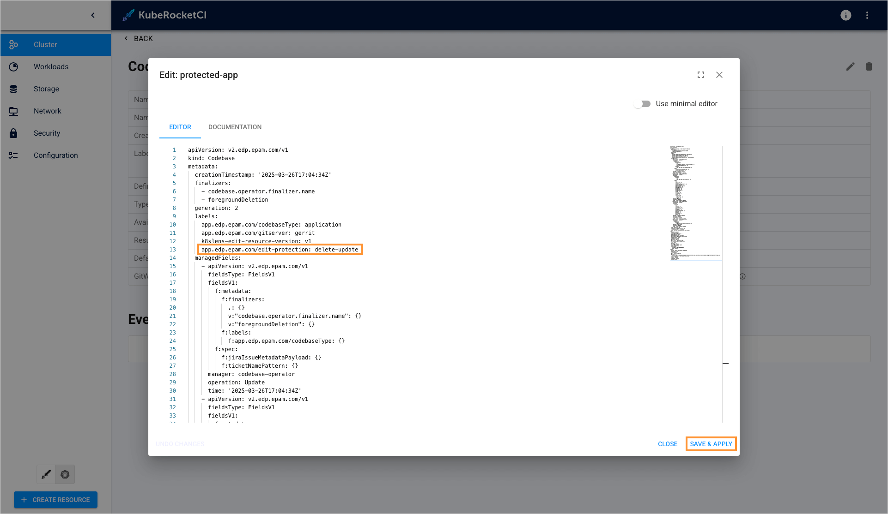
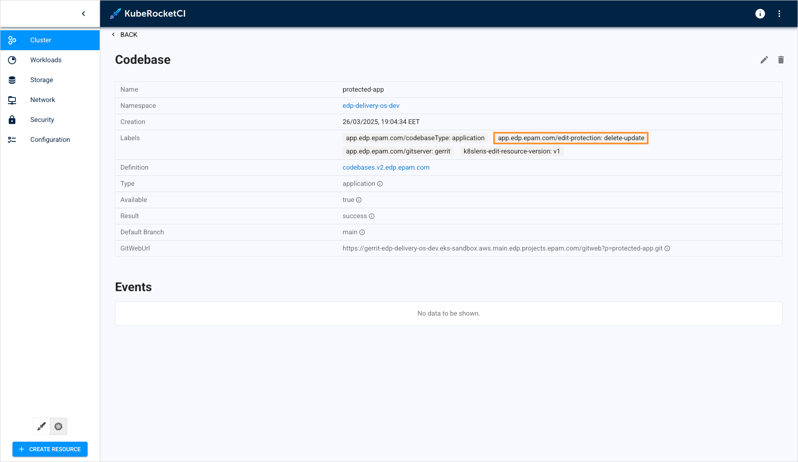
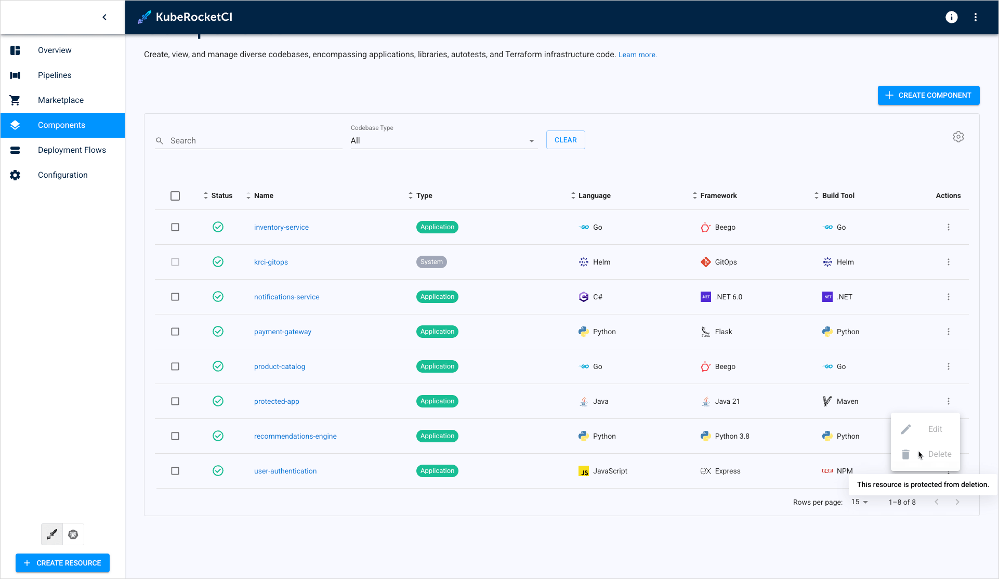

---

title: "Protect Resources From Deletion/Modification"
sidebar_label: "Protect Resources From Deletion/Modification"
description: "Learn how to use the protected label feature in KubeRocketCI to prevent accidental deletion or modification of resources such as codebases, environments, and deployment flows."

---
<!-- markdownlint-disable MD025 -->

# Protect Resources From Deletion/Modification

<head>
  <link rel="canonical" href="https://docs.kuberocketci.io/docs/user-guide/protected-label" />
</head>

KubeRocketCI allows to prevent accidental resource deletion and modification by applying a protected label. This page describes the protected label feature, its purpose, types, and usage.

## Overview

Protected label is a Kubernetes label that tells KubeRocketCI to block any delete or edit operations with the resource. The platform checks the label first before performing an operation with the resource.

Protected labels support the following resources:

* [Codebases](../api/codebase.md#codebase);
* [Codebase branches](../api/codebase.md#codebasebranch);
* [Deployment flows](../api/cd-pipeline.md#cdpipeline);
* [Environments](../api/cd-pipeline.md#stage).

## Protection Types

Protection label can optionally block specific operations over a resource:

* **app.edp.epam.com/edit-protection: delete-update** - Blocks both the delete and modify operations;
* **app.edp.epam.com/edit-protection: delete** - Blocks only delete operations;
* **app.edp.epam.com/edit-protection: update** - Blocks only modify operations.

## Apply Protected Label

To apply the resource deletion and modification block, follow the steps below. We will use a codebase resource as an example, but the procedure applies to all the supported resources:

1. Navigate to the KubeRocketCI portal.

2. Switch the portal to the Kubernetes mode:

  

3. Navigate to **Cluster** -> **Custom resources**:

  

4. In the custom resources list, enter **Codebase** in the filter field to find it and then select it in the list:

  

5. Enter the codebase you want to protect from accidental deletion and/or modification.

6. On the resource details page, click the **Edit** button:

  

7. In the edit resource window, add the label to the **labels** section and click **Save and apply**:

  

8. Make sure the label was applied:

  

9. Switch back to the KubeRocketCI mode, navigate to the **Components** section and verify that you can't delete or edit the protected codebase:

  

## Remove Protected Label

To remove a label, navigate back to the resource, edit the resource by removing the label, and save the changes.

## Related Articles

* [Manage Applications](../user-guide/application.md)
* [Customize Deploy Pipeline](../operator-guide/cd/customize-deploy-pipeline.md)
* [Add Deployment Flow](../user-guide/add-cd-pipeline.md)
* [Manage Deployment Flows](../user-guide/manage-environments.md)
