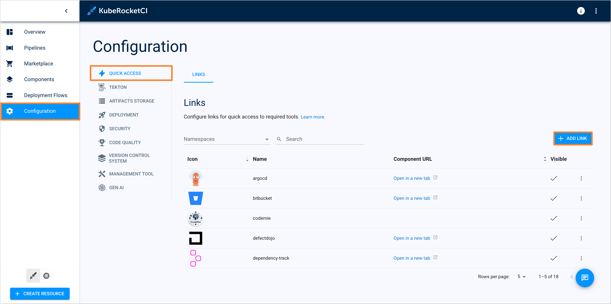
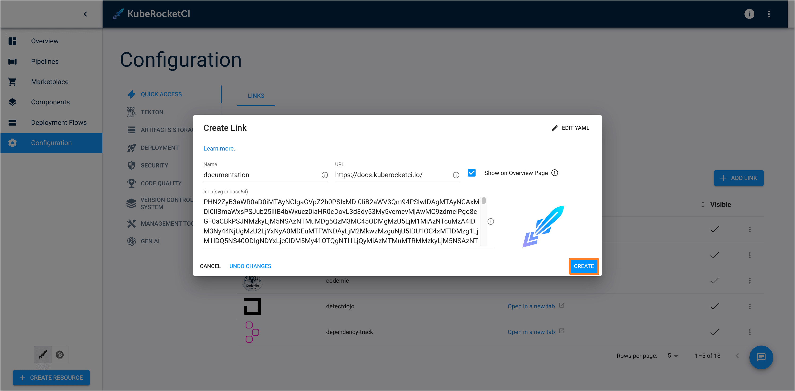
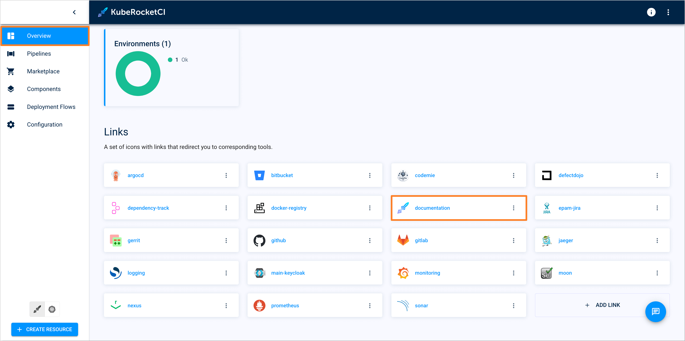
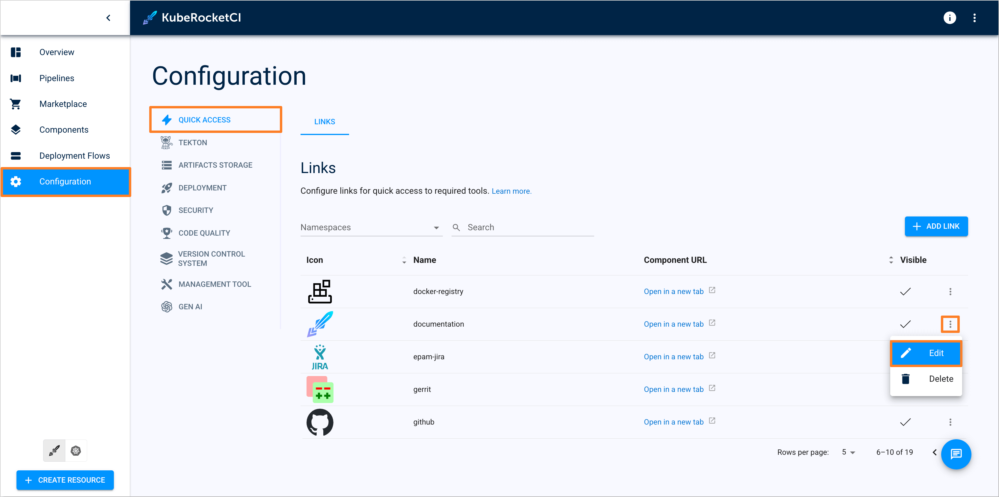
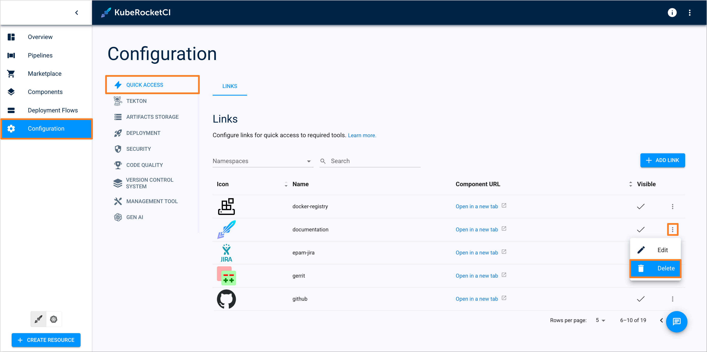
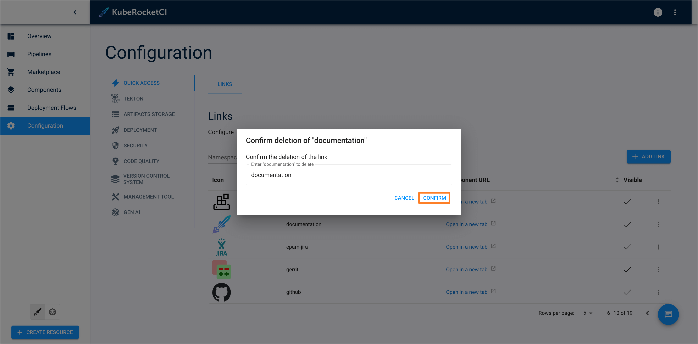

---

title: "Manage Quick Links"
sidebar_label: "Manage Quick Links"
description: "Guide to managing Quick Links in KubeRocketCI, enabling easy access to essential tools and resources directly from the Overview page."

---
<!-- markdownlint-disable MD025 -->

# Manage Quick Links

<head>
  <link rel="canonical" href="https://docs.kuberocketci.io/docs/user-guide/quick-links" />
</head>

The Links section is designed to store all external references in one place. These links are displayed directly on the [Overview](index.md) page of the KubeRocketCI portal. Additionally, some links are also shown on the Component and Environment sections.

## Add Quick Link

There are two methods to add Quick Links:

- [Add Quick Link via KubeRocketCI portal](#add-quick-link-via-kuberocketci-portal)
- [Add Quick Link via Helm chart](#add-quick-link-via-helm-chart)

### Add Quick Link via KubeRocketCI Portal

To add a Quick Link via the KubeRocketCI portal, follow the steps below:

1. Navigate to **Configuration** -> **Quick Access** -> **Links** and click the **+ Add Link** button:

    

2. In the appeared window, insert the link name, URL, and SVG icon in base 64 format. Click the checkbox if it should be displayed on the **Overview** page:

    

3. If the **Show on Overview Page** option is selected, the link will be displayed on the **Overview** page:

    

### Add Quick Link via Helm Chart

The Quick Links can be specified in the [edp-install](https://github.com/epam/edp-install) Helm chart during platform installation or upgrade process.

For some components, the Quick Link section is already present in the `values.yaml` file. In this case, it is enough to specify the necessary URL for the appropriate component.

An example of the `quickLinks` section in the `values.yaml` file, with all supported components, provided below:

    ```yaml title="values.yaml"
    quickLinks:
      # Base URL value for the argocd Quick Link
      argocd: ""
      # Base URL value for the codemie Quick Link
      codemie: ""
      # Base URL value for the defectdojo Quick Link
      defectdojo: ""
      # Base URL value for the dependency track Quick Link
      dependency_track: ""
      # Base URL value for the container registry Quick Link (e.g. Nexus, DockerHub, ECR, etc.)
      docker_registry: ""
      # Configuration for the logging Quick Link
      logging:
        # -- Define the provider name for correct URL generation.
        # Available providers: "opensearch", "datadog".
        # If the provider name is not specified, the base URL will be used.
        provider: ""
        # Base URL value for the logging Quick Link
        url: ""
      # Configuration for the monitoring Quick Link
      monitoring:
        # -- Define the provider name for correct URL generation.
        # Available providers: "grafana", "datadog".
        # If the provider name is not specified, the base URL will be used.
        provider: ""
        # Base URL value for the monitoring Quick Link
        url: ""
      # Base URL value for the nexus Quick Link
      nexus: ""
      # Base URL value for the sonar Quick Link
      sonar: ""
    ```

If the required component is not listed in the `quickLinks` section, it is possible to add the Quick Link using the `extraQuickLinks` section.

An example of specifying the Quick Link through the `extraQuickLinks` section in the `values.yaml` file is provided below:

    ```yaml title="values.yaml"
    extraQuickLinks:
      # Name of the Quick Link
      - documentation:
          # Base URL value for the documentation Quick Link
          url: "https://docs.kuberocketci.io/"
          # Visibility option for the Quick Link on the Overview page.
          visible: true
          # SVG icon in base 64 format.
          icon: PHN2ZyB4b...
      # Name of the Quick Link
      - jaeger:
          # Base URL value for the jaeger Quick Link
          url: "https://jaeger.example.com/"
          # Visibility option for the Quick Link on the Overview page.
          visible: true
          # SVG icon in base 64 format.
          icon: PHN2ZyBoZ...
    ```

After specifying the necessary Quick Links in the `values.yaml` file, the Quick Links will be displayed on the **Overview** page after the platform installation.

## Edit Quick Link

To edit a Quick Link, follow the steps below:

1. Navigate to **Configuration** -> **Quick Access** -> **Links**. Click the three-dot menu and select **Edit**:

    

2. Edit the necessary fields and click **Apply**:

    

## Delete Quick Link

:::note
Quick Links of type **system** cannot be deleted as they are crucial for the platform's functionality.
:::

To delete a Quick Link, follow the steps below:

1. Navigate to **Configuration** -> **Quick Access** -> **Links**. Click the three-dot menu and select **Delete**:

    

2. In the **Confirm deletion** window, enter the name of the link and click **Confirm**:

    

## Related Articles

* [Add Git Server](add-git-server.md)
* [Add Cluster](add-cluster.md)
* [Manage GitOps](gitops.md)
* [Manage Registries](manage-container-registries.md)
