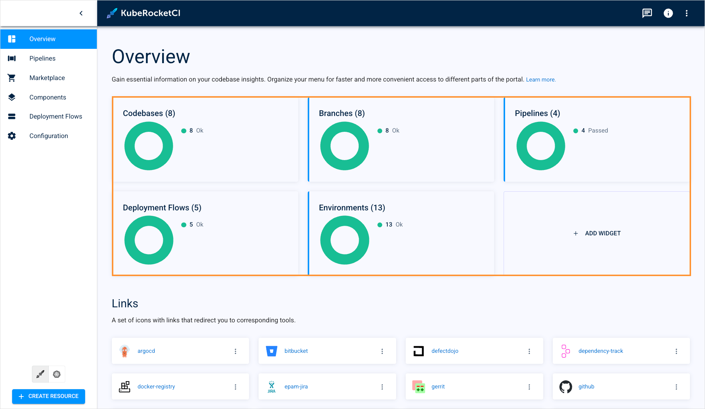
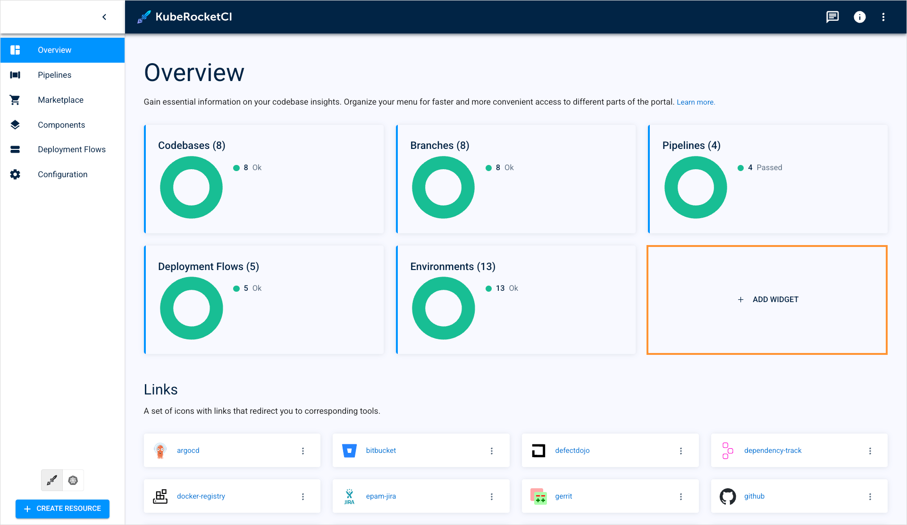
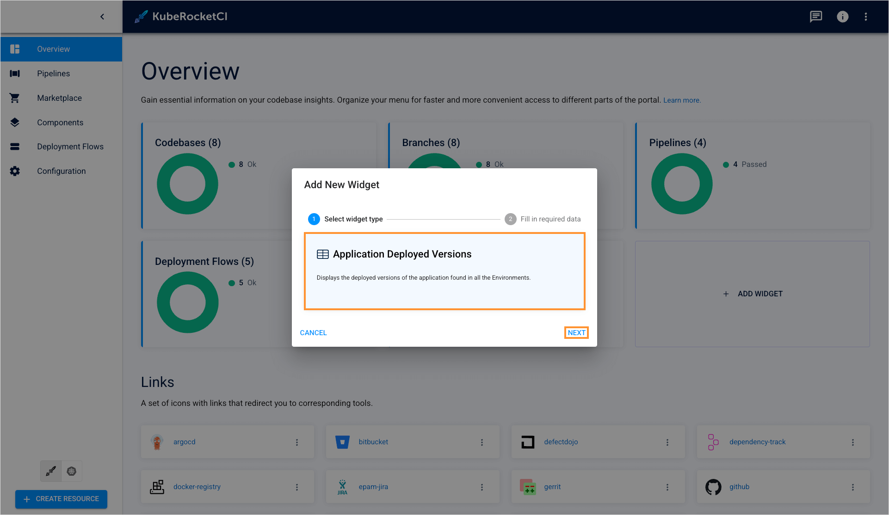
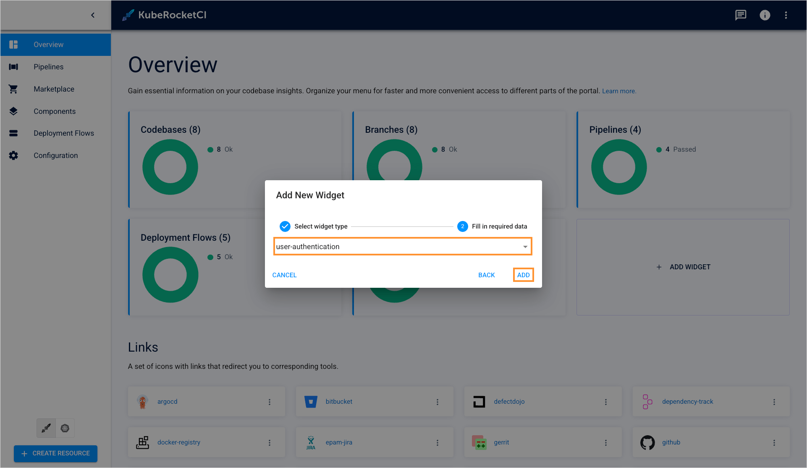
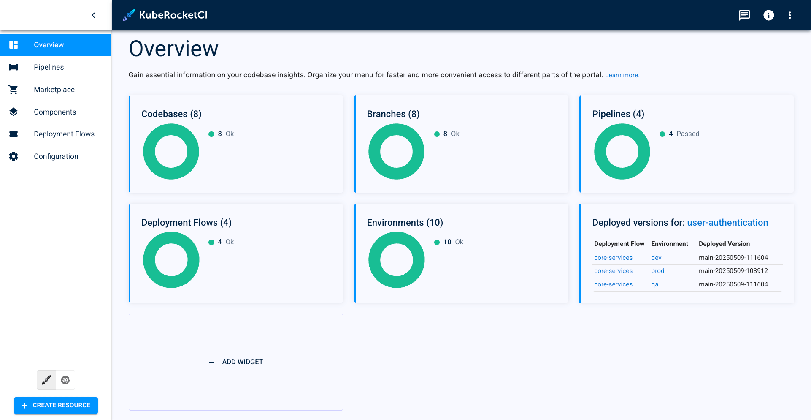
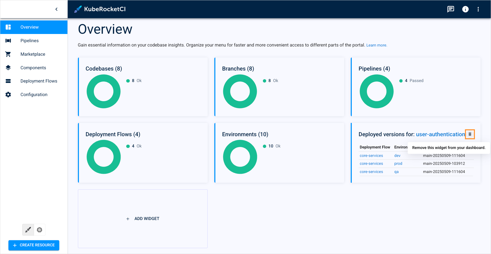
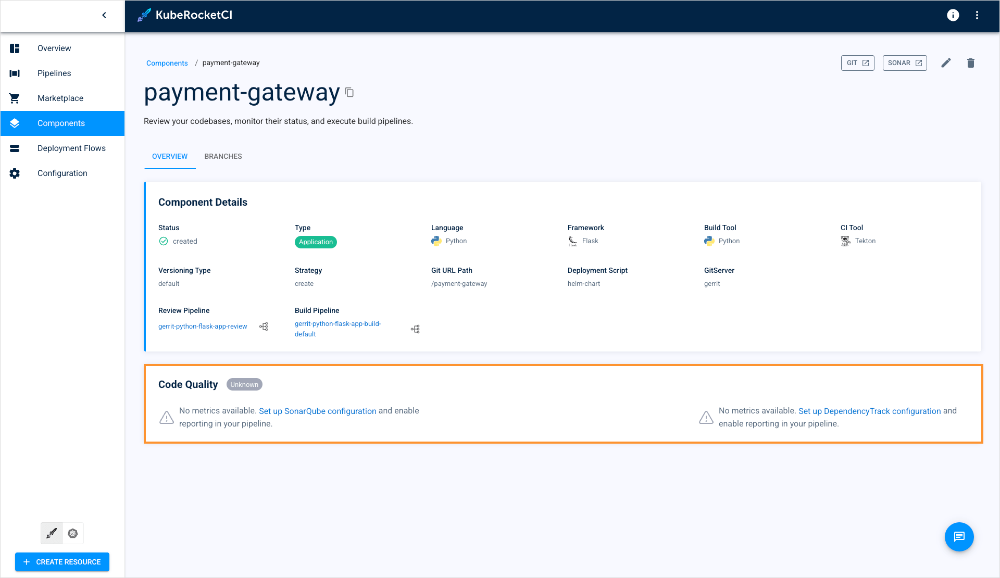
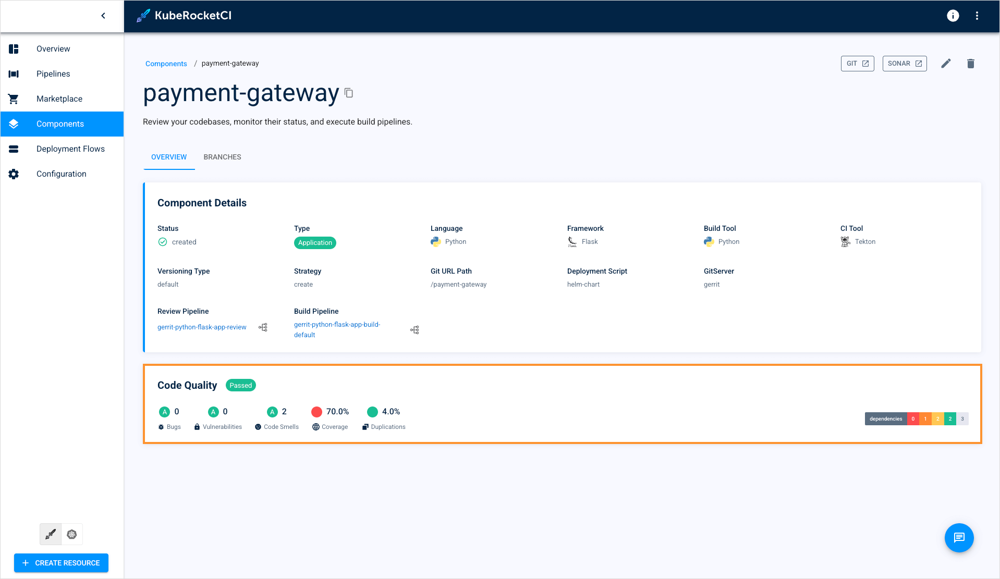
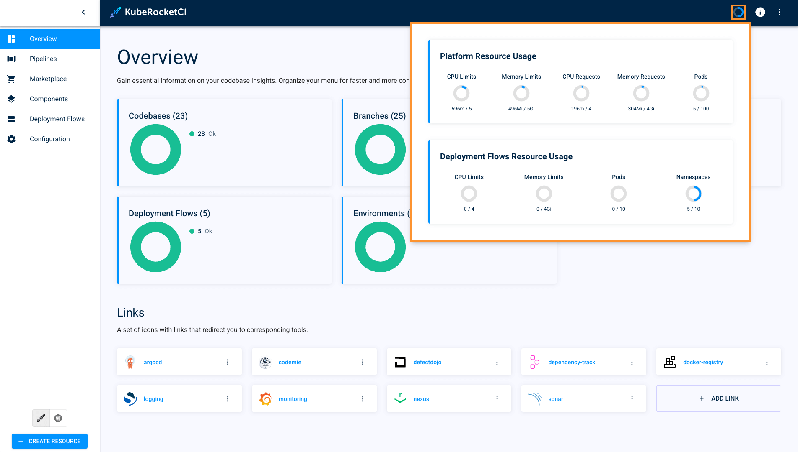

<!-- markdownlint-disable MD025 -->

# KubeRocketCI Widgets

<head>
  <link rel="canonical" href="https://docs.kuberocketci.io/docs/user-guide/widgets" />
</head>

KubeRocketCI offers widgets as data visualization tools to observe the status of both the platform and its resources.
This page describes all the widgets presented in KubeRocketCI.

## Widgets Overview

The first widgets users view when using KubeRocketCI portal are KubeRocketCI resource widgets:

  

These widgets reflect all the resources in the **default namespace**:

* **Codebases**: Displays all the created codebases;
* **Branches**: Shows the total amount of codebase branches;
* **Pipelines**: Shows all the initiated pipeline runs;
* **Deployment Flows**: Displays all the created deployment flows;
* **Environments**: Shows the total amount of created environments;
* **+ Add Widget**: Opens the **Add new widget** window.

The status of the resources is displayed real-time and doesn't require any preliminary configuration to for widgets to work. Not only these widgets display the amount of resources but also their statuses (success, fail, in progress).

Additionally, users can track any specific application status and deployed versions using custom widgets. To add a custom widget, follow the steps below:

1. On the **Overview** section, click the **+ Add Widget** button:

  

2. On the **Add new widget** window, select the **Application deployed versions** widget type:

  

3. Select the application to track and click **Add**:

  

4. View the application widget to get the information about Deployment Flows and Environments where application is deployed:

  

5. To delete the widget, hover your mouse cursor over the widget block and click the bin icon that appears:

  

## SonarQube & Dependency-Track Widgets

KubeRocketCI also offers widgets to track codebases' code quality directly from the KubeRocketCI portal. These widgets pull codebase-related data from SonarQube and Dependency-Track tools:

  

To enable these widgets, you need to pass the following steps:

1. Integrate platform with [SonarQube](../operator-guide/code-quality/sonarqube.md) and/or [Dependency-Track](../operator-guide/devsecops/dependency-track.md).
2. Install and configure the [KrakenD](../operator-guide/extensions/krakend.md) tool.
3. Trigger the review pipeline in a codebase, allowing SonarQube and Dependency-Track to scan your code.

:::note
At least one build pipeline must be run for the codebase to activate the widgets.
:::

4. Verify the widgets started working for the codebase:

  

:::note
The SonarQube and Dependency-Track widgets only track the default branch.
:::

## Resource Quota Widget

The last available widget is a resource quota widget. To open the widget, click the circle icon in the top-left corner of the screen:

  

This widget shows resource requests and limits (CPU, Memory, Namespace) of both the deployment flows and the entire platform.

To enable the widget, you need to deploy KubeRocketCI in a [Capsule](../operator-guide/advanced-installation/capsule.md) tenant.

## Related Articles

* [SonarQube Integration](../operator-guide/code-quality/sonarqube.md)
* [Integrate Dependency-Track](../operator-guide/devsecops/dependency-track.md)
* [KrakenD Integration](../operator-guide/extensions/krakend.md)
